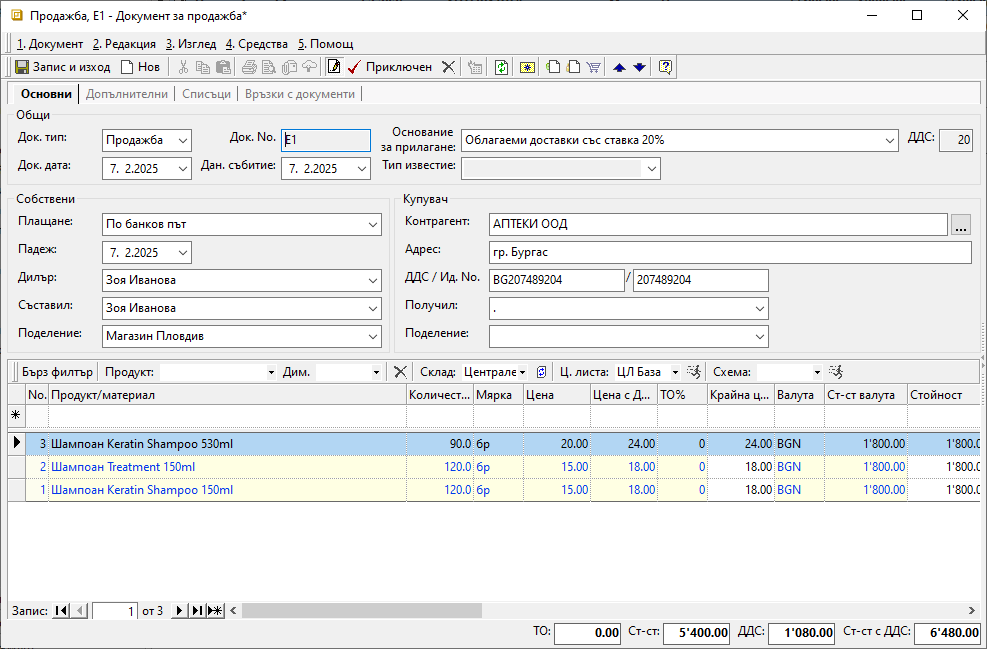

```{only} html
[Нагоре](000-index)
```

# Създаване на документ за продажба

- [Въведение](https://docs.unicontsoft.com/guide/erp/002-docs/002-trade-system/001-orders-sales-purchase-documents/003-create-sales-document.html#id2)  
- [Създаване на продажба](https://docs.unicontsoft.com/guide/erp/002-docs/002-trade-system/001-orders-sales-purchase-documents/003-create-sales-document.html#id3)  
- [Реквизити](https://docs.unicontsoft.com/guide/erp/002-docs/002-trade-system/001-orders-sales-purchase-documents/003-create-sales-document.html#id4)  
- [Свързани статии](https://docs.unicontsoft.com/guide/erp/002-docs/002-trade-system/001-orders-sales-purchase-documents/003-create-sales-document.html#id5)  

## **Въведение**

Търговската операция по продажба на стоки и услуги от страна на контрагент **Потребител на продукта** се регистрира в системата чрез вътрешнофирмен документ **Продажба**. В него се описват всички продукти и договорените с клиента условия на сделката.  
С приключването на документа за продажба възниква вземане от клиента.  

Системата дава възможност за генерирация и на останалите свързани документи по сделката - складови, касови, данъчни и други. Това може да стане в момента на валидиране на продажбата или допълнително.  
Тези операции могат да бъдат извършени от един потребител или от различни отдели в организацията.  

## **Създаване на продажба**

1) Създаването на документи за продажба е достъпно в **Търговска система || Документи за продажба**. Това може да стане чрез клавишна комбинация Ctrl+N, чрез бутон **Нов документ** в лентата с инструменти или чрез десен бутон на мишката върху списъка с документи и **Нов документ**. Всеки от предложените варианти отваря празна форма за въвеждане на данни за продажба.  

2)  В раздел **Основни** трябва да се въведат данни за продажбата в секции *Общи*, *Собствени* и *Купувач*.   

От полето **Док. Тип** се отваря падащ списък за избор на тип документ. По подразбиране системата попълва тип **Продажба**-*Документ за продажба*.  

Поле **Док. No** съдържа номер на документа. Ако полето бъде оставено празно, при приключване на продажбата системата ще го обзаведе с пореден номер според настройките в **Номератори**.       

Чрез **Док. дата** се определя дата, за която се отнася текущата продажба, а в поле **Дан. събитие** - дата на данъчното събитие.  

Системата обзавежда **Основание за прилагане** с настроеното по подразбиране основание. То може да бъде променено от падащия списък в полето.  
Основанията за прилагане са предварително настроени в **Номенклатури || Референтни номенклатури**.  

> **Основание за прилагане** е реквизитът, който указва вида на сделката. Заедно с него се обзавежда и  **ДДС** с процент ДДС, който е настроен да съответства на избраното основание.  

Полета **Плащане** и **Падеж** показват начина на плащане и падежа, договорени с клиента.  
Системата обзавежда тези полета автоматично, когато за клиента има дефинирани настройки за отложено плащане и за начин на плащане.   

Реквизити **Съставил** и **Поделение** се обзавеждат автоматично според настройките на текущия потребител. Ако такива липсват или данните в полетата трябва да бъдат променени, се използват падащите списъци с предварителни настройки.  
Системата обзавежда полето автоматично, когато за контрагента са направени съответните настройки.   

> Реквизит **Поделение** е водещ при номериране на документите за продажба.  
> Настройката се дефинира в **Администрация || Номератори** и е различна за всяко поделение.   

Полето **Дилър** показва персона, която отговаря за бизнес отношенията с избрания клиент.  

В секция *Купувач* се попълват реквизитите, свързани с клиента.  
За обзавеждане на поле **Контрагент** се отваря форма за избор от списък с въведените в системата контрагенти. Ако търсеният контрагент липсва, системата позволява въвеждането му в момента.  
Останалите полета в секцията се обзавеждат с настроените за избрания клиент реквизити.  
При необходимост, могат да бъдат променени.  

{ class=align-center w=15cm }

Списък с продаваните продукти се добавя от реда за нов запис.  

От **Продукти и материали** се отваря форма за избор със списък въведени продукти.  
   - От раздел **Продукти и материали** в колони **Разполагаемо кол.** и **Наличност в осн. мярка** могат да се проследят свободните за продажба количества и физическите наличностите в склад. За целта от лентата *Бърз филтър* се избира **Склад**.  

   - От раздел **Признаци** в колона **Салдо** се вижда разполагаемото количество на продукти в счетоводния склад. В колона **Разполагаемо** се вижда разликата между наличното количество и фактурираното, но все още неизписано количество.  
   Данните се визуализират след филтриране на списъка по следния начин:  

   { class=align-center }

   - Раздел **Редове на документи** могат да се видят всички продажби на този клиент (с продукти, количествата, цени и други).  

   { class=align-center w=15cm }

   - бутон **Избор** добавя всички маркирани продукти в продажбата;  

Количествата по продукти се въвеждат от **Количество** според избраната мерна единица.  
Системата дава възможност за промяна на мерните единици в поле **Мярка**. Падащият списък в полето се обзавежда с настройките за продукта на текущия ред. Списъкът съдържа основна мерна единица за продукта и настроените му фасети на мерки.   

Ценовите условия се дефинират с реквизити **Цена**, **Цена с ДДС** и **ТО%**.  
**Цена** и **Цена с ДДС** съдържат единичната цена съответно без ДДС и с ДДС.   
Достатъчно е да се попълни една от цените, при което системата автоматично изчислява другата.  
Тези полета се обзавеждат автоматично, когато за текущия клиент има настроена ценова листа по подразбиране.  
Цените в документа могат да се променят ръчно или чрез прилагане на ЦЛ. Прилагането става от поле **Ц. листа** (в лентата *Бърз филтър*) и бутона вдясно *Прилагане ценова листа*.   

**ТО%** е полето, в което може да се попълни търговска отстъпка за избран продукт.  
Процентите с отстъпки се обзавеждат автоматично, когато за текущия клиент има настроена схема с отстъпка по подразбиране.  
Отстъпката в документа може да се променя ръчно или чрез прилагане на схема с ТО. Това става от поле **Схема** (в лентата *Бърз филтър*) и бутона вдясно *Прилагане схема отстъпки*.   

3) За валидиране на продажбата се избира бутон **Приключен** от лентата с инструменти.  
Това извежда форма **Свързани документи**, чрез която могат да се извършат останалите операции: 

- **Изписване от** (склад) — в полето се поставя отметка, ако стоката е изпратена от склада и трябва бъде намалена от складовите наличности;  
    - *Док. тип* - поле за избор на тип складов документ;  
    Системата предлага по подразбиране **РСД**-*Разходен складов документ*.    
    - *Складове по подразбиране на продукт/материал* - чрез избор на тази опция се вземат предвид настройките на всеки продукт за склад по подразбиране;  
    Системата ще генерира отделни складови документи, като групира продуктите по складове.  
    - *За дата* - избира се дата, която системата да попълни като **Док. дата** в складовия документ; 
    - *Счетоводно записване* - при поставянето на отметка системата автоматично  ще осчетоводи складовия документ;  
    За да се обзаведе коректно счетоводната статия, **Автоматичен счетоводител** трябва да е предварително настроен.  
    - *Вид запис* - поле за избор на формата на счетоводния документ;  
    При избор на вариант *Една статия* системата създава счетоводен документ с една статия, включваща продуктите (признаците) в общ списък;  
    При *Ред-статия* системата генерира счетоводен документ с множество статии - за всеки продукт се създава отделна счетоводна статия;
    - *Приключване* - при поставена отметка системата генерира складов документ и автоматично го приключва;  
    Ако не бъде поставена отметка, системата генерира складов документ, но той остава в състояние на редакция.  
    - *Запазване* - чрез тази опция складовият документ се генерира в редакция и продуктите в продажбата се резервират в избрания склад;  

- **Депозит от** (склад) - опция за избор на склад и създаване на депозитна разписка, съдържаща настроен амбалаж за продукти;  
    - *За дата* - избира се дата, която системата да попълни като **Док. дата** в депозитната разписка;  
    - *Приключване* - при поставена отметка системата генерира депозитна разписка и автоматично я приключва;  
    Ако не бъде поставена отметка, системата генерира свързания документ, който остава в състояние на редакция.

- **Плащане в** (каса) — чрез тази опцията се избира каса и се създава приходен касов ордер; 
Използва се, когато има плащане в брой.    
    - *Сума* - в полето се записва фактически получената сума по продажбата;  
    - *Основание* - от падащия списък се избира основанието за плащане, което системата да обзаведе в касовия документ;  
    - *За дата* - въвежда се дата, с която системата попълва **Док. дата** в касовия документ;  
    - *Счетоводно записване* - при поставянето на отметка системата автоматично ще осчетоводи касовия документ;  
    За да се обзаведе коректно счетоводната статия, **Автоматичен счетоводител** трябва да е предварително настроен.  
    - *Приключване* - при поставена отметка системата генерира касов документ и автоматично го приключва;  
    Ако не бъде поставена отметка, системата генерира свързания документ, който остава в състояние на редакция. 

- **Издаване** (данъчен документ) — опцията се маркира при издаване на данъчен документ към продажбата;  
От падащия списък се избира тип на данъчния документ. Системата обзавежда полето автоматично, ако за клиента има настройки по подразбиране.  
 
    - *Номер* - полето остава празно и системата дава пореден номер на данъчния документ;  
    Настройките на автоматичната номерация се дефинират в **Администрация || Номератори** по типове документи и поделения.  
    - *За дата* - с тази дата системата попълва **Док. дата** в данъчния документ;  

    > При издаване на нов данъчен документ датата не трябва да се променя с по-ранна от тази на последно валидирания. Това е от съществено значение за хронологията на данъчните документи.  

    - *Счетоводно записване* - при поставянето на отметка системата ще осчетоводи данъчния документ;  
    - *Касов бон* - опция за генерация на счетоводен запис за касовия бон при плащане в брой;  

    > Ако за опцията **Плащане в** *(каса)* вече е маркирано *Счетоводно записване*, тук опцията *Касов бон* не трябва да се активира.  

    - *Бон сума* - полето се обзавежда със сума на касовия бон;  
    - *Бон дата* - дата на касовия бон;  
    - *Приключване* - при поставена отметка системата създава данъчния документ и автоматично го приключва;  
    Ако не бъде поставена отметка, системата генерира свързания документ, но той остава в състояние на редакция.  

- **Печат** и **Преглед** се активират чрез поставяне на отметка. Позволяват директно отпечатване (след избор на шаблон) или преглед на документа на екран.

- **Ок** бутонът потвърждава маркираните опции. Системата генерира избраните свързани документи и валидира покупката.    

{ class=align-center }

4) Чрез бутон **Запис и изход** от лентата с инструменти документът се записва и формата се затваря.  

## **Реквизити**

1) В раздел **Основни**:  
   - **Док. Тип** – поле за избор на тип документ;  
   По подразбиране системата предлага **Продажба**-*Документ за продажба*.   
   - **Док. No** - в полето се попълва номер на документа;  
   Ако полето остане празно, системата автоматично попълва пореден номер при приключване на документа спрямо настройките в **Номератори**.  
   - **Док. дата** - в полето се избира дата за текущата продажба;  
   По подразбиране в нов документ системата предлага текуща дата.   
   - **Дан. събитие** - избор на дата на данъчното събитие;  
   - **Основание за прилагане** - падащ списък за избор на вида на сделката;  
   Основанията са предварително дефинирани от **Номенклатури || Референтни номенклатури**.  
   - **ДДС** - показва процент ДДС, настроен за избраното основание за прилагане;  
   - **Тип известие** - този реквизит се активира и използва единствено за коригиращи документи;  
   - **Плащане** - поле с падащ списък за избор на начин на плащане;  
   - **Падеж** - поле за дата на падеж на плащане по продажбата;  
   Дата на падеж може да се обзаведе автоматично, ако са направени настройки за контрагента - клиент.  
   - **Дилър** - падащ списък за избор на служител, който пряко отговаря за взаимоотношенията с текущия контрагент;  
   - **Съставил** - избор на лице, съставило документа, от предварително настроен списък със служители;  
   Данните в полето се попълват автоматично с настройките на текущия потребител.  
   - **Поделение** - поле с падащ списък за избор на поделение;  
   Полето се попълва автоматично с настройките на текущия потребител.  
   Списъкът трябва да е предварително настроени в контрагент **Потребител на продукта**.  
   - **Контрагент** – в полето се отваря форма за избор на клиент от списък **Контрагенти**;  
   Ако търсеният контрагент не фигурира в съществуващия списък, системата позволява въвеждането му в момента.  
   - **Адрес** - поле с адрес по регистрация на избрания контрагент;  
   - **ДДС / Ид. No.** - поле с ДДС номер, Булстат или друг идентификатор за избрания контрагент;  
   - **Получил** - падащ списък за избор на лице, което ще получи документа;  
   - **Поделение** - списък с настроените за контрагента обекти;  

   От реда за нов запис се обзавежда списък с продукти. Колоните, които съдържа, са:  
   - **Поверителност** - дава информация за активирани *Поверителност на цени* и/или *Поверителност на документ*;  
   - **No.** - пореден номер на запис на реда;  
   - **Миниатюра на продукт/материал** - показва настроеното за продукта изображение по подразбиране;  
   - **Код продукт/материал** - полето се обзавежда с настроения основен код за избрания продукт;  
   - **Баркод на продукт/материал** - полето се обзавежда с баркод за продукта в избраната мярка;  
   - **Вендор код на продукт/материал** - полето се обзавежда при наличие на настройка с външен код на избрания продукт, предоставен от доставчика;  
   - **Вендор име на продукт/материал** - полето се обзавежда при наличие на настройка с име на избрания продукт, предоставено от доставчика;   
   - **Тип на продукт/материал** - полето се обзавежда с настроения реквизит *Тип* за продукт на реда;   
   - **Продукт/материал** - отваря форма за избор **Продукти и материали**;  
   - **Допълнителен текст** - въвеждане на описание за продукта на реда, което може да се показва при печат;  
   - **Забележка** - полето позволява въвеждане на свободен текст с уточнение за продукта на ред;  
   - **Партида** - избор на партида за избрания на реда продукт;  
   От бутона в края на полето системата отваря форма с налични партиди от продукта.  
   - **Дата на годност на партида** - поле с дата на годност за текущата партида на реда;  
   - **Страна на произход на партида** - избор на страна на произход за текущата партида на реда;  
   - **Доставна партида** - в полето може да се въведе допълнителна партида за продукт на реда;  
   - **Акциз за осн. мярка** - показва настройките на реквизита от раздел **Допълнителни** във форма за редакция на продукта;  
   - **АДД на партида** - ;  
   - **Сериен номер на партида** - в полето може да се въведе общ сериен номер за партида на реда;  
   - **Серийни номера** - указва сериен номер за продукт на реда;  
   - **Количество** - в полето се попълва количесто за продукта на реда;   
   - **Заявено кол** - обзавежда се със стойностите от колона **Количество** в свързан документ за заявка;  
   - **Доставено кол.** - ;  
   - **Мярка** - падащ списък за избор на мерна единица от настроените за продукта на реда;  
   - **Цена** - поле за попълване на единична цена без ДДС;  
   - **Основание за прилагане** - отваря падащ списък за избор на основание за прилагане;  
   Всички основания трябва да бъдат настроени предварително в **Номенклатури || Референтни номенклатури**.  
   - **Данъчна група** - показва данъчна група, настроена за продукта на реда;  
   - **ДДС ставка** - показва ДДС ставка, настроена за продукта на реда;  
   - **ДДС вкл. в цената** - указва включване на ДДС в цената на продукта от реда;  
   - **Цена с ДДС** - поле за попълване на единична цена с ДДС;  
   - **ТО%** - поле за въвеждане на търговска отстъпка в проценти;  
   - **МД%** - ;  
   - **Крайна цена с ТО%** - показва цена без ДДС в национална валута след приспадната търговска отстъпка;  
   - **Крайна цена с ДДС** - показва крайна цена в национална валута с включен ДДС;  
   - **Крайна цена с ТО% и ДДС** - показва цена с ДДС в национална валута след приспадната търговска отстъпка;  
   - **Осн. мярка** - показва мерна единица, настроена за основна;  
   - **Отношение на мерки** - показва фасети на мерки за допълнителната мерна единица;  
   - **Количество в основна мярка** - показва количество за продукта на реда в основна мерна единица;  
   - **Крайна цена в осн. мярка с ТО%** - показва единична цена без ДДС с включена отстъпка за продукта в основна мерна единица;  
   - **Валута** - полето показва валута по редове на документа;  
   Валута на документа се променя от раздел *Допълнителни*, след което системата обзавежда валута и по редовете.  
   - **Курс** - поле с валутен курс за избраната валута;  
   - **Бруто тегло** - показва бруто тегло за количеството от продукта на реда;  
   - **Нето тегло кг** - показва нето тегло в килограми за количеството от продукта на реда;  
   - **Бруто обем** - показва бруто обем за количеството от продукта на реда;   
   - **Ст-ст валута** - обща стойност без ДДС за количеството продукти на реда;  
   - **Разполагаемо кол.** - поле с информация за свободни количества на склад;  
   - **Стойност** - показва обща стойност на реда в национална валута;  
   - **Обща стойност с ДДС** - показва обща стойност с ДДС за цялото количество от продукта на ред;  
   - **ТО за реда** - показва обща сума на търговска отстъпка в национална валута;  
   - **ДДС за реда** - показва обща сума на ДДС за цялото количество от продукта на реда;  
   - **Обща ТО с ДДС** -показва обща сума на отстъпка с ДДС за цялото количество от продукта на ред;  
   - **Включен акциз** - показва сума на акциза за избраното количество от продукт на реда;  
   - **Наличност** - поле с информация за налично количество - общо или за избран склад (вкл. резервирани количества);  
   - **Запазени** - показва резервираните количества за продукт на реда;  
   - **Издължено кол.** - показва изписаното от склад количество за продукта на реда;  
   - **Цена складов док.** - показва среднопретеглена цена за продукта на реда от свързаните складови документи;  
   - **Кол. от свързани скл. документи** - показва изписаното от склад количество за продукта на реда;  
   - **Цена по ц. листа** - показва настроената цена от приложената в документа ценова листа;  
   - **Промоционална ц. листа** - показва настроената цена при наличие на промоция към приложената в документа ценова листа;  
   - **ТО% по схема отстъпки** - показва процент на търговската отстъпка от приложената в документа схема ТО%;  
   - **Производител** - отваря форма за избор на производител от списък **Контрагенти**;  
   - **Продукт за трансформация** - отваря форма за избор на събирателен продукт за трансформация при фактуриране на продажби;  
   - **Група за трансформация** - полето позволява попълване на събирателна група за трансформация при фактуриране на продажби;  
   - **Начална дата на прихода** - избор на дата, от която стартира приходът;  
   - **Крайна дата на прихода** - избор на дата, към която приходът приключва;  
   - **Период на прихода** - отваря списък за избор от различни типове периоди за прихода;  
   - **Заключване на реда** - позволява заключване на реда за корекции;  
   - **Група** - показва група, към която е настроен продуктът на реда;  
   - **Разлика с количества от РСД** - полето се попълва автоматично с разликата между количествата в продажбата и в свързания РСД;  
   - **Стандартна опаковъчна единица** - ;  
   - **Потребител създаване** - информация за потребител, добавил текущия ред в документа;  
   - **Дата създаване** - дата и час на добавяне на текущия ред;  
   - **Потребител последна модификация** - потребителско име на направилия последните корекции в данните на реда;  
   - **Дата последна модификация** - информация за дата и час, когато са направени последните изменения в данните на текущия ред;  

   > Като отделни колони се визуализират текущо настроените фасети и дименсии за Продукти и дълготрайни активи.  

   2) В раздел **Допълнителни**:  

   **Реквизити: Дименсии** - Тази секция се визуализира, ако за документи за продажба има дефинирани дименсии от меню **Номенклатури || Потребителски дименсии**.  

   **Реквизити: Доставка**  
   - **Дата на доставка** - поле с уговорена дата на доставка;  
   - **Час на доставка** - указва час за доставка;  
   - **Предефиниран адрес** - предварително дефиниран адрес, от който се попълват елементите на адреса на доставка;  
   - **Държава** - указва държава, към която се доставя заявката;  
   - **Град/населено място** - указва населено място за доставяне на заявката;  
   - **Пощенски код** - указва пощенския код на населеното място за доставяне на заявката;  
   - **Улица / Квартал** - указва улица или квартал на място на доставяне на заявката;  
   - **Номер (Улица)** - указва номер на улица от адреса на  място на доставяне на заявката.  
   Полето остава празно, ако е избран квартал.  
   - **Блок (Квартал)** - указва номер на блок от адреса на място на доставка;  
   Полето остава празно, ако е избрана улица. 
   - **Вход (Квартал)** - указва вход на блок от адреса на доставка;  
   Полето остава празно, ако е избрана улица.  
   - **Етаж (Квартал)** - указва етаж от адреса на доставка;  
   Полето осъава празно, ако е избрана улица.  
   - **Апартамент (Квартал)** - указва номер на апартамент от адреса на доставка;  
   Полето остава празно, ако е избрана улица.  
   - **Пояснение** - допълнителна информация от адреса на доставка (например разположение на звънеца за входа, портиер, охрана и т.н.);  
   - **GPS координати на адрес на доставка** - указва GPS координати на адреса на доставка;  
   - **Телефон** - попълва се телефонен номер за контакт;  
   Използва се при генериране на куриерска товарителница.  
   - **Ел. поща** - имейл на контрагента;  
   Използва се при изпращане на документа по ел. поща. Ако не е указан, се използва имейлът, настроен в номенклатура контрагент, поделения или персони на титуляр на заявка.  
   - **Условия на доставка** - указва условията на доставка, съгласно кодовете на Incoterms;  
   Използва се при печат на пакетажен лист, валутна проформа и валутна фактура, ако са избрани бланки с концентрация.  
   - **Статус на доставка** - указва статус на процеса по доставка на стоката;  
   
   **Реквизити: Транспорт - общи**  
   - **Дата на експедиция** - избор на очаквана дата на експедиция с куриер или собствено транспортно средство;  
   - **Вид транспорт** - падащ списък за избор на вид транспорт за доставка;  
   Различните видове транспорт трябва да се настроят предварително от **Референтни номенклатури**.  
   - **Транспортна фирма** - отваря форма **Контрагенти**  за избор на транспортна фирма, която ще извърши доставката;  
   - **Товарителница** - поле с номер на товарителница към доставката;  
   Използва се при генериране на счетоводни документи по сметки за наложен платеж.  
   - **Транспортно средство** - указва вид на транспортното средство за доставка;  
   - **Дата на предаване** - дата на реално предаване на стоката;  

   **Реквизити: Транспорт - дестинация**  
   - **GPS координати на товарене** - указва GPS координати на мястото, където е извършено натоварване на стоката;  
   - **GPS координати на приемо-предаване** - указва GPS координати на мястото, където е извършено приемо-предаване на стоката;  

   **Реквизити: Транспорт - данни за автомобила и шофьора**  
   - **Шофьор** - указва шофьор от транспортна фирма, който ще извърши доставката;  
   - **Втори шофьор** - указва втори шофьор от транспортната фирма, който ще извърши доставката съвместно с първия;  

   **Реквизити: Плащане**  
   - **Дата на падеж** - избор на дата с падеж на остатъчно плащане по продажбата;  
   - **Начин на плащане** - указва начин на плащане на остатъчна сума по продажбата;  
   - **Сума** - указва сума на уговорено остатъчно плащане по продажбата;  
   - **Валута** - избор на валута, в която е уговорено задължението на клиента;  
   - **Курс** - указва текущ курс на валутата, в която възниква вземането от клиента; 
   - **Банкова сметка** - избор на банкова сметка, която ще се отпечата на данъчния документ за продажба;  
   - **Код на транзакция** - полето се попълва при плащане с карта или online плащане;  
   Указва код на транзакция от банков POS терминал или от система за online плащания, както ще се отчете плащането по продажбата в извлечението от банката оператор.  
   - **Система за online плащания** - указва оператор online плащане, през който е извършено плащането (online payment gateway) като **ePay.bg**, **EasyPay**, **PayPal** и др.;  
   - **Промо ваучер** - поле с промо ваучер за допълнителна отстъпка от програми за лоялност;  

   **Реквизити: Складов документ**  
   - **Дата на събиране** - избор на очаквана дата за събиране на стоки при издължаване от склад;  
   - **Склад за изпълнение** - избор на склад, от който ще се издължат количествата;  
   - **Премахване на запазени количества** - указва начина на отписване на запазените количества;  
   При приключване на складов документ и избрана опция *Да* в свързана продажба, запазените количества се премахват за цялата продажба.  

   **Реквизити: Данъчен документ**  
   - **Данъчен документ** - указва тип данъчен документ, с който е желателно да се отчете продажбата; 
   - **Контрагент** - указва контрагент, който ще е титуляр на фактурата.  
   Използва се единствено при настроен тип данъчен документ *1 - Фактура*.  
   - **Адрес** - поле с адрес на контрагент при печат на фактура;  
   Използва се единствено при избран тип данъчен документ *1 - Фактура*.  
   - **ДДС номер** - попълва се ДДС номер (ИН по ДДС) за печат на фактура;  
   Използва се единствено при избран тип данъчен документ *1 - Фактура*.  
   - **Идент. номер** - поле за идентификационен номер (ИН), както ще се отпечата на фактура;  
   Използва се единствено при избран тип данъчен документ *1 - Фактура*.   
   - **Поделение** - избор на поделение на контрагент, за което ще се издаде фактура;  
   Използва се единствено при избран тип данъчен документ *1 - Фактура*.  
   - **Получател** - избор на лице, което ще е получател на фактура;    
   Използва се единствено при избран тип данъчен документ *1 - Фактура*.  

   **Реквизити: Допълнителни**  
   - **Основание за известие** - указва основание за дебитното/кредитното известие, както ще се отпечатва на оригинала;  
   - **Място на сделката** - указва място на сделката, както ще се отпечатва на оригинала;  
   От меню **Администрация || Настройки** може да се настрои стойност по подразбиране.  
   - **Допълнителен ДДС** - указва стойност на допълнителен ДДС за изравняване на *Обща стойност с ДДС* на документа;  
   - **Папка** - избор на папка на документа за групиране в счетоводството;  
   - **Канал за продажби** - указва канала за продажби, по който се реализира сделката;  
   Използва се в справки **Марж и рентабилност на приходите от продажби** и **Продажби (реализация)**.  

   **Реквизити: СУПТО**  
   - **Търговски обект** - падащ списък за избор на търговски обект, в който се извършва продажбата;  
   - **Работно място с ФУ** - указва фискално устройства за генериране на Уникален номер на продажба (УНП);  
   - **Генериран УНП** - полето се обзавежда с генерирания Уникален номер на продажба (УНП);  

   **Реквизити: POS система**  
   - **Фискален бон** - полето съдържа номер и дата/час на фискален бон, издаден от ФУ на POS терминала;  
   - **POS терминал** - указва каса на POS терминала, от който е направена продажбата;  

   **Реквизити: Външни системи**  
   - **Входящ стоков номер** - указва входящ стоков номер за обмяна на документи по **EDI** система;  
   - **Поръчка номер** - полето се обзавежда с номер на поръчка за обмяна на документи по **EDI** система;  
   - **Поръчка дата** - указва дата на поръчка за обмяна на документи по **EDI** система;  
   - **Приемателен протокол номер** - указва номер на приемателен протокол за обмяна на документи по **EDI** система;  
   - **Приемателен протокол дата** - указва дата на приемателен протокол за обмяна на документи по **EDI** система;  
   - **Клиентски код** - указва клиентски код на титуляра на документа във външни системи, **getti** карта;  
   - **Собствен код** - указва код на контрагента-издател на документа във външни системи, *Доставчик номер в търговска верига* по **EDI** система;  

   **Реквизити: Други**  
   - **МОЛ доставчик** - отпаднал реквизит, който не се използва никъде в системата;  
   - **МОЛ купувач** - отпаднал реквизит, който не се използва никъде в системата;  
   - **ЛООСО купувач** - отпаднал реквизит, който не се използва никъде в системата;  
   - **ДДС сметка** - отпаднал реквизит, който не се използва никъде в системата;  
   - **Машина** - указва машина, за която са дейностите и материалите по продажбата;  

3) В раздел **Списъци**:  
   **Списъци**  
   - **Направления** - В тази секция системата показва списък с всички продукти, въведени в текущата продажба. Всички или само избрани продукти могат да бъдат разпределени като приход към структурни центрове на себестойност, обект/проект и/или финансова структура.  
   - **Прикачени файлове** - Системата дава възможност от реда за нов запис вдясно да се добавят прикачени файлове. Това става от поле **Файл**, в което се отваря форма за избор **Медия каталог**. Каталогът включва предварително настроени от **Номенклатури || Медия каталог** папки.  
   - **Счетоводни записвания** - В тази секция системата показва всички счетоводни записвания, генерирани за свързаните документи към текущата продажба.  

4) В раздел **Връзки с документи**:  
Този раздел не съдържа реквизити за настройка. В него системата осигурява пряк път до свързани документи. Ако продажбата е валидирана и към нея има генерирани свързани документи, те се визуализират по тип в съответната папка.  
От тук свързаните документи могат да бъдат отворени и редактирани.   

## **Свързани статии**

- [Как да създадем Документ/Фактура за Продажба](https://www.unicontsoft.com/cms/node/26)  
- [Как да отпечатаме Документ за продажба](https://www.unicontsoft.com/cms/node/27)  
- [Продажба с наложен платеж](https://www.unicontsoft.com/cms/node/226)  
- [Как да въведем Продажба със серийни номера на партиди](https://www.unicontsoft.com/cms/node/235)  
- [Как да генерираме Документ за Продажба от Покупки](https://www.unicontsoft.com/cms/node/183)  

