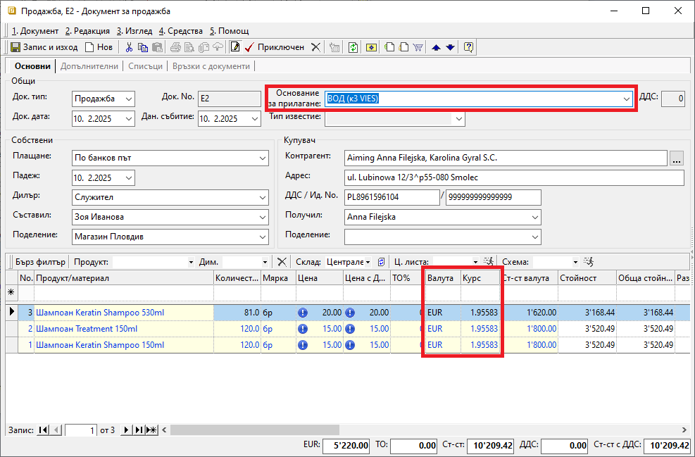
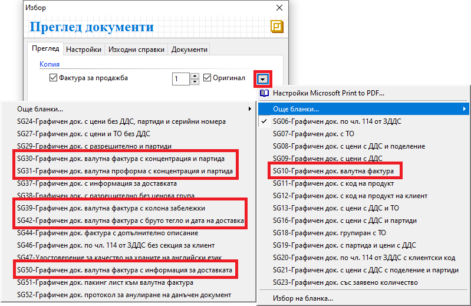
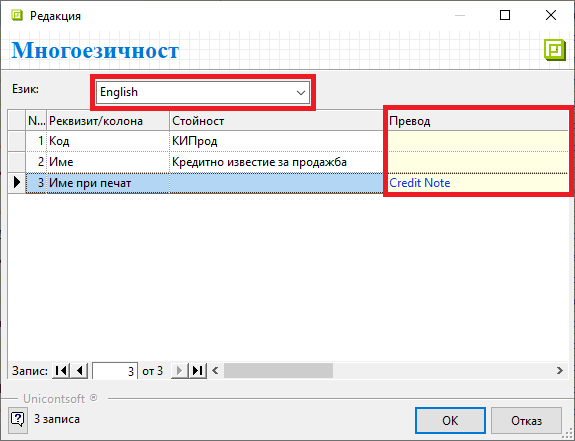
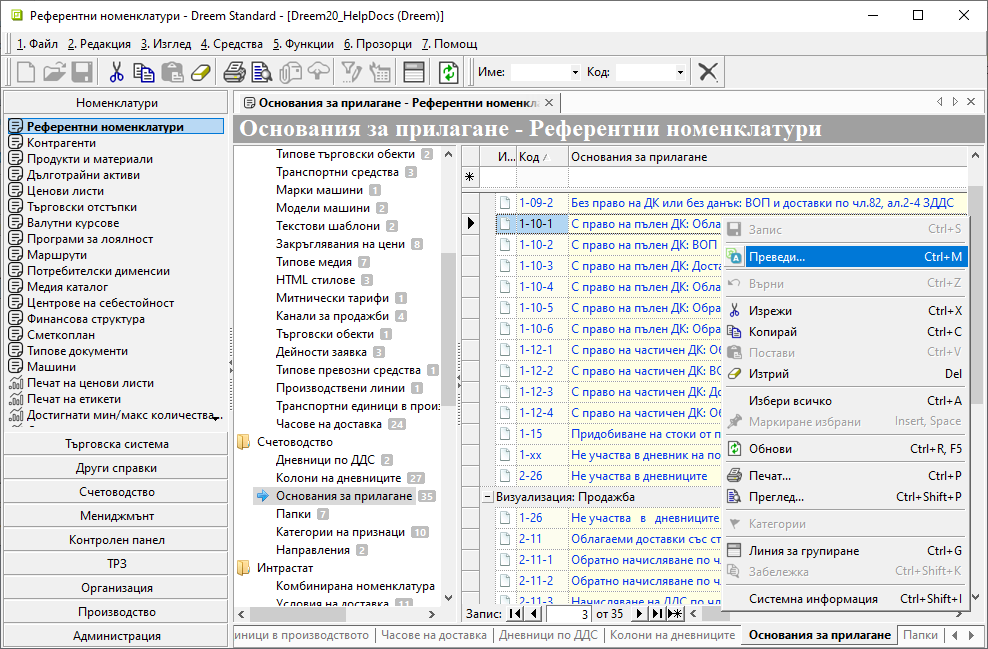
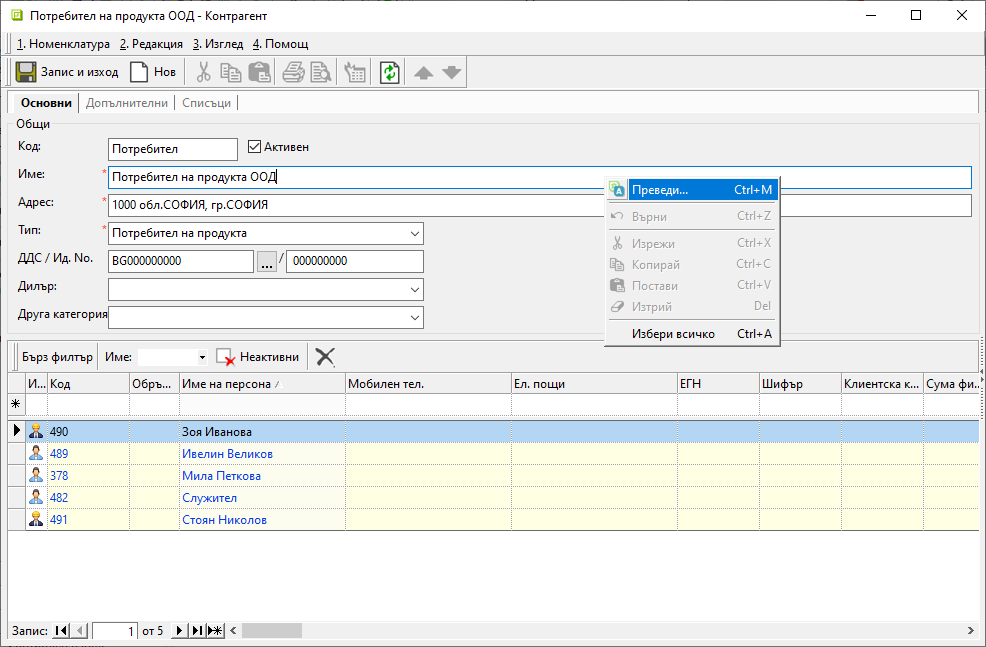
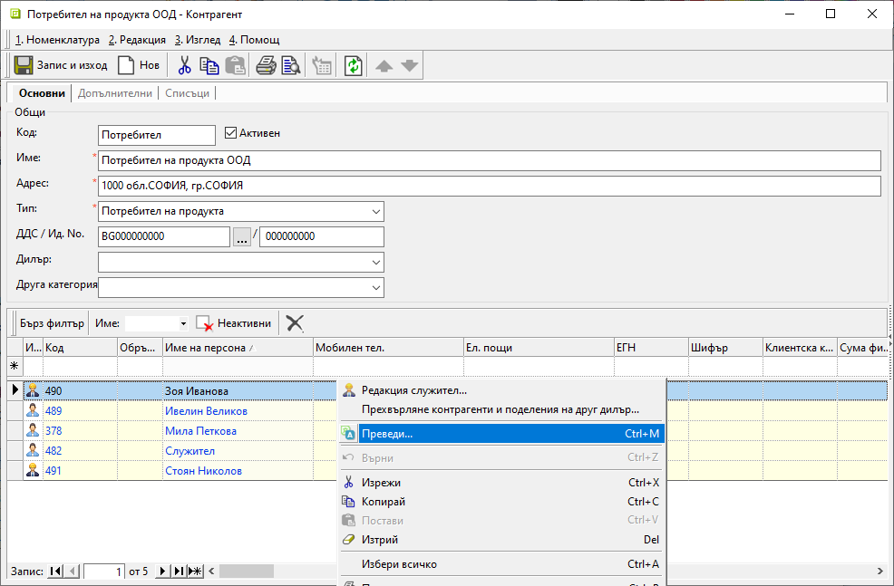
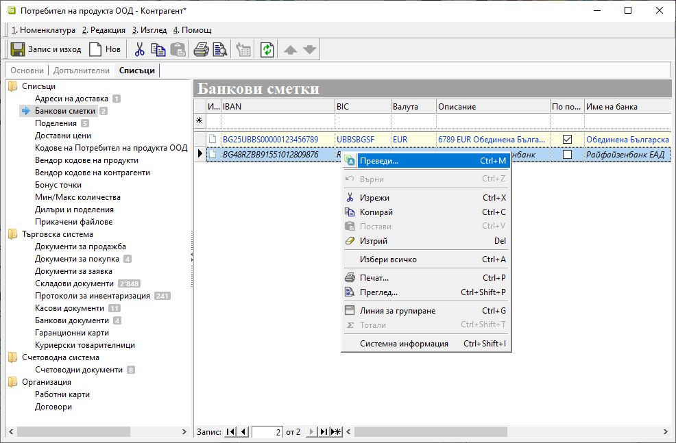
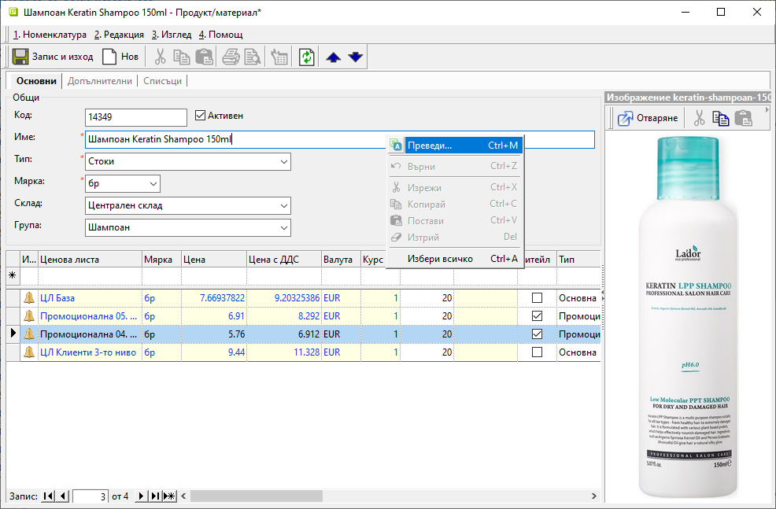

```{only} html
[Нагоре](000-index)
```

# **В чуждестранна валута**

- [Въведение](#въведение)  
- [Създаване на валутна продажба](#създаване-на-валутна-продажба)  
- [Настройки при печат на чуждоезикова фактура](#настройки-при-печат)  
- [Използване на шаблони за печат на валутна фактура](#шаблони-за-печат-на-документи)
- [Свързани статии](#свързани-статии)  

## **Въведение**

При чуждестранни сделки документите, които се обработват в системата, пораждат вземания или задължения във валута.  
Валутните сделки се въвеждат в системата като стандартни [покупки](../001-orders-sales-purchase-documents/002-create-purchase-documents.md) и [продажби](../001-orders-sales-purchase-documents/003-create-sales-document.md). Това, което ги отличава, са данните в  следните реквизити:  

- В раздел **Основни**: *Основание за прилагане*, *Валута* и *Курс*;  
- В раздел **Допълнителни**: *Валута* и *Курс*;  

За издаване и отпечатване на валутен документ предварително в системата трябва да се направи чуждоезиков превод на участващите реквизити. Това става от списъка със съответната настройка чрез опция **Преведи**.  

## **Създаване на валутна продажба**  

1) Отличителните реквизити в раздел **Основни** на формата за редакция са:  
    - **Основание за прилагане** - От падащия списък в полето трябва да бъде избрано коректно основание за валутна сделка.  
    Списъкът с основания е въведен предварително от **Номенклатури » Референтни номенклатури**.  
    - **Валута** - В това поле може да се променя валута по редовете на документа. Системата може да обзаведе полето автоматично. За целта в раздел **Допълнителни** трябва да се укаже валута за документа.  
    - **Курс** - от това поле може да се променя валутен курс според избраната на реда валута. Полето се обзавежда автоматично при попълване на информацията в раздел **Допълнителни**.  

{ class=align-center w=15cm }

2) Промяна на валута за целия документ се извършва от раздел **Допълнителни » Реквизити: Плащане**. Това включва следните реквизити:   
    - **Валута** - От падащия списък в полето се избира валута на документа.  
    Списък с валути трябва да се настрои предварително в **Номенклатури » Референтни номенклатури**.  
    - **Курс** - В полето се въвежда валутен курс спрямо вече избраната валута.  
    Полето може да се попълни автоматично, когато за избраната валута има настройки в **Номенклатури » Валутни курсове**.  

    > Системата ще предложи автоматично копиране на тези настройки по редовете на документа в **Основни**.  

{ class=align-center w=15cm }

Останалата част от обработката на документа се извършва стандартно.    

## **Настройки при печат**

При валутните документи се използват различни шаблони за печат.  
Те са чуждоезични и са необходими някои допълнителни настройки с превод.  

1) **Типове документи** - Една от основните настройки за превод е наименованието на различните документи. Тя е достъпна в **Номенклатури » Типове документи**. С десен клик върху реда с избрания тип документ се избира опция **Преведи**. Това отваря форма за редакция **Многоезичност**.  

{ class=align-center w=15cm }

Формата съдържа реквизитите *Код*, *Име* и *Име при печат*. За всеки един от тях може да бъде добавен превод.  
Изборът се потвърждава с бутон [**OK**]. С това формата за редакция се затваря. Когато има направени промени, трябва да бъдат потвърдени с бутон [**Запис**] в лентата с инструменти.  

{ class=align-center }

2) **Основание за прилагане** — От **Номенклатури » Референтни номенклатури** се добавя превод в **Основания за прилагане**. С десен клик върху реда с основание се избира опция **Преведи**. Отваря се форма за редакция и може да бъде добавен превод за реквизити *Код*, *Име* и *Име при печат*. Настройката трябва да бъде потвърдена и записана.  

{ class=align-center w=15cm }

3) **Контрагенти** — Настройките за превод се дефинират от формата за редакция на **Потребител на продукта**, достъпна от списък **Контрагенти**. Опцията **Преведи** се отваря с десен клик от полета *Код*, *Име* или *Адрес* (раздел **Основни**).  

{ class=align-center w=15cm }

В **Потребител на продукта** може да се настрои превод и за всички служители или приоритетно за издаващите външнотърговски документи. Опцията **Преведи** е достъпна с десен клик върху реда с персона.  

{ class=align-center w=15cm }

Друг реквизит за контрагент, който се визуализира при печат на документи, е **Банкови сметки** в раздел **Списъци**.  
Опцията **Преведи** се активира с десен бутон върху реда с желаната банкова сметка. Форма **Многоезичност** съдържа полета за превод *Име*, *Име на банката*, *Банков клон* и *Адрес на банка*.  

Новите настройки трябва да бъдат записани.  

{ class=align-center w=15cm }

> За клиента, който ще получи документа, също се правят гореописаните настройки на контрагент.  

4) **Продукти** — Превод на наименованието се въвежда за всички продукти в документа.  
Отваря се форма за редакция **Продукт/материал** и с десен клик в поле *Код* или *Име* се избира **Преведи**. Настройката трябва да бъде потвърдена и записана.   

{ class=align-center w=15cm }

## **Шаблони за печат на документи**  

За разпечатването на документа са предвидени подходящи шаблони с изглед за валутна фактура.  
Промяната на шаблон за печат става от форма *Печат документи*, която се отваря чрез бутон **Печат** или *Преглед документи* - чрез бутон **Преглед**.  

{ class=align-center w=15cm }

## **Свързани статии**

[Документи за покупка](002-create-purchase-documents.md)  
[Документи за продажба](003-create-sales-document.md)  
[Митническа декларация за внос](../../../005-how-to/019-import-custom-declaration.md)  