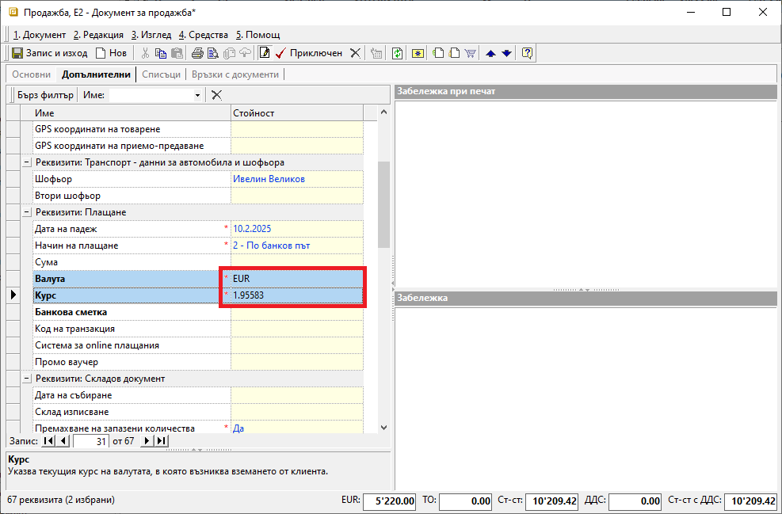
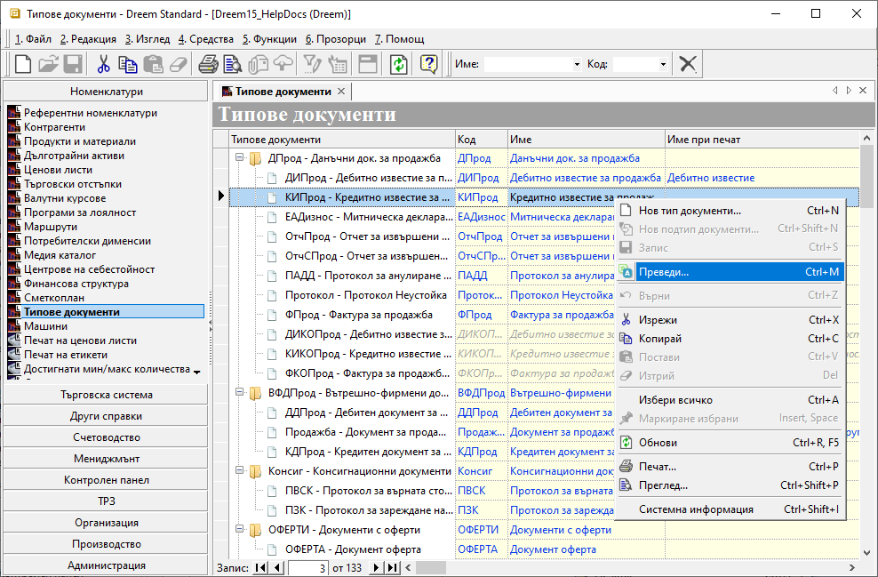
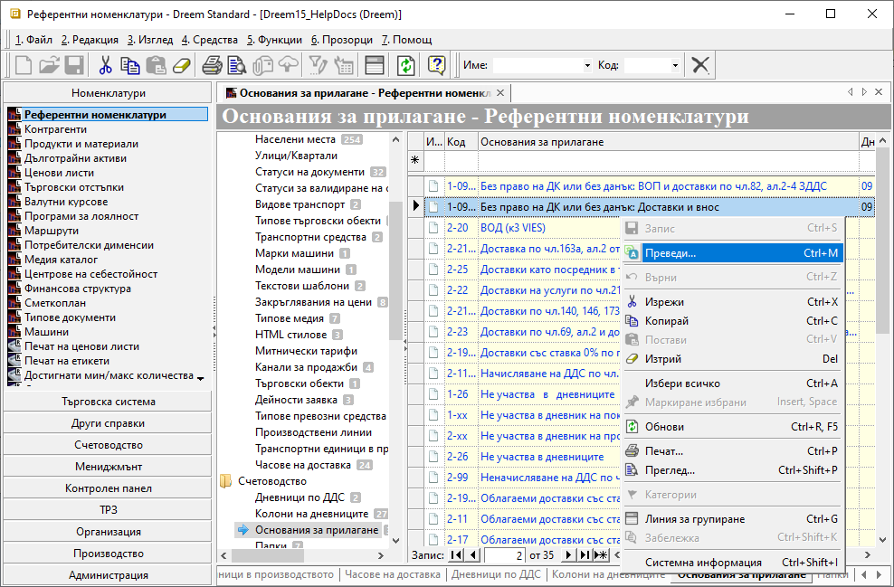

```{only} html
[Нагоре](000-index)
```

# **Документи в чуждестранна валута**

- [Въведение](#въведение)  
- [Създаване на валутна продажба](#създаване-на-валутна-продажба)  
- [Настройки при печат на чуждоезикова фактура](#настройки-при-печат-на-чуждоезикова-фактура)  
- [Използване на шаблон за печат на валутна фактура](#използване-на-шаблон-за-печат-на-валутна-фактура)
- [Свързани статии](#свързани-статии)  

## **Въведение**

При сделки с чуждестранни лица документите, които се обработват в системата, пораждат вземания или задължения във валута.

Валутните сделки се въвеждат в системата като стандартни [покупки](https://docs.unicontsoft.com/guide/erp/002-docs/002-trade-system/001-orders-sales-purchase-documents/002-create-purchase-documents.html) или [продажби](https://docs.unicontsoft.com/guide/erp/002-docs/002-trade-system/001-orders-sales-purchase-documents/003-create-sales-document.html). Единствените реквизити, които се различават, са данните в полета:  

- В раздел **Основни**: *Основание за прилагане*, *Валута* и *Курс*;  
- В раздел **Допълнителни**: *Валута* и *Курс*;  

## **Създаване на валутна продажба**  

1) Реквизитите в раздел **Основни**, които отличават валутните документи, са:  
    - **Основание за прилагане**, което се променя чрез избор на подходящо основание от падащото меню. Списъкът с основания трябва да бъде въведен предварително от **Номенклатури » Референтни номенклатури**.  
    - **Валута** - от това поле може да се променя валута по редовете на документа;  
Системата може да обзаведе това поле автоматично. За целта трябва да се промени настройката в раздел **Допълнителни**.  
    - **Курс** - от това поле може да се променя валутен курс според избраната на реда валута;  
Системата може да обзаведе това поле автоматично, след като се изпълни стъпката с настройки в раздел **Допълнителни**.  

{ class=align-center w=15cm }

2) Промяната на валута на документа се извършва от форма за редакция на документ в раздел **Допълнителни » Реквизити: Плащане**. Реквизитите, които се попълват тук при валутен документ, са:   
    - **Валута** - поле с падащ списък за избор на валута на документа;  
Списък с валути трябва да се настрои предварително в **Номенклатури » Референтни номенклатури**.  
    - **Курс** - поле за въвеждане на валутен курс за избраната валута;  
Полето се попълва автоматично от системата, когато за избраната валута има настройки в **Номенклатури » Валутни курсове**.  

> Валутният курс за евро (EUR) е системно въведен, като се допуска ръчно коригиране.  

{ class=align-center w=15cm }

Системата ще предложи автоматично копиране на тези настройки и в редовете на документа от раздел **Основни**.  

Останалата част от обработката на документа се извършва стандартно.  

> При осчетоводяването на валутни документи сумата на вземането/задължението ще се отрази едновременно със стойност във валута и в евро.  

## **Настройки при печат на чуждоезикова фактура**

1) **Типове документи** - Една от основните настройки за превод е наименованието на различните документи. Тя е достъпна в **Номенклатури » Типове документи**. Чрез десен бутон на мишката върху реда с типа документ се избира опция **Преведи**. Това отваря форма за редакция **Многоезичност**.  

{ class=align-center w=15cm }

Формата съдържа реквизитите *Код*, *Име* и *Име при печат*. За всеки един от тях може да бъде добавен превод.  
Изборът се потвърждава с бутон [**OK**], което затваря формата за редакция. Когато има направени промени, трябва да бъдат потвърдени с бутон [**Запис**] в лентата с инструменти.  

{ class=align-center }

2) **Основание за прилагане** — От **Номенклатури » Референтни номенклатури** се добавя превод за **Основания за прилагане**. Отново с десен бутон на мишката върху реда с желаниото основание се избира опция **Преведи**. В отворената форма за редакция може да бъде добавен превод за реквизити *Код*, *Име* и *Име при печат*. Настройката трябва да бъде потвърдена и записана.  

{ class=align-center w=15cm }

3) **Контрагенти** — Настройките за превод се правят от формата за редакция на **Потребител на продукта**. Това може да стане при отваряне на списък **Контрагенти**, достъпен в меню **Номенклатури » Контрагенти**.  

Опцията **Преведи** се активира с десен бутон на мишката върху полета *Код*, *Име* или *Адрес*. Те са разположени в панел **Основни**.  

{ class=align-center w=15cm }

В **Потребител на продукта** може да се настрои превод и за всички персони или приоритетно за тези, които ще издават външнотърговски документи. Опция **Преведи** отново е достъпна от контекстното меню чрез десен бутон на мишката върху реда с избраната персона.  

{ class=align-center w=15cm }

Друг реквизит, който се визуализира при печат на документи и изисква превод, е **Банкови сметки**. Настройката се намира в панел **Списъци » Банкови сметки** на формата за редакция на контрагент.  
Опцията **Преведи** се активира с десен бутон върху реда с желаната банкова сметка.  

Форма **Многоезичност** съдържа полета за превод *Име*, *Име на банката*, *Банков клон* и *Адрес на банка*.  

{ class=align-center w=15cm }

> За контрагента - клиент, който ще получи документа, се правят същите настройки като горепоказаните.  

4) **Продукти** — Превод на наименованието трябва да бъде въведен за всички продукти, които ще участват в документа. Това става през форма за редакция на **Продукт/материал**. Форма за настройка на превод се отваря с десен бутон на мишката от поле *Код* или *Име*. От контекстното меню се избира опцията **Преведи**.  

{ class=align-center w=15cm }

## **Използване на шаблон за печат на валутна фактура**  

За издаване на валутен документ предварително в системата трябва да се направи чуждоезиков превод на участващите реквизити. Това става от списъка със съответната настройка чрез бутон [**Преведи**](https://www.unicontsoft.com/cms/node/135). 

За разпечатването на документа са предвидени подходящи шаблони с изглед за валутна фактура.  
Промяната на шаблон за печат става от форма *Печат документи*, която се отваря чрез бутон **Печат** или *Преглед документи* - чрез бутон **Преглед**.  

{ class=align-center w=15cm }

## **Свързани статии**

[Документи за покупка](002-create-purchase-documents.md)  
[Документи за продажба](003-create-sales-document.md)  
[Митническа декларация за внос](../../../005-how-to/019-import-custom-declaration.md)  