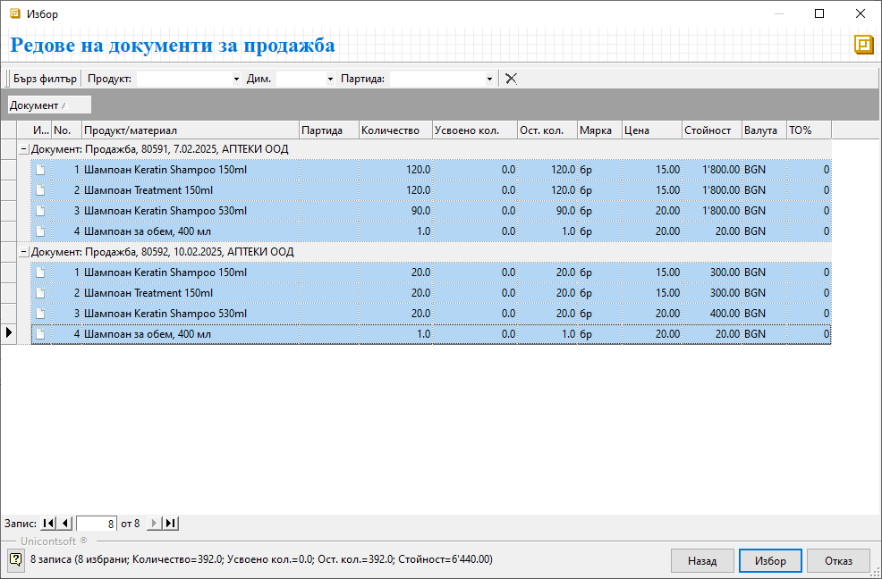
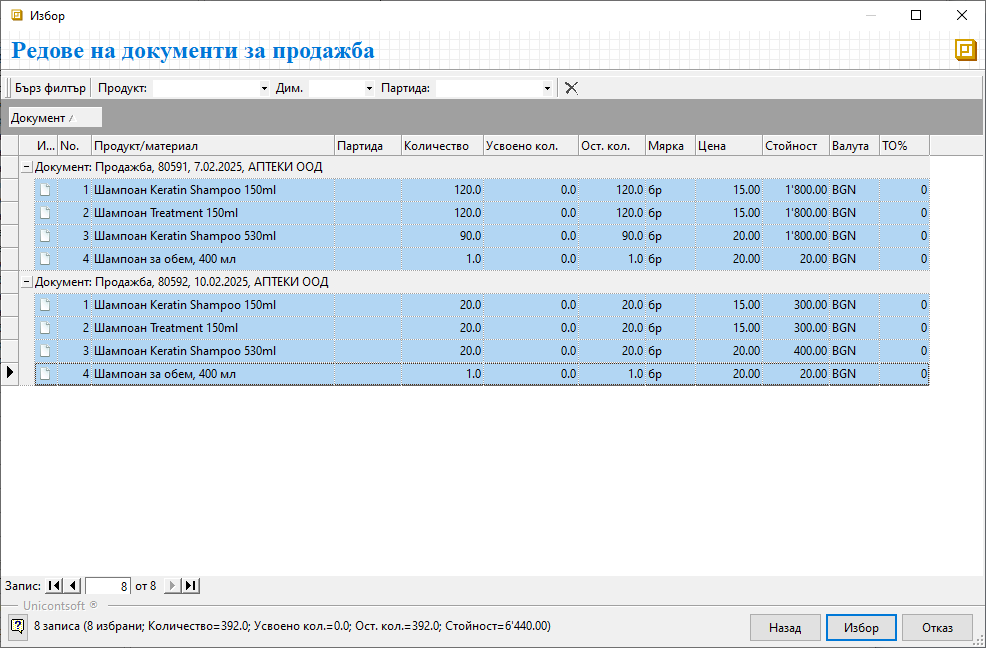

```{only} html
[Нагоре](000-index)
```

# Генериране на фактура от множество продажби

Системата дава възможност за обединяване на няколко документа за продажба на един контрагент в една фактура.  
Тези документи се обработват в **Търговска система || Документи за продажба** и вариантите за издаване на обща фактура са следните:  

1) Генерация от форма за нов документ:  

-  Чрез десен бутон на мишката върху списъка с документи се избира **Нов документ**. Отваря се празна форма за въвеждане на данни.  

- От меню **Средства** се избира опция **Генериране фактура от продажби**. Това отваря форма за избор **Редове на документи за продажба**.  

- От списъка с продажби се маркират желаните вътрешнофирмени документи и с бутон **Напред** се преминава към следваща стъпка.  

> Ако търсените документите не се визуализират в списъка, трябва да се направи корекция на търсенето в *Бърз филтър* и/или в основния филтър (от жълтото поле).  

{ class=align-center }

- Системата извежда списък с пълното съдържание на избраните документи за продажба. Тук се маркират продуктите, които системата да включи във фактурата.  
С бутон **Избор** се продължава към следваща стъпка.

{ class=align-center }

- В резултат на предходните действия системата генерира **ФПрод**-*Фактура за продажба* и автоматично попълва всички полета.  

> При наличие на еднакви продукти с еднакви цени в избраните продажби системата ги обединява в един ред с общо количество.  

{ class=align-center }

- Обработката на фактурата за продажба завършва с бутон **Приключен** от лентата с инструменти. Той валидира фактурата и отваря форма **Свързани документи** за генериране на счетоводен запис.  

{ class=align-center }


2) Генерация от списък **Документи за продажба**:  

- От **Търговска система || Документи за продажба** се извежда списък с вътрешнофирмени документи. Търсенето се направлява от *Бърз филтър* и/или основния филтър.  
Маркират се продажбите, които да бъдат включени в обща фактура.  

- Чрез десен бутон върху маркировката се избира **Други средства || Генериране фактура от продажби**.  

{ class=align-center }

- Системата извежда списък с пълното съдържание на избраните документи за продажба. Маркират се продуктите, които системата да включи във фактурата.  
С бутон **Избор** се продължава към следваща стъпка.

{ class=align-center }

- В резултат на предходните действия системата генерира **ФПрод**-*Фактура за продажба* и автоматично попълва всички полета.  

{ class=align-center }

- Данъчният документ се валидира чрез бутон **Приключен**, който отваря форма за генарция на свързани документи.  
Тук системата предлага аветоматично генериране на счетоводен запис.  
___  
Свързани статии:  

[Как да създадем Фактура от няколко продажби](https://www.unicontsoft.com/cms/node/29)  