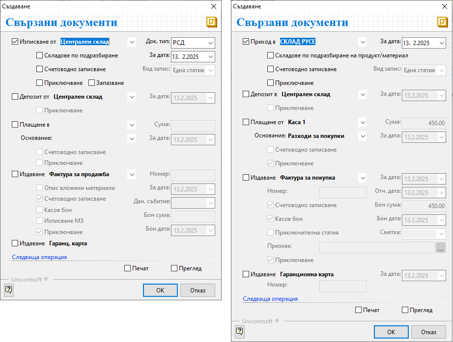
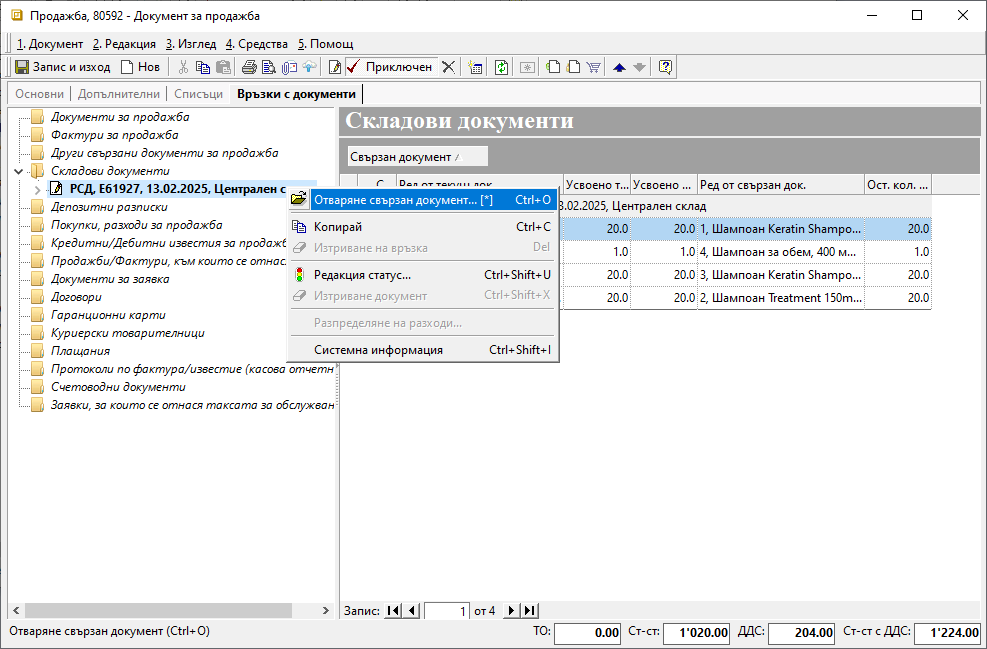
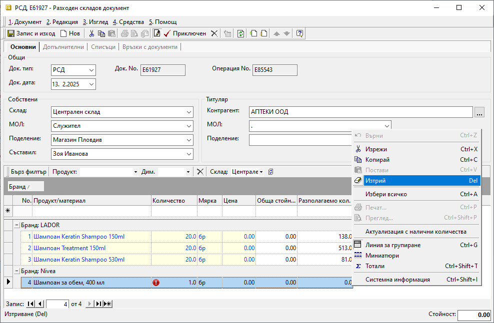

```{only} html
[Нагоре](000-index)
```

# **Частична доставка**  

- [Въведение](#въведение)  
- [Регистриране на сделка с частична доставка](#регистриране-на-доставки)
- [Свързани статии](#свързани-статии)  

## **Въведение**

Във връзка с една сделка може да се наложи частично изписване или заприходяване на продукти и материали в склада.  
Като начало сделката се регистрира в системата с документ от съответния тип - **Продажба** или **Покупка**. В последствие към нея се добавя необходимият брой складови документи.   

> Складовите документи трябва да отразяват фактическото движение на продукти по дата и склад.  

Така при доставка на траншове се регистрира нов складов документ по дата за всеки прием или изписване.  
Същият метод се използва и за заприходяване в различни складове при пълна доставка по покупка.    

## **Регистриране на доставки** 

1) В **Търговска система** се създава и валидира документ за [покупка](002-create-purchase-documents.md) / [продажба](003-create-sales-document.md).  
С бутон [**Генериране**] или [**Приключен**] от лентата с инструменти се отваря форма **Свързани документи**. В нея се избират определени опции, които касаят складови документи:  
- **Изписване от** (склад) / **Приход в** (склад) — В полето се поставя отметка и от падащото меню се избира склад.  
    - *Док. тип* - Полето е активно при документите за продажба.  
    Позволява избор на тип складов документ, с който стоките да се издължат. Системата предлага по подразбиране **РСД**-*Разходен складов документ*.   

      При покупките системата автоматично създава тип **ПСД**-*Приходен складов документ*.  
    - *Складове по подразбиране на продукт/материал* - Чрез избор на тази опция се вземат предвид настройките на всеки продукт за склад по подразбиране. Системата ще разпредели продуктите по складове в отделни документи.  
    - *За дата* - Избира се дата, която системата да попълни в реквизит **Док. дата** на складовия документ. 
    - *Счетоводно записване* - Опцията указва автоматично създаване на счетоводен запис за складовия документ. За да се обзаведе коректно счетоводната статия, [**Автоматичен осчетоводител**](../../../001-ref/002-accounting/003-acc-wizard.md) трябва да бъде предварително настроен.  
    - *Вид запис* - В това поле се избира формата на счетоводния документ. При вариант *Една статия* системата създава счетоводен документ и включва продуктите (признаците) в общ списък с една статия.    
    При вариант *Ред-статия* се генерира счетоводен документ с множество статии - отделна за всеки продукт.  
    - *Приключване* - За тази опция не се поставя отметка. По този начин системата генерира складов документ, който остава в състояние на редакция.  
- **Ок** - Този бутон потвърждава маркираните опции и системата генерира складов документ.   

{ class=align-center w=15cm }

2) Складовият документ може да бъде отворен от раздел **Връзки с документи** на формата за редакция на продажбата/покупката.  

{ class=align-center w=15cm }

3) Съдържанието на складовия документ се коригира, така че да отговаря на реално издълженото/полученото за текущия склад.  
След намаляване на количествата или изтриване на редове документът се приключва.  

{ class=align-center w=15cm }

4) Точки **1**, **2** и **3** се повтарят за необходимия брой складови документи до пълното регистриране на доставките.  

> Системата генерира всеки следващ складов документ единствено с остатъчните количества по продукти.  
Последният складов документ може да бъде генериран с *Приключване*.
 
## **Свързани статии**

[Връзки между документи](../../001-documents/002-row-crosses.md)  
[Състояния на документите](../../../004-tips/004-doc-states.md)  
[Документи за покупка](002-create-purchase-documents.md)  
[Документи за продажба](003-create-sales-document.md)  
[Автоматичен осчетоводител](../../../001-ref/002-accounting/003-acc-wizard.md)  