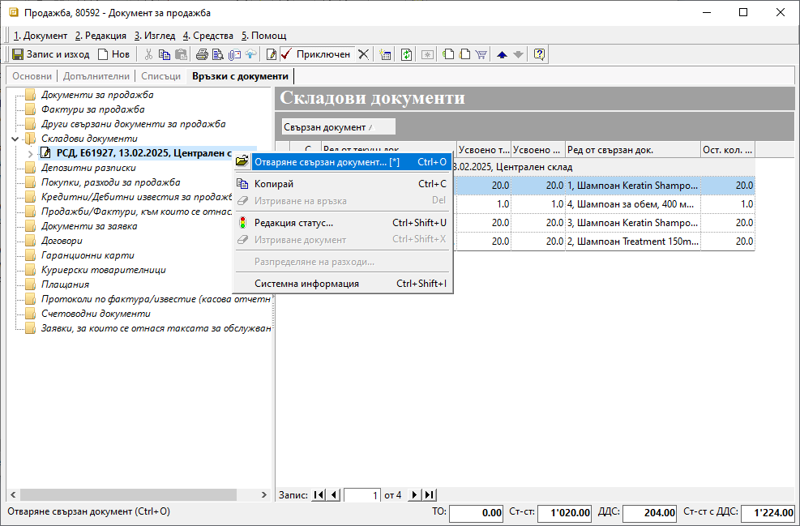

```{only} html
[Нагоре](000-index)
```

# Продажба/покупка с няколко складови документа

- [Въведение](https://docs.unicontsoft.com/guide/erp/002-docs/002-trade-system/001-orders-sales-purchase-documents/006-invoice-multiple-wd.html#id2)  
- [Регистриране на няколко доставки към една продажба/покупка](https://docs.unicontsoft.com/guide/erp/002-docs/002-trade-system/001-orders-sales-purchase-documents/006-invoice-multiple-wd.html#id2)
- [Свързани статии](https://docs.unicontsoft.com/guide/erp/002-docs/002-trade-system/001-orders-sales-purchase-documents/006-invoice-multiple-wd.html#id3)  

## **Въведение**

В системата се прилага единна схема за частично изписване при продажби и частично заприходяване по покупки на продукти и материали в склада. Това може да се наложи в различни ситуации. Понякога продуктите се доставят на различни етапи. Това трябва да се регистрира в отделни документи с точна дата. При друга ситуация продуктите може да се отнасят за различни складове. Така при продажби може да се издължават с отделни документи от наколко склада. Същото важи и при покупки, когато продуктите трябва да се заприходят в отделни складове.   

## **Регистриране на няколко доставки към една продажба/покупка** 

1) В **Търговска система** към създаден документ за продажба/покупка от форма за генериране на **Свързани документи** се регистрират складови документи.  
- **Изписване от** (склад) / **Приход в** (склад) — в полето се поставя отметка и от падащото меню се избира склад;  
    - *Док. тип* - **При продажба**: поле за избор на тип складов документ, с който стоките да се издължат;  
    Системата предлага по подразбиране **РСД**-*Разходен складов документ*.    
    **При покупка**: системата автоматично създава тип **ПСД**-*приходен складов документ*.  
    - *Складове по подразбиране на продукт/материал* - чрез избор на тази опция се вземат предвид настройките на всеки продукт за склад по подразбиране;  
    Системата ще генерира отделни складови документи, като групира продуктите по складове.  
    - *За дата* - избира се дата, която системата да попълни като **Док. дата** в складовия документ; 
    - *Счетоводно записване* - при поставянето на отметка системата автоматично  ще осчетоводи складовия документ;  
    За да се обзаведе коректно счетоводната статия, **Автоматичен счетоводител** трябва да е предварително настроен.  
    - *Вид запис* - поле за избор на формата на счетоводния документ;  
    При избор на вариант *Една статия* системата създава счетоводен документ с една статия, включваща продуктите (признаците) в общ списък;  
    При *Ред-статия* системата генерира счетоводен документ с множество статии - за всеки продукт се създава отделна счетоводна статия;
    - *Приключване* - не се поставя отметка;  
    По този начин системата генерира складов документ, който остава в състояние на редакция.  
    - **Ок** - бутонът потвърждава маркираните опции и системата генерира складов документ;   

    { class=align-center w=15cm }

2) От раздел **Връзки с документи** във формата за редакция на продажбата/покупката се отваря складовият документ в редакция.  

{ class=align-center w=15cm }

3) Съдържанието на складовия документ се коригира, така че да отговаря на реално издълженото/полученото за текущия склад.  
След намаляване на количествата или изтриване на редове документът се приключва.  

{ class=align-center w=15cm }

4) Точки 1, 2 и 3 се повтарят докато се регистрират необходимият брой складови документи.  
Във всеки следващ складов документ системата генерира единствено неизписаните/незаприходените продукти и количества.  
Последният складов документ може да бъде генериран с приключване.
 
## **Свързани статии**

- [Как да издължим частично стоки от склад](https://www.unicontsoft.com/cms/node/34)  
- [Как да въведем частично стоки в склад от покупка](https://www.unicontsoft.com/cms/node/85)