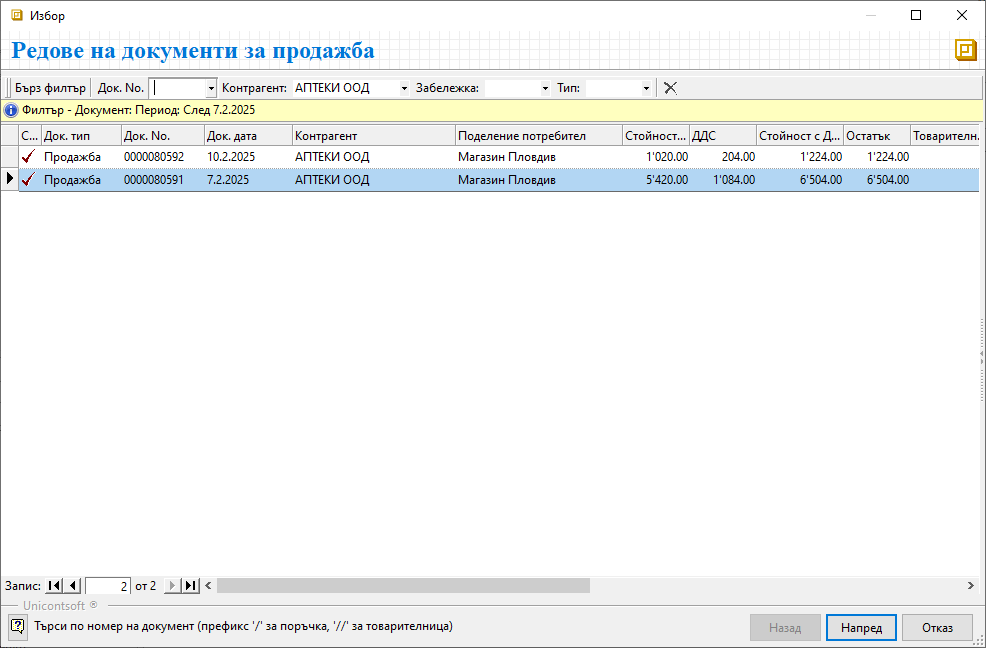
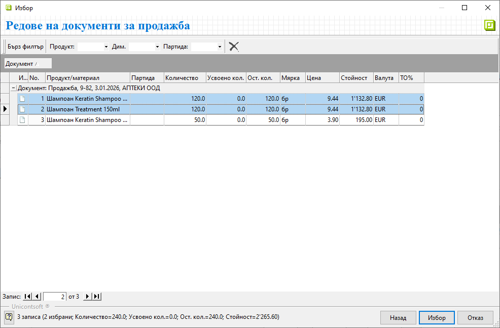
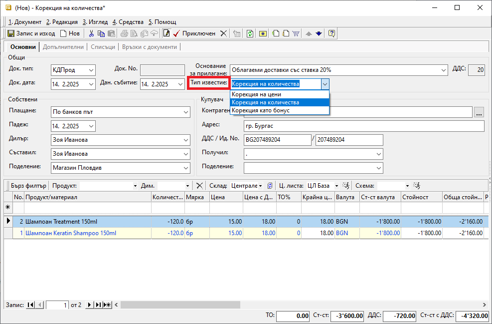
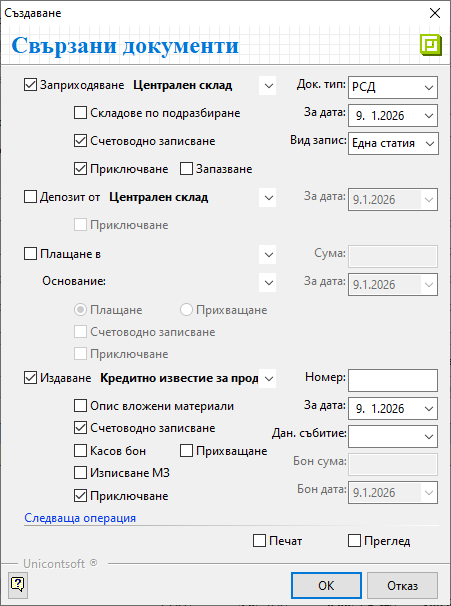

```{only} html
[Нагоре](000-index)
```

# **Кредитни документи**

- [Въведение](#въведение)  
- [Генериране на кредитен документ](#нов-кредитен-документ)  
- [Свързани статии](#свързани-статии)

## **Въведение**

Системата поддържа лесна обработка на кредитни документи при връщане на стока, намаление на цени и бонуси за натрупан оборот.  

> Методите за регистриране на кредитни документи са аналогични за покупки и продажби.  

Различните причини за създаване на документ за корекция се указват чрез тип на известието.  
При кредитните документи от тип *Корекция на цени* и *Корекция на количества* се изисква връзка с вече издадена продажба/ фактура. Системата разполага с инструмент за изграждане на такава. Чрез него се свързват вътрешнофирмените документи **Продажба**-*Документ за продажба* и **КДПрод**-*Кредитен документ за продажба*. На същия принцип се създава връзката и на данъчните документи **Фактура**-*Фактура за продажба* с **КИПрод**-*Кредитно известие за продажба*.  

При тип документ [*Корекция като бонус*](../../../005-how-to/002-correction-doc.md#кд-без-връзка-с-продажба) връзка с предхождаща го продажба/фактура не се изисква. Този тип корекции се въвеждат ръчно.  

## **Нов кредитен документ**

**1. Създаване**

Кредитен документ за продажба с корекция на цени/количества се създава от **Търговска система » Документи за продажба**.  
С десен клик върху списъка и опция **Нов документ** се отваря празна форма за въвеждане на данни.  

**2. Попълване на реквизити**

От меню **Средства** се избира **Генериране на кредитен документ/известие**. Това отваря форма за избор **Редове на документи за продажба**.  

В списъка се избира продажба, за която се отнася корекцията. Могат да бъдат маркирани един или няколко документа.  
Ако търсените документи не се визуализират в списъка, се променят параметрите в основния филтър и/или в *Бърз филтър*.     
С бутон **Напред** се преминава към следваща стъпка.  

{ class=align-center w=15cm }

Системата извежда съдържанието на избраните продажби. От списъка се маркират продуктите, за които се отнася корекцията.  
Генерацията се потвърждава с бутон **Избор**.  

{ class=align-center w=15cm }

Отваря се форма с вътрешнофирмен документ **КДПрод**. Реквизитите в нея са автоматично попълнени.  

- **Док. тип** – По подразбиране в полето е избран тип **КДПрод**-*Кредитен документ за продажба*.  

- **Док. номер** – При валидиране на документа системата ще обзаведе полето с пореден номер според избраните обект и тип документ.  

- **Док. дата** – В полето се указва дата на кредитния документ.  
По подразбиране системата предлага текуща дата.  

- **Основание на прилагане** – Полето се попълва с основанието за прилагане от свързаната продажба.  

- **Тип известие** - От падащия списък в полето се избира тип на корекцията.  
Типовете са системно заложени:  
    - *Корекция на количества* се използва за връщане на продукти.  
    - *Корекция на цени* се използва при намаление в цената за един или няколко продукта.  
    - *Корекция като бонус* се създава при специфични условия.   

{ class=align-center w=15cm }

Системата поставя отрицателен знак в различни полета според избрания **Тип известие**.  
При *Корекция на количества* стават отрицателни стойностите в колона **Количество**.  
При *Корекция на цени* отрицателни са стойности в полетата от колона **Цена**.  

Данните в тези колони се редактират, така че да отразяват корекциите.  

> Системата не допуска стойностите на намаление в количество и цена да надвишат тези от свързаните продажби.  

**3. Приключване**

Документът се валидира от бутон [**Приключен**] в лентата с инструменти. Отваря се форма **Свързани документи**. Чрез нея могат да бъдат създадени следните:   

- **Заприходяване** (склад) - Опцията се маркира при **Тип известие:** *Корекция на количества*. Чрез нея фактически върнатите количества се добавят към наличността на избрания склад.   
Системата създава разходен складов документ с отрицателен знак.  
  - *Док. тип* - В полето се избира тип складов документ.  
  По подразбиране системата предлага **РСД**-*Разходен складов документ*.    
  - *Складове по подразбиране* - Опцията указва да се вземат предвид настройките за склад по подразбиране на всеки продукт.  
  Системата ще генерира отделни документи, в които продуктите се разпределят по склад.  
  - *За дата* - Избира се дата, която системата да попълни като **Док. дата** в складовия документ.  
  - *Счетоводно записване* - Чрез опцията се указва генерация на счетоводен запис към складовия документ.  
  За да се обзаведе коректно счетоводната статия, трябва да бъде настроен предварително **Автоматичен осчетоводител**.  
  - *Вид запис* - От полето се избира формата на счетоводния документ.  
  При избран вариант *Една статия* системата създава счетоводен документ с една статия. В него продуктите (признаците) са обединени в един списък.  
  При *Ред-статия* се генерира счетоводен документ с множество статии. За всеки продукт се създава отделна счетоводна статия.  
  - *Приключване* - Чрез отметка се указва генериране на складовия документ с автоматично приключване.  
  Когато липсва отметка, документът се генерира в състояние на редакция.  
  - *Запазване* - Опцията указва генериране на складов документ в редакция с резервиране на продуктите в избрания склад.  

- **Депозит от** (склад) - Опцията се маркира при наличие на амбалаж при връщане на продукти и материали.  
    - *За дата* - Избира се дата, която ще се попълни като **Док. дата** в депозитната разписка.  
    - *Приключване* - При поставена отметка депозитната разписка се генерира и приключва автоматично.  
    Когато няма отметка, свързаният документ се генерира в състояние на редакция.  

- **Плащане в** (каса) – Чрез опцията се указва каса и се потвърждава създаване на касов ордер. Използва се, когато има връщане в брой, с карта или подобно (при определени [настройки](../../../005-how-to/018-card-payments.md)).  
Опцията е автоматично изключена при плащане по договор или банков път.   
    - *Сума* - В полето се записва фактически върната сума.  
    - *Основание* - От падащия списък се избира основание за плащане, което се попълва в касовия документ.  
    - *За дата* - Въвежда се дата, с която се попълва **Док. дата** в касовия документ.  
    - *Прихващане* - Опцията позволява системата автоматично да прихване неплатените остатъци по свързаните продажба и кредитен документ.  
    - *Счетоводно записване* - С поставена отметка се указва генериране на счетоводна статия към касовия документ.  
    За да се обзаведе коректно статията, **Автоматичен осчетоводител** трябва да бъде настроен предварително.  
    - *Приключване* - Чрез отметка се указва генериране на касов документ с автоматично приключване.   
    Когато няма отметка, свързаният документ се генерира в състояние на редакция.  

- **Издаване** (тип документ) - Опцията се маркира за издаване на данъчен документ към текущия кредитен документ.  
От падащия списък се избира тип на данъчния документ.  
Полето се обзавежда автоматично при дефинирани настройки за контрагента.  
    - *Номер* - Полето остава празно и системата дава пореден номер на данъчния документ. Настройките за автоматична номерация се дефинират предварително в **Администрация » Номератори**.  

    > При издаване на нов данъчен документ датата не трябва да се променя с по-ранна от тази на последно валидирания. Това е от съществено значение за хронологията на данъчните документи.  

    - *Счетоводно записване* - Чрез отметка се потвърждава генерация на счетоводен запис към данъчния документ.  
    - *Касов бон* - Указва генерация на счетоводен запис за касовия бон.    

    > Ако за **Плащане в** *(каса)* вече е избрано *Счетоводно записване*, тук опцията *Касов бон* не се маркира.  

    - *Бон сума* - Полето се обзавежда със сума на касовия бон.  
    - *Бон дата* - В полето се попълва дата на касовия бон.  
    - *Приключване* - С поставена отметка се потвърждава генерацията на данъчен документ с автоматично приключване.    
    Когато няма отметка, свързаният документ се генерира в състояние на редакция.  

- **Печат** или **Преглед** - Отваря се форма за избор на шаблон.  
При избрана опция **Печат** документът директно се разпечатва с избрания шаблон.  
При опция **Преглед** документът се отваря на екран преди отпечатване.     

-  **Ок** - С бутона се потвърждава изпълнението на избраните опции. Системата генерира свързаните документи.    

{ class=align-center }

**4. Запис**

От бутон [**Запис и Изход**] в лентата с инструменти документът се запазва и формата се затваря.  
 
## **Свързани статии**
 
[Коригиращи документи при продажба](../../../005-how-to/002-correction-doc.md)  
[Връзки между документи](../../001-documents/002-row-crosses.md)  