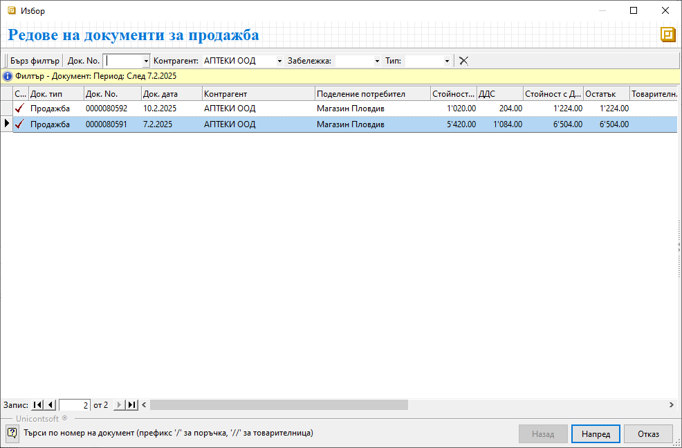
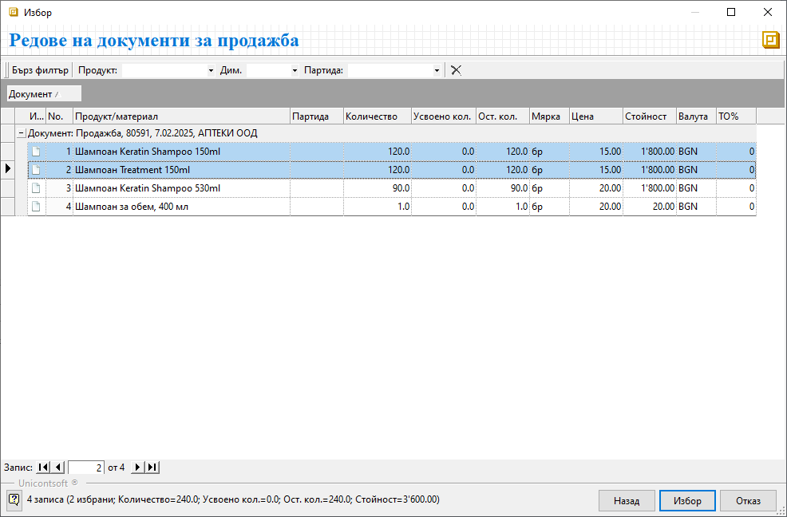
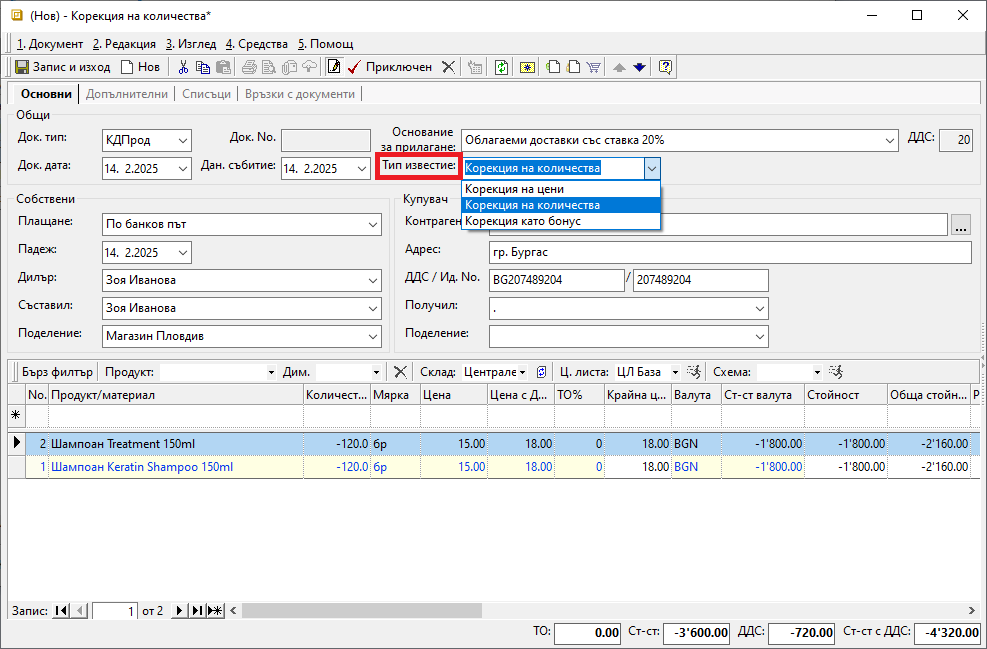
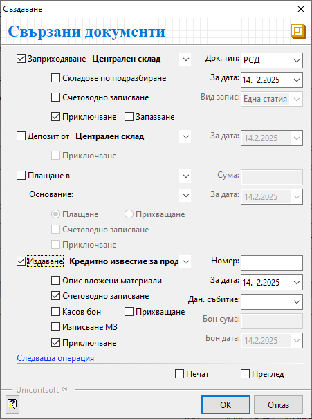

```{only} html
[Нагоре](000-index)
```

# Кредитен документ/Кредитно известие за продажба

Системата дава възможност за издаване на кредитни документи при връщане на стока, намаляване на цена и като бонус оборот.  
Причината за създаване на корекция се указва в документа чрез тип на известието.  

За кредитните документи от тип *Корекция на цени* и *Корекция на количества* системата винаги изисква връзка с тип документ **Продажба** (**Фактура**). За тях в системата има инструмент за генерация, чрез който се създава връзка между вътрешнофирмените документи **Продажба** и **КДПрод**, респ. между данъчните документи **Фактура** и **КИПрод**.  

При тип на коригиращия документ *Корекция като бонус* такава връзка с предхождаща го продажба (фактура) не се изисква. Този тип корекции се въвеждат ръчно.  

Един от начините за генериране на кредитен документ за корекция на цени или на количества е следният:

1. В **Търговска система || Документи за продажба** чрез десен бутон на мишката върху списъка с документи се избира **Нов документ**. Отваря се празна форма за въвеждане на данни.  

2) От меню **Средства** се избира **Генериране на кредитен документ/известие**. Това отваря форма за избор **Редове за документи за продажба**.  

3) В списъка с документи се маркира един или няколко документа за продажба, за които се прави корекция.  
Ако търсените документи не се визуализират в списъка, могат да бъдат намерени чрез основния филтър и чрез *Бърз филтър*.     
С бутон **Напред** се преминава на следваща стъпка.  

{ class=align-center w=15cm }

4) Системата извежда съдържанието на маркираните продажби в списък с продукти. Избират се тези продукти, за които се отнася корекцията.  
С бутон **Избор** се потвърждава и системата генерира кредитния документ за продажба. .

{ class=align-center w=15cm }

5) Отваря се форма с вътрешнофирмен документ **КДПрод** с автоматично попълнени реквизити на документа.  
Системата позволява редактиране на данните в полетата.   

- **Док. тип** – в полето по подразбиране е избран тип **КДПрод**-*Кредитен документ за продажба*;  

- **Док. номер** – номера на текущ документ;  
При валидиране на документа системата обзавежда полето с пореден номер за избраното поделение и тип документ.  

- **Док. дата** – поле с дата на кредитния документ;  
Системата обзавежда полето с текуща дата.  

- **Основание на прилагане** – системата автоматично попълва полето с основанието от свързаната продажба;  

- **Тип известие** - от падащия списък в полето се избира тип на корекцията;  
Типовете са системно заложени:  
    - *Корекция на количества* за връщане на продукти;  
    - *Корекция на цени* при промяна на цената за един или няколко продукта;    

{ class=align-center w=15cm }

6) Според избрания **Тип известие** системата автоматично поставя отрицателен знак или в колона **Количество** (*Корекция на количества*), или в колона **Цена** (*Корекция на цени*).  
Данните в тези колони се коригират по редовете на документа, така че да отразяват желаните корекции.  

> Системата не допуска намаляване на количества или цени, които надвишават тези от свързаните продажби.  

7) **Приключен** - бутон в лентата с инструменти, чрез който текущият документ се валидира и се отваря форма за създаване **Свързани документи**.    

    - **Заприходяване (склад)** - тази опция се маркира при **Тип известие** *Корекция на количества*;  
    При избор на склад и дата системата създава **РСД** с отрицателен знак за фактически върната стока.  
    Складовият документ може да се осчетоводи, ако предварително е настроен **Автоматичен осчетоводител**.  

    - **Депозит от (склад)** - опцията се маркира при наличие на амбалаж при връщане на продукти и материали;  

    - **Плащане в (каса)** – опция за създаване на касов документ  в избраната каса за плащане или за прихващане;  
    Опция *Прихващане* позволява системата автоматично да прихване остатъците за плащане по свързаните продажба и кредитен документ.  
    Касовият документ може да се осчетоводи, ако предварително е настроен **Автоматичен осчетоводител**.  

    - **Издаване Кредитно известие за продажба** – при маркиране на опцията системата издава данъчен документ **КИПрод**-*Кредитно известие по продажба* с избраната *За дата*. По този начин се създава връза между данъчните документи **КИПрод** и **ФПрод**.     
    За да бъде осчетоводен автоматично данъчният документ се поставя отметка в *Счетоводно записване*.   

    - **Печат** и **Преглед** - опциите се активират чрез поставяне на отметка и позволяват преглед на документите на екран или директното им отпечатване (след избор на шаблон);  

    -  **Ок** - бутон, с който се потвърждава изпълнението на избраните опции и системата генерира свързаните документи;    

    { class=align-center }

1. **Запис и Изход** — бутон в лентата с инструменти. Записва документа и излиза от формата.  

___  
## Свързани статии

- [Как да създадем Кредитен документ/Кредитно известие за количество](https://www.unicontsoft.com/cms/node/48)  
- [Как да създадем Кредитен документ/Кредитно известие за цена](https://www.unicontsoft.com/cms/node/28)  
- [Коригиращи документи при продажба](https://docs.unicontsoft.com/blog/20240331-correction-doc.html)