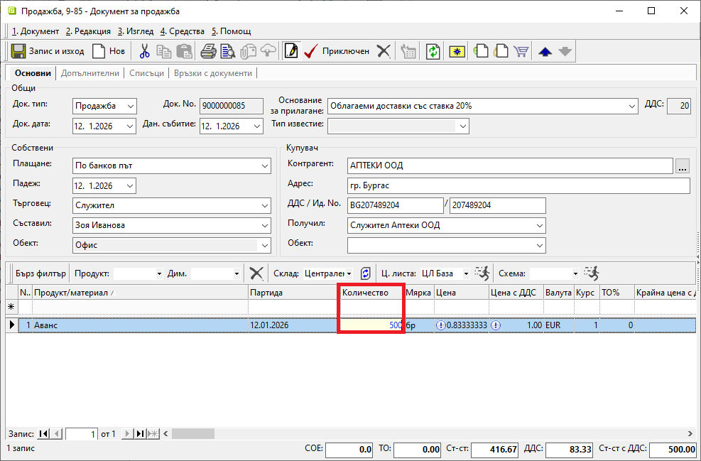
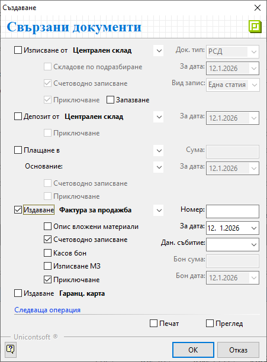
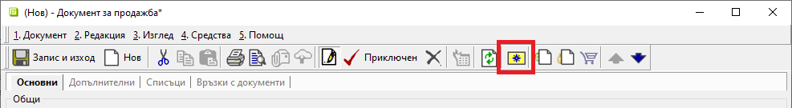
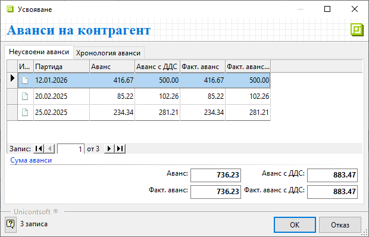
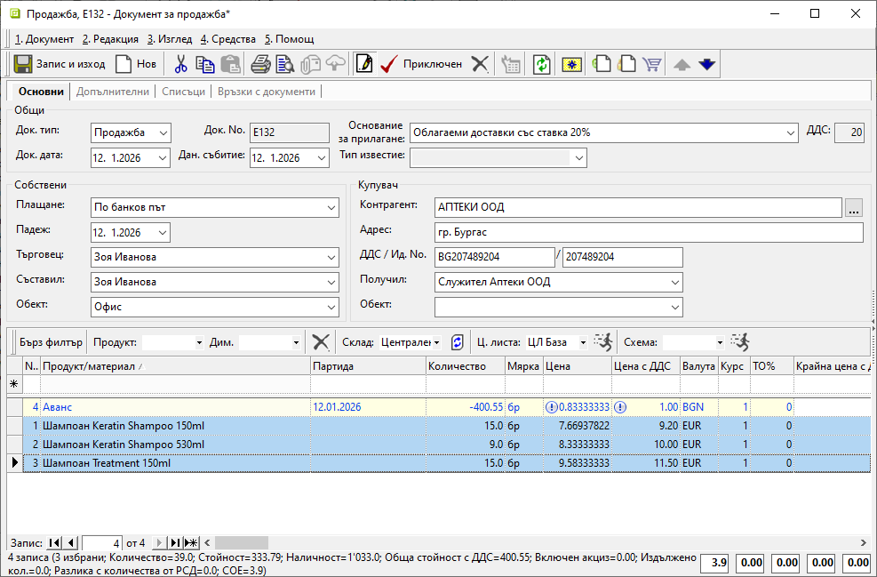
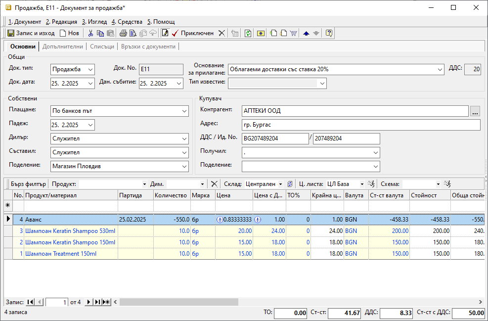

```{only} html
[Нагоре](000-index)
```

# **Работа с аванси**

- [Въведение](#въведение)  
- [Регистриране на аванс](#регистриране-на-аванс)  
- [Усвояване на аванс](#усвояване-на-аванс)  
- [Свързани статии](#свързани-статии)  

## **Въведение**

В системата има изграден модел за работа с аванси. Той включва регистриране и автоматично усвояване по партиди.  

> Моделът на работа е идентичен при аванси от клиенти и към доставчици.  

Получен от клиент аванс се регистрира чрез документ тип **Продажба**, а аванс към доставчик - с **Покупка**. Следват се стъпките за създаване и обработка на стандартните продажби и покупки. Единствената особеност е използването на продукт **Аванс**.  

> Продукт **Аванс** е системно въведен и настроен. Той е със заложена цена от 1.00 евро (с ДДС). Затова сума на аванса с ДДС се попълва в **Количество**.     
Продукт **Аванс** не трябва да се редактира или изтрива.  

Хронологията на аванси - платени, усвоени и неусвоени, може да бъде проследявана по клиенти и доставчици от **Други справки » Аванси по контрагенти**.  

## **Регистриране на аванс**

**1. Създаване**

От **Търговска система » Документи за продажба** чрез десен клик върху списъка с документи се избира [**Нов документ**](003-create-sales-document.md#създаване-на-продажба). Отваря се празна форма за въвеждане на данни.  

**2. Попълване на реквизити**

В раздел **Основни** се въвеждат: 

- **Док. Тип** – От падащия списък в полето се избира вътрешнофирмен тип документ **Продажба**. Системата предлага този тип по подразбиране, освен ако не е настроено друго.  

- **Док. No** - Полето се обзавежда с номер на документа.  
Ако бъде оставено празно, при приключване на продажбата се попълва пореден номер спрямо настройките в [**Номератори**](../../../001-ref/004-settings/004-counters.md).       

- **Док. дата** - В полето се избира дата, на която е получен авансът.  

- **Плащане** - Чрез реквизита се указва тип плащане, с който е получен авансът.    
Полето се обзавежда автоматично, когато за клиента има настроено плащане по подразбиране. Това може да се направи от форма за редакция [**Контрагенти**](../../../001-ref/001-nomenclatures/002-contragents.md).  

- **Контрагент** — От полето се отваря форма **Контрагенти** за избор на клиент.  
Ако търсеният контрагент не фигурира в списъка, системата позволява въвеждането му в момента чрез десен клик и **Нов контрагент**.  
За останалите полета в секция **Купувач** автоматично се прилагат настроените за клиента реквизити.  

{ class=align-center w=15cm }

- **Продукт/материал** - В полето задължително се избира продукт **Аванс**. В следствие на системната му настройка автоматично се обзавеждат и други полета.  

- **Количество** - В това поле се попълва сума с ДДС на получения аванс.  

- **Мярка** - Полето се обзавежда според настройките на продукт **Аванс**. По подразбиране мерната единица е **бр** (брой).   

- **Цена** и **Цена с ДДС** — тези полета съдържат системно настроената цена без/с ДДС за продукт **Аванс**.  

> Цените не трябва да се коригират.  

- **Партида** - Чрез това поле може да бъде указана партида за аванса. Това позволява системата да следи авансите аналитично по отделни партиди. В противен случай ги обединява и следи общо получена сума от контрагента.  

**3. Приключване**

Документът трябва да бъде валидиран чрез бутон [**Приключен**] в лентата с инструменти. Той извежда форма **Свързани документи**, чрез която могат да се извършат останалите операции: 

- **Плащане в** (каса) — Чрез тази опция се избира каса, в която се създава приходен касов ордер. 
Използва се, когато авансът е получен в брой.    
    - *Сума* - В полето се записва фактически получената сума на аванса.  
    - *Основание* - От падащия списък се избира основанието за плащане, което системата да обзаведе в касовия документ.  
    - *За дата* - Въвежда се дата на получения аванс. С нея системата попълва реквизит **Док. дата** в касовия документ.  
    - *Счетоводно записване* - При поставяне на отметка системата автоматично осчетоводява касовия документ.  
    За да се обзаведе коректно счетоводната статия, [**Автоматичен осчетоводител**](../../../001-ref/002-accounting/003-acc-wizard.md) трябва да е предварително настроен.  
    - *Приключване* - С поставяне на отметка системата генерира касов документ и автоматично го валидира. По този начин наличността на касата е увеличена със сумата на аванса.   
    Ако не бъде поставена отметка, системата ще генерира свързания документ в състояние на редакция. В този случай сумата на аванса все още не е добавена към наличността на касата.  

- **Издаване** (данъчен документ) — Опцията се маркира при издаване на данъчен документ (фактура) за получен аванс от клиент. От падащия списък се избира тип на данъчния документ.  
 
    - *Номер* - Полето остава празно и системата дава пореден номер на данъчния документ според избрания обект.   
    - *За дата* - С тази дата системата попълва реквизит **Док. дата** в данъчния документ (фактурата).    
    - *Счетоводно записване* - При поставянето на отметка системата ще осчетоводи данъчния документ.  
    - *Касов бон* - Това е опция за генерация на счетоводен запис за касовия бон при плащане в брой.  

    > Ако за опцията **Плащане в** *(каса)* вече е маркирано *Счетоводно записване*, тук опцията *Касов бон* не трябва да се активира.  

    - *Бон сума* - Полето се обзавежда със сума на касовия бон.  
    - *Бон дата* - Полето се попълва с дата на касовия бон.  
    - *Приключване* - При поставена отметка системата създава данъчния документ (фактурата) и автоматично го валидира.  
    Ако не бъде поставена отметка, системата генерира свързания документ, но той остава в състояние на редакция.  

- **Печат** или **Преглед** - Отваря се форма за избор на шаблон.  
При избрана опция **Печат** документът се разпечатва директно с избрания шаблон. При опция **Преглед** документът се отваря на екран преди отпечатване.     

{ class=align-center }

**Запис**

Чрез бутон [**Запис и изход**] от лентата с инструменти документът се записва и формата се затваря.  

## **Усвояване на аванс**

Аванси се усвояват при въвеждане на последващи продажби за контрагента.  
В нов документ **Продажба** се попълват всички данни и преди неговото приключване се избира бутон [**Неусвоени аванси на контрагент**] от лентата с инструменти.   

{ class=align-center w=15cm } 

Системата отваря форма за усвояване **Аванси на контрагент**. В нея е представена информация за неусвоени аванси и справка с хронология на всички аванси.   

Раздел **Неусвоени аванси** показва получените аванси по партиди, които имат остатък за усвояване.  
В този списък се указва усвояването на аванс чрез маркиране на един или няколко реда. Направеният избор се потвърждава чрез бутон [**ОК**]. Системата добавя в продажбата ред с продукт **Аванс** с отрицателен знак.   

Раздел **Хронология аванси** дава детайлна информация за документи, с които са регистрирани получените аванси.  

{ class=align-center w=15cm }

Вариантите за усвояване на аванс са следните:  
- **Частично усвояване** на аванс има, когато стойността на продажбата е по-малка от сумата на получения аванс. При такова усвояване системата автоматично приравнява количеството на продукт **Аванс** със стойността на продажбата. Така стойност на документа става **0.00**.  
По партидата на аванса се формира остатък. Той може да бъде усвоен в последваща нова продажба на контрагента.   

{ class=align-center w=15cm }

- **Пълно усвояване** на аванс има при продажба, чиято стойност е равна или по-голяма от сумата на аванса. Разликата между стойностите на продажбата и на усвоения аванс формира стойността на текущия документ.  
Партидата на избрания за усвояване аванс се "закрива" с валидирането на продажбата.  

{ class=align-center w=15cm }

## **Свързани статии**

[Контрагенти](../../../001-ref/001-nomenclatures/002-contragents.md)  
[Документи за продажба](003-create-sales-document.md)  
[Документи за покупка](002-create-purchase-documents.md)  
[Автоматичен осчетоводител](../../../001-ref/002-accounting/003-acc-wizard.md)  
[Номератоири](../../../001-ref/004-settings/004-counters.md)  