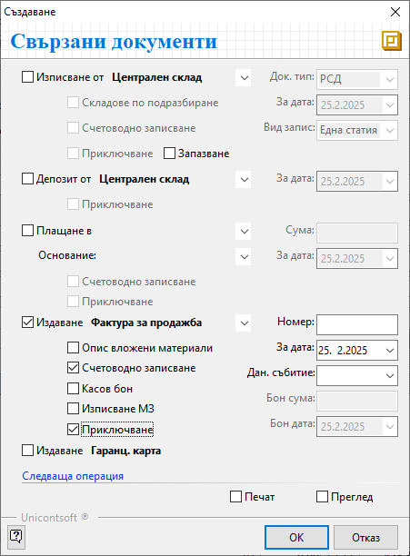
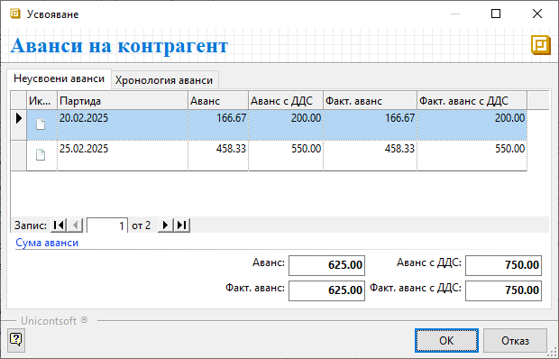
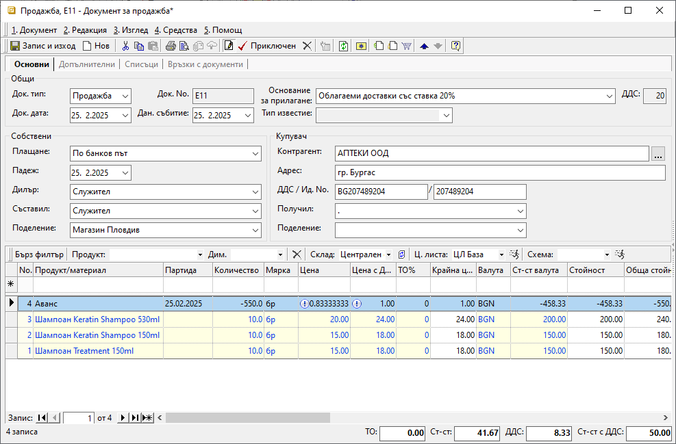

```{only} html
[Нагоре](000-index)
```

# **Работа с аванси**

- [Въведение](#въведение)  
- [Регистриране на аванс](#регистриране-на-аванс)  
- [Усвояване на аванс](#усвояване-на-аванс)  
- [Свързани статии](#свързани-статии)

## **Въведение**

Програмата разполага със схема за работа с аванси. Тя включва регистрирането и автоматичното им усвояване по партиди. Хронология на авансите - платени, усвоени и неусвоени, може да бъде проследявана по клиенти и доставчици от **Други справки || Аванси по контрагенти**.  

Платен аванс от клиент/към доставчик се регистрира в системата чрез документ тип **Продажба**/**Покупка**. Следват се стъпките за създаване на стандартните документи. Единствената особеност е използването на продукт **Аванс**.  

> Продукт **Аванс** е системно въведен и настроен и не се редактира или изтрива.  
Той е със заложена цена от 1.00 лв. (с ДДС), затова сумата на аванса (с ДДС) се въвежда и променя от колона **Количество**.   

## **Регистриране на аванс**

Схемата за работа с аванси, получени от клиенти и платени към доставчици, е идентична.  

Процесът по регистриране на аванс от клиент е следният:

1) От **Търговска система || Документи за продажба** чрез десен бутон на мишката върху списъка с документи се избира [**Нов документ**](https://docs.unicontsoft.com/guide/erp/002-docs/002-trade-system/001-orders-sales-purchase-documents/003-create-sales-document.html). Отваря се празна форма за въвеждане на данни.  

2) В раздел **Основни** се въвеждат: 

- **Док. Тип** – От падащия списък в полето се избира вътрешнофирмен тип документ **Продажба**. Системата предлага този тип по подразбиране, освен ако не е настроено друго.  

- **Док. No** - Полето се обзавежда с номер на документа. Когато полето бъде оставено празно, при приключване на продажбата системата попълва пореден номер за избраното поделение.       

- **Док. дата** - В полето се избира дата, на която е получен авансът.  

- **Плащане** - Чрез този реквизит се посочва тип плащане, с който е получен авансът.    
Системата обзавежда полето, когато за клиента има настроено плащане по подразбиране. Това може да се направи от форма за редакция [**Контрагенти**](https://docs.unicontsoft.com/guide/erp/001-ref/001-nomenclatures/002-contragents.html).  

- **Контрагент** — Поле за избор на клиент, от което се отваря форма за избор **Контрагенти**.  
Ако търсеният контрагент не фигурира в съществуващия списък, системата позволява въвеждането му в момента чрез десен бутон и **Нов контрагент**.  
Останалите полета в секция **Купувач** се обзавеждат автоматично. Системата прилага настроените за избрания клиент реквизити.  

{ class=align-center w=15cm }

- **Продукт/материал** - В полето задължително се избира продукт **Аванс**. Тъй като цената му е системно настроена - 1.00 лв. с ДДС, автоматично се обзавеждат и полета **Цена** и **Цена с ДДС**.  

- **Количество** - В това поле се попълва сума с ДДС на получения аванс.  

- **Мярка** - Полето се обзавежда според настройките на продукт **Аванс**. По подразбиране мерната единица е **бр** (брой).   

- **Цена** и **Цена с ДДС** — тези полета съдържат системно настроената цена без/с ДДС за продукт **Аванс**.  

> Цените на продукта **Аванс** не трябва да се коригират.  

- **Партида** - Чрез това поле може да се попълни партида за аванса. Така системата може да следи всеки аванс отделно, когато те са регистрирани с отделни партиди. В противен случай ги обединява и следи общо получената сума от контрагента.  

3) Документът трябва да бъде валидиран чрез бутон [**Приключен**] в лентата с инструменти. Той извежда форма **Свързани документи**, чрез която могат да се извършат останалите операции: 

- **Плащане в** (каса) — Чрез тази опция се избира каса, в която се създава приходен касов ордер. 
Използва се, когато авансът е получен в брой.    
    - *Сума* - В полето се записва фактически получената сума на аванса.  
    - *Основание* - От падащия списък се избира основанието за плащане, което системата да обзаведе в касовия документ.  
    - *За дата* - Въвежда се дата на получения аванс. С нея системата попълва реквизит **Док. дата** в касовия документ.  
    - *Счетоводно записване* - При поставяне на отметка системата автоматично осчетоводява касовия документ.  
    За да се обзаведе коректно счетоводната статия, [**Автоматичен счетоводител**](https://docs.unicontsoft.com/guide/erp/001-ref/002-accounting/002-acc-wizard.html) трябва да е предварително настроен.  
    - *Приключване* - С поставяне на отметка системата генерира касов документ и автоматично го валидира. По този начин наличността на касата е увеличена със сумата на аванса.   
    Ако не бъде поставена отметка, системата ще генерира свързания документ в състояние на редакция. В този случай сумата на аванса все още не е добавена към наличността на касата.  

- **Издаване** (данъчен документ) — Опцията се маркира при издаване на данъчен документ (фактура) за получен аванс от клиент. От падащия списък се избира тип на данъчния документ.  
 
    - *Номер* - Полето остава празно и системата дава пореден номер на данъчния документ според избраното поделение.   
    - *За дата* - С тази дата системата попълва реквизит **Док. дата** в данъчния документ (фактурата).    
    - *Счетоводно записване* - При поставянето на отметка системата ще осчетоводи данъчния документ.  
    - *Касов бон* - Това е опция за генерация на счетоводен запис за касовия бон при плащане в брой.  

    > Ако за опцията **Плащане в** *(каса)* вече е маркирано *Счетоводно записване*, тук опцията *Касов бон* не трябва да се активира.  

    - *Бон сума* - Полето се обзавежда със сума на касовия бон.  
    - *Бон дата* - Полето се попълва с дата на касовия бон.  
    - *Приключване* - При поставена отметка системата създава данъчния документ (фактурата) и автоматично го валидира.  
    Ако не бъде поставена отметка, системата генерира свързания документ, но той остава в състояние на редакция.  

- **Печат** и **Преглед** - Опциите се активират чрез поставяне на отметка. Позволяват преглед на документа на екран или директното му отпечатване (след избор на шаблон).  

 { class=align-center }

4) Чрез бутон [**Запис и изход**] от лентата с инструменти документът се записва и формата се затваря.  

## **Усвояване на аванс**

Усвояването на аванс се осъществява при въвеждане на последващи продажби за контрагента.  

1) Създава се [нов документ **Продажба**](https://docs.unicontsoft.com/guide/erp/002-docs/002-trade-system/001-orders-sales-purchase-documents/003-create-sales-document.html) и се попълват всички данни. Преди валидиране на продажбата се избира бутон [**Неусвоени аванси на контрагент**] от лентата с инструменти. Това отваря форма със списък на регистрираните за контрагента аванси.   

{ class=align-center w=15cm } 

В раздел **Неусвоени аванси** се визуализират всички получени аванси по партиди, които до момента не са усвоени.  
Раздел **Хронология аванси** дава детайлна информация в списък с документи, с които са регистрирани получените аванси.  

2) Маркира се ред от неусвоените аванси. Могат да бъдат избрани няколко аванса за усвояване в една продажба. Направеният избор се потвърждава чрез бутон [**ОК**]. Системата добавя в продажбата ред с продукт **Аванс** с отрицателен знак.   

{ class=align-center w=15cm }

3) Варианти за усвояване на аванс:  
- **Частично усвояване** на аванс има, когато стойността на продажбата е по-малка от сумата на получения аванс. При такова усвояване системата автоматично приравнява количеството на продукт **Аванс** със стойността на продажбата. Така стойност на документа става **0.00**.  
По партидата на аванса се формира остатък. Той може да бъде усвоен при следваща продажба на контрагента.   

{ class=align-center w=15cm }

- **Пълно усвояване** на аванс има при продажба, чиято стойност е равна или по-голяма от сумата на аванса. Разликата между стойностите на продажбата и на усвоения аванс формира стойността на текущия документ.  
Партидата на избрания за усвояване аванс се "закрива" с валидирането на продажбата.  

{ class=align-center w=15cm }
 
## **Свързани статии**

- [Как да работим с aванси от клиенти](https://www.unicontsoft.com/cms/node/40)  
- [Как да работим с аванси към доставчици](https://www.unicontsoft.com/cms/node/86)  