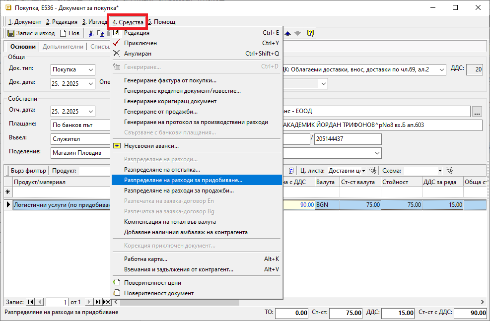
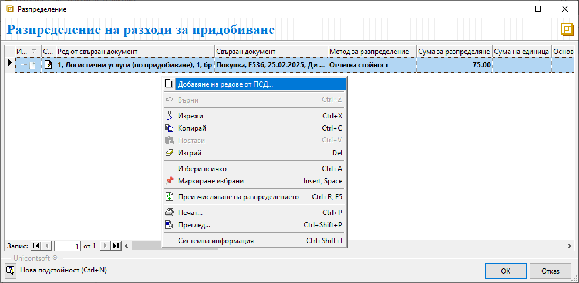
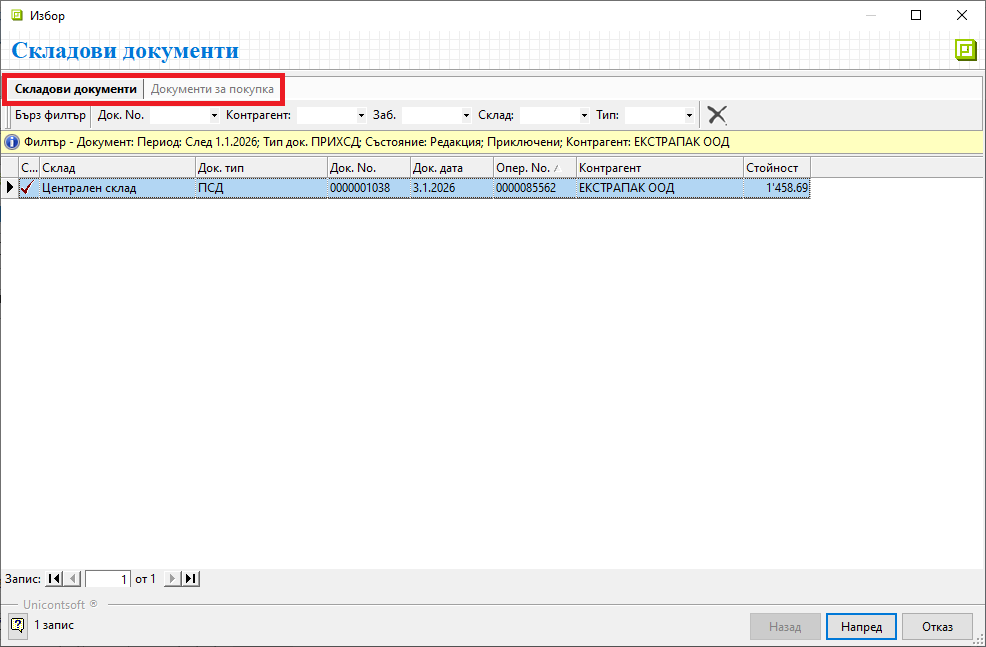
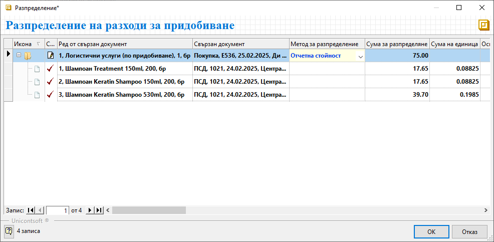
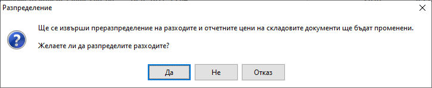

```{only} html
[Нагоре](000-index)
```

# **Разпределяне на разходи за придобиване**

- [Въведение](#въведение)  
- [Разпределяне на разходи](#разпределяне-на-разходи)  
- [Свързани статии](#свързани-статии)  

## **Въведение**

Системата разполага с инструмент за разпределяне на разходите по придобиване, като транспорт, опаковка и други. Това осигурява точна информация за реалната себестойност на закупените продукти и материали.  
Препоръчително е за различните разходи да се [създадат отделни продукти](https://docs.unicontsoft.com/guide/erp/001-ref/001-nomenclatures/003-items.html) от тип, настроен като услуга.  

## **Разпределяне на разходи**

Процесът по разпределяне на разходи по покупка е следният:  

1) Предварително в системата трябва да се валидират документите за придобиването на стоките. Това са документите от тип **Покупка** и тип **ПСД**-*Приходен складов документ*.  

2) Въвежда се отделен нов документ за покупка с направените разходи по придобиване. Полетата с реквизити от секции *Общи*, *Собствени* и *Доставчик* се попълват без особености.  
В редовете на документа се използват създадените за целите на разпределението продукти - напр. *Логистични услуги по придобиване*, *Опаковане* и т.н.  

3) От меню **Средства || Разпределение на разходи за придобиване** се отваря форма за избор на свързани документи.  

{ class=align-center w=15cm }

4) На този етап форма **Разпределение на разходи за придобиване** съдържа единствено ред с разходите за разпределяне от текущата покупка.  
С десен бутон върху реда се избира опция **Добавяне на редове от ПСД**.  

5) Отваря се форма за избор **Складови документи**. Чрез нея трябва да се добавят продуктите, върху чиято стойност се разпределя сумата на разходите.   

> Сума на разходите за разпределяне е винаги без ДДС.

{ class=align-center w=15cm }

   Формата съдържа списъци със складови документи и документи за покупка.  
   Работи се по избор в един от двата списъка. Трябва да се посочи или документ за покупката на стоки, или приходен складов документ, към който се отнасят текущите разходи.  

6) Маркират се един или няколко документа **ПСД**/**Покупка** и с бутон [**Напред**] се продължава към следваща стъпка.  

7) Системата показва списък с продукти, които се съдържат в избраните документи. Маркират се един, няколко или всички продукти, върху които да се разпределят разходите. С бутон [**Избор**] се добавят в списъка на формата за разпределение.    

{ class=align-center w=15cm }

8) Разходите за разпределение се изчисляват по продукти след избиране на метод за разпределение.  
Чрез оформения списък системата дава детайлна информация в следните колини:  
- **Ред от свързан документ** -  по редовете в колоната се виждат всички разходи по придобиване и избраните продукти, върху които те ще се разпределят;  

- **Свързан документ** - полетата в тази колона се обзавеждат автоматично с тип, номер и дата на документ, в който участва продуктът на текущия ред;  

- **Метод за разпределение** - полето се обзавежда автоматично с метод **Отчетна стойност**;  
С него системата автоматично разпределя общата сума на разхода спрямо единичната цена на продуктите.  
Методът за разпределение може да бъде променен чрез падащия списък в полето.  

- **Сума за разпределяне** - данните в тези полета се обзавеждат автоматично спрямо избрания метод за разпределение;  

> Единствено при избран метод **Ръчно** в колона **Сума за разпределяне** се допуска редакция на стойностите.  

- **Сума на единица** - тези полета се попълват автоматично от системата със сумите на разпределените разходи за единица продукт;  

{ class=align-center w=15cm }

9) С бутон **OK** се преминава към следваща стъпка в разпределението на разходи. Това отваря форма за потвърждаване на разпределението със следните опции:  
     - **Да** - избраното разпределение се потвърждава и формата с редове от свързани документи се затваря автоматично;  
     С това цените на придобиване в складовите документи са актуализирани.    
     - **Не** - разпределението се отхвърля и формата с редове от свързани документи се затваря;  
     - **Отказ** - разпределението се прекъсва, като формата с редове от свързани документи остава на екран;   

{ class=align-center w=15cm }
  
## **Свързани статии**

[Как да разпределим разходи по покупка](https://www.unicontsoft.com/cms/node/148)  
[Разпределение на разходи за придобиване](../../../005-how-to/004-allocate-acquisition-costs.md)