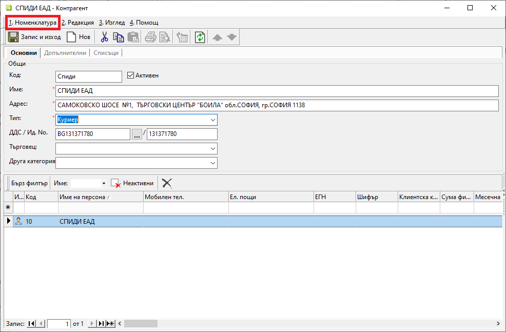
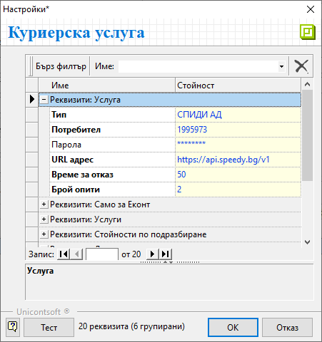
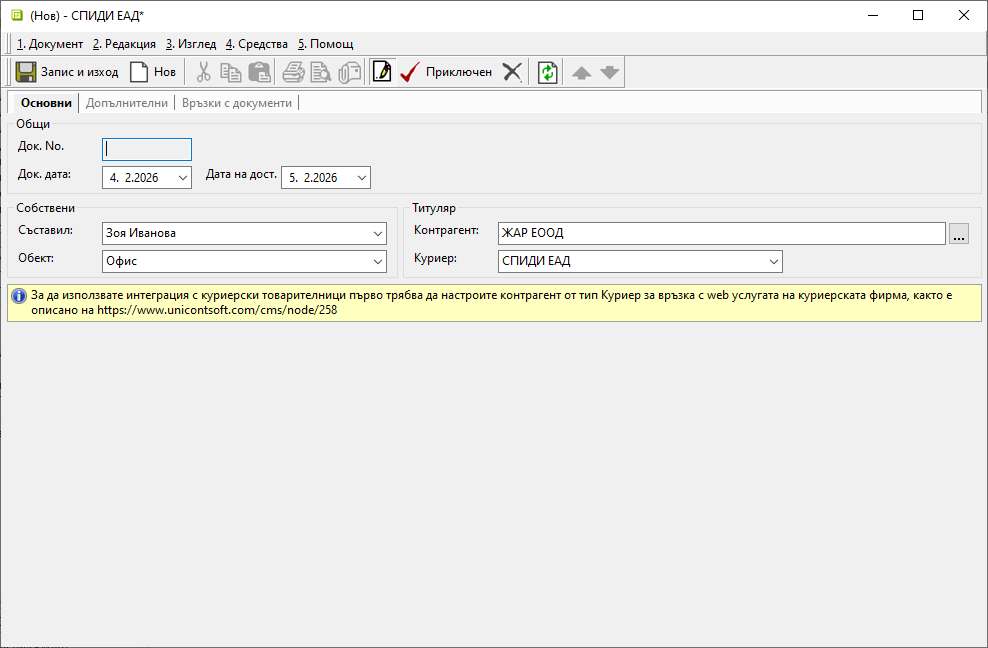
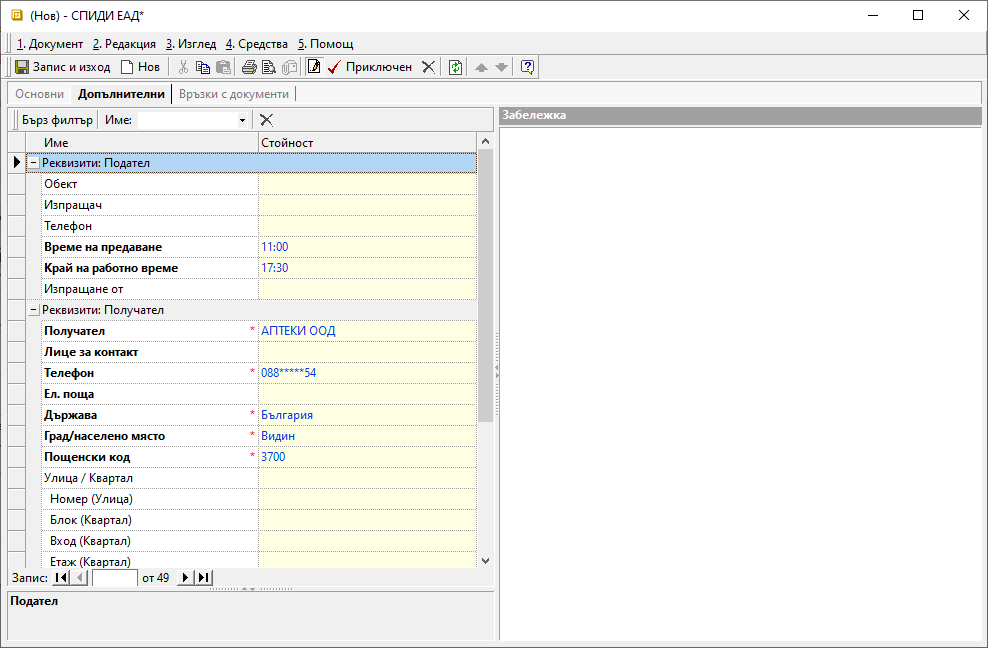

```{only} html
[Нагоре](000-index)
```

# **Куриерски товарителници**

- [Въведение](#въведение)  
- [Настройки](#настройки)
- [Създаване на куриерски товарителници](#нова-товарителница)  
- [Реквизити](#реквизити)   
- [Свързани статии](#свързани-статии)  

## **Въведение**

Системата разполага с инструмент за генерация на товарителници чрез интеграция с куриерска услуга. За да функционира коректно, е необходимо настройките да се конфигурират предварително. Това включва дефиниране на стойности по подразбиране - данни за изпращача, опции за преглед, тест, отказ и други.   
Системата автоматично попълва необходимите данни в документа, като позволява последваща редакция на товарителницата.  

##  **Настройки**

От функционалност [**Номенклатури » Контрагенти**](../../../001-ref/001-nomenclatures/002-contragents.md) еднократно се въвежда нов контрагент с куриерска фирма.  

> За тип на контрагента трябва да бъде избран **Куриер**.  

{ class=align-center w=15cm }

Във формата за редакция на избрания куриер се отваря меню **Номенклатура** от лентата с инструменти. Избира се **Настройки на куриерска услугa**. Това отваря форма **Куриерска услуга**. В нея се попълват реквизитите за интеграция с web услугата на куриерската фирма.  
В тази форма също могат да бъдат дефинирани и стойности по подразбиране, свързани с данни за изпращача, опции за преглед, тест, отказ и други. Системата ги прилага при генерация на товарителници. При необходимост данните могат да бъдат коригирани.  

{ class=align-center }

##  **Нова товарителница**

**1. Създаване**  

Нова товарителница се създава в **Търговска система » Куриерски товарителници**. Празна форма за въвеждане на данни може да се отвори чрез:  
   - десен клик върху списъка с документи и опция **Нов документ**;
   - бутон [**Нов документ**] в лентата с инструменти;  
   - клавишна комбинация **Ctrl+N**;  

**2. Попълване на реквизити**

В раздел **Основни** на формата за редакция се попълват:  

- **Док. дата** - Реквизитът указва дата на товарителницата.  
Системата предлага по подразбиране текуща дата.  
- **Дата на дост.** - Полето се обзавежда автоматично следваща дата спрямо текущата.  
- **Съставил** и **Обект** - Реквизитите се обзавеждат автоматично с настройките на текущия потребител. При необходимост могат да бъдат променени.  
- **Контрагент** - В полето се отваря форма **Контрагенти** за избор на клиент, за който се отнася доставката.  
- **Куриер** - От падащия списък в полето се избира куриерска фирма.   

В раздел **Допълнителни**:  

В раздела се въвежда информация за подател, получател и детайли на доставката. Част от полетата с реквизити се попълват автоматично, като могат да бъдат редактирани.  
Всички задължителни реквизити са маркирани с червен символ.  

**3. Приключване**

С бутон [**Приключен**] в лентата с инструменти документът се валидира. Системата се свързва с уеб услугата на куриерската фирма и получава пореден номер на товарителницата.  

**4. Запис**

Чрез бутон **Запис и изход** от лентата с инструменти документът се записва и формата се затваря.  

## **Реквизити**

1) В раздел **Основни**:  
   - **Док. No** - указва номер на товарителницата;  
   Полето се попълва автоматично след валидиране на документа.  
   - **Док. дата** - указва дата, за която се генерира текущата товарителница;  
   По подразбиране системата предлага текуща дата.  
   - **Дата на дост.** - указва дата, на която куриер да осъществи доставката;  
   - **Съставил** - отваря падащ списък за избор на служител;   
   Номенклатурата със служители трябва да е предварително настроена.  
   - **Обект** - поле с падащ списък за избор на обект от предварително настроените в **Потребител на продукта**;  
   - **Контрагент** - поле за избор на клиент от списък **Контрагенти**;  
   Ако търсеният контрагент не фигурира в списъка, системата позволява въвеждането му в момента с десен клик и **Нов контрагент**.  
   - **Куриер** - поле за избор на куриер от предварително настроения в **Контрагенти** списък;  

{ class=align-center w=15cm }

2) В раздел **Допълнителни**:  
   **Реквизити: Подател**  
    - **Обект** - указва обект, от който куриерът събира подготвената за изпращане пратка;  
    Ако се избере офис на куриер в **Изпращане от** в един от следващите реквизити, **Обект** не се взема предвид.  
    - **Изпращач** - указва лице за контакт с подателя;  
    По подразбиране се взима от **Съставил** в раздел **Основни**.  
    - **Телефон** - указва телефон на лице за контакт с подателя;  
    По подразбиране се взима от настройките на персоната в **Съставил**.  
    - **Време за предаване** - отваря списък за избор на желано време за предаване на пратката към куриер;  
    - **Край на работно време** - указва край на работното време за обект на подателя;  
    - **Изпращане от** - полето се попълва, когато пратката се изпраща от офис на куриерската фирма;  

   **Реквизити: Получател**  
    - **Получател** - указва получател на пратката;  
    - **Лице за контакт** - в полето се попълват имената на получателя;  
    Полето се обзавежда автоматично с настройката за избрания контрагент.  
    Остава празно ако съвпада с **Получател**.  
    - **Телефон** - попълва се телефонен номер за контакт с получателя (вкл. за SMS известия);  
    - **Ел. поща** - указва имейл на получател или лице за контакт;    
    - **Държава** - отваря падащ списък за избор на държава за доставка;  
    - **Грда/ населено място** - указва населено място на адреса за получаване на пратката;  
    - **Пощенски код** - указва пощенски код на населеното място за получаване на пратката;  
    Полето се обзавежда автоматично с пощ. код на избрания за доставка град.  
    - **Улица / Квартал** - указва улица/квартал на адреса за получаване на пратката, освен ако не се укаже офис на куриер в **До поискване от**;  
    - **Номер (Улица)** - указва номер на улица на адреса за получаване на пратката;  
    Остава празно, ако е избран квартал.  
    - **Блок (Квартал)** - указва номер на блок на адреса за получаване на пратката;  
    Остава празно, ако е избрана улица.  
    - **Вход (Квартал)** - указва вход на адреса за получаване на пратката;  
    Остава празно, ако е избрана улица.  
    - **Етаж (Квартал)** - указва етаж на адреса за получаване на пратката;  
    Остава празно, ако е избрана улица.  
    - **Апартамент (Квартал)** - указва номер на апартамент на адреса за получаване на пратката;  
    Остава празно, ако е избрана улица.  
    - **Пояснение** -  поле за допълнителни уточнения относно адреса за получаване на пратката;  
    - **До поискване от** - указва офис на куриер, в който да се остави пратката, когато е до поискване от получателя;  

   { class=align-center w=15cm }

   **Реквизити: Информация**  
    - **Вид услуга** - указва вид на услугата, която се използва за доставка на пратка;  
    - **Услуга** - указва услуга на куриера, която се използва за изпращане на пратка;  
    - **За сметка на** - от полето се посочва кой следва да заплати куриерската такса по доставка на пратката;  
    - **Ценова листа** - от падащия списък в полето се избира по чия ценова листа се изчислява стойността на куриерската услуга;  
    - **Съдържание** - попълва се кратко описание на съдържанието на пратката;  
    - **Пакетиране** - указва вида на опаковане на пратката;  
    По подразбиране се обзавежда с *Пакет*.  
    - **Брой колети** - от бутон [**...**] в полето се отваря форма за въвеждане на брой и размери на колетите;  
    - **Бруто тегло - кг** - указва бруто тегло на пратката (вкл. опаковката);  
    - **Референция** - в полето може да се въведе текст, който да се отпечата на товарителницата;  

   **Допълнителни услуги**  
    - **Фиксирано време** - отваря падащ списък за избор на точен час, в който куриер да извърши доставката на адрес;  
    - **Сума наложен платеж** - указва стойност, когато се дължи наложен платеж;  
    - **Сума застраховка** - в полето може да се попълни сума на застрахователна стойност (обявена стойност);  
    - **Обратна разписка** - указва дали към пратката има обратна разписка;  
    - **Обратни документи** - указва дали към пратката има документи за обратна доставка;  
    - **Съботен разнос** - в полето се избира дали пратката да бъде включена в съботен разнос на куриера;  
    - **Чупливо** - с **Да/ Не** настройка в полето се посочва дали пратката е с чупливо съдържание;  
    - **Документи** - указва дали пратката съдържа единствено документи;  
    - **Отвори преди плащане** - указва дали е позволен преглед на пратката преди плащане;  
    - **Тествай преди плащане** - указва дали е позволено тестване преди плащане на пратката;  
    - **Пощенски паричен превод** - указва дали плащането ще се извърши като ППП;  
    - **Клиентска фактура по ППП** - попълват се номер и дата на клиентска фактура, които се подават на куриера при плащане с договор за ППП;  
    - **Ваучери за връщане** - указва дали да се генерира ваучер за връщане на стока;  
    - **Втори телефон за SMS известяване** - указва телефон на подателя, който да се извести със SMS при получаване на пратката;  
    Отделно лице за контакти на получателя винаги се известява със SMS на неговия телефон.  

   **Реквизити: При отказ от плащане**  
    - **Услуга за връщане** - в полето се избира вид услуга, която куриерската фирма извършва при връщане на отказана пратка;  
    - **За сметка на** - в полето се посочва за чия сметка е куриерската услуга по връщане на отказана пратка;  

   **Реквизити: Обратна пратка**  
    - **Услуга за обратна пратка** - в полето се избира вид услуга, която куриерската фирма извършва за обратната пратка;  
    - **Брой колети** - брой колети на обратната пратка;  

   **Реквизити: Тотали**  
    - **Обща стойност с ДДС** - полето показва сума за плащане към куриера;  

3) В раздел **Връзки с документи**:  
Този раздел не съдържа реквизити за настройка. В него системата осигурява пряк път до свързани документи. От тук те могат да бъдат отворени за преглед и редакция.   

## **Свързани статии**

[Контрагенти](../../../001-ref/001-nomenclatures/002-contragents.md)  
 