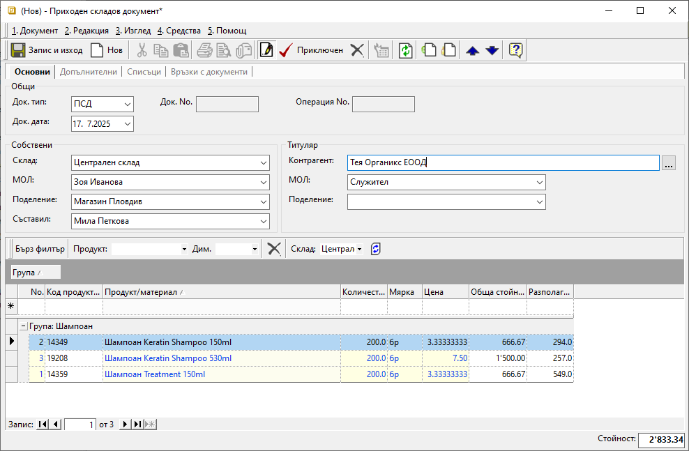
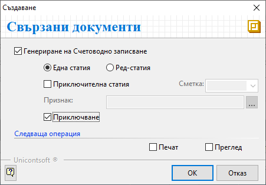

```{only} html
[Нагоре](000-index)
```

# **Складов документ**

- [Въведение](#въведение)  
- [Създаване на складов документ](#създаване-на-складов-документ)  
- [Реквизити](#реквизити)  

## **Въведение**

Складовите операции се регистрират в системата с отделни складови документи. Всички те могат да бъдат въведени в системата ръчно. Това се извършва в меню **Търговска система » Складови документи**.  

Типът на складовия документ се определя от процеса в склада, който трябва да се регистрира в системата. Основните типове складови документи са:  

- **Документи за начални салда на склад** - Приходен тип складови документи, с който се въвежда актуално състояние на наличностите в началото на избран отчетен период.  
- **Приходни складови документи и депозитни разписки** — Увеличават наличността в съответния склад с въведените количества по продукти.  
- **Разходни складови документи и депозитни разписки** — Намаляват наличността в съответния склад с въведените количества по продукти.    

## **Създаване на складов документ**

1) Складов документ се създава от **Търговска система » Складови документи**. Това се прави чрез десен бутон на мишката и **Нов документ**, с клавишна комбинация **Ctrl+N** или чрез бутон **Нов документ** в лентата с инструменти.  
Отваря се празна форма за въвеждане на данни.  

2) От раздел **Основни** в поле **Док. тип** се избира тип на документа, което определя операцията като приход или разход за склада. Първоначално системата попълва реквизита с настройките по подразбиране.    

В полето **Док. дата** се избира датата, на която се извършва складовата операция. Спрямо тази дата системата дава пореден номер в **Док. No** след валидирането на документа.  
По подразбиране в нов документ системата предлага текуща дата.  
 
3) В секция *Собствени* чрез поле **Склад** се посочва складът, за който се отнася текущият документ.    
Ако складът има направени настройки по подразбиране, системата може да обзаведе автоматично и реквизит **МОЛ**.  

Реквизит **Обект** дава възможност да се избере обект на организацията, за който се отнася складовия документ.  
От поле **Съставил** се посочва лицето, което съставя документа.  
Тези полета се обзавеждат автоматично с настройките на текущия потребител.  

4) Секция *Титуляр* включва реквизити **Контрагент** и отнасящите се към него **МОЛ** и **Обект**.  
В полето се избира склад, консигнатор или физическо/юридическо лице, свързано със складовата операция.  
В разходен складов документ се избира клиент, получаващ изписаните количества. В складов документ по покупка на стоки се избира контрагента-доставчик. В документ, отразяващ вътрешна операция за организацията (напр. липса, брак, излишък, НСС), в поле **Контрагент** се избира **Потребител на продукта**.  

5) Чрез реда за добавяне на нов запис се въвежда списък с продуктите, за които се регистрира движението в склада. Това става от поле **Продукт/материал**. Продуктите трябва да са предварително въведени в системата. Отделни продукти могат да бъдат създавани и в процеса на работа. Това е удачно при заприходяване на нови продукти.  
При текущо създаване трябва да се вземе предвид, че за тези продукти няма складова наличност. Затова за тях не може да бъде валидиран разходен складов документ.  

Количеството, с което всеки продукт участва в складовата операция, се въвежда от **Количество**.  

Системата дава възможност за работа с партиди. В приходните складови документи те се въвеждат свободно от поле **Партида**. При регистриране на разход в полето се отваря форма за избор от вече наличните партиди в склада.  
Ако се регистрират няколко партиди от един продукт, всяка от тях се въвежда на отделен ред.  

В складови документи продуктите се отразяват с настроените им основни мерни единици. Често това е най-малката мярка, в която продуктът съществува в системата. Това става от полетата в колона **Мярка**.  

Oт поле **Цена** се въвежда eдинична стойност на всеки продукт. Цените винаги са без ДДС.  
За разходните складови документи системата попълва автоматично среднопретеглени цени при приключването на документа.  

{ class=align-center w=15cm }

6) Чрез бутон [**Приключен**] в лентата с инструменти документът се валидира.  
При валидиране на складовия документ системата предлага автоматична генерация на счетоводно записване.  

7) Отваря се форма **Свързани документи**. В нея са достъпни следните опции:  

- **Генериране на Счетоводно записване** – при поставянето на отметка системата ще генерира свързан счетоводен документ;  
За да се обзаведе коректно счетоводната статия, [**Автоматичен счетоводител**](https://docs.unicontsoft.com/guide/erp/001-ref/002-accounting/003-acc-wizard.html) трябва да е предварително настроен.  
    - *Една статия* - при избор на тази опция системата създава счетоводен документ с една статия, включваща продуктите (признаците) в общ списък;  
    - *Ред-статия* - с тази опция системата генерира счетоводен документ с множество статии - за всеки продукт от протокола се създава отделна счетоводна статия;   
    - *Приключителна статия* - при тази опция, след избор на приключителна сметка и по желание *Признак*, системата ще генерира и приключителна статия в счетоводния документ;  
    - *Приключване* - при поставена отметка системата генерира счетоводния документ и автоматично го приключва;  
    Ако не бъде поставена отметка, системата генерира счетоводен документ, който остава в състояние на редакция.  

- **Печат** и **Преглед** - Опциите се активират чрез поставяне на отметка и позволяват преглед на документа на екран или директно отпечатване (след избор на шаблон).   

{ class=align-center }

8) Бутон [**ОК**] потвърждава направения избор и генерира свързани документи.  
Данните в документа са валидирани и наличностите в текущия склад са актуализирани.  

## **Реквизити**

1) В раздел **Основни**:  
   - **Док. Тип** – поле за избор на тип документ;  
   Системата прилага дефинирания от **Администрация » Настройки** тип на документ по подразбиране.   
   - **Док. No** - в полето се попълва номер на документа;  
   Ако полето остане празно, системата автоматично попълва пореден номер при приключване на документа спрямо настройките в **Номератори**.  
   - **Док. дата** - в полето се избира дата за документа;  
   По подразбиране в нов документ системата предлага текуща дата.   
   - **Склад** - поле за избор на склад, за който се отнася складовата операция;  
   Системата прилага дефинирания от **Администрация » Настройки** склад по подразбиране.  
   - **МОЛ** - въвежда се материално отговорното лице за избрания склад;  
   Полето се обзавежда с настройките по подразбиране за избрания склад.  
   - **Обект** - поле с падащ списък за избор на обект;  
   Полето се попълва автоматично с настройките на текущия потребител.  
   Списъкът трябва да е предварително настроени в контрагент **Потребител на продукта**.  
   - **Съставил** - поле с падащ списък за избор на персона;  
   Списък със служители трябва да бъде предварително настроен.    
   Данните в полето се попълват автоматично с настройките на текущия потребител.  
   - **Контрагент** – в полето се отваря форма **Контрагенти** за избор на склад;   
   - **МОЛ** - поле за избор на материално отговорното лице от списък с персони;  
   Полето се обзавежда с настройките по подразбиране за избрания контрагент.   
   - **Обект** - поле за избор от списък с настроените за контрагента обекти;  

   От реда за нов запис се обзавежда списък с продукти. Колоните, които съдържа, са:  
   - **Поверителност** - дава информация за активирани *Поверителност на цени* и/или *Поверителност на документ*;  
   - **No.** - пореден номер на запис по реда на въвеждане;  
   - **Група** - полето показва група на продукта;  
   - **Миниатюра на продукт/материал** - показва настроеното за продукта изображение по подразбиране;  
   - **Ред от пакетажен лист** - в полето може да се избира ред, на който продуктът да участва в пакетажния лист;  
   - **Код продукт/материал** - полето се обзавежда с настроения основен код за избрания продукт;  
   - **Баркод на продукт/материал** - полето се обзавежда с баркод за продукта в избраната мярка;  
   - **Продукт/материал** - отваря форма за избор **Продукти и материали**;  
   - **Допълнителен текст** - въвеждане на описание за продукта на реда, което може да се показва при печат;  
   - **Забележка** - полето позволява въвеждане на свободен текст с уточнение за продукта на ред;  
   - **Партида** - избор на партида за избрания на реда продукт;  
   От бутона в края на полето системата отваря форма с налични партиди от продукта.  
   - **Дата на годност на партида** - поле с дата на годност за текущата партида на реда;  
   - **Страна на произход на партида** - избор на страна на произход за текущата партида на реда;  
   - **Доставна партида** - в полето може да се въведе допълнителна партида за продукт на реда; 
   - **Акциз за осн. мярка** - полето показва стойност на акциз за единица продукт на реда;  
   - **Сериен номер на партида** - в полето може да се въведе общ сериен номер за партида на реда;  
   - **АДД на партида** - в полето има възможност за попълване на свободен текст с акцизен данъчен документ;  
   - **Серийни номера** - указва сериен номер за продукт на реда;  
   - **Количество** - в полето се попълва количество за продукта на реда;   
   - **Заявено количество** - показва оставащо количество за усвояване от свързан документ за покупка или продажба;  
   - **Мярка** - падащ списък за избор на мерна единица от настроените за продукта на реда;  
   - **Цена** - поле за попълване на единична цена без ДДС;  
   - **Допълнителна мярка** - показва настроената за допълнителна мерна единица;  
   - **Отношение на мерки** - показва фасети на мерки за допълнителната мерна единица;  
   - **Количество в две мерки** - показва количеството на пълните единици в допълнителна мярка и на остатъка - в основна мярка;  
   - **Бруто тегло** - показва бруто тегло за количеството от продукта на реда;  
   - **Бруто обем** - показва бруто обем за количеството от продукта на реда;   
   - **Обща стойност** - обща стойност без ДДС за количеството продукти на реда;  
   - **Включен акциз** - дава информация за включен акциз на продукта;  
   - **Валута** - падащ списък за избор на валута;  
   - **Разполагаемо кол.** - поле с информация за свободни количества на склад;  
   - **Наличност на склад** - поле с информация за налично количество - общо или за избран склад, включващо резервираните количества;  
   - **Наличност на склад към дата на документа** - показва наличност към избрана различна дата;  
   Данните в тези полета се обзавеждат след активиране на опция **Наличност към дата на документа** от меню **Средства**.   
   - **Запазени в склад** - показва резервираните количества за продукт на ред;  
   - **Стелажи** - показва разположение на продукта по складови локации;  
   - **Рецепта** - в полето се отваря форма за избор от настроените рецепти;  
   - **Брой полуфабрикати в рецептата** - съдържа информация за настроени по рецепта полуфабрикати;  
   - **Разлика с количества от Покупки** - показва разликата между количеството в свързана покупка и текущ документ;  
   - **Разлика с количества от Продажби** - показва разликата между количеството в свързана продажба и текущ документ;  
   - **Бракувано количество** - указва бракувано количество за продукт на ред;  
   - **Транспортни единици** - дава информация за вид на транспортните единици, използвани при производство;  
   Данните се въвеждат през Dreem Mobile.  
   Транспортните единици трябва да бъдат предварително настроени в **Номенклатури » Референтни номенклатури**.  
   - **Потребител създаване** - информация за потребител, добавил текущия ред в документа;  
   - **Дата създаване** - дата и час на добавяне на текущия ред;  
   - **Потребител последна модификация** - потребителско име на направилия последните корекции в данните на реда;  
   - **Дата последна модификация** - информация за дата и час, когато са направени последните изменения в данните на текущия ред;  

   2) В раздел **Допълнителни**:  
   **Реквизити: Печат**  
   - **Ценова листа** - Използва се при попълване на колона **Цена с ДДС** на бланка **SG04-Складов док. по ценова листа** при отпечатване на складов документ.  
   - **Брой палети** - Указва броя на включените палети при отпечатване на документ **Пакетажен лист**.  
   
   **Реквизити: Събиране**  
   - **Валидиране** - Указва статус на валидиране на документа.  
   - **Дата на събиране** - Указва дата на събиране на стоки за издължаване от склада.  
   - **Приоритет** - Указва приоритет за валидиране на документа.  
   
   **Реквизити: Мобилни устройства**  
   - **Начало обработка** - Указва дата и час на начало на обработка.  
   - **Край обработка** - Указва дата и час на край на обработка.  
   - **Колектор** - Указва персона от настроените за **Потребител на продукта**, която събира продуктите по документа.  
   - **Проверяващ** - Указва персона от настроените за **Потребител на продукта**, която извършва проверка на събраните продукти по документа.  
   - **Контейнери** - Указва в кои контейнери в picking зоната са събраните продукти по документа.  
   - **Брой пакети** - Указва в колко на брой пакети са събрани продуктите по документа.  
   - **Бруто тегло - кг** - Указва бруто тегло след пакетиране.  

   **Реквизити: Производство**  
   - **Оператор** - Указва персона, която е определена да работи на избраната производствена линия.  
   - **Производствена линия** - Указва производствената линия (машина), на която да се произвеждат участващите в документа продукти и количества.  

   **Реквизити: Други**  
   - **Направление** - Използва се в **Автоматичен осчетоводител** при осчетоводяване на документа.  
   - **Подизпълнител** - Указва контрагент, който е подизпълнител в сделката. Не се използва никъде от системата.  
   - **Номер на документ за външни системи** - Указва номера на документа за външни системи.  
   - **Дата на документ за външни системи** - Указва датата на документа за външни системи.  

   3) В раздел **Списъци**:  
   **Списъци**  
   - **Направления** - В тази секция системата показва списък с всички продукти, въведени в текущия документ. Всички или само избрани продукти могат да бъдат разпределени като приход/разход към структурни центрове на себестойност, обект/проект и/или финансова структура.  
   - **Прикачени файлове** - Системата дава възможност от реда за нов запис вдясно да се добавят прикачени файлове. Това става от поле **Файл**, в което се отваря форма за избор **Медия каталог**. Каталогът включва предварително настроени от **Номенклатури » Медия каталог** папки.  
   - **Пакетажен лист** - В секцията могат да бъдат въведени данни, необходими за печат на пакетажен лист.  
   - **Палетизация** - В тази секция системата дава възможност за разпределяне на количествата по продукти към избрани транспортни единици и транспортни палета.  

   4) В раздел **Връзки с документи**:  
   Този раздел не съдържа реквизити за настройка. В него системата осигурява пряк път до свързани документи. От тук те могат да бъдат отворени и редактирани.  