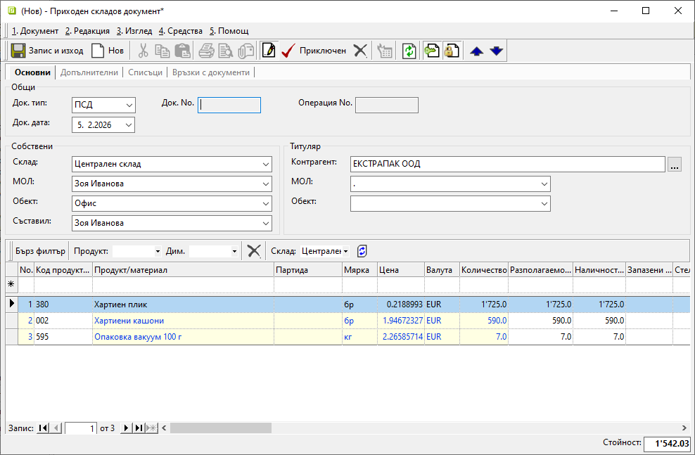
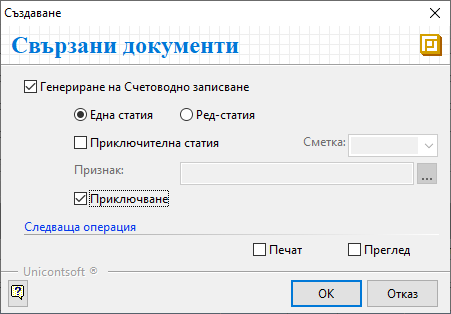

```{only} html
[Нагоре](000-index)
```

# **Складов документ**

- [Въведение](#въведение)  
- [Как се създава нов складов документ](#нов-складов-документ)  
- [Реквизити](#реквизити)  

## **Въведение**

Складовите операции се регистрират в системата с отделни складови документи. Могат да бъдат въвеждани ръчно и генерирани като свързани документи при определени условия.  

Типът на документа се определя от процеса, който трябва да се регистрира за склада.  
Основните типове складови документи са:  

- **Документи за начални салда на склад** - Приходен тип складови документи, с който се въвежда актуално състояние на наличностите в началото на избран отчетен период.  
- **Приходни складови документи и депозитни разписки** - Увеличават наличността в съответния склад с въведените количества по продукти.  
- **Разходни складови документи и депозитни разписки** - Намаляват наличността в съответния склад с въведените количества по продукти.    

## **Нов складов документ**

**1. Създаване**

Складов документ се създава от **Търговска система » Складови документи**.  
Празна форма за въвеждане на данни се отваря с десен клик и **Нов документ**, бутон [**Нов документ**] в лентата с инструменти или клавишна комбинация **Ctrl+N**.     

**2. Попълване на реквизити** 

В раздел **Основни** на формата за редакция се попълват:

- **Док. Тип** - От падащия списък в полето се избира тип на документа. Това определя операцията като приход или разход за склада. Първоначално реквизитът се попълва с настройките по подразбиране.    
- **Док. дата** - В полето се избира датата, на която се извършва складовата операция. Спрямо тази дата системата дава пореден номер в **Док. No** след валидирането на документа.  
По подразбиране в нов документ системата предлага текуща дата.  
 
- **Склад** - От падащия списък в полето се избира склад, за който се отнася текущата операция.    
Ако складът има направени настройки по подразбиране, системата може да обзаведе автоматично и реквизит **МОЛ**.  
- **Обект** - Чрез реквизита се указва обект, за който се отнася текущата операция.  
- **Съставил** - В полето се посочва лицето, което съставя документа.  

Полетата от секция *Собствени* се обзавеждат автоматично с настройките на текущия потребител в системата.  

- **Контрагент** - В полето се избира склад, консигнатор или физическо/юридическо лице, свързано със складовата операция.  
В разходен складов документ се избира клиент, получаващ изписаните количества. В складов документ по покупка на стоки се избира контрагента-доставчик. В документ, отразяващ вътрешна операция за организацията (напр. липса, брак, излишък, НСС), в поле **Контрагент** се избира **Потребител на продукта**.  

Останалите реквизити в секция *Титуляр* (**МОЛ** и **Обект**) се попълват автоматично с настройки за избрания контрагент. Могат да бъдат променени чрез падащите списъци за всяко поле.   

{ class=align-center w=15cm }

Чрез поле **Продукт/материал** на реда за нов запис се въвежда списък с продуктите, за които се регистрира движението в склада.  
Продуктите трябва да са предварително въведени в системата. Отделни продукти могат да бъдат създавани и в процеса на работа (напр. при заприходяване на нов продукт). В такъв случай трябва да се вземе предвид, че за тези продукти все още няма складова наличност. Затова за тях не може да бъде валидиран разходен тип документ.  

Количеството, с което всеки продукт участва в складовата операция, се въвежда от **Количество**.  

Системата дава възможност за работа с партиди. В приходните складови документи те се въвеждат свободно от поле **Партида**. При регистриране на разход в същото поле се отваря форма за избор от вече наличните партиди в склада.  
Ако се регистрират няколко партиди от един продукт, всяка от тях се въвежда на отделен ред.  

В поле **Мярка** продуктите се отразяват с настроените им основни мерни единици. Често това е най-малката мярка, в която продуктът съществува в системата.  

Oт поле **Цена** се въвежда eдинична стойност на всеки продукт. Цените винаги са без ДДС.  

> За разходните складови документи системата попълва автоматично среднопретеглени цени с приключването на документа.  

**3. Приключване**

Складовият документ се валидира чрез бутон [**Приключен**] в лентата с инструменти.  
Отваря се форма **Свързани документи**. В нея са достъпни следните опции:  

- **Генериране на Счетоводно записване** – при поставянето на отметка системата ще генерира свързан счетоводен документ;  
За да се обзаведе коректно счетоводната статия, [**Автоматичен осчетоводител**](../../../001-ref/002-accounting/003-acc-wizard.md) трябва да е предварително настроен.  
    - *Една статия* - при избор на тази опция се създава счетоводен документ с една статия и общ списък на продуктите (признаците);  
    - *Ред-статия* - с тази опция се генерира счетоводен документ с множество статии, отделно за всеки продукт;   
    - *Приключителна статия* - при тази опция, след избор на приключителна сметка и по желание *Признак*, системата ще генерира и приключителна статия в счетоводния документ;  
    - *Приключване* - указва генериране на счетоводния документ с автоматично приключване;  
    Ако не бъде поставена отметка, се генерира счетоводен документ в състояние на редакция.  

- **Печат** или **Преглед** - Отваря се форма за избор на шаблон.  
При избрана опция **Печат** документът се разпечатва директно с избрания шаблон.  
При опция **Преглед** документът се отваря на екран преди отпечатване.   

- Бутон [**ОК**] потвърждава направения избор и генерира свързани документи.  

{ class=align-center }

**4. Запис**

Чрез бутон [**Запис и изход**] в лентата с инструменти документът се записва и формата се затваря. Данните в документа са валидирани и наличностите в текущия склад са актуализирани.  

## **Реквизити**

1) В раздел **Основни**:  
   - **Док. Тип** – указва тип на документа;  
   Системата прилага дефинирания по подразбиране в **Администрация » Настройки** тип на документ.   
   - **Док. No** - в полето се попълва номер на документа;  
   Ако полето остане празно, системата автоматично попълва пореден номер при приключване на документа спрямо настройките в **Номератори**.  
   - **Док. дата** - указва дата за документа;  
   По подразбиране в нов документ системата предлага текуща дата.   
   - **Склад** - отваря падащ списък за избор на склад, за който се отнася складовата операция;  
   Системата прилага дефинирания склад по подразбиране.  
   - **МОЛ** - указва материално отговорното лице за избрания склад;  
   Полето се обзавежда с настройките по подразбиране за избрания склад.  
   - **Обект** - отваря падащ списък за избор на обект;  
   Списъкът трябва да е предварително настроени в контрагент **Потребител на продукта**.  
   Полето се попълва автоматично с настройките на текущия потребител.  
   - **Съставил** - поле с падащ списък за избор на персона;  
   Списък със служители трябва да бъде предварително настроен.    
   Данните в полето се попълват автоматично с настройките на текущия потребител.  
   - **Контрагент** – от полето се отваря форма **Контрагенти** за избор на склад;   
   - **МОЛ** - поле за избор на материално отговорното лице от списък с персони;  
   Полето се обзавежда с настройките по подразбиране за избрания контрагент.   
   - **Обект** - поле за избор от списък с настроените за контрагента обекти;  

   От реда за нов запис се обзавежда списък с продукти.  
   Съдържа следните колони:  
   - **Поверителност** - дава информация за активирани *Поверителност на цени* и/или *Поверителност на документ*;  
   - **No.** - пореден номер на запис по реда на въвеждане;  
   - **Група** - полето показва група на продукта;  
   - **Миниатюра на продукт/материал** - показва настроеното за продукта изображение по подразбиране;  
   - **Ред от пакетажен лист** - в полето може да се избира ред, на който продуктът да участва в пакетажния лист;  
   - **Код продукт/материал** - обзавежда се с настроения основен код за избрания продукт;  
   - **Баркод на продукт/материал** - полето се обзавежда с баркод за продукта в избраната мярка;  
   - **Продукт/материал** - отваря форма за избор **Продукти и материали**;  
   - **Допълнителен текст** - въвеждане на описание за продукта на реда, което може да се показва при печат;  
   - **Забележка** - поле за свободно въвеждане на уточняващ текст за продукта на ред;  
   - **Партида** - избор на партида за продукт на реда;  
   От бутона в края на полето се отваря форма с налични партиди от продукта.  
   - **Дата на годност на партида** - указва дата на годност за партида на реда;  
   - **Страна на произход на партида** - указва страна на произход за партида на реда;  
   - **Доставна партида** - в полето може да се въведе допълнителна партида за продукт на реда; 
   - **Акциз за осн. мярка** - полето показва стойност на акциз за единица продукт на реда;  
   - **Сериен номер на партида** - в полето може да се въведе общ сериен номер за партида на реда;  
   - **АДД на партида** - в полето има възможност за попълване на свободен текст с акцизен данъчен документ;  
   - **Серийни номера** - указва сериен номер за продукт на реда;  
   - **Количество** - в полето се попълва количество за продукта на реда;   
   - **Заявено количество** - показва оставащо количество за усвояване от свързан документ за покупка или продажба;  
   - **Мярка** - отваря падащ списък за избор на мерна единица от настроените за продукта;  
   - **Цена** - поле за попълване на единична цена без ДДС;  
   - **Допълнителна мярка** - показва настроената допълнителна мерна единица;  
   - **Отношение на мерки** - показва фасети на мерки за допълнителната мерна единица;  
   - **Количество в две мерки** - показва количеството на пълните единици в допълнителна мярка и на остатъка - в основна мярка;  
   - **Бруто тегло** - показва бруто тегло за количеството от продукта на реда;  
   - **Бруто обем** - показва бруто обем за количеството от продукта на реда;   
   - **Обща стойност** - обща стойност без ДДС за количеството продукти на реда;  
   - **Включен акциз** - дава информация с включен акциз за продукта;  
   - **Валута** - отваря падащ списък за избор на валута;  
   - **Разполагаемо кол.** - поле с информация за свободни количества на склад;  
   - **Наличност на склад** - поле с информация за налично количество (общо или за избран склад), включващо резервираните количества;  
   - **Наличност на склад към дата на документа** - показва наличност към избрана различна дата;  
   Данните се обзавеждат след активиране на опция **Наличност към дата на документа** от меню **Средства**.   
   - **Запазени в склад** - показва резервираните количества за продукт на ред;  
   - **Складови локации** - показва разположение на продукта по складови локации;  
   - **Рецепта** - в полето се отваря форма за избор от настроените рецепти;  
   - **Брой полуфабрикати в рецептата** - съдържа информация за настроени по рецепта полуфабрикати;  
   - **Разлика с количества от Покупки** - показва разликата между количеството в свързана покупка и текущ документ;  
   - **Разлика с количества от Продажби** - показва разликата между количеството в свързана продажба и текущ документ;  
   - **Бракувано количество** - указва бракувано количество за продукт на реда;  
   - **Транспортни единици** - дава информация за вид на транспортните единици, използвани при производство;  
   Данните се въвеждат през **Dreem Mobile**.  
   Транспортните единици трябва да бъдат предварително настроени в **Номенклатури » Референтни номенклатури**.  
   - **Потребител създаване** - информация за потребител, добавил текущия ред в документа;  
   - **Дата създаване** - дата и час на добавяне на текущия ред;  
   - **Потребител последна модификация** - потребителско име на направилия последните корекции в данните на реда;  
   - **Дата последна модификация** - информация за дата и час, когато са направени последните изменения в данните на текущия ред;  

   2) В раздел **Допълнителни**:  
   **Реквизити: Печат**  
   - **Ценова листа** - указва **Цена с ДДС** в бланка **SG04-Складов док. по ценова листа** при отпечатване на складов документ;  
   - **Брой палети** - указва броя на включените палети при отпечатване на документ **Пакетажен лист**;  
   
   **Реквизити: Събиране**  
   - **Валидиране** - показва статус на валидиране на документа;  
   - **Дата на събиране** - показва дата на събиране на стоки за издължаване от склада;  
   - **Приоритет** - указва приоритет за валидиране на документа;  
   
   **Реквизити: Мобилни устройства**  
   - **Начало обработка** - показва дата и час на начало на обработка;  
   - **Край обработка** - показва дата и час на край на обработка;  
   - **Колектор** - указва персона от настроените за **Потребител на продукта**, която събира продуктите по документа;  
   - **Проверяващ** - указва персона от настроените за **Потребител на продукта**, която извършва проверка на събраните продукти по документа;  
   - **Контейнери** - показва в кои контейнери в пикинг зоната са събраните продукти по документа;  
   - **Брой пакети** - показва в колко на брой пакети са събрани продуктите по документа;  
   - **Бруто тегло - кг** - показва бруто тегло след пакетиране;  

   **Реквизити: Производство**  
   - **Оператор** - указва персона, която е определена да работи на избраната производствена линия;  
   - **Производствена линия** - указва производствената линия (машина), на която да се произвеждат участващите в документа продукти и количества;  

   **Реквизити: Други**  
   - **Направление** - използва се в **Автоматичен осчетоводител** при осчетоводяване на документа;  
   - **Подизпълнител** - указва контрагент, който е подизпълнител в сделката;  
   Не се използва никъде от системата.  
   - **Номер на документ за външни системи** - показва номера на документа за външни системи;  
   - **Дата на документ за външни системи** - указва дата на документа за външни системи;  

   3) В раздел **Списъци**:  
   **Списъци**  
   - **Направления** - В тази секция системата показва списък с всички продукти, въведени в текущия документ. Те могат да бъдат разпределени като приход/разход към структурни центрове на себестойност, обект/проект и/или финансова структура.  
   - **Прикачени файлове** - От поле **Файл** на реда за нов запис се отваря форма за избор **Медия каталог**. 
   Прикачени файлове се добавят чрез каталога, предварително настроен от **Номенклатури » Медия каталог**.  
   - **Пакетажен лист** - В секцията могат да бъдат въведени данни, необходими за печат на пакетажен лист.  
   - **Палетизация** - В тази секция системата дава възможност за разпределяне на количествата по продукти към избрани транспортни единици и транспортни палети.  

   4) В раздел **Връзки с документи**:  
   Този раздел не съдържа реквизити за настройка. В него системата осигурява пряк път до свързани документи. От тук те могат да бъдат отворени и редактирани.  