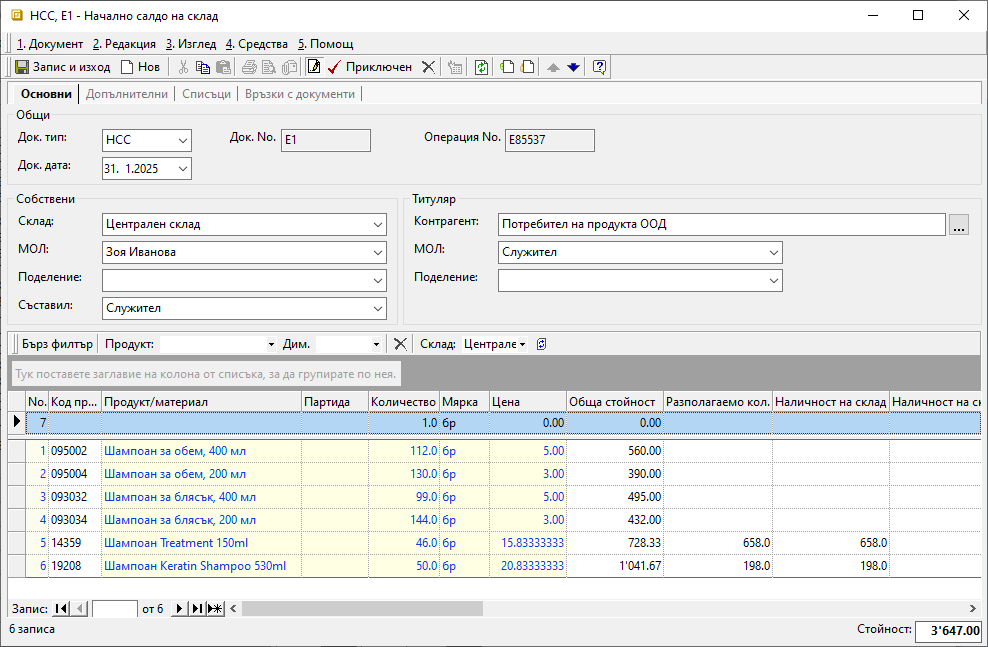

```{only} html
[Нагоре](000-index)
```

# Начално салдо на склад

- [Въведение](https://docs.unicontsoft.com/guide/erp/002-docs/002-trade-system/002-warehouse-documents/002-beg-saldo.html#id2)  
- [Въвеждане на начално салдо](https://docs.unicontsoft.com/guide/erp/002-docs/002-trade-system/002-warehouse-documents/002-beg-saldo.html#id3)  
- [Свързани статии](https://docs.unicontsoft.com/guide/erp/002-docs/002-trade-system/002-warehouse-documents/002-beg-saldo.html#id4)  

## **Въведение**

С документ **Началното салдо на склад** се отразяват количествата на наличните продукти и материали към определен момент. Това може да бъде при внедряване на Dreem ERP или в началото на нов отчетен период.  
Точното въвеждане на началното салдо е критично за управлението на складовите операции.  

Необходимо е да се въведат начални салда отделно за всеки склад. Освен актуални количества те трябва да съдържат и стойности - доставни цени без ДДС.  

## Въвеждане на начално салдо

Процесът по въвеждане на документ **Началното салдо на склад** е следният:  

1) От **Търговска система || Складови документи** чрез десен бутон на мишката се избира **Нов документ**. Отваря се форма за въвеждане и редакция на складов документ.  

2)  В раздел **Основни** се въвеждат:  

    - **Док. тип** – избира се тип на документа да бъде **НСС** – Начално салдо на склад;  
    - **Док. дата** – поле за избор на дата, към която количествата на продуктите ще се отразят в наличността на склада;  
    - **Док. No** – поле за избор на номер за документа;  
    Ако полето остане празно, системата ще генерира пореден номер на документ за текущия склад;  
    - **Склад** – поле за избор на склад, за който се отнасят началните салда;  
    - **МОЛ** – избира се материално отговорното лице за текущия склад;  
    Полето се обзавежда автоматично, ако складът има настроен МОЛ по подразбиране.  
    - **Поделение** - в полето може да се посочи поделение от предварително настроените в контрагент **Потребител на продукта**;  
    - **Съставил** - избира се персона, съставила документа;  
    Полето се обзавежда автоматично с настроените данни за текущия потребител на системата.  
    - **Контрагент** – данните за контрагент се обзавеждат автоматично при избиране на тип документ **НСС**;  
    - **Продукт/материал** – въвежда се списък с всички продукти, които са налични в склада към избраната в документа дата;  
    Ако продуктите не са предварително въведени, системата позволява това да се направи в момента чрез десен бутон и **Нов продукт**.   
    - **Партида** - в тази колона могат да се попълват партиди на продукти;  
    Ако един продукт участва с няколко партиди, се въвежда отделен ред за всяка от тях.  
    - **Количество** – в колоната се въвеждат наличните количества по продукти към датата на документа;   
    - **Мярка** - колоната трябва да съдържа основните мерни единици за всеки един продукт;  
   В складови документи продуктите се отразяват с настроените им основни мерни единици. Обикновено това е най-малката мярка, в която продуктът съществува в системата.   
    - **Цена** - в колоната се попълват единични цени без ДДС;  
    Обикновено се използва среднопретеглена цена за текущия склад.  

   { class=align-center w=15cm }

3) **Приключен** - бутон в лентата с инструменти на формата;  
След обзавеждане на реквизитите в **НСС**, документът трябва да бъде приключен. Това валидира данните от документа и те са видими в справките.  

## **Свързани статии**

[Създаване на складов документ](https://docs.unicontsoft.com/guide/erp/002-docs/002-trade-system/002-warehouse-documents/001-warehouse.html)