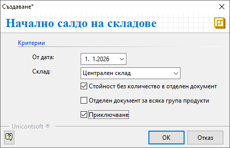

```{only} html
[Нагоре](000-index)
```

# **Начално салдо на склад**

- [Въведение](#въведение)  
- [Въвеждане на начално салдо](#въвеждане-на-начално-салдо)  
- [Генериране на начално салдо](#генериране-на-начално-салдо)
- [Свързани статии](#свързани-статии)  

## **Въведение**

С документ **Началното салдо на склад** се отразяват количествата на наличните продукти и материали към определен момент. Това е задължително при внедряване на Dreem ERP. В последствие начално салдо на склад може да бъде въвеждано в началото на нов отчетен период.  
Точното въвеждане на началното салдо е критично за управлението на складовите операции.  

Необходимо е да се въведат начални салда отделно за всеки склад. Освен актуални количества те трябва да съдържат и стойности по цени без ДДС.  

## **Въвеждане на начално салдо**

Процесът по въвеждане на документ **НСС**-*Началното салдо на склад* е следният:  

1) От **Търговска система » Складови документи** чрез десен бутон на мишката се избира **Нов документ**. Отваря се празна форма за въвеждане на нов складов документ.  

2)  В раздел **Основни** се попълват реквизити:  

    - **Док. тип** – избира се тип на документа да бъде **НСС** – Начално салдо на склад;  
    - **Док. дата** – поле за избор на дата, към която количествата на продуктите ще се отразят в наличността на склада;  
    - **Склад** – поле за избор на склад, за който се отнасят началните салда;  
    - **МОЛ** – избира се материално отговорното лице за текущия склад;  
    Полето се обзавежда автоматично, ако складът има настроен МОЛ по подразбиране.  
    - **Поделение** - в полето може да се посочи поделение от предварително настроените в контрагент **Потребител на продукта**;  
    - **Съставил** - избира се персона, съставила документа;  
    Полето се обзавежда автоматично с настроените данни за текущия потребител на системата.  
    - **Контрагент** – данните за контрагент се обзавеждат автоматично при избиране на тип документ **НСС**;  

3) От реда за добавяне на нов запис в поле **Продукт/материал** се отваря форма за избор на продукти. Въвежда се списък с всички продукти и материали, които са налични в склада към избраната дата на документа. Продуктите трябва да са предварително създадени в системата. За отделни липсващи номенклатури е възможно ръчно въвеждане в момента чрез десен бутон и **Нов продукт**.  

    От полетата в колона **Партида** могат да се попълват партиди на продукти. Когато един продукт е наличен в няколко партиди, се въвежда отделен ред за всяка от тях. Обикновено с партида са свързани и реквизити **Дата на годност на партида** и **Страна на произход на партида**, които се попълват в съответната колона.  

    Наличните количества по продукти се въвеждат от **Количество** в съответната им мерна единица. Реквизит **Мярка** трябва да съдържа основните мерни единици, с които е настроен всеки един продукт.  
   
    > В складови документи продуктите се отразяват с настроените им основни мерни единици. В общия случай това е най-малката мярка, в която продуктът съществува в системата.   

    От полета **Цена** за всеки продукт и партида се попълват единичните цени без ДДС. Обикновено се използва среднопретеглената цена за текущия склад.  

   { class=align-center w=15cm }

4) Чрез бутон [**Приключен**] от лентата с инструменти документът се валидира.   
С това складовите наличности са актуализирани и данните от документа стават видими в справките.  

## **Генериране на начално салдо**

Системата разполага с вграден инструмент за автоматична генерация на начално салдо за склада. Той е достъпен от **Контролен панел » Генериране на начално салдо за склада**.  

Автоматичната генерация е приложима, когато в базата има реални данни от минали периоди.  

{ class=align-center }

За генерацията на **НСС**-*Начално салдо на склад* е необходимо дефиниране на следните критерии:  

   - **От дата** - В полето се избира дата на началното салдо.  
   Това предполага всички складови документи до тази дата да бъдат валидирани. В противен случай няма да участват при формиране на началното салдо.  
   - **Склад** - Чрез обзавеждане на този реквизит се указва склад, за който се генерира документ тип **НСС**. Системата дава възможност за избор на един или множество складове.  
   - **Стойност без количество в отделен диокумент** - Чрез опцията се указва генерация на допълнителен документ **НСС**. Той включва всички продукти без наличност в склада с остатъчна стойност.  
   Силно препоръчително е тази опция да бъде активирана.  
   - **Отделен документ за всяка група продукти** - Опцията указва генерация на отделни документи **НСС** за всяка категория продукти.  
   - **Приключване** - С поставяне на отметка в полето се указва на системата да генерира документ **НСС** в състояние *Приключен*. Ако опцията не бъде маркирана, документът остава в състояние на редакция.  

Генерацията се потвърждава с бутон [**OK**]. Новосъздадените начални салда са достъпни в **Търговска система » Складови документи**.  

> При автоматичната генерация на **НСС** системата обзавежда документа както с наличностите, така и със среднопретеглени цени за всеки склад.    

## **Свързани статии**

[Създаване на складов документ](001-warehouse.md)