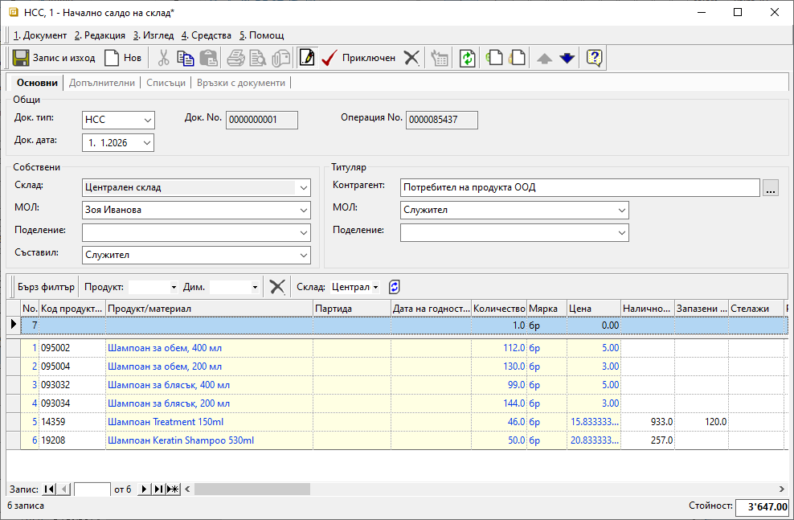
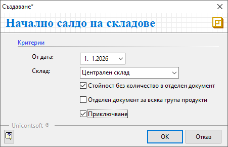

```{only} html
[Нагоре](000-index)
```

# **Начално салдо на склад**

- [Въведение](#въведение)  
- [Въвеждане на нов документ начално салдо](#нов-документ-за-начално-салдо)  
- [Генериране на начално салдо](#генериране-на-начално-салдо)
- [Свързани статии](#свързани-статии)  

## **Въведение**

С документ **Начално салдо на склад** се регистрират наличните към определен момент количества с продукти и материали. Необходимо е да се въведе такъв документ отделно за всеки склад.   

> Коректното въвеждане на начално салдо с фактически количества и стойности по цени без ДДС е критично за управлението на складовите операции.  

Актуалните начални салда са задължителни при внедряване на **Dreem ERP**.  
В последствие такъв документ може да бъде въвеждан в началото на всеки или за избран нов отчетен период.  

## **Нов документ за начално салдо**

**1. Създаване**

Нов документ **НСС**-*Началното салдо на склад* се въвежда от **Търговска система » Складови документи**.  
Чрез десен клик върху списъка с документи се избира опция **Нов документ**. Това отваря празна форма за ръчно въвеждане на данни.  

**2. Попълване на реквизити**  

В раздел **Основни** на формата за редакция се попълват:  

- **Док. тип** – В полето се избира тип на документа **НСС**–*Начално салдо на склад*.  
- **Док. дата** – От полето се указва дата, към която количествата с продукти ще се отразят в наличността на склада.  
- **Склад** – Чрез падащия списък в полето се указва склад, за който се отнасят наличностите по продукти.  
- **МОЛ** – Избира се материално отговорното лице за текущия склад.  
Полето се обзавежда автоматично, ако складът има настроен МОЛ по подразбиране.  
- **Обект** - В полето може да се посочи обект от настроените за **Потребител на продукта**.  
- **Съставил** - Избира се персона, която съставя документа.  
Полето се обзавежда автоматично с настроените данни за текущия потребител.  
- **Контрагент** – Данните за контрагент **Потребител на продукта** се обзавеждат автоматично при избиране на тип документ **НСС**.  

{ class=align-center w=15cm }

От поле **Продукт/материал** на реда за нов запис се отваря форма за избор на продукти. Въвежда се списък с всички продукти и материали, които са налични в склада към избраната дата на документа.  
Продуктите трябва да са предварително създадени в системата. За отделни липсващи номенклатури е възможно ръчно въвеждане на момента чрез десен клик и **Нов продукт**.  

При работа с партиди на продукти данните се попълват в **Партида**. Когато един продукт е наличен в няколко партиди, се въвежда отделен ред за всяка от тях. С партида са свързани също реквизити **Дата на годност на партида** и **Страна на произход на партида**, които се попълват в съответната колона.  

Наличните количества по продукти в съответната им мерна единица се въвеждат от **Количество**.  
Реквизит **Мярка** трябва да съдържа основните мерни единици, с които е настроен всеки един продукт. В общия случай това е най-малката мярка, в която продуктът съществува в системата.   

В **Цена** за всеки продукт и партида се попълват единичните цени без ДДС. Обикновено се използва среднопретеглената цена за текущия склад.  

**3. Приключване**

Чрез бутон [**Приключен**] от лентата с инструменти документът се валидира.   
С това складовите наличности са актуализирани и данните от документа стават видими в справките.  

**4. Запис**

Документът се записва и формата се затваря с бутон [**Запис и изход**] в лентата с инструменти.  

## **Генериране на начално салдо**

Системата разполага с вграден инструмент за автоматична генерация на начални салда. Той е достъпен от **Контролен панел » Генериране на начално салдо за склад**.  
Системата отваря форма за избор на критерии за генерация.  

> Автоматичната генерация е приложима, когато в базата има данни от минали периоди.  

{ class=align-center }

За генерацията на **НСС**-*Начално салдо на склад* е необходимо дефиниране на следните критерии:  

- **От дата** - В полето се избира дата на началното салдо.  
Това предполага всички складови документи до тази дата да са приключени. В противен случай данните в тях няма да участват при формиране на началното салдо.  
- **Склад** - Чрез този реквизит се указва склад, за който се генерира документ **НСС**.  
Системата позволява да бъде избран един или няколко склада.  
   - **Стойност без количество в отделен документ** - Опцията указва генерация на допълнителен документ **НСС**. Той включва всички продукти без наличност в склада с остатъчна стойност.  
   Силно препоръчително е тази опция да бъде активирана.  
   - **Отделен документ за всяка група продукти** - Опцията указва генерация на отделни документи **НСС** за всяка категория продукти.  
   - **Приключване** - В полето се указва генериране с приключване на документ **НСС**. Ако опцията не бъде маркирана, документът остава в състояние на редакция.  

- **OK** - Бутонът потвърждава генерацията.  
Новосъздадените начални салда са достъпни в **Търговска система » Складови документи**.  

> При автоматична генерация на **НСС** системата обзавежда документа с наличности и със среднопретеглени цени за избрания склад.    

## **Свързани статии**

[Създаване на складов документ](001-warehouse.md)