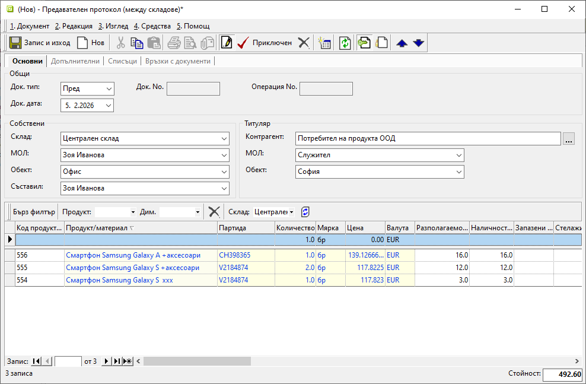
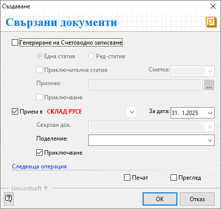

```{only} html
[Нагоре](000-index)
```

# **Трансфер между складове**

- [Въведение](#въведение)  
- [Създаване на нов документ за трансфер между складове](#нов-документ-за-трансфер)  
- [Свързани статии](#свързани-статии)  

## **Въведение**

Всяко движение на материали, стоки и продукция от един склад/обект към друг трябва да бъде отразено в системата.  
При трансфер се създават предавателен и свързан приемателен протокол.  Тази операция оказва влияние на складовите наличности едновременно в няколко склада.  

> Системата автоматично попълва количества и среднопретеглена цена в приходния протокол, така че да съвпадат с тези в разходния.  

## **Нов документ за трансфер**

**1. Създаване**

Трансфер между складове се регистрира от **Търговска система » Складови документи**.  
Празна форма за попълване на данни се отваря с десен клик върху списъка и опция **Нов документ**.  

**2. Попълване на реквизити**  

В раздел **Основни** се въвеждат следните реквизити:  

- **Док. тип** – В полето се избира тип на документа **Пред**–*Предавателен протокол (между складове)*.  
- **Док. дата** – Това е поле за избор на дата, за която количествата на продуктите трябва да се намалят от наличността на текущия склад.  
- **Док. No** – Полето може да остане празно, за да се генерира пореден номер спрямо настройките в **Номератори**.  
- **Склад** – Избира се склад, който предава материалите, стоките и/или продукцията.  
- **МОЛ** – Полето указва материално отговорното лице за текущия склад. Обзавежда се автоматично, ако складът има настроен МОЛ по подразбиране.  
- **Обект** - В полето може да се избере обект от настроените в контрагент **Потребител на продукта**.  
- **Съставил** - Указва персоната, която съставя документа.  
Полето се обзавежда автоматично с настройките на текущия потребител в системата.  
- **Контрагент** – Данните за контрагент се обзавеждат автоматично при избиране на тип документ **Пред**–*Предавателен протокол (между складове)*.   

{ class=align-center w=15cm }

От поле **Продукт/материал** на реда за нов запис се въвежда списък с продуктите, които се прехвърлят между складове.  
 
В поле **Партида** се отваря форма със списък за избор от наличните партиди за продукт. При трансфер на няколко партиди от един продукт, всяка от тях се въвежда на отделен ред.  

Количествата на продуктите, които се прехвърлят, се въвеждат в **Количество**.   
Поле **Мярка** се обзавежда с настроената за всеки продукт основна мерна единица.  

**3. Приключване**

Документът се валидира от бутон [**Приключен**] в лентата с инструменти. Това отваря форма за генериране **Свързани документи** със следните опции:  

- **Генериране на Счетоводно записване** – чрез отметка се указва генериране на свързан счетоводен документ;  
За да се обзаведе коректно счетоводната статия, **Автоматичен осчетоводител** трябва да е предварително настроен.  
    - *Една статия* - при избор на тази опция системата създава счетоводен документ с една статия и общ списък на продуктите (признаците);  
    - *Ред-статия* - с тази опция системата генерира счетоводен документ с множество статии - за всеки продукт от протокола се създава отделна счетоводна статия;   
    - *Приключителна статия* - при избрана приключителна сметка и *Признак* ще се генерира допълнителна статия (приключителна) в счетоводния документ;  
    - *Приключване* - при поставена отметка счетоводният документ се генерира с приключване;  
    Когато липсва отметка, счетоводният документ се генерира в състояние на редакция.  

- **Прием в** (склад) - указва генериране на свързан приемателен протокол при поставена отметка и избран приемащ склад;  
    - *За дата* - указва дата за свързания приемателен протокол;  
    Това е датата, на която продуктите фактически са пристигнали в приемащия склад.  
    - *Обект* - в полето може да бъде избран обект от настроените в **Потребител на продукта**, с който ще се обзаведе приемателният протокол;  
    - *Приключване* - при поставена отметка свързаният приемателен протокол се генерира с приключване;  
    Когато няма отметка, се генерира документ в състояние на редакция.

- **Печат** или **Преглед** - Отваря се форма за избор на шаблон.  
При избрана опция **Печат** документът се разпечатва директно с избрания шаблон.  
При опция **Преглед** документът се отваря на екран преди отпечатване.   

- [**ОК**] - бутон за потвърждаване на избраните опции;  
Данните в протоколите се валидират и наличностите на участващите складове се актуализират.  

{ class=align-center }

**4. Запис**

Чрез бутон [**Запис и изход**] в лентата с инструменти документът се записва и формата се затваря.  

## **Свързани статии**

[Създаване на складов документ](001-warehouse.md)