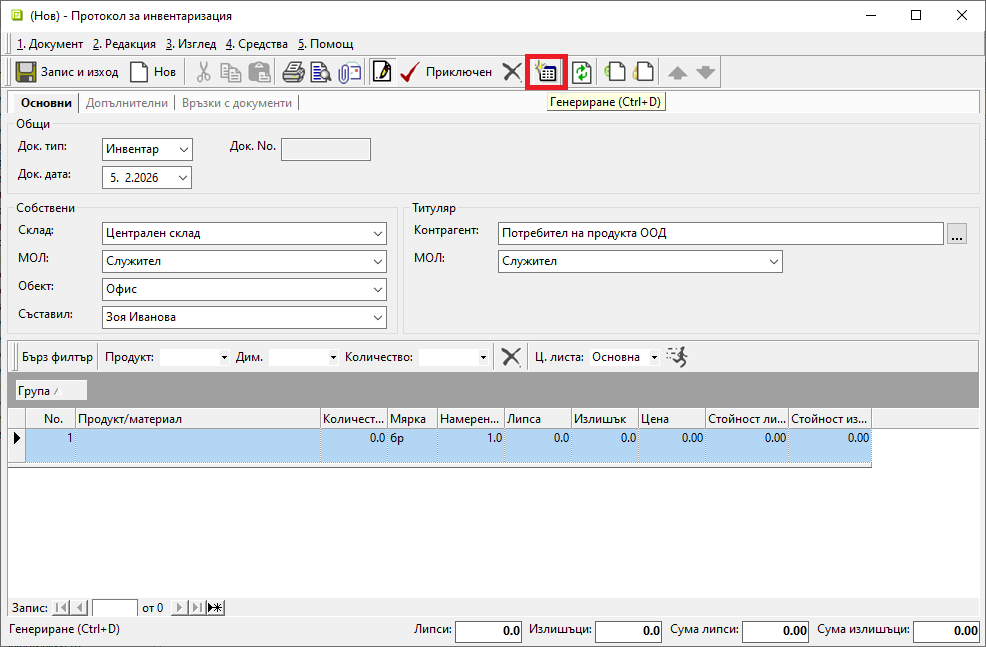
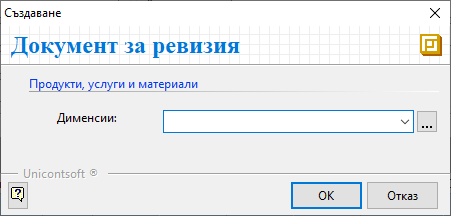
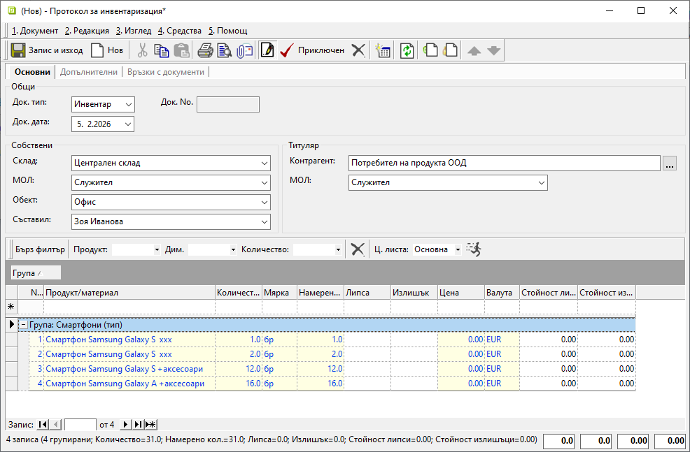
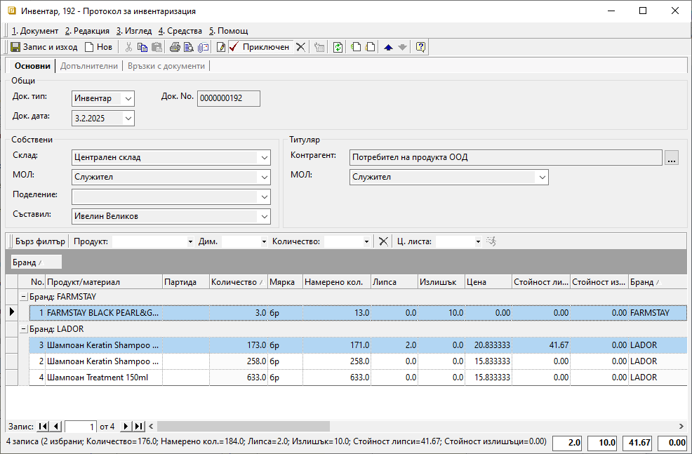
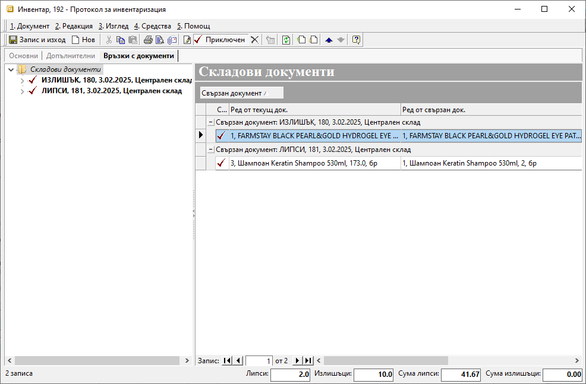

```{only} html
[Нагоре](000-index)
```

# **Инвентаризация**

- [Въведение](#въведение)  
- [Създаване на нов протокол за инвентаризация](#нов-протокол-за-инвентаризация)  

## **Въведение**

Чрез процеса на инвентаризация се осъществява проверка между фактическите наличности в избран склад и данните в системата.  

Проверката се регистрира с документ **Протокол за инвентаризация**.  
Системата разполага с инструмент за генерация на списък с продукти за инвентаризация. След валидирането на данните от проверката автоматично се генерират протоколи за липса и/или излишък. С това се актуализират количествата в търговския склад.  

## **Нов протокол за инвентаризация**

**1. Създаване**

От списъка с документи в **Търговска система » Протоколи за инвентаризация** се създава нов протокол. Празна форма за въвеждане на данни се отваря с десен клик и **Нов документ**, клавишна комбинация **Ctrl + N** или от бутон [**Нов документ**] в лентата с инструменти.  

**2. Попълване на реквизити**  

В раздел **Основни** се попълват следните реквизити:  

- **Док. тип** – Системата автоматично попълва това поле с тип на документа **Инвентар**–*Протокол за инвентаризация*.  
- **Док. дата** – В полето се избира дата, за която се извършва проверка на складовите наличности.  
- **Док. No** – Полето може да остане празно и при приклюване на протокола да се генерира пореден номер за текущия склад.  
- **Склад** – В това поле се избира склад, за който се извършва проверката на наличности.  
- **МОЛ** – Указва материално отговорното лице за текущия склад.  
Полето се обзавежда автоматично, ако складът има настроен МОЛ по подразбиране.  
- **Обект** - В полето може да се посочи обект от настроените за контрагент **Потребител на продукта**.  
- **Съставил** - Избира се персона, съставила документа. Полето се обзавежда автоматично с настройките на текущия потребител в системата.  
- **Контрагент** – Системата автоматично попълва полето с настроения за **Потребител на продукта** контрагент.  

{ class=align-center w=15cm }

**3. Генериране**

Чрез бутон **Генериране** от лентата с инструменти се отваря форма за създаване **Редове на протокол**.  
Чрез поле **Дименсии** инвентаризацията може да бъде ограничена до избрани конкретни групи продукти. Когато проверката е частична, се маркират една или няколко дименсии. Системата ще генерира данните в документа единствено за тях.  
Когато се извършва пълна инвентаризация, поле **Дименсии** остава празно. Така в протокола се генерира списък с всички налични продукти в избрания склад.  

{ class=align-center }

Направеният избор се потвърждава с бутон **OK**.  
Системата генерира списък с продукти и обзавежда колони **Количество** и **Намерено кол.**.  

{ class=align-center w=15cm }

- **Количество** - Показва наличностите на продукти в текущия склад към избраната в документа дата.  
- **Намерено кол.** - В полето се нанасят фактически установените при проверката наличности. За улеснение системата е обзавела същите данни от колона **Количество**. Коригират се единствено полетата с разминавания.  
- **Липса** и **Излишък** - Тези полета се обзавеждат единствено на редовете с разминавания между **Количество** и **Намерено кол.**.   

{ class=align-center w=15cm }

**4. Приключване**

Протоколът се валидира с бутон [**Приключен**] от лентата с инструменти. Свързаните документи се генерират автоматично. Могат да бъдат отворени за преглед от раздел **Връзки с документи**.    

При установени липси се генерира складов документ **ЛИПСИ**-*Протокол за липси*. Той е разходен тип складов документ и системата обзавежда **Цена** със среднопретеглени цени за текущия склад.  

При установени излишъци се генерира складов документ **ИЗЛИШЪК**-*Протокол за излишък*. Той е приходен тип складов документ и цените не се обзавеждат автоматично от системата.   

> При формираните излишъци също може да бъде приложена среднопретеглена цена след преизчисляване на склада.  
Необходима е предварителна настройка в **Администрация » Настройки » Излишъка се заприхождава по средна цена: Да**.  

{ class=align-center w=15cm }
 
 
