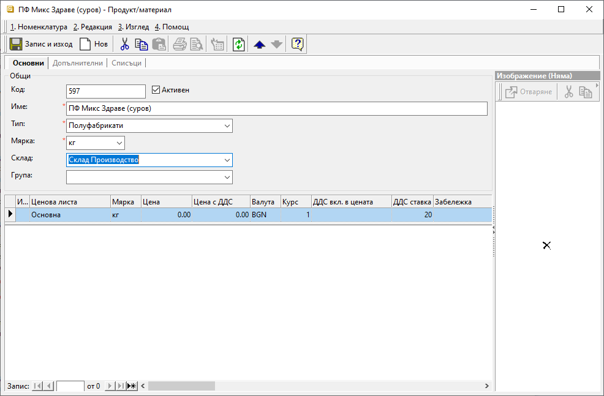
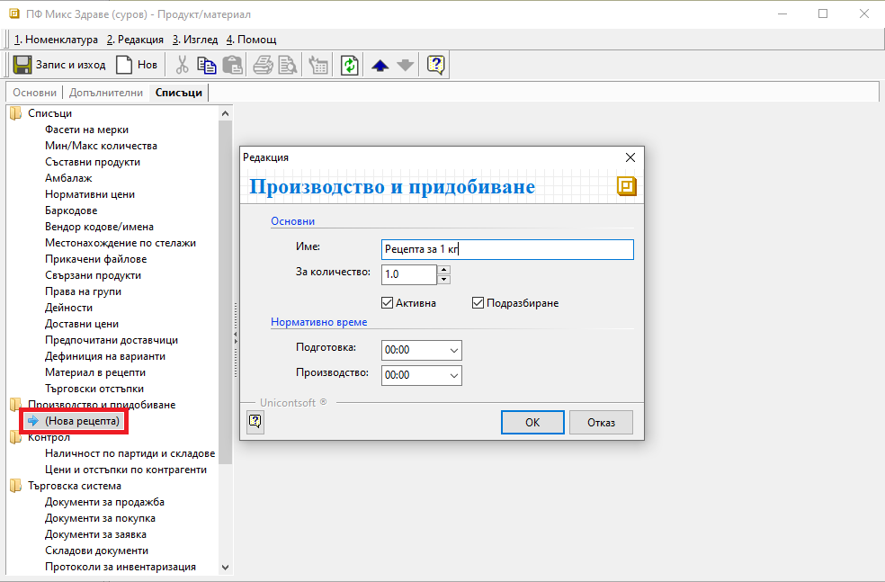
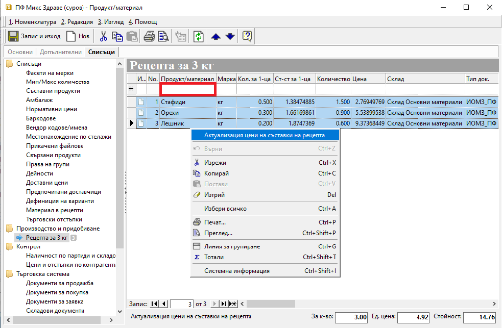

```{only} html
[Нагоре](../000-index)
```

# **Производство**

- [Въведение](#въведение)  
- [Настройки](#настройки)
- [Създаване на протоколи за производство](#създаване-на-протоколи-за-производство)  
- [Свързани статии](#свързани-статии)

## **Въведение**

**Dreem ERP** дава възможност за управление на производствените процеси чрез генерация на специфични складови документи. Те регистрират завършването на отделните операции и резултатите от производството по складове. Това гарантира проследимост на вложените суровини, себестойността и ефективността на производствения процес.  

Системата актуализира складовите наличности, като осигурява информация за изработените полуфабрикати и готова продукция:  
   - Партиди;  
   - Срокове на годност;  
   - Складове;  
   - Оператори;   

> Всяко движение на стоки и материали може да бъде осчетоводено автоматично. За целта за складовите документи се настройва [**Автоматичен осчетоводител**](../../../001-ref/002-accounting/003-acc-wizard.md) по типове продукти, документи и складове.  

## **Настройки**

Данните за материали се попълват в документите автоматично от системата на база рецепти. Във връзка с производството са необходими настройки на продуктите, които ще участват - материали, полуфабрикати и готова продукция.  

1) **Складове по подразбиране** - Складове по подразбиране се дефинират за всички материали и продукти, участващи в процесите на производство. 

   Настройката на реквизит **Склад** е достъпна в панел **Основни** от формата за редакция на продукт.  

{ class=align-center w=15cm }

2) **Рецепти** - Системата позволява добавяне на множество рецепти за един продукт - напр. в различни мерни единици.  

   Нова рецепта се добавя от форма за редакция на избрания продукт. Настройката е достъпна в раздел **Списъци || Производство и придобиване**. За добавяне на първа рецепта в продукта се избира опцията *(Нова рецепта)*. Това отваря форма за редакция **Производство и придобиване**.  

{ class=align-center w=15cm }

- **Секция Основни** - Избира се наименование за рецептата и се попълва в поле **Име**.  
В поле **За количество** задължително се въвежда брой единици в основна мярка на продукта, за които се отнася текущата рецепта.  

   Чрез опцията **Активна** настройката с текуща рецепта се активира/деактивира.  

   При настроени няколко рецепти една от тях може да бъде маркирана с **Подразбиране**, така че системата да я третира като предпочитана.  

- **Секция Нормативно време** - Чрез реквизити **Подготовка** и **Производство** може да бъде дефинирана продължителност в минути/часове за всеки от процесите.   

- **OK** - Направените модификации трябва да бъдат потвърдени с бутон [**OK**].  
С това системата затваря формата за редакция.    
Вдясно на екран се активира нов ред за добавяне на записи.  

- **Съставки** - От поле **Продукт/материал** се избират необходимите продукти за изпълнение на рецептата. За всяка от съставките се попълват мерни единици и количества по рецепта.  

{ class=align-center w=15cm }

- **Себестойност** - Колоните **Цена**, **ПДЦ** (Последна доставна цена без ДДС) и **СПЦ** (Среднопретеглена цена в склада) се обзавеждат от системата. По желание се маркира един, няколко или всички редове от списъка и с десен бутон на мишката се избира **Актуализация цени на съставки на рецепта**.  

   В тотали на формата (долу вдясно) се визуализират стойности за единица основна мярка и общо за количеството по рецепта.  

- **Склад и тип документ за Генериране през рецепта** - Настройките в полета **Склад** и **Тип док.** определят генерацията на разходни складови документи към протоколите за производство.  

За всяка съставка може да бъде дефиниран склад, в който автоматично се регистрира разходът за продукта при производство.  

От поле **Тип док.** се избира вид на разходния складовия документ със съставки, който системата ще създаде автоматично в избрания склад при производство.  

3) **Запис и изход** - Промените могат да бъдат записани с клавишна комбинация [**Ctrl + S**] или от меню **Номенклатурa || Запис**. 

## **Създаване на протоколи за производство**

Протоколите за производство се създават в **Търговска система || Складови документи** на база производствени задания. Те са приходни документи, които финализират всеки отделен етап от производството. 

1) **Производство на полуфабрикати** – Полуфабрикатите се използват като входен материал в следващите етапи на производство на готова продукция.  

Количеството на произведения полуфабрикат се определя в протоколите за производство. Валидирането на протоколите отразява завършен междинен етап от производството.  

2) **Производство на готова продукция** - Протоколът за производство на готова продукция е окончателният документ, който потвърждава приключването на производствената поръчка. Той отразява движението в склада с приема на готова продукция.  

## **Свързани статии**

[Продукти и материали](../../../001-ref/001-nomenclatures/003-items.md)  
[Типове документи](../../../001-ref/001-nomenclatures/014-doc-types.md)  
[Автоматичен осчетоводител](../../../001-ref/002-accounting/003-acc-wizard.md)  