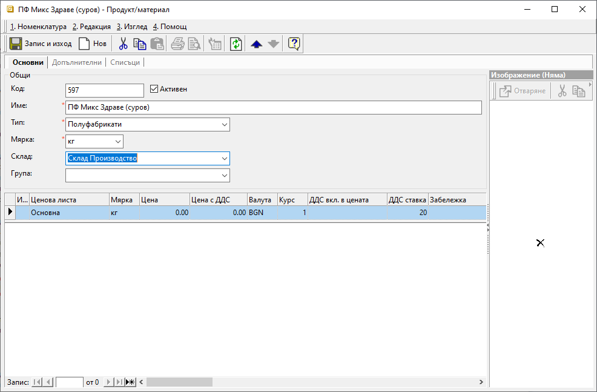
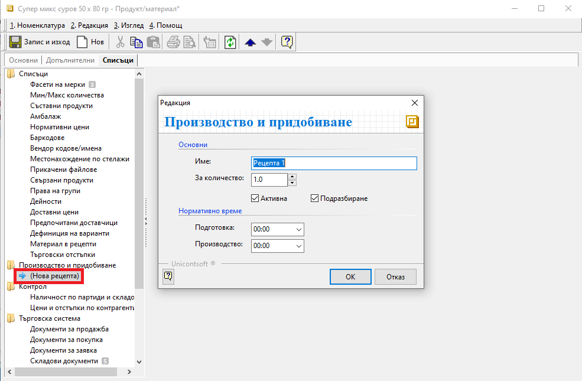
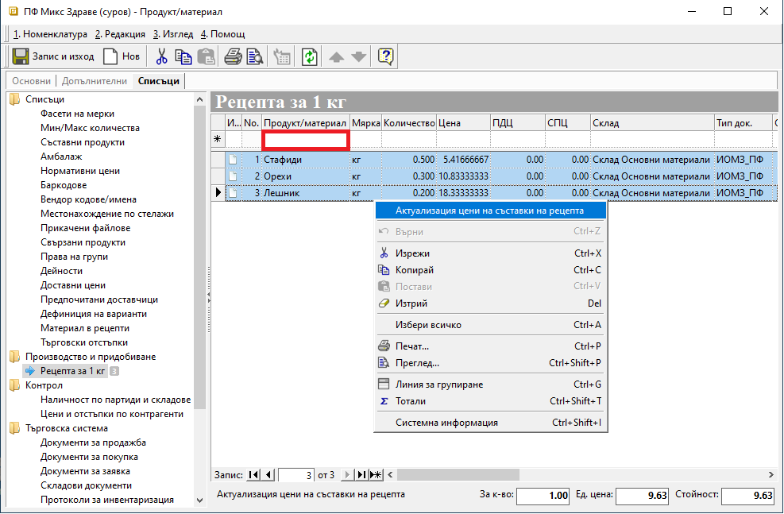
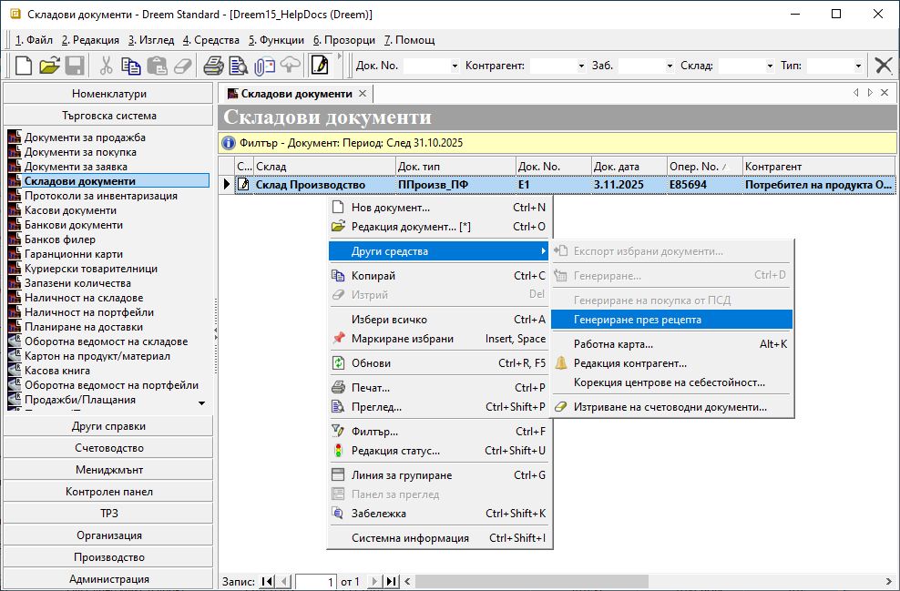
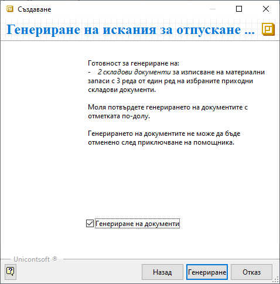
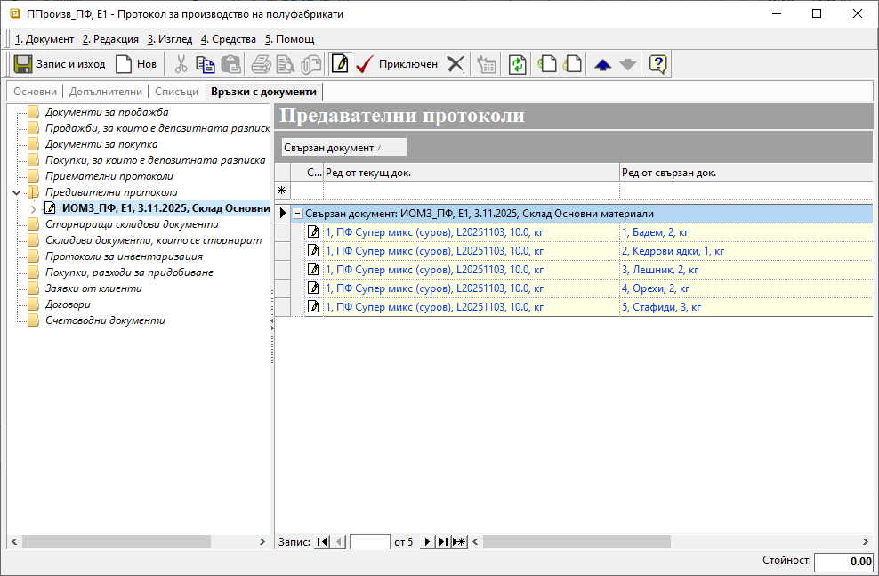
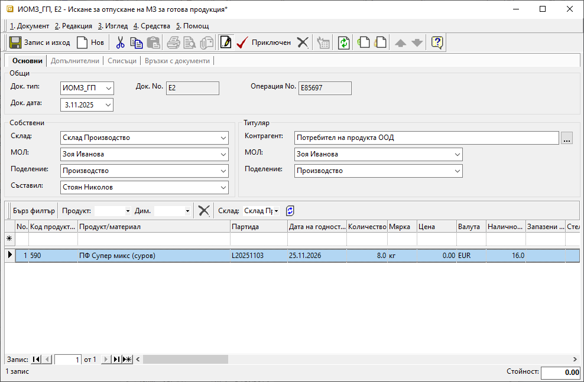
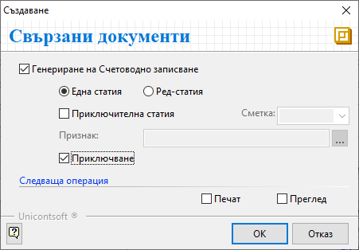
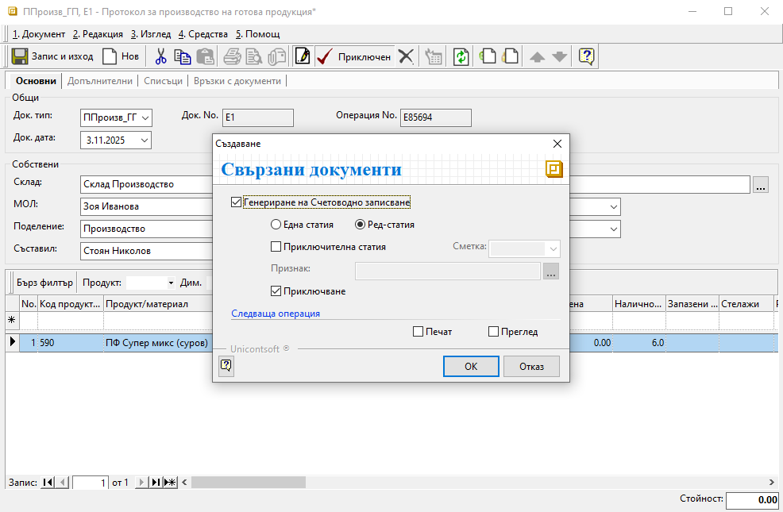

```{only} html
[Нагоре](../000-index)
```

# **Производство**

- [Въведение](#въведение)  
- [Настройки](#настройки)
- [Създаване на нови документи за производство](#нови-документи-за-производство)  
- [Свързани статии](#свързани-статии)

## **Въведение**

Производствените процеси се регистрират и управляват чрез генерация на специфични складови документи:  

- **Искания за отпускане на материални запаси (ИОМЗ)**  
Тези документи регистрират разхода на суровини по складове. Осигуряват проследимост на вложените материали, себестойност, партиди, срокове на годност, складове, оператори и др.  

> ИОМЗ е разходен тип складов документ. След валидиране автоматично се обзавежда с единични среднопретеглени цени и обща стойност.  

- **Протоколи/актове за производство (ППроизв/ АГП)**  
Тези документи потвърждават приключването на производственото задание. Те регистрират резултата от производството и актуализират наличността на изработени полуфабрикати и готова продукция.  

> Протоколите/актовете за производство са строго свързани с генерираните към тях ИОМЗ. С валидирането им себстойността на продукцията се обзавежда спрямо стойностите от ИОМЗ.  

## **Настройки**

Във връзка с производството са необходими настройки за продуктите, които ще участват - материали, полуфабрикати и готова продукция.  

1) **Складове по подразбиране**

Настройката се използва от помощника за генериране на ИОМЗ към протокол за производство. Може да бъде дефинирана за всички материали и продукти, участващи в процесите на производство.   
Склад по подразбиране се указва чрез реквизит **Склад** от формата за редакция на продукт (раздел **Основни**).  

{ class=align-center w=15cm }

2) **Рецепти** 

Настроените рецепти се използват като база за генериране на списък със суровини в ИОМЗ.  
Настройката е достъпна от форма за редакция на продукт в раздел **Списъци » Производство и придобиване**. Системата позволява добавяне на множество рецепти за един продукт.  

За добавяне на първа рецепта в продукта се избира опцията *(Нова рецепта)*. Това отваря форма за редакция **Производство и придобиване**.    

- **Секция Основни** - В поле **Име** се попълва наименование на рецептата.  
В поле **За количество** задължително се указва брой единици в основна мярка на продукта, за които се отнася рецептата.  
Чрез опцията **Активна** текущата рецепта се активира/деактивира.  
При настроени няколко рецепти една от тях може да бъде маркирана с **Подразбиране**, така че системата да я третира като предпочитана.  

- **Секция Нормативно време** - Чрез реквизити **Подготовка** и **Производство** може да бъде дефинирана продължителност в минути/часове за всеки от процесите.   

- **OK** - С бутон [**OK**] направените модификации се потвърждават и формата за редакция се затваря.    

{ class=align-center w=15cm }

В дясната част на формата за редакция се активира ред за добавяне на записи. Чрез него се въвеждат необходимите за изпълнение на рецептата суровини.  

От поле **Продукт/материал** се избират участващите в рецептата продукти. За всяка от съставките се попълват **Мярка** и **Количество**.  

Колоните **Цена**, **ПДЦ** (Последна доставна цена без ДДС) и **СПЦ** (Среднопретеглена цена в склада) се обзавеждат от системата. За целта  редовете в списъка се маркират и с десен клик се избира **Актуализация цени на съставки на рецепта**.  

> В тотали на формата (долу вдясно) се визуализират стойности за единица основна мярка и общо за количеството по рецепта.  

Настройките за **Склад** и **Тип док.** участват в генерацията на ИОМЗ при производство.  
При дефиниран склад системата автоматично ще изпише суровината от него.  
Чрез настроен тип документ се указва вид на разходния складов документ, с който се изписват съставките.  

{ class=align-center w=15cm }

3) **Запис и изход** - Чрез бутон [**Запис и изход**] направените промени се записват и формата се затваря. Промените могат да бъдат записани също с клавишна комбинация **Ctrl+S** или от меню **Номенклатурa » Запис**.  

## **Нови документи за производство**

**1. Създаване на производствено задание**

Документите за производство се създават в **Търговска система » Складови документи**.  
Чрез десен клик вурху списъка се избира **Нов документ**. Отваря се празна форма за въвеждане на данни.  

**2. Попълване на реквизити** 

В раздел **Основни** се въвеждат следните реквизити:   
   - **Док. тип** – В полето се избира тип на документа **ППроизв**-*Протокол за производство*.  
   - **Док. дата** – В полето се указва дата за производство.  
   - **Док. No** – Полето може да остане празно и системата ще генерира пореден номер според избраните тип документ и склад.  
   - **Склад** – От полето се указва склад, в който ще се заприходи продукцията.  
   - **МОЛ** – Реквизит за избор на материално отговорното лице за текущия склад. Полето се обзавежда автоматично, ако складът има настроен МОЛ по подразбиране.  
   - **Обект** - В полето може да се посочи обект от настроените за контрагент **Потребител на продукта**.  
   - **Съставил** - Избира се персона, която съставя документа. Полето се обзавежда автоматично с настроените данни за текущия потребител в системата.  
   - **Контрагент** – Данните за контрагент се обзавеждат автоматично при избиране на тип документ **ППроизв**-*Протокол за производство*.  

{ class=align-center w=15cm }

От реда за нов запис в поле **Продукт/материал** се добавят продуктите, които ще се произвеждат.  

По всяко време преди валидиране на протокола могат да бъдат попълнени детайли за **Партида** и **Срок на годност на партида**.  

В **Количество** се посочва колко от продукта се произвежда в мерната единица, избраната от поле **Мярка**.  

**3. Запис**  

Въведените до момента данни се записват от меню **Документ » Запис** или чрез клавишна комбинация **Ctrl+S**.   

> Протоколът за производство не се валидира на този етап.  
Документът се приключва след генериране на **ИОМЗ**-*Искане за отпускане на МЗ* и потвърждаване на вложените суровини.  

**4. Генериране на ИОМЗ**  

Системата разполага с инструмент за автоматично създаване на исканията за отпускане на материални запаси. Той е достъпен от меню **Средства » Генериране през рецепта** във формата за редакция на **ППроизв**.    
**Генериране през рецепта** може да бъде активирано също от списък със складови документи чрез десен клик върху **ППроизв** и **Други средства**.    

{ class=align-center w=15cm }

Отваря се помощник за генериране на искания за отпускане на МЗ.  
Чрез него се управляват автоматичното създаване на документи и попълване на избрани реквизити.  

{ class=align-center }

- **Док. тип** - Реквизитът указва тип на разходния складов документ, с който суровините от рецептата се изписват от склада.  
- **Док. дата** - Избира се дата за разходния складов документ.  
- **Реквизити** - Реквизитът определя вида на генерацията.  
Възможните варианти са:  
    - *По текущи реквизити* - При тази опция системата ще вземе предвид избраните в помощника реквизити за документи.  
    - *Склад и тип документ от рецепта* - При тази опция генерацията взема предвид настроените в рецептата склад и тип складов документ за всяка суровина.  
- **Склад** - Реквизитът указва за кой склад се генерира искането за отпускане на МЗ.  
Полето може да бъде обзаведено различно според избрания вид на генерацията:  
    - При генерация *По текущи реквизити* в полето може да бъде избран един склад. Системата ще генерира с този склад общ разходен документ с всички суровини.  
    Ако суровините имат настроени различни складове по подразбиране, в полето може да се маркира опция *(Складове по подразбиране)*. В този случай те се разпределят по складове в отделни документи.  
    - При генерация *Склад и тип документ от рецепта* реквизитът не се обзавежда. Системата генерира складов документ спрямо настройките по рецепта.  
- **МОЛ** - В полето може да бъде указана персона за МОЛ.  
Системата взема предвид този реквизит при генерация по текущи реквизити.  
- **Обект** - В полето може да бъде избран обект.  
Системата взема предвид този реквизит при генерация по текущи реквизити.  
- **Съставил** - Полето може да бъде обзаведено ръчно с избран случител, съставил документа. Системата взема предвид този реквизит при генерация по текущи реквизити.  
- **Приключен** - С поставянето/махането на отметка се избира дали системата автоматично да приключи разходния складов документ.  
- **Генериране на док. за прогнозна себест.** - .  
- **Генериране на док. за излишък при недостиг** - Чрез отметка се избира дали системата автоматично да създаде документ **ИЗЛИШЪК** с количествата от суровините в недостиг за изпълнение на рецептата.  
- **Генериране по един документ на склад** -  

- **Напред** - Към следваща стъпка от генерацията на ИОМЗ се преминава с бутон [**Напред**].  
- **Генериране** - Системата информира какви документи е в готовност да създаде. Действието може да бъде потвърдено с поставяне на отметка при **Генериране на документи** и бутон [**Генериране**].  

> След потвърждаване на генерирането на документи процесът не може да бъде отменен.  

{ class=align-center }

Системата съобщава за успешно създадените документи.  
Помощникът може да бъде затворен с бутон [**Изход**] или от [**x**].  

**5. Приключване на ИОМЗ** 

Новосъздаденият документ **ИОМЗ** е достъпен от списък **Складови документи** или от раздел **Връзки с документи** на протокола за производство.  

{ class=align-center w=15cm }

Реквизитите в **ИОМЗ** са обзаведени автоматично. Системата позволява да бъдат редактирани при необходимост.  

{ class=align-center w=15cm }

Искането за отпускане на МЗ трябва да бъде валидирано от бутон [**Приключен**]. Отваря се форма **Свързани документи** със следните опции:  

- **Генериране на Счетоводно записване** – Опцията указва генериране на свързан счетоводен документ.  
За да се обзаведе коректно счетоводната статия, **Автоматичен осчетоводител** трябва да е предварително настроен.  
    - *Една статия* - При тази опция системата създава счетоводен документ с една статия и общ списък със суровините (признаците).  
    - *Ред-статия* - С тази опция се генерира счетоводен документ с множество статии - за всяка суровина се създава отделна счетоводна статия.   
    - *Приключителна статия* - След избор на приключителна сметка и по желание *Признак* се генерира и приключителна статия в счетоводния документ.  
    - *Приключване* - Опцията указва автоматично приключване на генерирания счетоводен документ.  
    Ако не бъде поставена отметка, се генерира счетоводен документ в състояние на редакция.  

- **Печат** или **Преглед** - Отваря се форма за избор на шаблон.  
При избрана опция **Печат** документът се разпечатва директно с избрания шаблон. При опция **Преглед** документът се отваря на екран преди отпечатване.   

- **ОК** - Бутонът потвърждава избраните опции и валидира данните. С това участващите в документа суровини се изписват от съответния склад.  

> Разходният складов документ автоматично се обзавежда с единични среднопретеглени цени и обща стойност.  

Приключването на документи се повтаря за всички свързани **ИОМЗ**.  

{ class=align-center }

**6. Приключване на ППроизв** 

За да бъде завършен производственият процес, **Протокол за производство** трябва да бъде валидиран с бутон [**Приключен**]. 
Отваря се форма **Свързани документи** за избор от опциите:  

- **Генериране на Счетоводно записване** – При поставянето на отметка системата ще генерира свързан счетоводен документ.  
За да се обзаведе коректно счетоводната статия, **Автоматичен осчетоводител** трябва да е предварително настроен.  
    - *Една статия* - При тази опция се създава счетоводен документ с една статия, включваща суровините (признаците) в общ списък.  
    - *Ред-статия* - При тази опция се генерира счетоводен документ с множество статии - за всеки продукт се създава отделна счетоводна статия.   
    - *Приключителна статия* - След избор на приключителна сметка и по желание *Признак* се генерира и приключителна статия в счетоводния документ.  
    - *Приключване* - Опцията указва автоматично приключване на генерирания счетоводен документ.  
    Ако липсва отметка, системата генерира счетоводен документ в състояние на редакция.  

- **Печат** или **Преглед** - Отваря се форма за избор на шаблон.  
При избрана опция **Печат** документът се разпечатва директно с избрания шаблон. При опция **Преглед** документът се отваря на екран преди отпечатване.   

- **ОК** - С бутона избраните опции се потвърждават и данните се валидират. Това добавя готовата продукция към наличността в съответния склад.  

> Протоколът за производство автоматично се обзавежда с цени спрямо стойностите в ИОМЗ.  

{ class=align-center }  

## **Свързани статии**

[Продукти и материали](../../../001-ref/001-nomenclatures/004-items.md)  
[Типове документи](../../../001-ref/001-nomenclatures/014-doc-types.md)  
[Автоматичен осчетоводител](../../../001-ref/002-accounting/003-acc-wizard.md)  
[Производство с полуфабрикати](../../../005-how-to/017-manufacturing.md)  