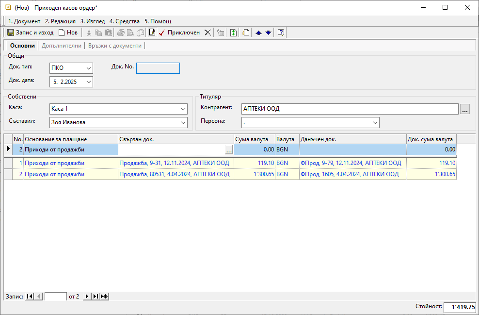

```{only} html
[Нагоре](000-index)
```

# Създаване на касов документ

- [Въведение](https://docs.unicontsoft.com/guide/erp/002-docs/002-trade-system/003-payments/001-cashdesk.html#id2)  
- [Създаване на нов касов документи](https://docs.unicontsoft.com/guide/erp/002-docs/002-trade-system/003-payments/001-cashdesk.html#id3)  
- [Реквизити](https://docs.unicontsoft.com/guide/erp/002-docs/002-trade-system/003-payments/001-cashdesk.html#id4)  
- [Свързани статии](https://docs.unicontsoft.com/guide/erp/002-docs/002-trade-system/003-payments/001-cashdesk.html#id5)  

## **Въведение**

Приходите и разходите на парични средства в брой се регистрират в системата чрез създаване на документи в **Търговска система || Касови документи**. За да има съответствие между реалната и касовата наличност в системата, всяко движение на парични средства трябва да бъде отразено.  

Касовите документи се създават отделно за всяка каса и са свързани само с един контрагент.  

## **Създаване на нов касов документ**

Процесът по създаване на касов документ е следният:

1) От **Търговска система || Касови документи** чрез десен бутон на мишката върху списъка се избира **Нов документ**. Отваря се празна форма за въвеждане на данни.   

2)  В раздел **Основни** се попълват следните реквизити:  

- **Док. Тип** – В полето се отваря падащ списък с настроените типове касови документи. Избира се **ПКО**-*Приходен касов ордер*, когато има постъпили плащания в текущата каса. Тип **РКО**-*Разходен касов ордер* се избира, когато има разход на средства от текущата каса.  
- **Док. No** - Полето се попълва с номер на документа. Системата дава пореден номер за избраната каса с приключването на документа.    
- **Док. дата** - В полето се избира дата, за която се отнася приходът/разходът на избраната каса.  
- **Каса** – От полето се отваря падащ списък за избор на каса. Всички каси се настройват предварително от меню **Номенклатури || Референтни номенклатури**.  
- **Съставил** - Избира се лице, което съставя документа. Списъкът със служители трябва да бъде предварително настроен.  
Данните в полето се попълват автоматично с настройките на текущия потребител.  
- **Контрагент** – В полето се отваря форма за избор от списък **Контрагенти**.  

{ class=align-center w=15cm }

3) От реда за добавяне на нов запис се въвеждат детайлите на извършеното плащане. Следователно трябва да бъдат попълнени някои реквизити:  

- **Основание за плащане** – От падащия списък в полето се избира предназначение на плащането.  
Основанията трябва да са предварително дефинирани в **Номенклатури || Референтни номенклатури || Търговска система: Основания за плащане**.  
Избраното основание определя счетоводната операция, която се генерира при приключване на документа. Необходимо е предварително да бъдат направени настроийки за това от [**Счетоводство || Автоматичен осчетоводител**](https://docs.unicontsoft.com/guide/erp/001-ref/002-accounting/002-acc-wizard.html).  

- **Свързан док.** - От полето се отваря форма за избор на вътрешнофирмени **Документи за покупка и продажба**. От списъка се маркират един или множество записи, по които е извършено плащане. За да се попълнят автоматично и свързаните с тях данъчни документи, се използва бутон **[Напред]**.  
По този начин ще се закрият остатъците за плащане по вътрешнофирмения и по данъчния документ.   

- **Сума валута** и **Док. сума валута** са полета за попълване на сума, отговаряща на извършеното плащане. Те се обзавеждат автоматично след избор на свързани документи. При частично плащане сумите трябва да се редактират, така че да съответстват на реалното плащане.  

- **Данъчен док.** - В полето се отваря форма за избор **Данъчни документи за покупка и продажба**. Полето се попълва автоматично, ако преди това е изпълнена стъпката с обзавеждане на **Свързан док.**.  

4) Чрез бутон [**Приключен**] от лентата с инструменти документът се валидира и се отваря форма за генерация **Свързани документи**. Системата дава възможност за автоматично създаване на счетоводно записване.  

За да се генерира коректен счетоводен запис, трябва предварително да има съответните настройки в [**Сметкоплан**](https://docs.unicontsoft.com/guide/erp/001-ref/002-accounting/001-chart-of-acc.html) и в [**Автоматичен счетоводител**](https://docs.unicontsoft.com/guide/erp/001-ref/002-accounting/002-acc-wizard.html).  

   - **Генериране на Счетоводно записване** - опция за автоматична генерация на свързан счетоводен документ;  
   Когато за тази опция липсва отметка, системата не генерира счетоводен запис към касовия ордер.  
   - **Приключване** - при липса на отметка, системата генерира счетоводния документ в редакция, а при поставена отметка - в състояние *Приключен*;  
   - **OK** - бутонът потвърждава избраните във формата опции;    

## **Реквизити**

1) В раздел **Основни**:  
   - **Док. Тип** – поле за избор на тип документ;  
   Системата прилага дефинирания от **Администрация || Настройки** тип на документ по подразбиране.   
   - **Док. No** - в полето се попълва номер на документа;  
   Ако полето остане празно, системата автоматично попълва пореден номер при приключване на документа спрямо настройките в **Номератори**.  
   - **Док. дата** - в полето се избира дата за документа;  
   По подразбиране в нов документ системата предлага текуща дата.   
   - **Каса** - от полето се отваря списък с настроени каси;  
   Реквизитът указва каса, в която се регистрира текущият документ.  
   - **Съставил** - поле с падащ списък за избор на персона от настроените в **Потребител на продукта**;  
   Списък със служители трябва да бъде предварително настроен.    
   Данните в полето се попълват автоматично с настройките на текущия потребител в системата.  
   - **Контрагент** – в полето се отваря форма за избор **Контрагенти**;   
   - **Персона** - поле за избор на лице от списък с персони на избрания контрагент;  
   Полето се обзавежда с настройките по подразбиране на контрагента.  

   От реда за нов запис се обзавежда списък, който съдържа колони:  
   - **Поверителност** - дава информация за активирани *Поверителност на цени* и/или *Поверителност на документ*;  
   - **No.** - пореден номер на запис по реда на въвеждане;  
   - **Основание за плащане** - отваря падащ списък с настроените основания за плащане в **Номенклатури || Референтни номенклатури**;  
   - **Свързан док.** - отваря форма със списък вътрешнофирмени документи за покупка и продажба;  
   - **Сума валута** - в полето се попълва сума на плащането в избраната валута;  
   - **Валута** - падащ списък за избор на валута;    
   - **Курс** - указва курс на избраната валута;  
   - **Сума** - сума на плащането в местна валута;  
   Полето се обзавежда автоматично в резултат на въведените стойности в полета **Курс** и **Сума валута**;  
   - **Данъчен док.** - отваря форма със списък данъчни документи за покупка и продажба;  
   - **Док. сума валута** - полето се попълва с остатък за плащане от свързан документ на реда;  
   - **Док. валута** - полето се попълва с валута от свързани документи на реда;  
   - **Док. курс** - полето се попълва с валутен курс от свързан документ на реда;  
   - **Док. сума** - полето се обзавежда със сума на остатък за плащане в местна валута;  
   - **Курсова разлика** - полето се обзавежда автоматично при наличие на разлика между **Сума** и **Док. сума**;  
   - **Операция** - полето дава информация за вид на плащането - приход или разход;  
   - **Допълнителен текст** - въвеждане на описание за плащане на реда, което може да се показва при печат;  
   - **Забележка** - полето позволява въвеждане на свободен текст с уточнение за плащане на ред;  
   - **Сума фискализиране** - ;  
   - **Фискален бон** - в полето се показват фискален бон номер, дата и час;  
   - **Номер на вид плащане** - полето се обзавежда с номер от вида плащане;  
   - **ФБ: Номер** - полето се обзавежда с номер на фискален бон;  
   - **ФБ: Дата/Час** - обзавежда се с дата и час от фискалния бон;  
   - **ФБ: Фискална памет ФУ** - ;  
   - **ФБ: Сериен номер на ФУ** - показва сериен номер на фискалното устройство, издало фискалния бон;  
   - **ФБ: УНП** - показва уникален номер на продажбата от фискалния бон;  
   - **ФБ: Обща стойност** - показва обща стойност на фискалния бон;  
   - **ФБ: Вид плащане** - указва вид плащане от фискалния бон;  
   - **ФБ: Сторниран/свързан бон** - указва номер на сторниран ;  
   - **ФБ: Вид сторно** - указва причината за сторниране - операторска грешка, връщане/рекламация, намаление на данъчна основа;  
   - **Счетоводен признак** - отврая форма за избор със списък **Счетоводни признаци**;  
   - **Потребител създаване** - информация за потребител, добавил текущия ред в фискален бондокумента;  
   - **Дата създаване** - дата и час на добавяне на текущия ред;  
   - **Потребител последна модификация** - потребителско име на направилия последните корекции в данните на реда;  
   - **Дата последна модификация** - информация за дата и час, когато са направени последните изменения в данните на текущия ред;  

## **Свързани статии**

- [Как да въведем Касов ордер](https://www.unicontsoft.com/cms/node/57)  
- [Как да настроим Сметкоплан](https://www.unicontsoft.com/cms/node/36)  
- [Как да настроим Автоматичен осчетоводител](https://www.unicontsoft.com/cms/node/257)
