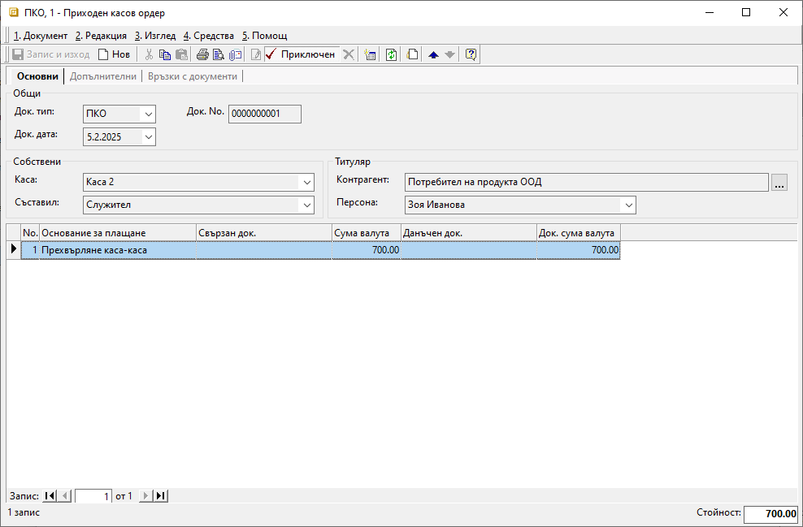

```{only} html
[Нагоре](000-index)
```

# **Трансфер между каси**

- [Въведение](#въведение)  
- [Създаване на документ за трансфер на средства](#създаване-на-документ-за-трансфер-на-средства)  
- [Свързани статии](#свързани-статии)  

## **Въведение**

Всички движенията на парични средства от и в каса трябва да бъдат отразени в системата.  
При паричен трансфер между каси посоката на движение на средствата се определя чрез типа на касовия документ. В касата, която предава средствата и наличността ѝ намалява, се създава **РКО**-*Разходен касов ордер*. Приходът в насрещната каса се отразява чрез въвеждане на **ПКО**-*Приходен касов ордер*.  

При тази операция системата дава възможност за автоматична генерация на свързаните документи. Това осигурява строга връзка между приходния и разходния касов документ. По този начин се намалява рискът от неточности и разминавания в касовите наличности.  

## **Създаване на документ за трансфер на средства**

Процесът по въвеждане на документи за прехвърляне на парични средства между каси е следният:

1) От **Търговска система » Касови документи** чрез десен бутон на мишката върху списъка се избира **Нов документ**. Отваря се празна форма за въвеждане на данни.  

2) В раздел **Основни** се попълват следните реквизити:

- **Док. Тип** – От полето се отваря падащия списък за избор на тип документ.   
Избира се тип **РКО** - *Разходен касов ордер*. С това се регистрира разходът на средства от текущата каса.  

- **Док. No** - Полето може да остане празно. Системата автоматично попълва пореден номер за избраната каса след валидиране на документа.  

- **Док. дата** - В полето трябва да се избере датата, за която се отнася разходът на избраната каса. 

- **Каса** – От полето се избира касата, която предава средствата.  
Списъкът с каси се настройва предварително от **Номенклатури » Референтни номенклатури**.  

- **Съставил** - Реквизитът трябва да се обзаведе с лицето, което въвежда документа.  
Данните в полето се попълват автоматично с настройките за персона на текущия потребител.  

- **Контрагент** – В полето се избира контрагент **Потребител на продукта**. 

{ class=align-center w=15cm }

3) На реда за нов запис в поле **Основание за плащане** се избира настроеното основание за трансфер на средства между каси. Основанията трябва да са предварително дефинирани в **Номенклатури » Референтни номенклатури » Търговска система: Основания за плащане**.  
Избраното основание определя счетоводната операция, която се генерира при приключване на документа. Необходимо е предварително да бъдат направени настроийки за това от **Счетоводство » Автоматичен осчетоводител**.  

   В полета **Сума валута** и **Док. сума валута** се посочва стойността на парични трансфер.  

4) Чрез бутон [**Приключен**] от лентата с инструменти се отваря форма за генерация на свързани документи.   
Системата дава възможност за автоматично създаване на следните документи:  

   - Чрез опция **Прехвърляне на средства между каси** системата ще генерира свързан **ПКО**-*Приходен касов ордер* за избрана каса, приемаща паричните средства;  
   - **Каса** - в полето се избира касата, която приема прехвърлените седства;  
   - **Генериране на Счетоводно записване** е опция за автоматична генерация на свързан счетоводен документ;  
   Когато за тази опция липсва отметка, системата не генерира счетоводен запис към касовия ордер.  
   - **Приключване** - при липса на отметка, системата генерира счетоводния документ в редакция, а при поставена отметка - в състояние *Приключен*;  
   - **OK** - бутонът потвърждава избраните във формата опции;  

{ class=align-center }

5) От раздел **Връзки с документи** могат да бъдат разгледани генерираните свързани документи.  
Приходният касов ордер в приемащата каса е автоматично валидиран. С това наличността на тази каса е увеличена със сумата на паричния трансфер.  

{ class=align-center w=15cm }
 
## **Свързани статии**

[Референтни номенклатури](../../../001-ref/001-nomenclatures/001-ref-nomenclatures.md)  
[Касов документ](001-cashdesk.md)  
[Сметкоплан](../../../001-ref/002-accounting/002-chart-of-acc.md)  
[Автоматичен осчетоводител](../../../001-ref/002-accounting/003-acc-wizard.md)  
   