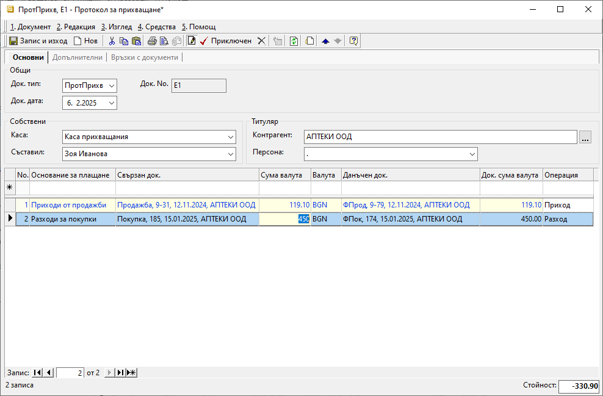

```{only} html
[Нагоре](000-index)
```

# **Прихващания**

- [Въведение](#въведение)  
- [Създаване на нов протокол за прихващане](#създаване-на-нов-протокол-за-прихващане)  
- [Свързани статии](#свързани-статии)  

## **Въведение**

При едновременното наличие на парични вземания и задължения между **Потребител на продукта** и контрагент те могат да се прихванат до размера на по-малкото от тях. Прихващане на остатъците за плащане може да се направи също между продажби и кредитни документи за продажба (покупки и кредитни документи за покупка).  
В системата тези операции се регистрират чрез специален вид касов документ - **ПротПрихв**-*Протокол
за прихващане*.  

## **Създаване на нов протокол за прихващане**

Процесът по създаване на **Протокол за прихващане** е следният:  

1) От **Търговска система || Касови документи** чрез десен бутон на мишката върху списъка с документи се избира **Нов документ**. Отваря се празна форма за въвеждане на данни.   

2) В раздел **Основни** се попълват реквизити:  

 - **Док. тип** – В полето се отваря падащ списък за избор на тип документ. Посочва се **ПротПрихв**-*Протокол за прихващане*.  

 - **Док. дата** – От полето се въвежда дата, за която се отнася прихващането.  

 - **Док. No** - Полето  може да бъде оставено празно. След валидиране на документа системата ще попълни пореден номер на документа за текущата каса.  

 - **Каса** – Чрез този реквизит се указва текуща каса за прихващането. Може да се направи предварителна настройка с отделна каса за прихващания от [**Номенклатури || Референтни номенклатури**](https://docs.unicontsoft.com/guide/erp/001-ref/001-nomenclatures/001-ref-nomenclatures.html).  

 - **Съставил** -  Избира се лице, което съставя документа. Списъкът със служители трябва да бъде предварително настроен.  
 Данните в полето се попълват автоматично с настройките на текущия потребител.  

 - **Контрагент** – В полето се отваря форма за избор от списък **Контрагенти**.   

{ class=align-center w=15cm } 

3) На реда за добавяне на нов запис  в поле **Основание за плащане** се избира предназначение на плащането. Примерни основания: при покупки - *Разходи за покупки* и за продажби – *Приходи от продажби*.  
Основанията трябва да са предварително дефинирани в **Номенклатури || Референтни номенклатури || Търговска система: Основания за плащане**.  

В полето **Свързан док** се отваря форма за избор на вътрешнофирмени **Документи за покупка и продажба**. От списъка се маркират записите, за които се извършва прихващане на остатъци за плащане. За да се попълнят автоматично и свързаните с тях данъчни документи, се използва бутон **[Напред]**.  
По този начин се закриват остатъците за плащане по вътрешнофирмените и по данъчните документи.   

От полето **Данъчен док.** се отваря форма за избор **Данъчни документи за покупка и продажба**.  
Полето се попълва автоматично, ако преди това е изпълнена стъпката с обзавеждане на **Свързан док.**.  

Полета **Сума валута** и **Док. сума валута** се обзавеждат автоматично с остатъците за плащане по свързаните документи. Избрани полета трябва да се редактират, за да се изпълни условието прихващането по вземания и задължения да е до размера на по-малкото от тях.  

> Сумата в тоталите на **ПротПрих** в поле **Стойност** винаги трябва да е равна на 0 (нула).   

4) Чрез бутон [**Приключен**] от лентата с инструменти документът се валидира. Отваря се форма за генерация на **Свързани документи**. Системата дава възможност за автоматично създаване на счетоводно записване.  
 
    - **Генериране на Счетоводно записване** - опция за автоматична генерация на свързан счетоводен документ;  
    Когато за тази опция липсва отметка, системата не генерира счетоводен запис към касовия документ.  
    - **Приключване** - при липса на отметка, системата генерира счетоводния документ в редакция, а при поставена отметка - в състояние *Приключен*;  
    - **OK** - бутонът потвърждава избраните във формата опции;   
    
## **Свързани статии**

[Създаване на касов документ](001-cashdesk.md)  
[Как да създадем Протокол за прихващане](https://www.unicontsoft.com/cms/node/35)  