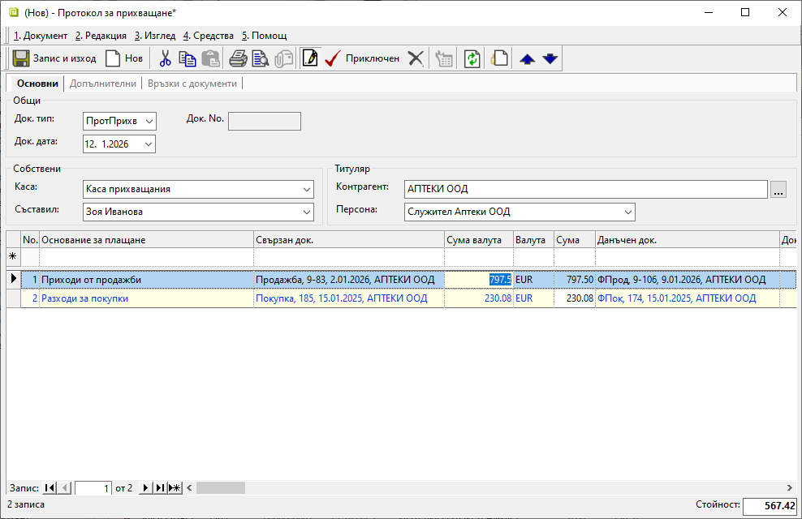

```{only} html
[Нагоре](000-index)
```

# **Прихващания**

- [Въведение](#въведение)  
- [Създаване на нов протокол за прихващане](#нов-протокол-за-прихващане)  
- [Свързани статии](#свързани-статии)  

## **Въведение**

В някои ситуации за един контрагент може да има неплатени остатъци едновременно като вземане и задължение. Те могат да бъдат прихванати до размера на по-малкото от двете.  
В системата тези операции се регистрират чрез отделен вид касов документ - **ПротПрихв**-*Протокол за прихващане*.  

Прихващане на неплатени остатъци може да се направи между следните документи:  
   - Продажби и покупки
   - Продажби и кредитни документи за продажба  
   - Покупки и кредитни документи за покупка  

## **Нов протокол за прихващане** 

**1. Създаване** 

От **Търговска система » Касови документи** с десен клик върху списъка със записи се избира **Нов документ**. Отваря се празна форма за въвеждане на данни.   

**2. Попълване на реквизити** 

В раздел **Основни** се попълват реквизити:  

 - **Док. тип** – В полето се отваря падащ списък с настроените типове касови документи. Избира се **ПротПрихв**-*Протокол за прихващане*.  

 - **Док. дата** – Полето се попълва с дата, за която се отнася прихващането.  

 - **Док. No** - Полето може да бъде оставено празно и с приключване на документа системата да попълни пореден номер.  

 - **Каса** – Чрез този реквизит се указва каса за прихващането.  
 Предварително от [**Номенклатури » Референтни номенклатури**](../../../001-ref/001-nomenclatures/001-ref-nomenclatures.md) може да се настрои отделна каса за прихващания.  

 - **Съставил** - В полето се попълва служител, който съставя документа. Списъкът с персони трябва да бъде предварително настроен в контрагент **Потребител на продукта**.  
 Данните в полето се попълват автоматично с настройките на текущия потребител.  

 - **Контрагент** – В полето се отваря форма за избор от списък **Контрагенти**.   

{ class=align-center w=15cm } 

На реда за добавяне на нов запис  в поле **Основание за плащане** се избира предназначение на плащането. Примерни основания: при покупки - *Разходи за покупки* и за продажби – *Приходи от продажби*.  
Основанията трябва да са предварително дефинирани в **Номенклатури » Референтни номенклатури » Търговска система: Основания за плащане**.  

В полето **Свързан док** се отваря форма за избор на вътрешнофирмени **Документи за покупка и продажба**. От списъка се маркират записите, за които се извършва прихващане на остатъци за плащане. За да се попълнят автоматично и свързаните с тях данъчни документи, се използва бутон **[Напред]**.  
По този начин се закриват остатъците за плащане по вътрешнофирмените и по данъчните документи.   

От полето **Данъчен док.** се отваря форма за избор **Данъчни документи за покупка и продажба**.  
Полето се попълва автоматично, ако преди това е изпълнена стъпката с обзавеждане на **Свързан док.**.  

Полета **Сума валута** и **Док. сума валута** се обзавеждат автоматично с остатъците за плащане по свързаните документи. Избрани полета трябва да се редактират, за да се изпълни условието прихващането по вземания и задължения да е до размера на по-малкото от тях.  

> Сумата в тоталите на **ПротПрих** в поле **Стойност** винаги трябва да е равна на 0 (нула).   

**3. Приключване**

Документът се валидира чрез бутон [**Приключен**] в лентата с инструменти. Отваря се форма за генерация на **Свързани документи**.   
 
- **Генериране на Счетоводно записване** - опция за автоматична генерация на свързан счетоводен документ;  
    Когато за тази опция липсва отметка, системата не генерира счетоводен запис към касовия документ.  
    - **Приключване** - при липса на отметка, системата генерира счетоводния документ в редакция, а при поставена отметка - в състояние *Приключен*;  
- **OK** - бутонът потвърждава избраните във формата опции;   
    
## **Свързани статии**

[Референтни номенклатури](../../../001-ref/001-nomenclatures/001-ref-nomenclatures.md)  
[Касов документ](001-cashdesk.md)  
[Сметкоплан](../../../001-ref/002-accounting/002-chart-of-acc.md)  
[Автоматичен осчетоводител](../../../001-ref/002-accounting/003-acc-wizard.md)  