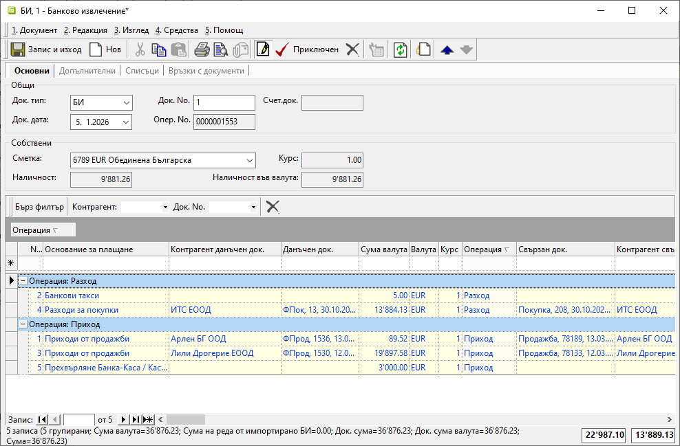
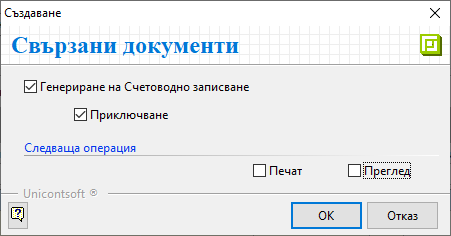

```{only} html
[Нагоре](000-index)
```

# **Банкови документи**

- [Въведение](#въведение)  
- [Създаване на нов банков документ](#нов-банков-документ)  
- [Реквизити](#реквизити)  
- [Свързани статии](#свързани-статии)  

## **Въведение**

Всяка банкова операция трябва да бъде регистрирана в системата. Това гарантира съответствие между фактическите наличности по банкови сметки и данните в системата.  

Въвеждането може да бъде направено ръчно или чрез [импорт](../../../005-how-to/001-bank-statement-import.md) на данните при наличен файл с извлечение от банката.  

## **Нов банков документ**

**1. Създаване** 

Процесът по ръчно въвеждане на банков документ започва със създаване на запис в **Търговска система » Банкови документи**. Чрез десен клик върху списъка се избира **Нов документ**. Отваря се празна форма за въвеждане на данни **Банково извлечение**.  

**2. Попълване на реквизити**  

В раздел **Основни** се попълват реквизити:  

- **Док. Тип** – От списъка в полето се избира типът на текущо въвеждания документ. Стандартният банков документ е **БИ**-*Банково извлечение*.  

- **Док. No** - В полето се въвежда номер на банковото извлечение. Ако остане празно, системата не попълва автоматичен номер на документа при приключване на извлечението.  

- **Док. дата** - Указва датата, за която се отнасят движенията по текущата банкова сметка.  

- **Банкова сметка** - От падащия списък в полето се избира банкова сметка, за която се отнасят трансакциите.  
Списък със сметки се настройва предварително в **Потребител на продукта**.  

> Останалите полета в секция **Общи** се попълват автоматично с данни за избраната банкова сметка.  

{ class=align-center w=15cm }

На реда за нов запис от поле **Основание за плащане** се избира предназначение на плащането.  
Списъкът с основания се дефинира предварително в **Номенклатури » Референтни номенклатури » Търговска система: Основания за плащане**.  

> Избраното основание определя автоматичната счетоводната операция при приключване на документа.  

В поле **Контрагент данъчен док.** се избира контрагент, свързан с плащането на реда. Полето се обзавежда автоматично, ако на реда вече са избрани свързани документи.   

От **Данъчен док.** се отваря форма за избор **Данъчни документи за покупка и продажба**. В списъка могат да бъдат маркирани един или множество записи с покупки и/или продажби.  
За да се попълнят автоматично и свързаните с тях вътрешнофирмени документи, се използва бутон [**Напред**]. По този начин едновременно ще се закрият неплатените остатъци по вътрешнофирмени и по данъчни документи.   

Полета **Сума валута** и **Док. сума валута** се попълват със сума, отговаряща на извършеното плащане.  
Те се обзавеждат автоматично след избор на свързани документи. Сумите  могат да се редактират при частично плащане.   

Поле **Валута** се обзавежда автоматично с настройката на избраната банкова сметка.  

От **Свързан док.** се отваря форма за избор **Документи за покупка и продажба**. Полето се попълва автоматично, ако преди това е изпълнена стъпката с обзавеждане на **Данъчен док.**.  

В поле **Контрагент свързан док.** се отваря форма за избор на **Контрагенти**. Полето се обзавежда автоматично, ако преди това са избрани свързани документи на реда.  

От поле **Операция** се указва дали трансакцията на реда е **Приход** или **Разход** в избраната банкова сметка.  

> Системата допуска приключване на банково извлечение без попълване на свързани данъчни и вътрешнофирмени документи.  

**3. Приключване**

Чрез бутон [**Приключен**] от лентата с инструменти банковото извлечение се валидира. Тук системата дава възможност за генериране на счетоводно записване.  

> За да се генерира коректен счетоводен запис, [**Автоматичен осчетоводител**](../../../001-ref/002-accounting/003-acc-wizard.md) трябва да е предварително настроен.  

- **Генериране на Счетоводно записване** - Опцията указва автоматична генерация на свързан счетоводен запис.  
Когато липсва отметка, системата не осчетоводява банковото извлечение.  
   - **Приключване** - Чрез отметка се указва генериране на счетоводния документ с автоматично приключване.  
   Ако полето остане празно, счетоводният запис се генерира в състояние на редакция.    

- **Печат** или **Преглед** - Отваря се форма за избор на шаблон.  
При избрана опция **Печат** документът се разпечатва директно с избрания шаблон. При опция **Преглед** документът се отваря на екран преди отпечатване.   

- **OK** - Бутонът потвърждава маркираните опции.  
Системата генерира свързани документи и валидира банковото извлечение.  

{ class=align-center }

Свързаният счетоводен документ може да се види от раздел **Връзки с документи**.  

## **Реквизити**

1) В раздел **Основни**:  
   - **Док. Тип** – отваря падащ списък за избор на тип документ;  
   Системата прилага дефинирания в **Администрация » Настройки** тип на документ по подразбиране.   
   - **Док. No** - в полето се попълва номер на документа;  
   Ако полето остане празно, системата не попълва пореден номер при приключване на документа.  
   - **Счет. док.** - полето се обзавежда с номер на свързания валидиран счетоводен документ;  
   - **Док. дата** - указва дата за документа;  
   По подразбиране в нов документ системата предлага текуща дата.  
   - **Опер. No.** - полето се обзавежда с пореден номер на операцията след валидиране на документа;  
   - **Сметка** - отваря списък за избор на банкова сметка, за която се отнася текущото извлечение;  
   - **Курс** - показва курс на наличността във валута;  
   - **Наличност** - показва начално салдо в местна валута за дата на документа;  
   - **Наличност във валута** - показва начално салдо за дата на документа във валута на банковата сметка;  

   От реда за нов запис се обзавежда списък със следните колони:  
   - **Поверителност** - дава информация за активирани *Поверителност на цени* и/или *Поверителност на документ*;  
   - **No.** - пореден номер на запис по реда на въвеждане;  
   - **Основание за плащане** - отваря падащ списък с настроените основания за плащане в **Номенклатури » Референтни номенклатури**;  
   - **Контрагент данъчен док.** - отваря форма за избор от списък **Контрагенти**;  
   Полето се попълва с контрагента, свързан с данъчния документ на реда.  
   - **Данъчен док.** - отваря форма със списък данъчни документи за покупка и продажба;  
   - **Сума валута** - в полето се попълва сума на плащането в избраната валута;  
   - **Валута** - падащ списък за избор на валута;  
   - **Курс** - указва курс за избраната валута;  
   - **Операция** - указва вид (посока) на плащането - приход или разход;  
   - **Допълнителен текст** - въвеждане на описание за плащане на реда, което може да се показва при печат;  
   - **Свързан док.** - отваря форма за избор от списък вътрешнофирмени документи за покупка и продажба;  
   - **Контрагент свързан док.** - отваря форма за избор от списък **Контрагенти**;  
   Попълва се с контрагента, свързан с вътрешнофирмения документ на реда.  
   - **Док. валута** - показва валута от свързан документ на реда;  
   - **Контрагент от импортирано БИ** - попълва се наименование на контрагент при импорт на файл с БИ;  
   - **Сума на реда от импортирано БИ** - полето се обзавежда със сума на плащането от импортирания файл;  
   - **Банкова референция от импортирано БИ** - показва код на банковата референция от импортирания файл;  
   - **Док. курс** - полето се попълва с валутен курс от свързан документ на реда;  
   - **Док. сума** - полето се обзавежда със сума на остатък за плащане в местна валута;  
   - **Док. сума валута** - полето се попълва с остатък за плащане от свързан документ на реда;  
   - **Сума** - сума на плащането в местна валута;  
   Полето се обзавежда автоматично в резултат на въведените стойности в полета **Курс** и **Сума валута**; 
   - **Курсова разлика** - полето се обзавежда автоматично при наличие на разлика между **Сума** и **Док. сума**;  
   - **Счетоводен признак** - отваря форма за избор от списък **Счетоводни признаци**;  
   - **Забележка от импортирано БИ** - полето се обзавежда с основание на превода от импортирания файл;  
   - **IBAN на контрагент от импортирано БИ** - показва IBAN на контрагента, свързан с плащането на реда;  
   - **Забележка** - поле за въвеждане на свободен текст с уточнение към плащането на ред;  
   - **Операция от импортирано БИ** - полето се попълва с вид на операцията на реда;  
   - **Потребител създаване** - информация за потребител, добавил текущия ред в документа;  
   - **Дата създаване** - дата и час на добавяне на текущия ред;  
   - **Потребител последна модификация** - потребителско име на направилия последните корекции в данните на реда;  
   - **Дата последна модификация** - информация за дата и час, когато са направени последните изменения в данните на текущия ред;  

2) В раздел **Допълнителни**:  
   Реквизити: Допълнителни  
   От поле **Забележка** вдясно може да бъде въведен свободен текст с уточнения към документа.  

3) В раздел **Списъци**:  
   Реквизити: Списъци  
   От списъка вдясно е достъпна информация за всички свързани счетоводни записвания.  

4) В раздел **Връзки с документи**:  
   Този раздел не съдържа реквизити за настройка. В него системата осигурява пряк път до свързани документи. От тук те могат да бъдат отворени за преглед и редакция.  

## **Свързани статии**

[Контрагенти](../../../001-ref/001-nomenclatures/002-contragents.md)  
[Автоматичен осчетоводител](../../../001-ref/002-accounting/003-acc-wizard.md)  
[Как да импортираме банкови извлечения](../../../005-how-to/001-bank-statement-import.md)  
