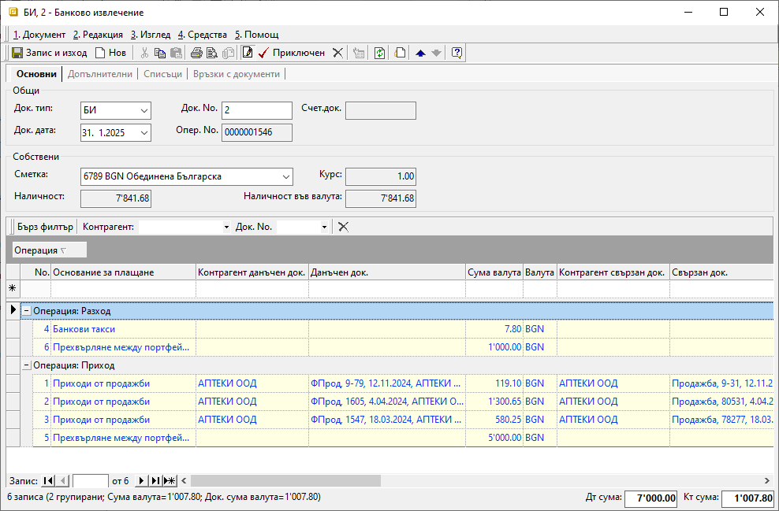

```{only} html
[Нагоре](000-index)
```

# **Банкови документи**

- [Въведение](#въведение)  
- [Създаване на банков документ](#създаване-на-банков-документ)  
- [Реквизити](#реквизити)  
- [Свързани статии](#свързани-статии)  

## **Въведение**

Движенията по банкови сметки се регистрират в системата чрез въвеждане на банкови документи. Системата позволява както ръчно въвеждане на банковите извлечения, така и [импорт](https://docs.unicontsoft.com/guide/erp/005-how-to/001-bank-statement-import.html) на данните. Импортът е възможен, когато има наличен файл с извлечение от банката.  

Извлеченията се въвеждат с отделни записи за всяка една банкова сметка. Сметките трябва да бъдат настроени предварително в **Потребител на продукта** от [**Номенклатури || Контрагенти**](https://docs.unicontsoft.com/guide/erp/001-ref/001-nomenclatures/002-contragents.html). 

## **Създаване на банков документ**

Процесът по ръчно въвеждане на банков документ е следният:

1) От **Търговска система || Банкови документи** чрез десен бутон на мишката върху списъка се избира **Нов документ**. Отваря се празна форма за въвеждане на данни **Банково извлечение**.  

2)  В раздел **Основни** се попълват реквизити:

- **Док. No** - В полето се попълва номер на банковото извлечение. Ако полето се остави празно, системата не попълва автоматичен номер на документа при приключване на извлечението.  

- В поле **Док. дата** се избира датата, за която се отнасят движенията по текущата банкова сметка.  

- **Банкова сметка** - От падащото меню в полето се избира банковата сметка, за която се отнасят плащанията. Банкови сметки се настройват предварително в **Потребител на продукта**.  

> Останалите полета в секция **Общи** се попълват автоматично от системата.  

{ class=align-center w=15cm }

3) На реда за добавяне на нов запис в поле **Основание за плащане** се отваря падащ списък за избор на предназначение на плащането. Основанията трябва да са предварително дефинирани в **Номенклатури || Референтни номенклатури || Търговска система: Основания за плащане**.  
Избраното основание определя счетоводната операция, която се генерира при приключване на документа. Необходимо е предварително да бъдат направени настроийки за това от [**Счетоводство || Автоматичен осчетоводител**](https://docs.unicontsoft.com/guide/erp/001-ref/002-accounting/002-acc-wizard.html).  

В поле **Контрагент данъчен док.** се избира контрагент, свързан с плащането на реда. Полето се обзавежда автоматично, ако преди това са избрани свързани документи на реда.   

От **Данъчен док.** се отваря форма за избор **Данъчни документи за покупка и продажба**. В списъка с данъчни документи могат да се маркират един или множество записи с покупки и/или продажби. За да се попълнят автоматично и свързаните с тях вътрешнофирмени документи, се използва бутон **[Напред]**.  
По този начин ще се закрият остатъците за плащане по вътрешнофирмения и по данъчния документ.   

Полета **Сума валута** и **Док. сума валута** се попълват със сума, отговаряща на извършеното плащане. Те се обзавеждат автоматично след избор на свързани документи. При частично плащане сумите трябва да се редактират, така че да съответстват на реалното плащане.   

В поле **Валута** се отваря падащ списък с предварително настроените валути от **Референтни номенклатури**. Полето се обзавежда автоматично след избор на свързани документи.  

От **Свързан док.** се отваря форма за избор **Документи за покупка и продажба**. Полето се попълва автоматично, ако преди това е изпълнена стъпката с обзавеждане на **Данъчен док.**.  

В поле **Контрагент свързан док.** се отваря форма за избор на **Контрагенти**. Полето се обзавежда автоматично, ако преди това са избрани свързани документи на реда.  

Данните в поле **Операция** указват дали операцията на реда е **Приход** или **Разход**.  

> Системата допуска приключване на банково извлечение и без цитиране на свързани данъчни и вътрешнофирмени документи.  

4) Чрез бутон **Приключен** от лентата с инструменти банковото извлечение се валидира. Тук системата дава възможност за генериране на счетоводно записване.  
 
    - **Генериране на Счетоводно записване** - опция за автоматична генерация на свързан счетоводен документ;  
    Когато за тази опция липсва отметка, системата не генерира счетоводен запис за банковото извлечение.  
    - **Приключване** - ако липсва отметка за тази опция, системата генерира счетоводния документ в редакция, а при поставена отметка - в състояние *Приключен*;  
    - **OK** - бутон, с който се потвърждават избраните във формата опции;  

{ class=align-center }

За да се генерира коректен счетоводен запис, [**Автоматичен счетоводител**](https://docs.unicontsoft.com/guide/erp/001-ref/002-accounting/002-acc-wizard.html) трябва да е предварително настроен. Свързаният счетоводен документ може да се види от раздел **Връзки с документи**.  

## **Реквизити**

1) В раздел **Основни**:  
   - **Док. Тип** – поле за избор на тип документ;  
   Системата прилага дефинирания от **Администрация || Настройки** тип на документ по подразбиране.   
   - **Док. No** - в полето се попълва номер на документа;  
   Ако полето остане празно, системата автоматично попълва пореден номер при приключване на документа.  
   - **Счет. док.** - полето се обзавежда с номер на свързания валидиран счетоводен документ;  
   - **Док. дата** - в полето се избира дата за документа;  
   По подразбиране в нов документ системата предлага текуща дата.  
   - **Опер. No.** - полето се обзавежда с пореден номер на операцията след валидиране на документа;  
   - **Сметка** - избира се банкова сметка, за която се въвежда текущото извлечение;  
   - **Курс** - в полето се визуализира курс на наличността във валута;  
   - **Наличност** - полето дава информация за текуща наличност в местна валута на избраната банкова сметка;  
   - **Наличност във валута** - полето дава информация за текуща наличност във валута за избраната банкова сметка;  

   От реда за нов запис се обзавежда списък, който съдържа колони:  
   - **Поверителност** - дава информация за активирани *Поверителност на цени* и/или *Поверителност на документ*;  
   - **No.** - пореден номер на запис по реда на въвеждане;  
   - **Основание за плащане** - отваря падащ списък с настроените основания за плащане в **Номенклатури || Референтни номенклатури**;  
   - **Контрагент данъчен док.** - полето се попълва с контрагента, свързан с данъчния документ на реда;  
   - **Данъчен док.** - отваря форма със списък данъчни документи за покупка и продажба;  
   - **Сума валута** - в полето се попълва сума на плащането в избраната валута;  
   - **Валута** - падащ списък за избор на валута;  
   - **Курс** - указва курс за избраната валута;  
   - **Операция** - полето дава информация за вид (посока) на плащането - приход или разход;  
   - **Допълнителен текст** - въвеждане на описание за плащане на реда, което може да се показва при печат;  
   - **Свързан док.** - отваря форма със списък вътрешнофирмени документи за покупка и продажба;  
   - **Контрагент свързан док.** - полето се попълва с контрагента, свързан с вътрешнофирмения документ на реда;  
   - **Док. валута** - полето се попълва с валута от свързани документи на реда;  
   - **Контрагент от импортирано БИ** - съдържа наименование на контрагента от импортирания файл;  
   - **Сума на реда от импортирано БИ** - полето се обзавежда със сума на плащането от импортирания файл;  
   - **Банкова референция от импортирано БИ** - полето се обзавежда с код на банковата референция от импортирания файл;  
   - **Док. курс** - полето се попълва с валутен курс от свързан документ на реда;  
   - **Док. сума** - полето се обзавежда със сума на остатък за плащане в местна валута;  
   - **Док. сума валута** - полето се попълва с остатък за плащане от свързан документ на реда; 
   - **Сума** - сума на плащането в местна валута;  
   Полето се обзавежда автоматично в резултат на въведените стойности в полета **Курс** и **Сума валута**; 
   - **Курсова разлика** - полето се обзавежда автоматично при наличие на разлика между **Сума** и **Док. сума**;  
   - **Счетоводен признак** - отврая форма за избор със списък **Счетоводни признаци**;  
   - **Забележка от импортирано БИ** - полето се обзавежда с основание на превода от импортирания файл;  
   - **IBAN на контрагент от импортирано БИ** - полето се попълва с IBAN на контрагента, свързан с плащането на реда;  
   - **Забележка** - полето позволява въвеждане на свободен текст с уточнение за плащане на ред;  
   - **Операция от импортирано БИ** - полето се попълва с вид на операцията на реда;  
   - **Потребител създаване** - информация за потребител, добавил текущия ред в документа;  
   - **Дата създаване** - дата и час на добавяне на текущия ред;  
   - **Потребител последна модификация** - потребителско име на направилия последните корекции в данните на реда;  
   - **Дата последна модификация** - информация за дата и час, когато са направени последните изменения в данните на текущия ред;  

2) В раздел **Допълнителни**:  
   Реквизити: Допълнителни  
   В поле **Забележка** вдясно може да бъде въведен свободен текст с уточнения по документа.  

3) В раздел **Списъци**:  
   Реквизити: Списъци  
   От списъка вдясно е достъпна информация за всички свързани счетоводни записвания.  

4) В раздел **Връзки с документи**:  
   Този раздел не съдържа реквизити за настройка. В него системата осигурява пряк път до свързани документи. От тук те могат да бъдат отворени и редактирани.  

## **Свързани статии**

- [Как да въведем банкови сметки на контрагент](https://www.unicontsoft.com/cms/node/143)  
- [Как да въведем Начално салдо на банкова сметка](https://www.unicontsoft.com/cms/node/178)  
- [Как да въведем Банково извлечение](https://www.unicontsoft.com/cms/node/38)  
- [Как да въведем Групово плащане](https://www.unicontsoft.com/cms/node/139)  
- [Как да импортираме банкови извлечения](../../../005-how-to/001-bank-statement-import.md)  
- [Как да импортираме документи по опис](https://www.unicontsoft.com/cms/node/255)  