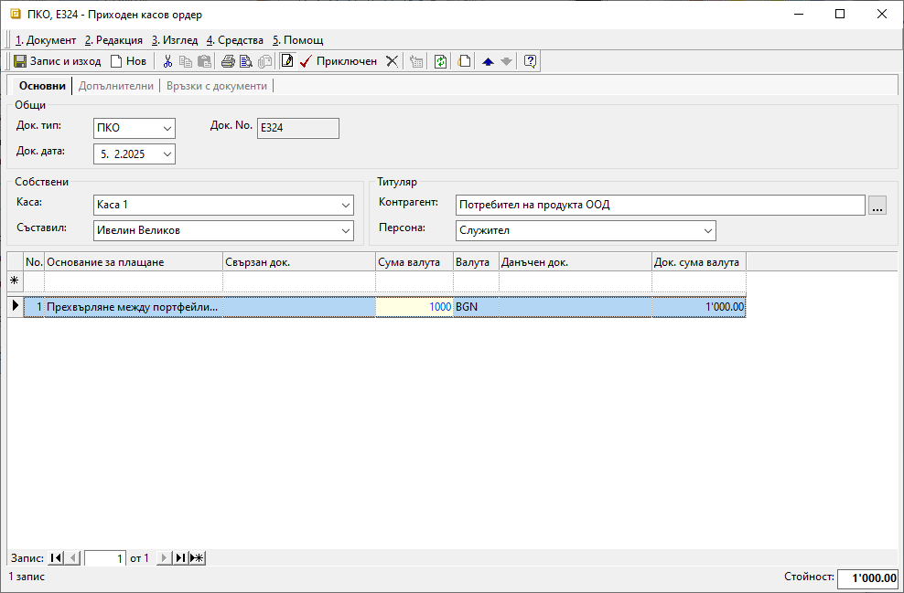

```{only} html
[Нагоре](000-index)
```

# **Трансфер банка-каса**

- [Въведение](#въведение)  
- [Прехвърляне на средства между банка и каса](#прехвърляне-на-средства-между-банка-и-каса)  
- [Свързани статии](#свързани-статии)

## **Въведение**

Трансферът на парични средства между банка и каса може да бъде двупосочен. Всеки приход или разход на средства трябва да се отрази в системата със съответния касов или банков документ.    

Внасянето и тегленето на пари от банковите сметки се регистрира чрез въвеждане на банкови извлечения. В тези документи посоката на движение на средствата се определя от тип на операцията - **Приход** или **Разход**.  

Прехвърлянето на средства от/в каса се регистрира в системата от **Касови документи**. Приходът в касата се отразява чрез въвеждане на **ПКО**-*Приходен касов ордер*. Когато се въвежда разход на средства от касата, се създава **РКО**-*Разходен касов ордер*.  

## **Прехвърляне на средства между банка и каса**

Процесът по прехвърляне на парични средства включва регистриране на следните документи:

1) От меню **Търговска система » Банкови документи** се създава нов документ. Отваря се празна форма за въвеждане на данни **Банково извлечение**. След избор на банкова сметка се въвежда операцията по прехвърляне на паричните средства.  

2) В раздел **Основни** се попълват реквизити:

- **Док. No** - в полето се попълва номер на банковото извлечение;  
Ако полето е празно, системата не попълва пореден номер на документа при приключване на извлечението.  

- **Док. дата** - в полето се избира датата, за която се отнасят движенията по текуща банкова сметка;  

- **Банкова сметка** - от падащото меню в полето се избира банковата сметка, за която се отнася операцията;   
Банковите сметки се настройват предварително в **Потребител на продукта**.  

> Останалите полета в секция **Общи** се попълват автоматично от системата.  

3) На реда за добавяне на нов запис в поле **Основание за плащане** се избира основанието, настроено за трансфер на средства. Основания за плащане се дефинират предварително от **Номенклатури » Референти номенклатури » Търговска система: Основания за плащане**. 

Полетата **Контрагент данъчен док.** и **Контрагент свързан док.** се попълват с контрагента, настроен като **Потребител на продукта**.    

В полета **Сума валута** и **Док. сума валута** се въвежда сумата, която се прехвърля в/от банковата сметка.  

Чрез поле **Операция** се указва посоката на движение на парични средства. Използва се *Разход* при прехвърляте на пари от банковата сметка към каса. *Приход* се избира при получаване на средства от каса в текущата банкова сметка.  

{ class=align-center w=15cm }

4) Чрез бутон **Приключен** от лентата с инструменти документът се валидира. Отваря се форма за генерация на свързани документи. Системата дава възможност за автоматично създаване на счетоводно записване.  
 
    - **Генериране на Счетоводно записване** - опция за автоматична генерация на свързан счетоводен документ;  
    Когато за тази опция липсва отметка, системата не генерира счетоводен запис за банковото извлечение.  
    - **Приключване** - ако липсва отметка за тази опция, системата генерира счетоводния документ в редакция, а при поставена отметка - в състояние *Приключен*;  
    - **OK** - бутонът потвърждава избраните във формата опции;   

> За да се генерира коректен счетоводен запис, трябва предварително да има настройки на транзитна сметка в [**Сметкоплан**](https://docs.unicontsoft.com/guide/erp/001-ref/002-accounting/002-chart-of-acc.html) и в [**Автоматичен счетоводител**](https://docs.unicontsoft.com/guide/erp/001-ref/002-accounting/003-acc-wizard.html).  


5) В меню **Търговска система » Касови документи** чрез десен бутон на мишката се създава **Нов документ**. Системата отваря празна форма за въвеждане на данни.   

6) В раздел **Основни** от формата се попълват реквизити:   

- **Док. Тип** – поле с падащ списък, от който се избира тип на документа;  
Избира се **ПКО** - *Приходен касов ордер*, когато средствата постъпват в касата.  
Тип **РКО** - *Разходен касов ордер* се избира, когато средствата излизат от касата и се прехвърлят в банкова сметка.  

- **Док. No** - полето се попълва с номер на документа;  
Системата автоматично попълва пореден номер за избраната каса при приключване на документа.    

- **Док. дата** - в полето се избира дата, за която се отнася приходът/разходът на избраната каса; 

- **Каса** – поле с падащ списък, от който се избира каса;  
Списъкът с каси се настройва предварително от **Номенклатури » Референтни номенклатури**.  

- **Съставил** - в полето се отваря падащ списък за избор от предварително настроените служители;  
Данните в полето се попълват автоматично с настройките на текущия потребител.  

- **Контрагент** – в полето се избира контрагентът, настроен като **Потребител на продукта**;

7) На реда за добавяне на нов запис се избира **Основание за плащане**. В полето се избира основанието, настроено за трансфер на средства.   

В полета **Сума валута** и **Док. сума валута** се въвежда сума на прихода/разхода на текущата каса.  

{ class=align-center w=15cm }

8) Чрез бутон **Приключен** от лентата с инструменти касовият документ се валидира. Отваря се форма за генерация на свързани документи. Системата дава възможност за автоматично създаване на счетоводно записване.  
 
    - **Генериране на Счетоводно записване** - опция за автоматична генерация на свързан счетоводен документ;  
    Когато за тази опция липсва отметка, системата не генерира счетоводен запис към касовия ордер.  
    - **Приключване** - при липса на отметка, системата генерира счетоводния документ в редакция, а при поставена отметка - в състояние *Приключен*;  
    - **OK** - бутонът потвърждава избраните във формата опции;   

> За да се генерира коректен счетоводен запис, трябва предварително да има настройки на транзитна сметка в **Сметкоплан** и в **Автоматичен счетоводител**.  
 
## **Свързани статии**

[Как да въведем Банково извлечение](004-bank.md)  
[Как да въведем Касов ордер](001-cashdesk.md)  
[Как да настроим Сметкоплан](../../../001-ref/002-accounting/002-chart-of-acc.md)  
[Как да настроим Автоматичен осчетоводител](../../../001-ref/002-accounting/003-acc-wizard.md)  