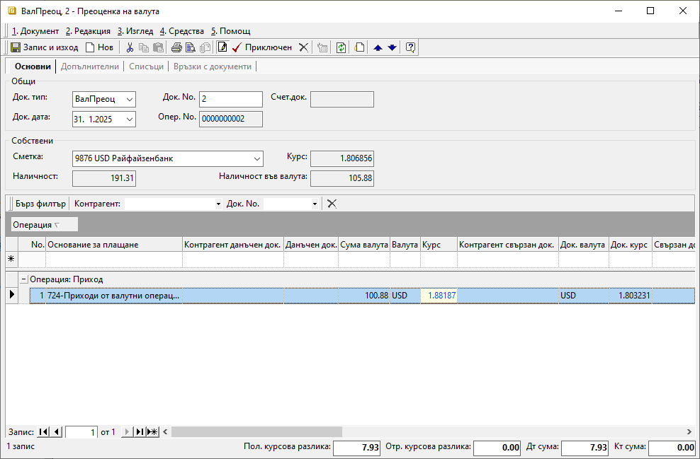
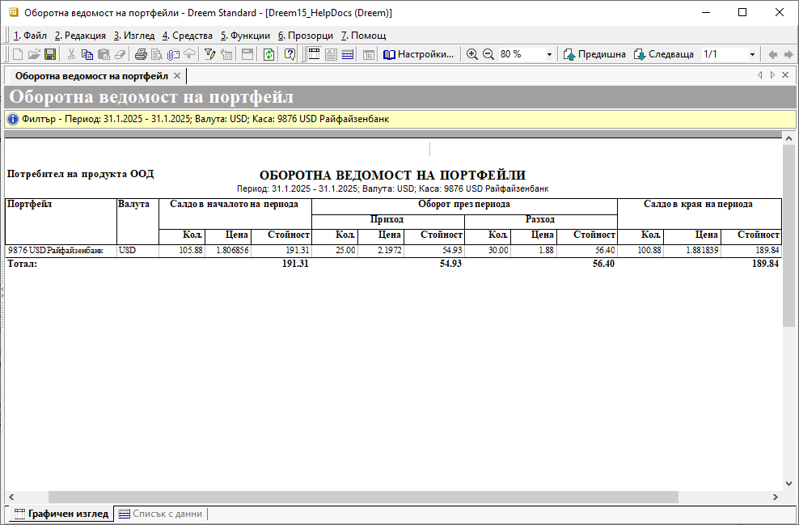

```{only} html
[Нагоре](000-index)
```

# Валутна преоценка

- [Въведение](https://docs.unicontsoft.com/guide/erp/002-docs/002-trade-system/003-payments/006-exchange-differences.html#id2)  
- [Създаване на банков документ за валутна преоценка](https://docs.unicontsoft.com/guide/erp/002-docs/002-trade-system/003-payments/006-exchange-differences.html#id3)  
- [Свързани статии](https://docs.unicontsoft.com/guide/erp/002-docs/002-trade-system/003-payments/006-exchange-differences.html#id4)  

## **Въведение**

Преоценката на валутни наличности в края на избран период (месец, тримесечие, година или др.) може да бъде направена от **Търговска система || Банкови документи**. За целта в системата има създаден отделен тип документ **ВалПреоц**-*Преоценка на валута*.  

> Преди да се създаде документ за валутна преоценка, е необходимо всички предходни банкови извлечения да бъдат въведени.  

## **Създаване на банков документ за валутна преоценка**

Процесът по въвеждане на банков документ за валутна преоценка е следният:

1) В справка **Оборотна ведомост на портфейли** се проверяват количество валута и цена на крайното салдо в избрания ден за преоценка.   

{ class=align-center w=15cm }

2) От **Търговска система || Банкови документи** чрез десен бутон на мишката върху списъка се избира **Нов документ**. Отваря се празна форма за въвеждане на данни.  

3) В раздел **Основни** на формата се попълват следните реквизити:  

- **Док. тип** - от падащия списък в полето се избира документ **ВалПреоц**-*Преоценка на валута*.  

- **Док. No** - в полето се попълва номер на документа;  
Ако полето остане празно, системата не попълва пореден номер на документа при приключване на извлечението.  

- **Док. дата** - в полето се избира дата на преоценката - например последен ден от месеца, тримесечието, годината или друго;  

- **Банкова сметка** - от падащия списък се избира валутната банковата сметка, за която се отнася текущата преоценка;   
Банкови сметки се настройват предварително в **Потребител на продукта**.  

> Останалите полета в секцията - **Курс**, **Наличност** и **Наличност във валута** се попълват автоматично от системата.  
> Данните в тях не се използват за целите на текущата валутна преоценка.   

{ class=align-center w=15cm }

4) На реда за добавяне на нов запис в поле **Основание за плащане** се избира основанието, настроено за преоценка на валута.  
Основанията трябва да са предварително дефинирани в **Номенклатури || Референтни номенклатури || Търговска система: Основания за плащане**. Избраното основание определя счетоводната операция, която се генерира при приключване на документа. Необходимо е предварително да бъдат направени настроийки за това от [**Счетоводство || Автоматичен осчетоводител**](https://docs.unicontsoft.com/guide/erp/001-ref/002-accounting/002-acc-wizard.html).  

В поле **Сума валута** се попълва наличност валута, отговаряща на крайното салдо за деня на преоценка. Данните се вземат от **Оборотна ведомост на портфейли**, колона *Салдо в края на периода || Кол.*.  

От полета **Валута** и **Док. валута** се избира валутата на текущата банкова сметка.    

В поле **Курс** се попълва валутен курс по фиксинга на БНБ за датата на текущия документ. Към този курс се приравнява наличността на избраната банкова сметка.    

В **Док. курс** се въвежда курс, отговарящ на данните от **Оборотна ведомост на портфейли**, колона *Цена*.  

5) Чрез бутон **Приключен** от лентата с инструменти банковият документ се валидира. Тук системата дава възможност за генериране на счетоводно записване.  
 
    - **Генериране на Счетоводно записване** - опция за автоматична генерация на свързан счетоводен документ;  
    Когато за тази опция липсва отметка, системата не генерира счетоводен запис.  
    - **Приключване** - ако липсва отметка за тази опция, системата генерира счетоводния документ в редакция, а при поставена отметка - в състояние *Приключен*;  
    - **OK** - бутон, с който се потвърждават избраните във формата опции;  

6) След актуализиране на данните в справка **Оборотна ведомост на портфейли** може да бъде направена проверка на новите стойности.  

{ class=align-center w=15cm }

## **Свързани статии**  

- [Банкови документи](https://docs.unicontsoft.com/guide/erp/002-docs/002-trade-system/003-payments/004-bank.html)  
- [Сметкоплан](https://docs.unicontsoft.com/guide/erp/001-ref/002-accounting/001-chart-of-acc.html)  
- [Автоматичен осчетоводител](https://docs.unicontsoft.com/guide/erp/001-ref/002-accounting/002-acc-wizard.html)