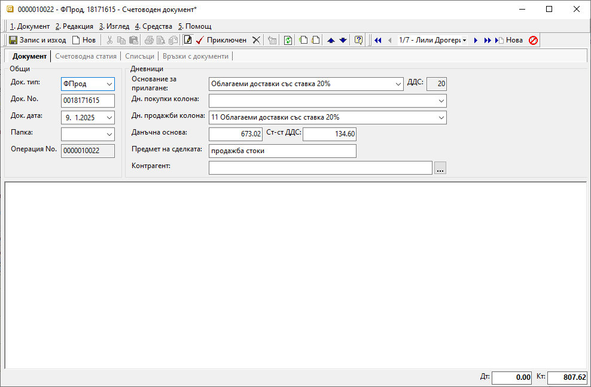
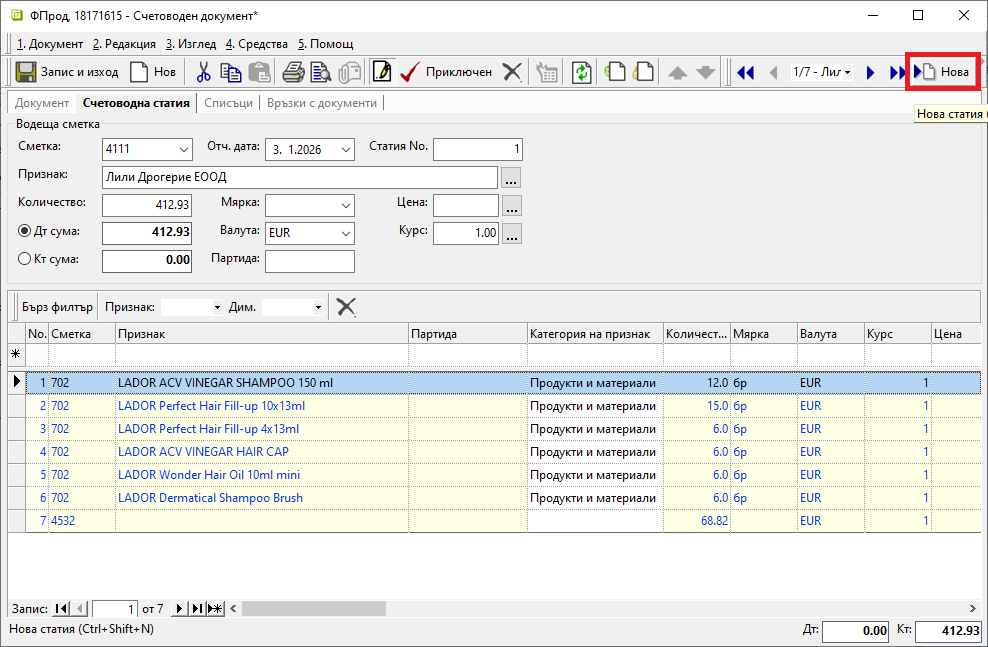

```{only} html
[Нагоре](000-index)
```

# Създаване на счетоводен документ 

- [Въведение](https://docs.unicontsoft.com/guide/erp/002-docs/003-accounting/001-acc-doc.html#id2)  
- [Създаване на счетоводен документ](https://docs.unicontsoft.com/guide/erp/002-docs/003-accounting/001-acc-doc.html#id3)  
- [Реквизити](https://docs.unicontsoft.com/guide/erp/002-docs/003-accounting/001-acc-doc.html#id4)  
- [Свързани статии](https://docs.unicontsoft.com/guide/erp/002-docs/003-accounting/001-acc-doc.html#id5)

## **Въведение**

Счетоводните документи могат да бъдат създавани ръчно или генерирани от системата.  
Автоматичното създаване е възможно при генерация на свързан счетоводен запис по документ в **Търговска система**. В този случай системата изисква настройка на **Автоматичен осчетоводител**.  
Счетоводни записи могат да се добавят и ръчно през модул **Счетоводство**. В този случай за системата не са необходими настройки за автоматични осчетоводявания.  

## **Създаване на счетоводен документ**

Процесът по ръчно въвеждане на нов счетоводен документ е следният:  

1) В меню **Счетоводство || Счетоводни документи** чрез десен бутон на мишката се избира **Нов документ**. Системата отваря празна форма за въвеждане на данни.  

2) В раздел **Документ** се въвежда основна информация за документа, свързана с дневниците по ЗДДС.  
Попълват се следните реквизити:   

   - **Док. тип** - От падащия списък в полето се избира тип на документа. Типовете са предварително дефинирани в **Номенклатури || Типове документи**.  
   - **Док. No.** - Поле за въвеждане на номер на документа.  
   - **Док. дата** - В полето се попълва дата за текущия документ.   
   - **Папка** - Опционално поле за избор на папка, в която документът да се разпредели.  
   - **Основание за прилагане** - От това поле се отваря списък с предварително настроените основания за прилагане. Полето трябва да се обзаведе според типа на текущия документ. За типове документи, които не се включват в отчетните регистри, полето остава празно.  
   - **ДДС** - Реквизитът се попълва автоматично с процента ДДС, настроен за избраното **Основание за прилагане**. Това поле остава празно, когато полето с основание не е попълнено.  
   - **Дн. покупки колона** и  **Дн. продажби колона** са полета с падащи списъци, които съдържат наименования на колоните от съответния дневник. Тези полета се попълват единствено за документи, които се включват в отчетните регистри (фактури, кредитни известия и пр.).    
   - **Данъчна основа** - В полето се попълва данъчна основа за документа, която трябва да влезе в отчетните регистри. Полето може да се обаведе автоматично след валидиране на документа. За целта трябва да са попълнени данните за водеща сметка и кореспонденции в радел **Счетоводна статия**.  
   - **Стойност ДДС** - Тук се попълва сума на ДДС за документа, която трябва да влезе в отчетните регистри.  
    Полето може да се обаведе автоматично след попълване на данните за водеща сметка и кореспонденции в радел **Счетоводна статия** и валидиране на документа. 
   - **Предмет на сделката** - В полето се въвежда свободен текст с предмет на сделката за документи, участващи в счетоводните регистри.  
   - **Контрагент** - От полето се отваря форма за избор на контрагент.  
    
   { class=align-center w=15cm }

3) В раздел **Счетоводна статия** се въвеждат счетоводните операции за документа в една или няколко статии.  
Допълнителна статия в документа може да се добави от бутон **Нова** в лентата с инструменти.  

В секция **Водеща сметка** се попълват следните реквизити:  

   - **Сметка (Водеща сметка)** – В полето се въвежда водеща сметка за счетоводната статия. Само една счетоводна сметка може да бъде избрана за водеща. Кореспонденциите на водещата сметка се въвеждат от реда за добавяне на нов запис. Системата позволява въвеждане на списък с една или множество кореспондиращи сметки.  
   Счетоводните сметки се дефинират предварително в [**Номенклатури || Сметкоплан**](https://docs.unicontsoft.com/guide/erp/001-ref/002-accounting/001-chart-of-acc.html).  
   - **Отч. дата** - С попълването на този реквизит документът ще влезе в счетоводните регистри към тази дата.  
   - **Признак** - В полето може да бъде избран признак за водещата сметка - контрагент, продукт/материал, ДМА, ДНА.  
   - **Количество** - В полето се въвежда количество. Това се отнася за счетоводните сметки, настроени като количествени. За сметките, настроени като стойностни, в полето се записва обща сума валута на текущата статия.  
   Данните в полето могат да се обзаведат автоматично с въвеждане на списъка с кореспондендиращи сметки.   
   - **Мярка** – От това поле се избира мерна единица. Реквизитът се отнася за счетоводните сметки, настроени като количествени.  
   - **Цена** – Реквизитът се обзавежда с единична цена, когато водещата сметка е настроена като количествена и са избрани количество и мерна единица.  
   - **Дт сума** и **Кт сума** - Маркира се една от опциите, с което се отбелязва дали движението по водеща сметка е в Дт или в Кт. Системата автоматично ще попълни избраното поле с обща стойност на счетоводната статия.  
   - **Валута** и **Курс** - В тези полета се попълват валутен курс и валута за текущата статия.  

> При генериране на няколко идентични счетоводни статии в един документ системата дава възможност за копиране от меню **Средства || Копиране на статия**.  

{ class=align-center w=15cm }

4) В редовете на статията се въвеждат кореспонденциите със съответните счетоводни сметки, количества и цени:  
- **Сметка** - в полето се избира счетоводна сметка от падащо меню със **Сметкоплан**;  
- **Признак** - в полето се отваря форма за избор на признак;  
Признакът се избира в зависимост от текуща сметка на реда. Това може да бъде продукт/материал, ДМА, ДНА или контрагент.  
- **Количество** - в полето се попълва количество и се отнася за счетоводните сметки, настроени като количествени;  
За сметките, настроени като стойностни, в полето се записва обща сума валута;   
- **Мярка** – поле с падащ списък за избор на мерна единица за текуща сметка на реда;  
Полето се отнася за счетоводните сметки, настроени като количествени.  
- **Валута** и **Курс** - в тези полета се попълват валутен курс и валута за текуща сметка на реда;  
- **Цена** – в полето може да се въведе единична цена;  
Полето се попълва, когато водещата сметка е настроена като количествена и на реда са избрани количество и мерна единица.  
- **Отч. дата** - системата автоматично попълва отчетната дата по редове според отчетната дата на документа;   
- **Свързан документ** - поле за избор на свързан документ от списък с фактури за покупка и продажба;  
Данните в това поле се въвеждат в определени типове счетоводни документи (например банкови и касови документи).  

> Полета **Дт** и **Кт** най–долу във формата на счетоводния документ представят тотал на сумите по редове на списъка с кореспонденции.  

5) Чрез бутон **Приключен** от лентата с инструменти счетоводният документ се валидира и се отваря форма за генерация **Свързани документи**.  
    - **Генериране на документ за плащане** - чрез поставяне на отметка се потвърждава генерация на свързан РКО/ПКО;  
        - *За дата* - избира се дата, с която системата попълва **Док. дата** в свързания документ;  
        - *Приключване* - при поставена отметка системата генерира свързания документ и автоматично го приключва;  
        Ако не бъде поставена отметка, системата генерира свързания документ, който остава в състояние на редакция.  

6) **Запис и изход** - бутон в лентата с инструменти, който записва документа и затваря формата.  

## **Реквизити**

1) В раздел **Документ**:  
   - **Док. Тип** – указва тип на текущия документ;    
   - **Док. No** - поле с номер на документа;   
   - **Док. дата** - поле за избор на дата на документ;  
   - **Папка** - указва папка, в която документът ще бъде включен;  
   Списъкът с папки трябва да се настрои предварително в **Номенклатури || Референтни номенклатури**.  
   - **Операция No.** - указва пореден номер на операция;  
   Полето се обзавежда автоматично при валидиране на документа в системата.  
   - **Основание за прилагане** - поле с падащ списък за избор на основание за прилагане;  
    Списъкът трябва да бъдат настроен предварително от **Номенклатури || Референтни номенклатури**.   
   - **ДДС** - указва процент на ДДС;  
   Полето се попълва автоматично с процента ДДС, настроен за избраното **Основание за прилагане**.  
   - **Дн. покупки колона** - указва колона от Дневник за покупките, към която се отнася текущият документ;  
   Списъкът с колони се дефинира предварително в **Номенклатури || Референтни номенклатури || Счетоводство: Колони на дневниците**.   
   - **Дн. продажби колона** - указва колона от Дневник за продажбите, към която се отнася текущият документ;  
   - **Данъчна основа** - в полето се попълва данъчна основа за документа, която влиза в отчетните регистри;    
   - **Стойност ДДС** - поле със сума на ДДС за документа, която влиза в отчетните регистри;  
   - **Предмет на сделката** - указва предмет на сделката в документите, участващи в счетоводните регистри;  
   - **Контрагент** - в полето се отваря форма за избор **Контрагенти**;    

2) В раздел **Счетоводна статия**:  
   - **Сметка (Водеща сметка)** – указва водеща счетоводна сметка;  
   Счетоводните сметки се дефинират предварително в **Номенклатури || Сметкоплан**.  
   - **Отч. дата** - попълва се отчетна дата на документа;  
   Текущият документ ще влезе в счетоводните регистри за тази дата.  
   - **Статия No.** - указва пореден номер на генерирана статия в счетоводния документ;  
   Полето се обзавежда автоматично от системата.  
   - **Признак** - отваря форма за избор **Счетоводни признаци**;   
   - **Количество** - в полето се попълва количество, отнасящо се за водещата сметка;  
   Полето се обзаведа автоматично, ако първо се въведе списък с кореспонденции.   
   - **Мярка** – поле за избор на мерна единица;  
   Полето се отнася за счетоводните сметки, настроени като количествени.  
   Списъкът с мерни единици се дефинира предварително в **Номенклатури || Референтни номенклатури**.   
   - **Цена** – в полето може да се попълни единична цена;  
   Полето се отнася за количествени счетоводни сметки. Обзавежда се, когато реквизити **Количество** и **Мярка** са попълнени.  
   - **Дт сума** - указва движение в Дт на водещата сметка;  
   Системата автоматично обзавежда полето със сума на счетоводната статия.  
   - **Кт сума** - указва движение в Кт на водещата сметка;   
   Системата автоматично обзавежда полето със сума на счетоводната статия.  
   - **Валута** - указва валута за текущата статия;  
   - **Курс** - указва валутен курс за текущата статия;  
   - **Партида** - указва партида за водещата сметка;  

   От реда за нов запис се обзавежда списък, който съдържа колони:  
   - **Поверителност** - дава информация за активирани *Поверителност на цени* и/или *Поверителност на документ*;  
   - **No.** - пореден номер на запис по реда на въвеждане;  
   - **Сметка** - в полето се отваря падащ списък за избор на счетоводна сметка;  
   Настройките трябва да бъдат предварително направени от **Номенклатури || Сметкоплан**.  
   - **Наименование на сметка** - показва име на избраната счетоводна сметка;  
   Настройките трябва да бъдат предварително направени от **Номенклатури || Сметкоплан**.  
   - **Код на признак** - показва настройките за код на избрания счетоводен признак;  
   - **Признак** - отваря форма за избор **Счетоводни признаци**;  
   - **Допълнителен текст** - въвеждане на описание за реда, което може да се показва при печат;  
   - **Партида** - в полето може да бъде попълнена партида за счетоводната сметка/признак на реда;  
   - **Категория на признак** - полето показва типа на избрания признак на реда - продукти и материали, контрагенти и т.н.;  
   - **Количество** - в полето се попълва количество за счетоводната сметка на реда;   
   - **Мярка** - падащ списък за избор на мерна единица за счетоводната сметка на реда;  
   - **Валута** - падащ списък за избор на валута;  
   - **Курс** - указва валутен курс за избраната валута;  
   - **Цена** - поле за попълване на единична цена;  
   - **Дт** - показва стойност за сметката от реда при движение в Дт;  
   - **Кт** - показва стойност за сметката от реда при движение в Кт;  
   - **Отч. дата** - указва отчетна дата за текущия ред;  
   - **Свързан документ** - в полето се отваря форма **Свързване на документи**;  
   Спрямо типа на текущия документ полето може да се обзаведе със свързани данъчни документи (фактури, кредитни известия и т.н.), платежни документи (ПКО, РКО, банкови извлечения) и други.  
   - **Потребител създаване** - информация за потребител, добавил текущия ред в документа;  
   - **Дата създаване** - дата и час на добавяне на текущия ред;  
   - **Потребител последна модификация** - потребителско име на направилия последните корекции в данните на реда;  
   - **Дата последна модификация** - информация за дата и час, когато са направени последните изменения в данните на текущия ред;  

3) В раздел **Списъци**:  
   Реквизити: Списъци  
   - **Дневници по ДДС** - указва данни от текущия документ, които влизат в отчетните регистри - основание за прилагане, ДДС ставка, колона от дневник, стойност на данъчна основа и ДДС.  
   - **Счетоводни записвания** - общ списък с всички счетоводни статии, включени в текущия документ.  

4) В раздел **Връзки с документи**:  
   Този раздел не съдържа реквизити за настройка. В него системата осигурява пряк път до свързани документи. От тук те могат да бъдат отворени и редактирани.  

## **Свързани статии**  

[Референтни номенклатури](https://docs.unicontsoft.com/guide/erp/001-ref/001-nomenclatures/001-ref-nomenclatures.html)  
[Сметкоплан](https://docs.unicontsoft.com/guide/erp/001-ref/002-accounting/001-chart-of-acc.html)