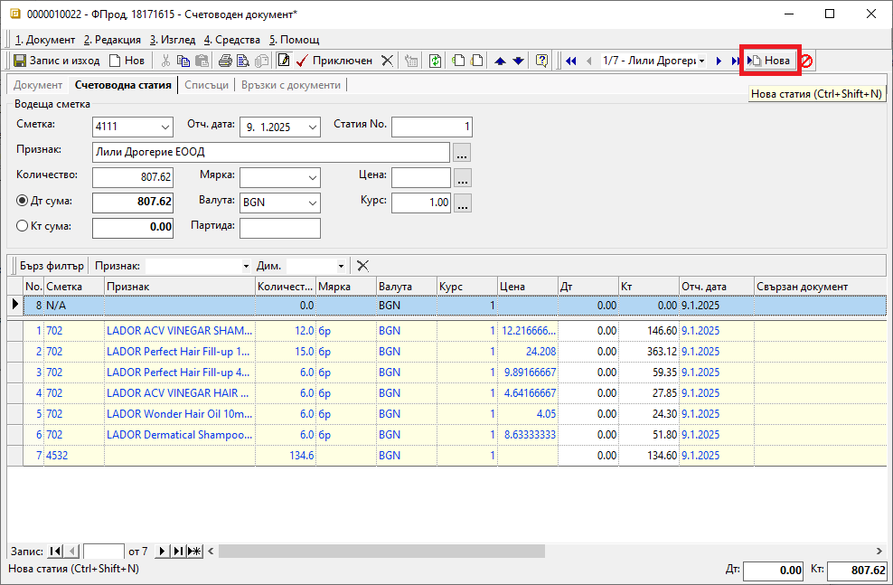

```{only} html
[Нагоре](000-index)
```

# Създаване на счетоводен документ 

Счетоводните документи могат да бъдат създавани ръчно, или генерирани от системата.  
Автоматичното създаване е възможно при генерация на свързан счетоводен запис по документ в **Търговска система**. В този случай системата изисква настройка на **Автоматичен осчетоводител**.  
Счетоводни записи могат да се добавят и ръчно през модул **Счетоводство**. За системата не са необходими настройки в **Автоматичен осчетоводител**.  

Процесът по ръчно въвеждане на счетоводен документ е следният:  

1) Счетоводен документ се създава ръчно от **Счетоводство || Счетоводни документи** чрез десен бутон на мишката и избор на **Нов документ**.  

2) В секция **Документ** се попълва основна информация за документа и информация за дневниците по ЗДДС.   

    - **Док. тип** - от падащия списък в полето се избира тип на документа;  
    Типовете документи са предварително дефинирани в **Номенклатури || Типове документи**.  

    - **Док. No.** - поле с номер на документа;  

    - **Док. дата** - в полето се попълва дата на документа;  

    - **Папка** - опционално поле за избор на папка, в която документът да се разпредели;  
    Списъкът с папки трябва да се настрои предварително в **Номенклатури || Референтни номенклатури || Счетоводство: Папки**.  

    - **Операция No.** - полето се обзавежда автоматично с пореден номер на операция при валидиране на документа в системата;  

    - **Основание за прилагане** - в полето се отваря списък с предварително настроени основания за прилагане;  
    Полето трябва да се обзаведе според типа на текущия документ. За типове документи, които не се включват в отчетните регистри, полето остава празно.  

    - **ДДС** - полето се попълва автоматично с процента ДДС, настроен за избраното **Основание за прилагане**;  
    Това поле остава празно, когато полето с основание не е попълнено.  

    -  **Дн. покупки колона** и  **Дн. продажби колона** - полета за избор от падащи списъци, които съдържат колоните на съответния дневник;  
    Списъкът с колони на дневници се дефинира предварително в **Номенклатури || Референтни номенклатури || Счетоводство: Колони на дневниците**.  
    Тези полета се попълват единствено за документи, които се включват в отчетните регистри (фактури, кредитни известия и пр.)  

    - **Данъчна основа** - в полето се попълва данъчна основа за документа, която трябва да влезе в отчетните регистри;  
    Полето може да се обаведе автоматично след попълване на данните за водеща сметка и кореспонденции в радел **Счетоводна статия**  и валидиране на документа.  

    - **Стойност ДДС** - в това поле се попълва сума на ДДС за документа, което трябва да влезе в отчетните регистри;  
    Полето може да се обаведе автоматично след попълване на данните за водеща сметка и кореспонденции в радел **Счетоводна статия** и валидиране на документа. 

    - **Предмет на сделката** - в полето се въвежда свободен текст с предмет на сделката за документи, участващи в счетоводните регистри;  

    - **Контрагент** - в полето се отваря форма за избор на контрагент;  
    
    { class=align-center }

3) В секция **Счетоводна статия** се въвеждат счетоводните операции за документа в една или няколко статии.  
Допълнителна статия в документа може да се добави от бутон **Нова** в лентата с инструменти.  

    - **Сметка (Водеща сметка)** – в полето може да се избере само една счетоводна сметка за водеща;  
    Кореспонденциите на водещата сметка се въвеждат от реда за добавяне на нов запис. Системата позволява въвеждане на списък с една или множество кореспондиращи счетоводни сметки.  
    Списъкът със сметки се дефинира предварително в **Номенклатури || Сметкоплан**.  

    - **Отч. дата** - попълва се отчетната дата на документа;  
    С тази дата текущият документ ще влезе в счетоводните регистри за месеца, в който попада.    

    - **Статия No.** - полето се обзавежда от системата с пореден номер на генерирана статия в счетоводния документ;  

    -  **Признак** - в полето се отваря форма за избор на признак;  
    Признакът се избира в зависимост от водещата сметка. Това може да бъде контрагент, продукт/материал, ДМА, ДНА.  

    - **Количество** - в полето се попълва количество и се отнася за счетоводните сметки, настроени като количествени;  
    За сметките, настроени като стойностни, в полето се записва обща сума валута на текущата статия.  
    Данните в полето могат да се обзаведат автоматично с въвеждане на списъка с кореспондендиращи сметки.   

    - **Мярка** – поле за избор на мерна единица;  
    Полето се отнася за счетоводните сметки, настроени като количествени.  
    Списъкът с мерни единици се дефинира предварително в **Номенклатури || Референтни номенклатури**.   

    - **Цена** – в полето може да се попълни единична цена;  
    Полето се обзавежда, когато водещата сметка е настроена като количествена и са избрани количество и мерна единица.  

    - **Дт сума** и **Кт сума** - избира се една от опциите, с което се отбелязва дали движението по водеща сметка е в Дт или в Кт;  
    Системата автоматично обзавежда съответното поле със сума на счетоводната статия.  

    - **Валута** и **Курс** - в тези полета се попълват валутен курс и валута за текущата статия;  

> При генериране на няколко идентични счетоводни статии в един документ системата дава възможност за копиране от меню **Средства || Копиране на статия**.  

{ class=align-center }

В редовете на статията се въвеждат кореспонденциите по съответните им сметки, количества и цени:  
- **Сметка** - в полето се избира счетоводна сметка от падащо меню със **Сметкоплан**;  
- **Признак** - в полето се отваря форма за избор на признак;  
Признакът се избира в зависимост от текуща сметка на реда. Това може да бъде продукт/материал, ДМА, ДНА или контрагент.  
- **Количество** - в полето се попълва количество и се отнася за счетоводните сметки, настроени като количествени;  
За сметките, настроени като стойностни, в полето се записва обща сума валута;   
- **Мярка** – поле с падащ списък за избор на мерна единица за текуща сметка на реда;  
Полето се отнася за счетоводните сметки, настроени като количествени.  
- **Валута** и **Курс** - в тези полета се попълват валутен курс и валута за текуща сметка на реда;  
- **Цена** – в полето може да се въведе единична цена;  
Полето се попълва, когато водещата сметка е настроена като количествена и на реда са избрани количество и мерна единица.  
- **Отч. дата** - системата автоматично попълва отчетната дата по редове според отчетната дата на документа;   
- **Свързан документ** - поле за избор на свързан документ от списък с фактури за покупка и продажба;  
Данните в това поле се въвеждат в определени типове счетоводни документи (например банкови и касови документи).  

> Полета **Дт** и **Кт** най–долу във формата на счетоводния документ представят тотал на сумите по редове на списъка с кореспонденции.  

4) Чрез бутон **Приключен** от лентата с инструменти счетоводният документ се валидира и се отваря форма за генерация **Свързани документи**.  
    - **Генериране на документ за плащане** - ;  
        - *За дата* - избира се дата, с която системата попълва **Док. дата** в свързания документ;  
        - *Приключване* - при поставена отметка системата генерира свързания документ и автоматично го приключва;  
        Ако не бъде поставена отметка, системата генерира свързания документ, който остава в състояние на редакция.  

5) **Запис и изход** - бутон в лентата с инструменти, който записва документа и затваря формата.  