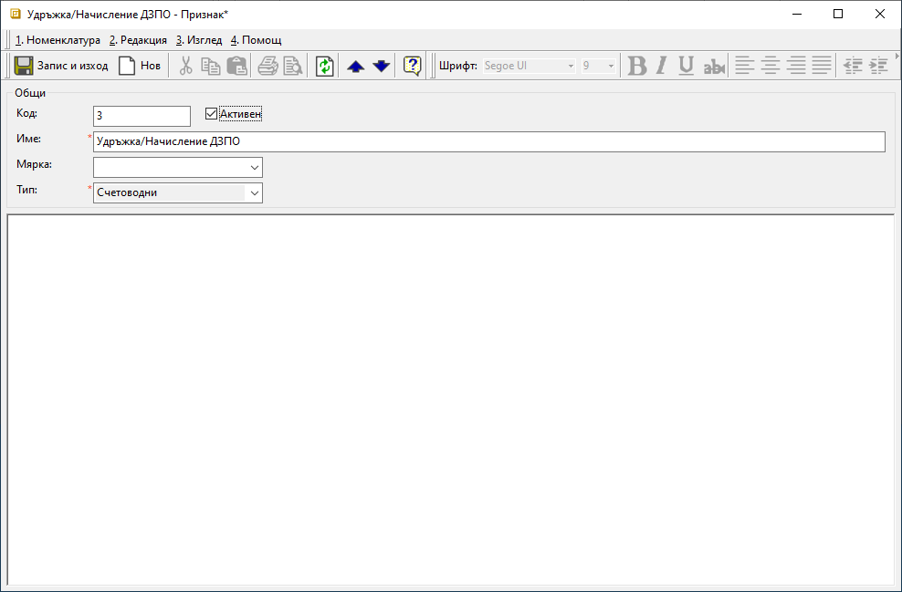

```{only} html
[Нагоре](000-index)
```

# **Създаване на счетоводен признак** 

- [Въведение]()  
- [Създаване на счетоводен признак]()  
- [Реквизити]()  
- [Свързани статии]()

## **Въведение**

**Счетоводни признаци** обединяват различни типове номенклатури: **Контрагенти**, **Подукти/ материали**, **Дълготрайни активи**, **Персони** и др. категории. В списъка с признаци автоматично се включват въведените от **Търговска система** номенклатури.   

Но при създаване на нов запис през **Счетоводни признаци** настройката не се прехвърля и в **Търговска система**. Може да се прилага единствено в счетоводните документи и справки.  

## **Създаване на счетоводен признак**

Използването на признаци към счетоводните сметки осигурява допълнителна аналитичност в счетоводните справки.  

1) В меню **Счетоводство || Счетоводни признаци** с десен бутон на мишката върху списъка с продукти се избира **Нов признак**.  
Отваря се форма **Признак** за въвеждане на данни. Задължителните реквизити са маркирани с червен символ.  

{ class=align-center w=15cm }

2)  Поле **Код** се попълва по желание. Задължително за попълване е полето **Име** с избрано наименование за счетоводния признак.  
Системата автоматично е маркирала текущия признак с **Активен**.  
   
    От поле **Мярка** може да се избере мерна единица за счетоводния признак. Настройката не е задължителна.  
   
    Реквизит **Тип** се настройва задължително от падащия списък в полето. Списъкът е предварително дефиниран от **Категории на признаци** в **Номенклатури || Референтни номенклатури**.  

3) **Запис и изход** - Записва направените промени и затваря формата за редакция.  

## **Реквизити**

1) В раздел **Общи**:  
   - **Код** – в полето се попълва код в цифри, букви и/или други знаци;  
   Системата автоматично обзавежда полето с пореден номер, ако бъде оставено празно.  
   - **Активен** - чрез поставяне/махане на отметка признакът се маркира като активна или неактивна номенклатура;  
   - **Име** – попълва се желаното наименование (задължителен реквизит);  
   - **Мярка** – от списък се избира мерна единица за счетоводния признак;  
   - **Тип** – от падащия списък в полето се избира какъв е типът на счетоводния признак (задължителна настройка);  
   Списъкът трябва да е предварително настроен в **Номенклатури || Референтни номенклатури**.    

## **Свързани статии**  

[Референтни номенклатури](https://docs.unicontsoft.com/guide/erp/001-ref/001-nomenclatures/001-ref-nomenclatures.html)  