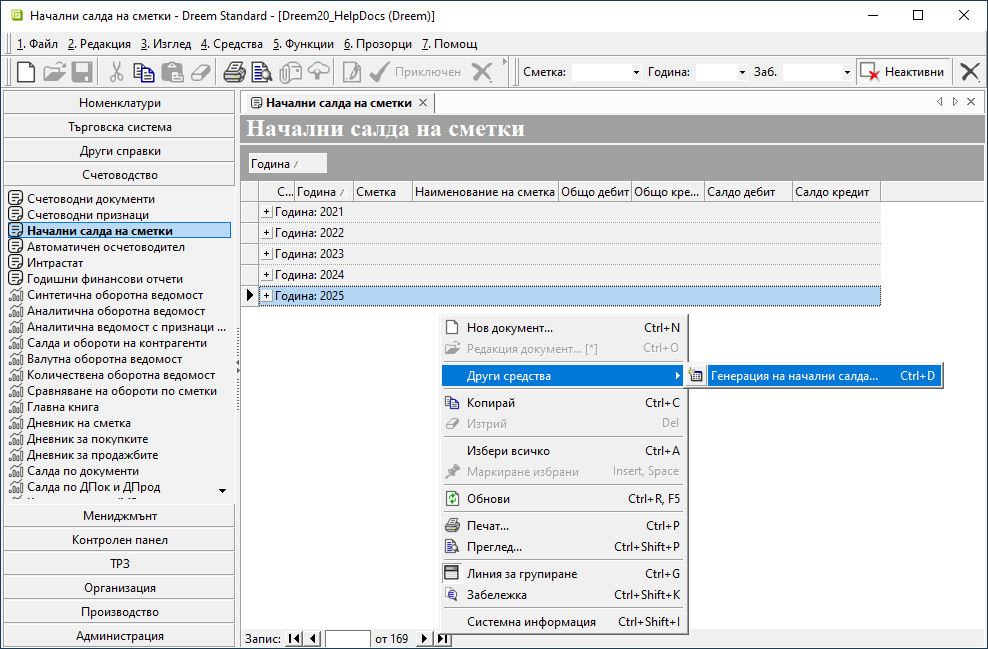
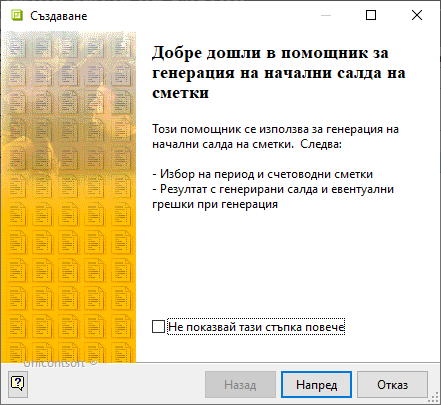
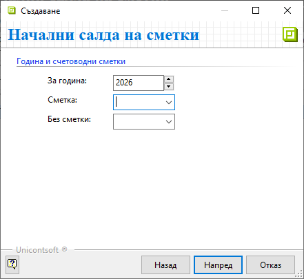
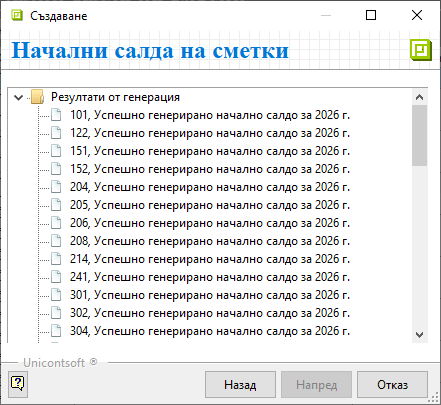
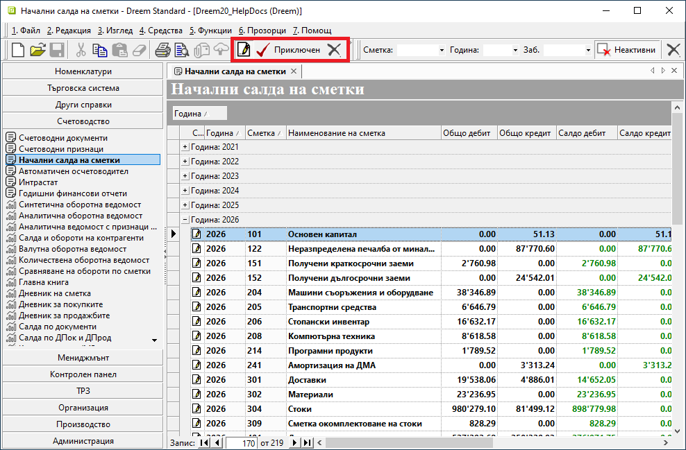
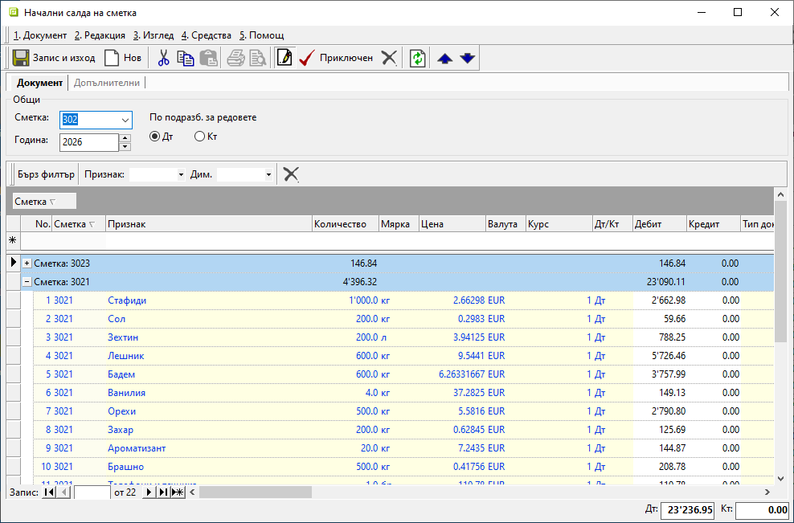

```{only} html
[Нагоре](000-index)
```

# **Начални салда на сметки** 

- [Въведение](#въведение)  
- [Генерация на начални салда на счетоводни сметки](#генерация-на-начални-салда)  
- [Реквизити](#реквизити)  

## **Въведение**

**Dreem ERP** разполага с инструмент за автоматична генерация на начални салда на счетоводни сметки. Чрез него за избрана година могат да бъдат създадени записи едновременно за всички сметки или поетапно за една/няколко сметки.  

Помощникът е достъпен в **Счетоводство » Начални салда на сметки**.  

## **Генерация на начални салда**

Генерацията може да бъде стартирана от меню **Средства** или чрез десен бутон на мишката от **Други средства**.    
 
{ class=align-center w=15cm }

Системата извежда информация с предстоящите стъпки за създаването на НС.  
Към генерация се преминава с бутон [**Напред**].  

{ class=align-center }

На тази стъпка се попълват годината и желаните сметки, за които се генерират НС.  

В поле **Сметка** се отваря списък с главни сметки от настроения [**Сметкоплан**](../../001-ref/002-accounting/002-chart-of-acc.md). Възможните варианти за избор са:  
- *Всички сметки* - Ако полето бъде оставено празно, системата генерира НС за всички счетоводни сметки.  
- *Една сметка* - В списъка може да бъде маркирана само една счетоводна сметка и системата генерира НС единствено за нея.  

От генерацията могат да бъдат изключени една или няколко сметки. За целта се използва списъкът в поле **Без сметки**, който позволява множествен избор. Ако полето е празно, системата изпълнява генерацията спрямо критериите в полета **За година** и **Сметка**.   

{ class=align-center }

Избраните параметри се потвърждават с бутон [**Напред**]. Системата прави нужните проверки и показва резултата от генерацията.  

При съобщение за грешка нередностите трябва да бъдат отстранени. След това може да се направи повторен опит за генерация.  

Когато салдата са успешно генерирани, формата се затваря от [**X**].  

{ class=align-center }

Системата създава отделен документ с НС за всяка от главните сметки. Записите са в редакция и могат да бъдат проверявани, анулирани или приключвани поетапно.  

Състоянието на документите може да бъде променено едновременно за няколко/всички. За целта се използват бутоните в лентата с инструменти, като предварително в списъка се маркират желаните записи. 

{ class=align-center w=15cm }

За проверка на данните се отваря формата за редакция с НС на избраната сметка. Системата позволява редактиране единствено на оцветените в жълто полета.  

> Началните салда трябва да бъдат валидирани чрез **Приключен**. С това системата приема данните за потвърдени.    

{ class=align-center w=15cm }

## **Реквизити**

1) В раздел **Документ**:  
   - **Сметка** – полето показва главната счетоводна сметка, за която се отнася текущото НС;  
   - **Година** - показва годината, за която се отнася текущото НС;  
   - **По подразбиране за редовете** - указва дебитно или кредитно начално салдо;  
   
   От реда за нов запис се обзавежда списък, който съдържа колони:   
 
   - **No.** - пореден номер на запис по ред на въвеждане;  
   - **Сметка** - указва счетоводна сметка/подсметка, за която се отнася НС на текущия ред;  
   - **Код на признак** - показва настройките за код на избрания счетоводен признак;  
   - **Признак** - наименование на счетоводен признак, за който се отнася НС на реда;  
   - **Партида** - обзавежда се с партида за счетоводната сметка/признак, когато в счетоводните документи е попълвана такава;  
   - **Категория признак** - полето показва типа, към който се отнася признакът на реда;  
   - **Количество** - полето се попълва с количеството за счетоводната сметка на реда;   
   - **Цена** - обзавежда се с единична цена;  
   - **Валута** - указва валута на НС;  
   - **Курс** - указва валутен курс;  
   - **Дт/Кт** - указва дали НС е по Дт или по Кт;  
   - **Дебит** - обзавежда се със сума при НС по Дт;  
   - **Кредит** - обзавежда се със сума при НС по Кт;  
   - **Тип док.** - показва тип на документа, избран в поле **Свързан документ**;  
   - **Док. дата** - показва датата на избрания свързан документ;  
   - **Док. No.** - показва номера на избрания свързан документ;  
   - **Мярка** - указва мерна единица за счетоводната сметка на реда;  
   - **Плащания/прихващания** - при свързване на плащания  полето се обзавежда с платежни документи (ПКО, РКО, БИ);  
   - **Свързан документ** - полето може да се обзаведе със свързани данъчни документи (фактури, кредитни известия и т.н.) спрямо вида на счетоводната сметка;   
   - **Потребител създаване** - информация за потребител, добавил текущия ред в документа;  
   - **Дата създаване** - дата и час на добавяне на текущия ред;  
   - **Потребител последна модификация** - потребителско име на направилия последните корекции в данните на реда;  
   - **Дата последна модификация** - информация за дата и час, когато са направени последните изменения в данните на текущия ред;  


2) В раздел **Допълнителни** има поле за свободно въвеждане на текст (коментар, допълнителни особености и пр.).    