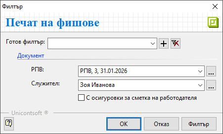

```{only} html
[Нагоре](000-index)
```

# **Печат на фишове**

Системата разполага с функционалност за разпечатване на фишове на служители. Тя е достъпна от **ТРЗ » Печат на фишове**.  

> Фишове се отпечатват на база предварително валидирани данни за служители в документи **РПВ**-*Разчетно-платежни ведомости*.  

1) Във филтър формата **Печат на фишове** има възможност за избор от следните опции:  
- **РПВ** - От бутона вдясно на полето се отваря списък за избор на **РПВ**. Могат да се посочат една или няколко ведомости за печат.  
Ако полето остане празно, системата ще направи справка за всички **РПВ**.  
- **Служител** - В полето се указва служител, за който се разпечатва фиш.  
Бутонът вдясно отваря списък с всички служители. Може да се маркира един или няколко служителя.  
Ако полето остане празно, системата ще предложи за печат фишове за всички служители от избраната **РПВ**.  
- **С осигуровки за сметка на работодателя** - При активиране на опцията се визуализират и данни с осигуровките, които са за сметка на работодател.  

{ class=align-center }

2) **Ок** или **Филтър** - Чрез тези бутони се потвърждават избраните опции.  
Системата извежда справката на екран.  