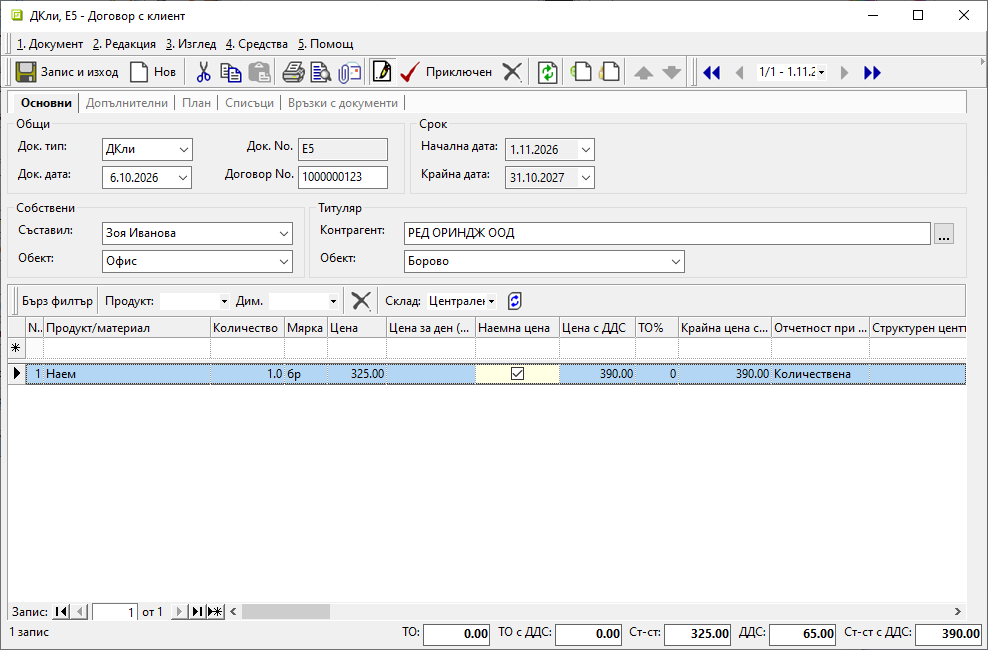
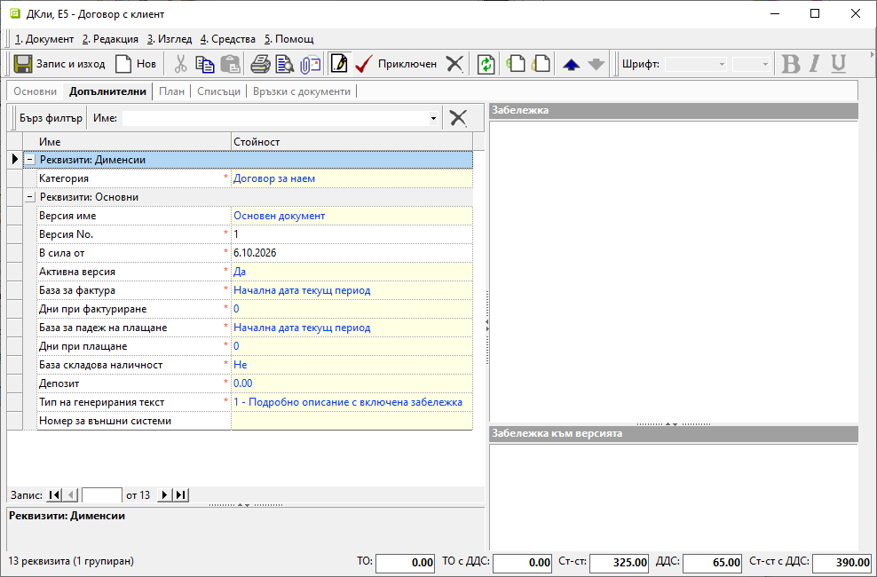
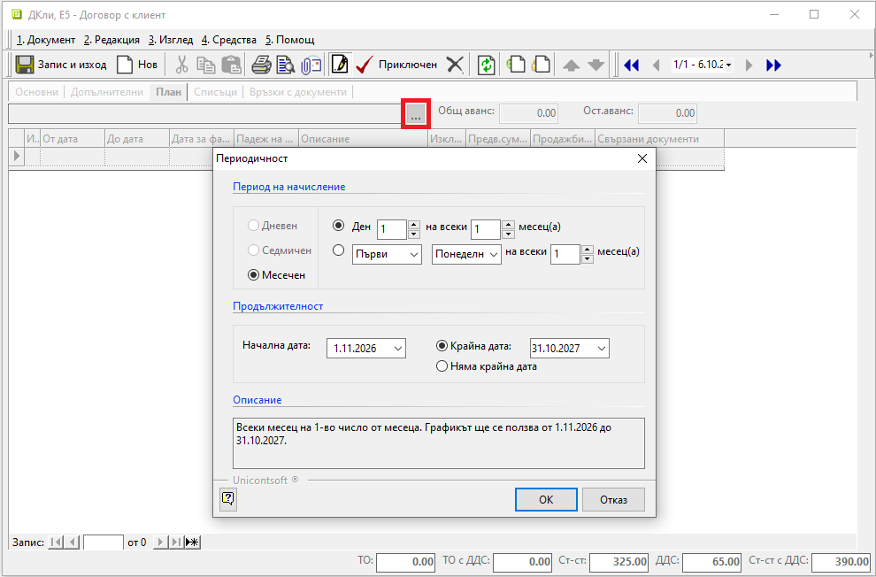
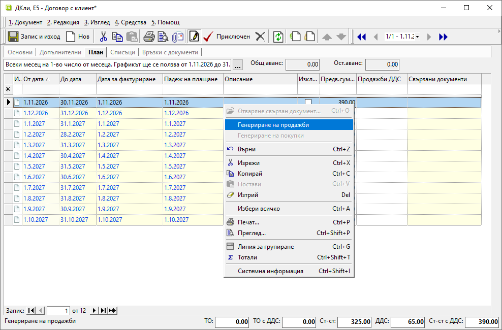
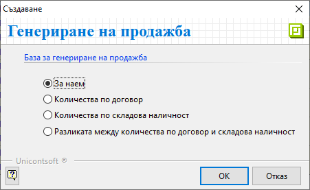
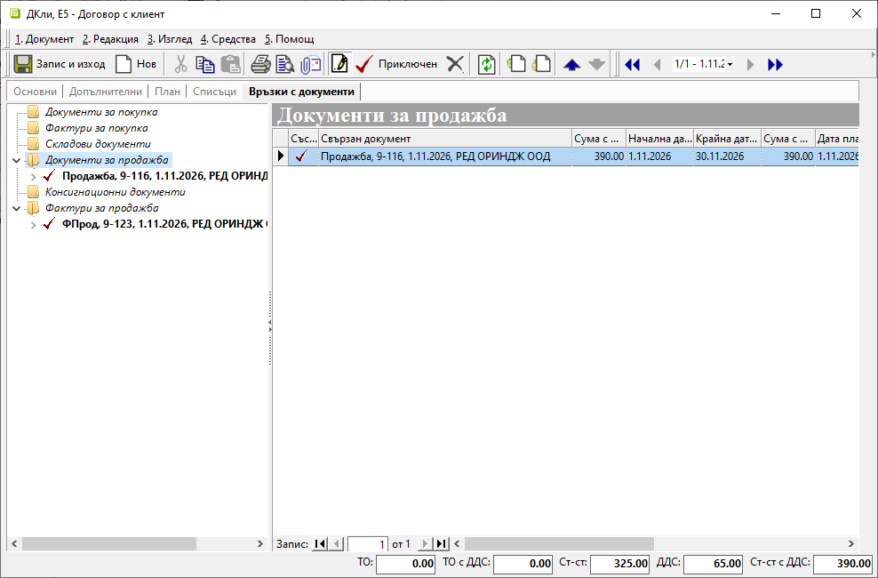

```{only} html
[Нагоре](000-index)
```

# **Договори** 

- [Въведение](#въведение)  
- [Как се създава договор](#нов-договор)  
- [Реквизити](#реквизити)  

## **Въведение**

Чрез функционалност **Договори** се управляват планирането и изпълнението на договорите с клиенти и доставчици. В тази връзка системата автоматично изготвя препоръчителния график за фактуриране на дейностите по договор.  

## **Нов договор**

**1. Създаване**

Нов документ се създава в меню **Организация » Договори**.  
Чрез десен клик върху списъка със записи се избира **Нов документ** (Ctrl+N). Системата отваря празна форма за въвеждане на данни.  

**2. Попълване на реквизити**

В раздел **Основни** се въвежда началната информация за договора. Попълват се следните реквизити:   

   - **Док. тип** - От падащия списък се избира тип на документа от предварително дефинираните в **Номенклатури » Типове документи**.  
   - **Док. дата** - В полето се въвежда дата за документа.   
   - **Док. No.** - Полето се попълва с пореден номер на записа.  
   - **Договор No.** - Въвежда се номер на договора.  
   - **Съставил** - Избира се служител, съставил документа.   
   - **Обект** - Избира се обект от настроените за **Потребител на продукта**.    
   - **Контрагент** - От полето се отваря форма за избор на контрагент, с когото е сключен текущият договор.  
   - **Обект** - В полето може да бъде избран обект на контрагента, за когото се отнася договорът.    

> Полетата за срок на договора ще се обзаведат автоматично на следващ етап с попълването на раздел **План**.  

От реда за нов запис се добавят включените в договора услуги и/или стоки. За всеки ред се попълват количество и цена.  
В полета **Цена** и **Цена с ДДС** се въвежда цена за единица продукт в избраната мярка.  
Когато се използва дневна наемна цена, се попълва поле **Цена за ден**. В този случай стойността в генерираните продажби ще се изчисли спрямо брой дни и цената за ден.  
В колона **Наемна цена** се маркират редовете с продукти, които в последствие да участват в генерацията на документи.  

{ class=align-center w=15cm }

В раздел **Допълнителни** се попълват всички задължителни реквизити. Те са маркирани с червен символ и са обзаведени със стойности по подразбиране. Редактират се спрямо условията на договора.   

Чрез попълване на [категория](../../001-ref/001-nomenclatures/011-custom-dimensions.md) (напр. *Договор за наем*) се указва вид на договора.  
Дефинират се база и брой дни отместване, въз основа на които ще се обзаведат периодите на фактуриране и падежите в **План**.  
Поле **Депозит** се попълва при наличие на депозирана сума по договора.  
Чрез настройката **Тип на генерирания текст** се указват елементите на автоматичния текст, който се попълва по редовете в продажби.  

{ class=align-center w=15cm }

От раздел **План** се въвеждат период на начисление и продължителност на договора.  
Формата за настройка на периодичност се отваря от бутона с три точки [**...**] над списъка.    

Интервал за фактуриране се дефинира в секция **Период на начисление**.  
Указват се **Начална дата** и **Крайна дата** за срока на договора.  
Избраната конфигурация се потвърждава с бутон [**OK**], след което задължително се записва (Ctrl+S).  

{ class=align-center w=15cm }

Системата създава план-списък с препоръчителни дати на фактуриране и падеж.  
Всички колони в жълто могат да бъдат редактирани.  

Документ за продажба или покупка - според типа на договора, се генерира чрез десен клик върху избрания ред и опция **Генериране на продажби/ Генериране на покупки**.  

> Опциите **Генериране на продажби** или **Генериране на покупки** в раздел **План** са активни и при състояние *Приключен* на договора.   

{ class=align-center w=15cm }

Отваря се форма за генерация, чрез която може да бъде избрана една от следните бази:  

- **За наем**  
Системата ще генерира вътрешнофирмен документ с продукти и количества, за които в списъка има указана настройка **Наемна цена**.  
- **Количества по договор**  
Системата ще генерира вътрешнофирмен документ с продукти и количества, както са описани в договора.  
- **Количества по складова наличност**  
Системата ще генерира вътрешнофирмен документ с продукти и количества, налични при контрагента.  
- **Разликата между количества по договор и складова наличност**  
Системата ще генерира вътрешнофирмен документ с продукти и количества, получени като разлика между количествата по договор и складовата наличност при контрагента.  

{ class=align-center }

При потвърждаване на избора с бутон [**OK**] автоматично се създава вътрешнофирмен документ в редакция. Той е достъпен в раздел **Връзки с документи** за по-нататъшна обработка.  

> **Връзки с документи** обединява всички издадени към договора документи.    

{ class=align-center w=15cm }

**3. Приключване**

Бутонът валидира промените и приключва документа.  

**4. Запис и изход**  

Чрез бутон [**Запис и изход**] в лентата с инструменти документът се записва и формата се затваря.  

Ако документът е бил приключен, той вече е запаметен и в този случай бутонът единствено затваря формата.  

## **Реквизити**

1) В раздел **Документ**:  
   - **Док. тип** – указва тип на текущия документ;    
   - **Док. дата** - указва дата на документ;  
   - **Док. No.** - поле с номер на документ;   
   - **Договор No.** - поле с номер на текущия договор;  
   - **Начална дата** - указва дата за влизане в сила на договор;  
   - **Крайна дата** - указва крайната дата за валидност на договора;  
   - **Съставил** - отваря списък със служители за избор на персона, съставила документа;  
   Полето се попълва автоматично с настройките на текущия потребител.  
   - **Обект** - отваря падащ списък за избор на обект;  
   Полето се попълва автоматично с настройките на текущия потребител.  
   - **Контрагент** - в полето се отваря форма за избор от списък **Контрагенти**;    
   Ако търсеният контрагент не фигурира в съществуващия списък, системата позволява въвеждането му в момента.  
   - **Обект** - отваря списък за избор от настроените за контрагента обекти;  

   От реда за нов запис се обзавежда списък, който съдържа колони:  
   - **Поверителност** - дава информация за активирани *Поверителност на цени* и/или *Поверителност на документ*;  
   - **No.** - пореден номер на запис по реда на въвеждане;  
   - **Код продукт/материал** - полето се обзавежда с настроения основен код за продукт на реда;  
   - **Баркод на продукт/материал** - показва баркод на продукта в избраната мярка;  
   - **Продукт/материал** - отваря форма за избор **Продукти и материали**;  
   - **Партида** - указва партида за продукта;  
   Бутонът в края на полето отваря форма за избор от налични партиди за продукта.  
   - **Код продукт за трансформация** - показва код на избрания продукт за трансформация при фактуриране;  
   - **Продукт/материал за трансформация** - отваря форма за избор на събирателен продукт за трансформация при фактуриране;  
   - **Допълнителен текст** - поле за въвеждане на уточнение, описание или др., което може да се показва при печат;  
   - **Забележка** - поле за въвеждане на свободен текст с уточнение за продукта на ред;  
   - **Количество** - в полето се попълва количество за продукт на реда;   
   - **Мярка** - отваря падащ списък за избор на мерна единица за продукт на реда;  
   - **Цена** - поле за попълване на единична цена;  
   - **Цена за ден** - може да бъде указана единична наемна цена за ден;  
   - **Наемна цена** - чрез отметка се потвърждава включване на реда в генерация на документи;  
   - **ДДС ставка** - показва ДДС ставка, настроена за продукта на реда;  
   - **ДДС вкл. в цената** - указва включване на ДДС в цената на продукта от реда;  
   - **Цена с ДДС** - указва единична цена с ДДС;   
   - **Валута** - отваря падащ списък за избор на валута;  
   - **Курс** - указва валутен курс за избраната валута;  
   - **ТО%** - указва търговска отстъпка в проценти;  
   - **Крайна цена с ТО%** - показва цена без ДДС в национална валута след приспадната търговска отстъпка;  
   - **Крайна цена с ДДС** - показва крайна цена в национална валута с включен ДДС;  
   - **Крайна цена с ДДС и ТО%** - показва цена с ДДС в национална валута след приспадната търговска отстъпка;  
   - **Отчетност при фактуриране** - указва база за генериране на съдържание (продукти) в свързаните документи за фактуриране;  
   - **Структурен център на себестойност** - отваря форма **Центрове на себестойност** за избор на структурен център;  
   - **Наличност** - показва текущо налично количество за избрания в *Бърз филтър* склад;  
   - **Стойност** - обща стойност без ДДС в избраната на реда валута;  
   - **ТО за реда** - показва обща сума на търговска отстъпка в национална валута;  
   - **ДДС за реда** - показва обща сума на ДДС за цялото количество от продукта на реда;  
   - **Обща стойност с ДДС** - показва обща стойност с ДДС за цялото количество от продукта на ред;  
   - **Обща ТО с ДДС** - показва обща сума на отстъпка с ДДС за цялото количество от продукта на ред;  
   - **Дименсия за групи** - показва основна група на продукт;  
   - **Отместване спрямо основния период** - ;  
   - **Ст-ст валута** - обща стойност без ДДС на реда в национална валута;  
   - **Предадено количество** - показва общо предадено на контрагента по договор количество;  
   - **Върнато количество** - показва върнато количество от контрагента; 
   - **За връщане** - показва остатък за връщане;  
   - **За вземане** - показва остатък за вземане;  
   - **Обект/проект** - отваря форма **Центрове на себестойност** за избор на обект/проект;  
   - **Друг център на себестойност** - отваря форма **Центрове на себестойност** за избор на друг кост център;  
   - **Потребител създаване** - информация за потребител, добавил текущия ред в документа;  
   - **Дата създаване** - дата и час на добавяне на текущия ред;  
   - **Потребител последна модификация** - потребителско име на направилия последните корекции в данните на реда;  
   - **Дата последна модификация** - информация за дата и час, когато са направени последните изменения в данните на текущия ред;  

2) В раздел **Допълнителни**:  
   Реквизити: Дименсии  
   - **Категория** - отваря списък за избор на категория на договора;  
   
   Реквизити: Основни  
   - **Версия име** - указва името на версията;  
   - **Версия No.** - указва поредния номер на версията на документа;  
   - **В сила от** - указва начална дата на валидност на текущата версия на документа;  
   - **Активна версия** - указва валидната версия за системата;  
   - **База за фактура** - указва датата, спрямо която се изчислява датата за фактура;  
   - **Дни при фактуриране** - указва брой дни отместване спрямо базата за генериране на фактура;  
   - **База за падеж на плащане** - указва датата, спрямо която се изчислява падежа на плащане;  
   - **Дни при плащане** - указва брой дни отместване спрямо базата за падежа на плащане;  
   - **База складова наличност** - указва дали продажбите се генерират според наличността на склада;  
   - **Депозит** - указва депозитната сума, платена от клиента;  
   - **Тип на генерирания текст** - указва вида на допълнителния текст в генерираните редове от продажба;  
   - **Номер за външни системи** - указва номера на договор за външни системи;  

2) В раздел **План**:  
   - **От дата** - указва началната дата на период;  
   - **До дата** - указва крайната дата на период;  
   - **Дата на фактуриране** - препоръчителна дата за фактуриране;  
   - **Падеж на плащане** - показва падеж според настрените дни отместване спрямо базата на падежа;  
   - **Година** - показва годината, в която попада препоръчителна дата за фактуриране;  
   - **Описание** - поле за въвеждане на пояснение;  
   - **Изключен** - ;  
   - **Предв. сума** - предварителна сума без ДДС по договор;  
   - **Предв. сума с ДДС** - предварителна сума с ДДС по договор;  
   - **Стойност по склад** - показва стойност без ДДС по складови наличности;  
   - **Стойност по склад с ДДС** - стойност с ДДС по складови наличности;  
   - **Продажби** - сума без ДДС на продажбите;  
   - **Продажби ДДС** - показва сумата с ДДС по продажби;  
   - **Кредитни документи** - сума без ДДС на коригиращите документи;  
   - **Кредитни документи ДДС** - сума с ДДС на коригиращите документи;  
   - **Усвоен аванс** - сума на усвоените аванси без ДДС;  
   - **Усвоен аванс ДДС** - сума на усвоените аванси с ДДС;  
   - **Свързани документи** - показва всички генерирани от реда документи;  
   - **Лог на промените** - отваря форма за въвеждане на текстови шаблони с редакции;  
   - **Потребител създаване** - информация за потребител, добавил текущия ред в документа;    
   - **Приход** - общ приход без ДДС като разлика на сума продажби и сума коригиращи документи;   
   - **Приход ДДС** - общ приход с ДДС като разлика на сума продажби и сума коригиращи документи;  
   - **Дата създаване** - дата и час на добавяне на текущия ред;  
   - **Потребител последна модификация** - потребителско име на направилия последните корекции в данните на реда;  
   - **Дата последна модификация** - информация за дата и час, когато са направени последните изменения в данните на текущия ред;  

3) В раздел **Списъци**:  
   Реквизити: Списъци  
   - **Прикачени файлове** - Системата дава възможност чрез реда за нов запис вдясно да се добавят прикачени файлове. Това става от поле **Файл**, в което се отваря форма за избор **Медия каталог**. Каталогът включва предварително настроени от **Номенклатури » Медия каталог** папки.    

4) В раздел **Връзки с документи**:  
   Този раздел не съдържа реквизити за настройка. В него системата осигурява пряк път до свързани документи. От тук те могат да бъдат отворени и редактирани.  

