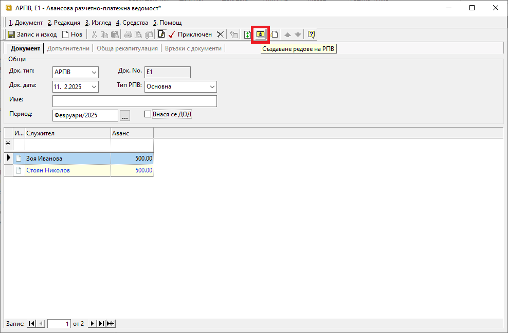

```{only} html
[Нагоре](000-index)
```

# **Авансови РПВ**

- [Въведение](#въведение)  
- [Генериране на АРПВ](#генериране-на-арпв)  
- [Реквизити](#реквизити)  
- [Свързани статии](#свързани-статии)

## **Въведение**

Системата предоставя възможност за генерация на документ, с който автоматично се начисляват аванси на служителите. 

Тази функционалност е достъпна в модул **ТРЗ » Авансови разчетно–платежни ведомости**.  

За автоматичното съставяне на тези документи е необходимо да бъде настроена номенклатура със служителите на фирмата.  

## **Генериране на АРПВ**

1) От **ТРЗ » Авансови разчетно–платежни ведомости** чрез десен бутон на мишката върху списъка се избира **Нов документ**.  
Отваря се празна форма за въвеждане на данни.  

2) В раздел **Документ** се попълват:  

 - **Док. тип** – От падащия списък в полето се избира тип на документа **АРПВ**-*Авансова разчетно–платежна ведомост*.    
 - **Док. No.** – Полето може да се обзаведе с номер на документа. Ако бъде оставено празно, при валидиране на АРПВ системата ще попълни пореден номер.  
 - **Док. дата** – В това поле се попълва дата на начисление на заплатите.  
 - **Тип РПВ** - От полето се отваря падащ списък за избор на тип РПВ. Списъкът се настройва предварително в **Номенклатури » Референтни номенклатури**.   
 - **Име** – Реквизитът дава възможност да се въведе наименование на ведомостта, което се визуализира при печат.  
 - **Период** – В полето се избира месец, за който се отнасят авансите.  
 - **Внася се ДОД** - Опцията указва дали системата ще начисли ДОД. Активира се чрез поставяне на отметка.    

 { class=align-center w=15cm }

3) **Създаване редове на РПВ** - Чрез жълтия бутон в лентата с инструменти може автоматично да се генерира ред за всеки служител с настроен аванс. Настройка на аванс се прави от форма за редакция на **Служител » Раздел Допълнителни**.    

4) От реда за добавяне на нов запис се оформя списък със служители, който включва колони:  

- **Служител** - Полето съдържа данни с имената на служителите. Освен чрез генерация, системата позволява и ръчно въвеждане на списък служители.  
- **Аванс** - В полето се обзавеждат сумите на аванса за всеки служител. Данните могат да бъдат въведени и редактирани ръчно, както и автоматично. Последното се извършва чрез жълтия бутон **Създаване редове на РПВ** в лентата с инструменти.  

5) Чрез бутон **Приключен** от лентата с инструменти **АРПВ** се валидира и се отваря форма за генерация **Свързани документи**.  
    - **Плащане в** (каса) — Чрез тази опцията може да се избира каса, за която се създава разходен касов ордер. Използва се, когато има плащане в брой.    
        - *За дата* - Избира се дата, с която системата попълва **Док. дата** в касовия документ. 
        - *Основание:* - От падащия списък се посочва основанието за плащане, което системата да обзаведе в касовия документ.
        - *Приключване* - При поставена отметка системата генерира касов документ и автоматично го приключва. Ако не бъде поставена отметка, системата генерира свързания документ, който остава в състояние на редакция.  
    - **Генериране на Счетоводно записване** - Опцията служи за автоматична генерация на свързан счетоводен документ. Когато за тази опция липсва отметка, системата не генерира счетоводен запис към **АРПВ**.  
        - *Приключване* - При поставена отметка системата генерира счетоводния документ и автоматично го приключва. Ако не бъде поставена отметка, системата генерира счетоводен запис, който остава в състояние на редакция. 
    - **Печат** и **Преглед** - Опциите се използват за директен печат или за преглед на екран на документа.     
    - **OK** - Бутонът потвърждава избраните във формата опции.  

     { class=align-center }

6) **Запис и изход** - Този бутон в лентата с инструменти записва документа и затваря формата.  

## **Реквизити**

1) В раздел **Документ**:  
   - **Док. Тип** – указва тип на текущия документ;    
   - **Док. No** - поле с номер на документа;   
   - **Док. дата** - поле за избор на дата на документ;  
   - **Тип РПВ** - в полето се отваря падащ списък за избор на тип РПВ;  
   Списъкът трябва да е предварително настроен в **Номенклатури » Референтни номенклатури**.   
   - **Име** – реквизит с наименование на ведомостта, което се визуализира при печат.  
   - **Период** – указва месец, за който се отнасят авансите;    
   - **Внася се ДОД** - указва дали системата ще начисли ДОД;  

   На реда за добавяне на нов запис се попълват следните реквизити:  
   - **Служител** - отваря форма за избор от списък **Служители**;  
   Служителите могат да бъдат добавени в момента или предварително настроени от **ТРЗ » Служители**.   
   - **Аванс** - в полето се обзавежда сума на аванса за служителя на реда;  
   - **Потребител създаване** - информация за потребител, добавил текущия ред в документа;  
   - **Дата създаване** - дата и час на добавяне на текущия ред;  
   - **Потребител последна модификация** - потребителско име на направилия последните корекции в данните на реда;  
   - **Дата последна модификация** - информация за дата и час, когато са направени последните изменения на текущия ред;  

2) В раздел **Допълнителни**:  
   Системата дава възможност за документа да бъде въведено уточняващо описание в свободен текст.  

3) В раздел **Обща рекапитулация**:  
   - **Аванси** - показва сума на авансите за всички служители в текущата АРПВ;  
   - **Общо** - полето показва обща стойност на авансите и свързаните с тях допълнителни такси;  
   - **Такси** - указва сума на таксите, добавени към обща стойност на авансите;  

   Списъкът, който следва, включва реквизити:  
   - **Код за вид плащане** - указва кода, настроен за вид на плащане;  
   Настройките се правят предварително в системата от меню **Номенклатури » Референтни номенклатури**.  
   - **Работодател - дължими суми** - полето се обзавежда със сума, която е за сметка на работодателя;  
   - **Наименование за вид плащане** - указва име на избрания код за вид плащане;  

4) В раздел **Връзки с документи**:  
   Този раздел не съдържа реквизити за настройка. В него системата осигурява пряк път до свързани документи. От тук те могат да бъдат отворени и редактирани.  


## **Свързани статии**

[Референтни номенклатури за ТРЗ](../../001-ref/003-payroll/001-payroll-ref-nom.md)  
[Номенклатура Служители](../../001-ref/003-payroll/002-employees.md)  
[Автоматичен осчетоводител](../../001-ref/002-accounting/003-acc-wizard.md)