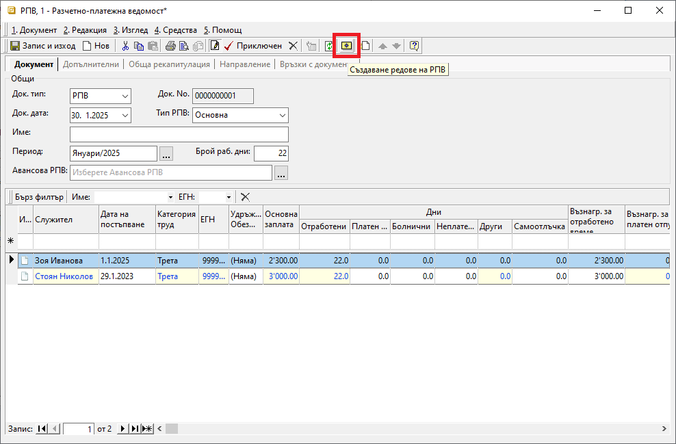
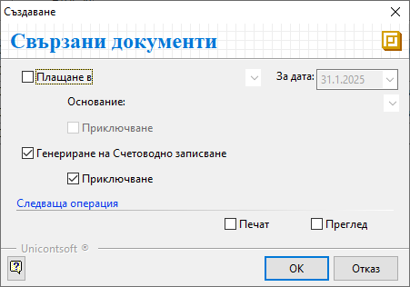

```{only} html
[Нагоре](000-index)
```

# **Разчетно–платежни ведомости**

- [Въведение](#въведение)  
- [Съставяне на РПВ](#съставяне-на-рпв)  
- [Реквизити](#реквизити)  
- [Свързани статии](#свързани-статии)  

## **Въведение**

Системата предоставя възможност за генерация на документ, с който автоматично се начисляват заплатите и осигуровките на служителите.  
Тази функционалност е достъпна в модул **ТРЗ || Разчетно–платежни ведомости**.  

За автоматичното съставяне на РПВ е необходимо да бъдат извършени предварително следните действия:  

 - Дефиниране на настройки в **Номенклатури || Референтни номенклатури || ТРЗ**;  
 - Създаване на номенклатурите със служителите на фирмата;  
 - Въвеждане в системата на всички болнични документи;  
 - Въвеждане в системата на всички документи за отпуск;  
 - Генерация и валидиране на *Авансови разчетно-платежни ведомости* за дадени аванси на служители;   

## **Съставяне на РПВ**

1) От **ТРЗ || Разчетно–платежни ведомости** чрез десен бутон на мишката върху списъка се избира **Нов документ**.  
Отваря се нова форма за въвеждане на данни.  

2) В раздел **Документ** се попълват следните реквизити:  
   - **Док. тип** – От полето се избира тип на документа **РПВ**-*Разчетно–платежна ведомост*.  
   - **Док. No.** – В полето може да се въведе номер за документа. Ако бъде оставено празно, при валидиране на РПВ системата ще попълни пореден номер.  
   - **Док. дата** – В това поле се попълва дата на начисление на заплатите.  
   - **Име** – Реквизитът дава възможност да се въведе наименование на ведомостта, което се визуализира при печат.  
   - **Период** – В полето се избира месец, за който се отнасят заплати на служителите.  
   - **Брой раб. дни** – Полето се попълва автоматично с брой работни дни за избрания период. Настройките за неработни дни и официални празници се създават в **Номенклатури || Референтни номенклатури || ТРЗ: Празници и почивни дни**. Системата се актуализира и всички официално приети за неработни дни се попълват автоматично.  
   - **Авансова РПВ** – От бутона [**...**] в края на полето се отваря форма за избор на документи **Авансови разчетно–платежни ведомости**. Полето трябва да се обзаведе, когато има създаден документ за аванси за същия месец. При изчисление на заплатите системата ще извади сумите на авансите.  

 { class=align-center w=15cm }

3) **Създаване редове на РПВ** - Чрез жълтия бутон в лентата с инструменти може автоматично да се генерира ред за всеки настроен служител. Когато всичко е попълнено правилно, останалите полета от списъка във ведомостта ще се обзаведат автоматично.  

> Всички полета в жълт цвят могат да бъдат коригирани.  
 
4) В раздел **Обща рекапитулация** може да се види общата сума на дължимите осигуровки по параграфи.  
Справката може да бъде разпечатана при приключване на документа.  

5) В раздел **Направление** системата показва списък с всички служители, въведени в текущия документ. Всички или само избрани от тях могат да бъдат разпределени като разход към структурни центрове на себестойност, обект/проект и/или финансова структура.  

6) Чрез бутон **Приключен** от лентата с инструменти **РПВ** се валидира и се отваря форма за генерация **Свързани документи**.  
    - **Плащане в** (каса) — Чрез опцията се избира каса, в която се създава разходен касов ордер. Използва се, когато има изплащане на заплати в брой.    
        - *За дата* - Реквизитът се обзавежда с дата, с която системата попълва **Док. дата** в касовия документ. 
        - *Основание:* - От падащия списък се посочва основанието за плащане, което системата да обзаведе в касовия документ.
        - *Приключване* - При поставена отметка системата генерира касов документ и автоматично го приключва. Ако не бъде поставена отметка, системата генерира свързан документ, който остава в състояние на редакция. 
    - **Генериране на Счетоводно записване** - Тази опция генерира свързан счетоводен документ. Когато за тази опция липсва отметка, системата не генерира счетоводен запис към **РПВ**.  
        - *Приключване* - При поставане на отметка системата валидира счетоводния документ. Ако не бъде поставена отметка, системата генерира счетоводен запис, който остава в състояние на редакция. 
    - **Печат** и **Преглед** са опции за директен печат или за преглед на екран на документа. Могат да бъдат разпечатани **РПВ** и **Обща рекапитулация**.  
    - **OK** - Чрез този бутон се потвърждават избраните във формата опции.  
    
    { class=align-center }
 
7) **Запис и изход** - бутон в лентата с инструменти, който записва документа и затваря формата.  

## **Реквизити**

1) В раздел **Документ**:  
   - **Док. Тип** – указва тип на текущия документ;    
   - **Док. No** - поле с номер на документа;   
   - **Док. дата** - поле за избор на дата на документ;  
   - **Тип РПВ** - в полето се отваря падащ списък за избор на тип РПВ;  
   Списъкът трябва да е предварително настроен в **Номенклатури || Референтни номенклатури**.  
   - **Име** – реквизит с наименование на ведомостта, което се визуализира при печат.  
   - **Период** – указва месец, за който се отнасят начислените заплати;  
   - **Брой раб. дни** - указва брой работни дни за избрания период;  
   Настройките за неработни дни и официални празници се създават в **Номенклатури || Референтни номенклатури || ТРЗ: Празници и почивни дни**.  
   - **Авансова РПВ** - отваря форма за избор на документи **Авансови разчетно–платежни ведомости**;  

   На реда за добавяне на нов запис се попълват следните реквизити:  
   - **Служител** - отваря форма за избор от списък **Служители**;  
   Служителите могат да бъдат добавени в момента или предварително настроени от **ТРЗ || Служители**.  
   - **Дата на постъпване** - реквизитът се обзавежда с настройките на **Дата на постъпване** за служителя на реда;  
   - **Категория труд** - указва категория труд за служителя на реда;  
   Всички категории трябва да са предварително въведени от **Номенклатури || Референтни номенклатури**.  
   - **ЕГН** - показва настроения ЕГН за служителя на реда;  
   - **Адрес** - показва адреса, настроен за служителя на реда;  
   - **Удръжки/Надбавки, Обезщ. и Отпуски** - ;  
   - **Основна заплата** - указва основна заплата, настроена за служителя на реда;  
   - **Дни: Отработени** - показва брой отработени дни за избрания период в РПВ;  
   - **Дни: Платен отпуск** - показва брой дни използван платен отпуск за избрания период в РПВ;  
   - **Дни: Болнични** - показва брой дни болнични за избрания период в РПВ;    
   - **Дни: Неплатен отпуск** - показва брой дни използван неплатен отпуск за избрания период в РПВ;    
   - **Дни: Други** - показва брой дни други отсъствия за избрания период в РПВ;    
   - **Дни: Самоотлъчка** - показва брой дни самоотлъчка за избрания период в РПВ;    
   - **Възнагр. за отработено време** - сума на възнаграждението спрямо брой отработени дни в месеца;  
   - **% прослужено време** - показва процент на надбавката за придобит трудов стаж и професионален опит;  
   - **Възнагр. за платен отпуск** - сума на възнаграждението за използвания платен отпуск в месеца спрямо данните в поле *Дни: Платен отпуск*;  
   - **Обезщ. за сметка на работодателя** - сума на изплатените обезщетения за болнични от работодател;  
   - **Облагаеми: Надбавки** - показва сума с настроените надбавки за служителя на реда;  
   - **Облагаеми: Удръжки** - показва сума с настроените удръжки за служителя на реда;  
   - **Социални разходи: Надбавки** - показва раздел **Списъци || Вноски: Държавно обществено осигуряване**;  
   - **Социални разходи: Общ %** - показва общия процент на настроени за служителя социални разходи;  
   - **Социални разходи: Сума** - показва сума на настроени за служителя социални разходи;  
   - **Осиг. доход при друг работодател** - сумата, върху която се осигурява персоната на реда, при друг работодател;  
   - **Брутна заплата** - показва брутна заплата за служителя;  
   - **Осигурителен доход** - показва сумата, върху която се начисляват осигурителни вноски;   
   - **Вноски - проценти: ДОО** - показва процент на ДОО, спрямо настройките на служителя в раздел **Списъци**;  
   - **Вноски - проценти: ДЗПО** - показва процент на ДЗПО, спрямо настройките на служителя в раздел **Списъци**;  
   - **Вноски - проценти: ЗО** - показва процент на ЗО, спрямо настройките на служителя в раздел **Списъци**;  
   - **Вноски - суми: ДОО** - показва сума на ДОО, изчислена спрямо настройките на служителя в раздел **Списъци**;  
   - **Вноски - суми: ДЗПО** - показва сума на ДЗПО, изчислена спрямо настройките на служителя в раздел **Списъци**;  
   - **Вноски - суми: ЗО** - показва сума на ЗО, изчислена спрямо настройките на служителя в раздел **Списъци**;  
   - **Вноски - суми: ЗО неплатен отпуск** - показва сума на ЗО, изчислена за използван неплатен отпуск от служителя;  
   - **Вноски - суми: За облагане с ДОД** - показва стойност на облагаемия доход;  
   - **Вноски - суми: ДОД** - показва сума на ДОД, изчислена спрямо стойностите на поле *Вноски - суми: За облагане с ДОД*;  
   - **Нетна заплата** - показва сума след приспадане на всички дължими осигурителни вноски и ДОД от брутната работна заплата;  
   - **Обезщ. за сметка на обществено осигуряване** - ;  
   - **Необлагаеми: Надбавки** - показва необлагаеми надбавки, настроени за служителя в раздел **Списъци**;  
   - **Необлагаеми: Удръжки** - показва необлагаеми удръжки, настроени за служителя в раздел **Списъци**;   
   - **Изравняване ДОД** - ;  
   - **Аванс** - показва сума на получен от служителя аванс;  
   - **Сума за получаване** - сумата, която се изплаща на служителя;  
   - **Брой работни часове** - показва дневен брой работни часове, настроени за служителя на реда;  
   - **Тип работно време** - показва типа на работно време, настроен за служителя на реда;  
   - **ГВРС** - указва дали се начислява фонд „Гарантирани вземания на работниците и служителите“;   
   - **Мин. осигурителен праг** - указва текущия минимален осигурителен праг за длъжността на служителя;  
   - **Макс. осигурителен праг** - указва текущия максимален осигурителен праг за длъжността на служителя;  
   - **Пенсионер** - указва дали служителят на реда е пенсионер;  
   - **Намалена трудоспособност** - указва дали служителят на реда е с намалена трудоспособност;  
   - **Самоосигуряващ се** - указва дали служителят на реда е самоосигуряващ се;  
   - **Вид осигурен** - реквизитът се обзавежда с настройките на служителя на реда за вид осигурен;  
   - **Разходен център** - полето се обзавежда с избран **Разходен център** от раздел **Направление**;  
   - **Потребител създаване** - информация за потребител, добавил текущия ред в документа;  
   - **Дата създаване** - дата и час на добавяне на текущия ред;  
   - **Потребител последна модификация** - потребителско име на направилия последните корекции в данните на реда;  
   - **Дата последна модификация** - информация за дата и час, когато са направени последните изменения на текущия ред;  

2) В раздел **Допълнителни**:  
   Системата дава възможност за документа да бъде въведено уточняващо описание в свободен текст.  

3) В раздел **Обща рекапитулация**:  
   - **Рекапитулация** - показва общо дължима сума от работодател за ДОО, ДЗПО, ЗО;  
   - **РПВ** - показва сума за получаване общо за всички служители в РПВ;  
   - **НПЗ** - ;  
   - **Общо** - показва обща стойност на полета *Рекапитулация*, *РПВ* и *НПЗ*;  

   Списъкът, който следва, включва реквизити:   
   - **Самоосигуряващи се** - указва дали лицето е самоосигуряващо се;  
   - **Код за вид плащане** - указва кода, настроен за вид на плащане;  
   Настройките се правят предварително в системата от меню **Номенклатури || Референтни номенклатури**.  
   - **Работодател - дължими суми** - полето се обзавежда със сума, която е за сметка на работодателя;  
   - **Служител - дължими суми** - полето се обзавежда със сума, която е за сметка на служителя;  
   - **Обща сума** - показва общо дължима сума от работодателя и служителя;  
   - **Наименование за вид плащане** - указва име на избрания код за вид плащане;  

4) В раздел **Направление**:  
   Системата показва списък със служители от текуща РПВ. Разходите за всеки от тях могат да бъдат разпределени към структурни центрове на себестойност, обект/проект и/или финансова структура.  

5) В раздел **Връзки с документи**:  
   Този раздел не съдържа реквизити за настройка. В него системата осигурява пряк път до свързани документи. От тук те могат да бъдат отворени и редактирани.  

## **Свързани статии**

[Референтни номенклатури за ТРЗ](../../001-ref/003-payroll/001-payroll-ref-nom.md)  
[Номенклатура Служители](../../001-ref/003-payroll/002-employees.md)  
[Авансови разчетно-платежни ведомости](../../002-docs/004-payroll-documents/001-adv-payroll-documents.md)  
[Болнични документи](../../002-docs/004-payroll-documents/003-medical-documents.md)  
[Документи за отпуск](../../002-docs/004-payroll-documents/004-leave-documents.md)  
[Автоматичен осчетоводител](../../001-ref/002-accounting/003-acc-wizard.md)  