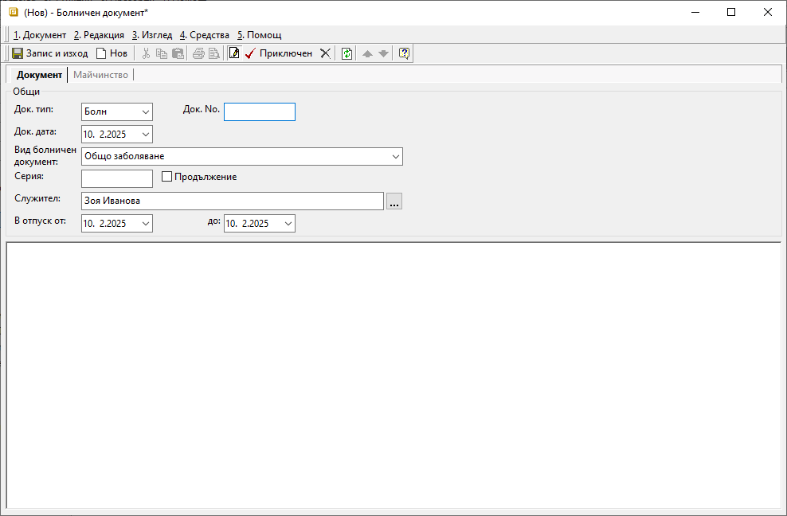

```{only} html
[Нагоре](000-index)
```

# Болнични документи

- [Въведение](https://docs.unicontsoft.com/guide/erp/002-docs/004-payroll-documents/003-medical-documents.html#id2)  
- [Създаване на нов болничен документ](https://docs.unicontsoft.com/guide/erp/002-docs/004-payroll-documents/003-medical-documents.html#id3)  
- [Реквизити](https://docs.unicontsoft.com/guide/erp/002-docs/004-payroll-documents/003-medical-documents.html#id4)  

## **Въведение**

Всеки болничен документ, представен от служител на фирмата, трябва да се регистрира в системата. Това става чрез въвеждане на документи от тип **Болн**-*Болничен документ*.   

## **Създаване на нов болничен документ**

1) От меню **ТРЗ || Болнични документи** чрез десен бутон на мишката върху списъка се избира **Нов документ**.  
Отваря се празна форма за въвеждане на данни.  

2) В раздел **Документ** се попълват следните данни от болничния лист:    

 - **Док. тип** – Избира се тип на документа **Болн**-*Болничен документ*.  
 - **Док. No.** – В полето се попълва номер на болничния лист, представен от служителя.  
 - **Док. дата** – Въвежда се дата на болничния лист, представен от служителя. 
 - **Вид болничен документ** – В това поле се избира вида на отсъствието, посочено на болничния лист. Видовете болнични документи са предварително дефинирани в **Номенклатури || Референтни номенклатури || ТРЗ: Видове болнични документи.**  
 - **Серия** - Това поле се използва за попълване на серия от болничния лист.  
 - **Продължение** - Когато болничният лист е продължение на вече представен такъв, в полето се поставя отметка.    
 - **Служител** – От полето се избира служител, за когото се отнася болничният документ.   
 - **В отпуск от / до** – В тези полета се попълват първи и последен ден от болничния лист,  

{ class=align-center w=15cm }

3) При регистриране на документ от вид *Бременност и раждане* в раздел **Майчинство** се попълват реквизити **Дата на термина** и **Дата на раждане**.  

4) След попълване на необходимите полета документът се валидира с бутон **Приключен** от лентата с инструменти.  

5) **Запис и изход** - бутон в лентата с инструменти, който записва документа и затваря формата.  

## **Реквизити**

1) В раздел **Документ**:  
   - **Док. тип** – отваря списък за избор от настроените типове на документи за отсъствия;  
   - **Док. No.** – поле за номер на болничен лист на служителя;  
   - **Док. дата** – поле за дата на болничен лист;  
   - **Вид болничен документ** – отваря падащ списък за избор на причина за отсъствие;  
   Видовете болнични документи са предварително дефинирани в **Номенклатури || Референтни номенклатури || ТРЗ: Видове болнични документи.**  
   - **Серия** - попълва се серия на болничен лист;  
   - **Продължение** - указва дали текущият документ е продължение на вече представен първичен болничен лист;  
   - **Служител** – отваря форма за избор от списък **Служители**;   
   - **В отпуск от / до** – реквизитите указват периода на отсъствие;  

2) В раздел **Майчинство**:  
   - **Дата на термина** - в полето се избира дата, определена за термин на раждане;  
   - **Дата на раждане** - в полето се попълва дата на раждане;  
