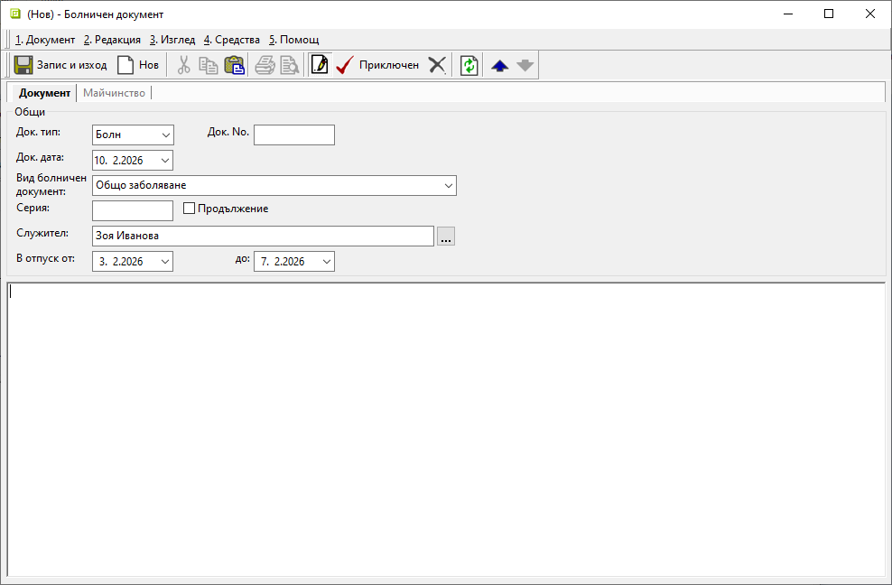

```{only} html
[Нагоре](000-index)
```

# **Болнични документи**

- [Въведение](#въведение)  
- [Създаване на нов болничен документ](#нов-болничен-документ)  
- [Реквизити](#реквизити)  

## **Въведение**

Всеки болничен документ, представен от служител на организацията, трябва да бъде регистриран в системата. Това става чрез въвеждане на документи от тип **Болн**-*Болничен документ*.   

## **Нов болничен документ**

**1. Създаване**

Нов болничен документ се добавя от меню **ТРЗ » Болнични документи**. Чрез десен клик върху списъка със записи се избира **Нов документ**.  
Отваря се празна форма за въвеждане на данни.  

**2. Попълване на реквизити**

В раздел **Документ** се попълват следните данни от болничния лист:    

 - **Док. тип** – Избира се тип на документа **Болн**-*Болничен документ*.  
 - **Док. No.** – В полето се попълва номер на представения болничен лист.  
 - **Док. дата** – Въвежда се дата на болничния лист, представен от служителя. 
 - **Вид болничен документ** – Чрез реквизита се указва вид на отсъствието, посочено в болничния лист.  
 Видовете болнични документи се дефинират предварително в **Номенклатури » Референтни номенклатури » ТРЗ: Видове болнични документи**.  
 - **Серия** - Полето се използва за попълване на серия от болничния лист.  
 - **Продължение** - Когато текущият болничен лист е продължение на предходен, в полето се поставя отметка.    
 - **Служител** – От полето се избира служител, за когото се отнася болничният документ.   
 - **В отпуск от / до** – В тези полета се попълват първи и последен ден от болничния лист.  

{ class=align-center w=15cm }

При регистриране на документ от вид *Бременност и раждане* в раздел **Майчинство** се попълват реквизити **Дата на термина** и **Дата на раждане**.  

**3. Приключване**

След попълване на необходимите полета документът трябва да се валидира. Използва се бутон [**Приключен**] от лентата с инструменти.  

**4. Запис**

Чрез бутон [**Запис и изход**] в лентата с инструменти документът се записва и формата се затваря.  

## **Реквизити**

1) В раздел **Документ**:  
   - **Док. тип** – отваря списък за избор от настроените типове на документи за отсъствия;  
   - **Док. No.** – поле за номер на болничен лист на служителя;  
   - **Док. дата** – поле за дата на болничен лист;  
   - **Вид болничен документ** – отваря падащ списък за избор на причина за отсъствие;  
   Видовете болнични документи са предварително дефинирани в **Номенклатури » Референтни номенклатури » ТРЗ: Видове болнични документи.**  
   - **Серия** - попълва се серия на болничен лист;  
   - **Продължение** - указва дали текущият документ е продължение на вече представен първичен болничен лист;  
   - **Служител** – отваря форма за избор от списък **Служители**;   
   - **В отпуск от / до** – реквизитите указват периода на отсъствие;  

2) В раздел **Майчинство**:  
   - **Дата на термина** - указва дата, определена за термин на раждане;  
   - **Дата на раждане** - указва дата на раждане;  
