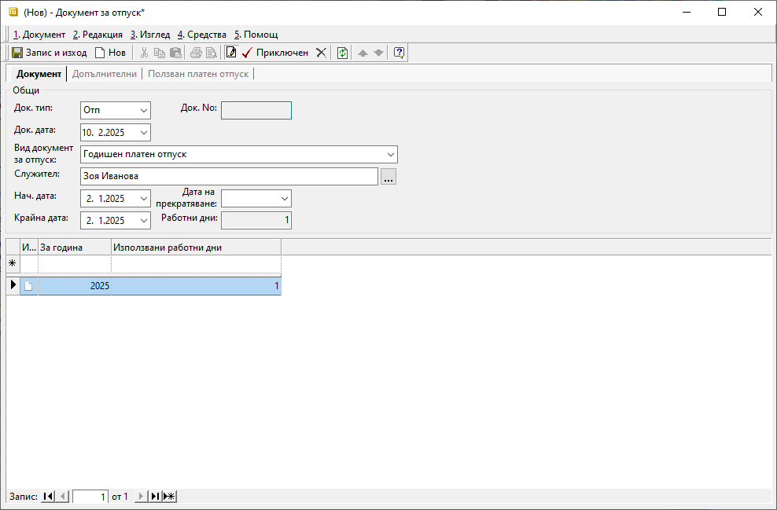

```{only} html
[Нагоре](000-index)
```

# **Документи за отпуск**

- [Въведение](#въведение)  
- [Създаване на нов документ за отпуск](#създаване-на-нов-документ-за-отпуск)  
- [Реквизити](#реквизити)  

## **Въведение**

Използваните от служител на фирмата дни отпуск (платен, неплатен или друг вид) трябва да се регистрират в системата. Това става чрез въвеждане на тип документ **Отп**-*Документи за отпуск*.   

## **Създаване на нов документ за отпуск**

1) От **ТРЗ || Документи за отпуск** чрез десен бутон на мишката върху списъка се избира **Нов документ**.  
Отваря се нова форма за въвеждане на данни.  

2) В раздел **Документ** се попълват:  

 - **Док. тип** – Избира се тип на документа **Отп**-*Документ за отпуск*.  
 - **Док. No.** – В полето се попълва номер на документа. Ако остане празно, при приключване на документа системата ще генерира пореден номер.  
 - **Док. дата** – Въвежда се дата на документа. Датата може да съвпада или да се различава от началната дата на отпуска.  
 - **Вид документ за отпуск** – В това поле се избира вид отпуск. Настройките за отпуск са предварително дефинирани в **Номенклатури || Референтни номенклатури || ТРЗ: Видове документи за отпуск**.  
 - **Служител** – От полето се избира служител, за когото се отнася използваният отпуск.  
 - **Нач. дата** и **Крайна дата** – В тези полета се въвежда периодът на отпуск - първи и последен ден.  

{ class=align-center w=15cm }

3) **Приключен** - След попълване на необходимите полета документът се валидира с бутон [**Приключен**] от лентата с инструменти.  

4) **Запис и изход** - Чрез бутона в лентата с инструменти документът се записва и формата се затваря.  

# **Реквизити**

1) В раздел **Документ**:  
   - **Док. тип** – отваря списък за избор от настроените типове на документи за отсъствия;  
   - **Док. No.** – поле за номер на болничен лист на служителя;  
   - **Док. дата** – поле за дата на болничен лист;  
   - **Вид документ за отпуск** - отваря падащ списък за избор на вида на отсъствието;  
   Видовете документи за отпуск са предварително дефинирани в **Номенклатури || Референтни номенклатури || ТРЗ**.  
   - **Служител** – отваря форма за избор от списък **Служители**;   
   - **Нач. дата** - избор на начална дата на отсъствието;  
   - **Крайна дата** - избор на крайна дата на отсъствието;  
   - **Дата на прекратяване** - ;  
   - **Работни дни** - показва брой работни дни през периода на отсъствието;  

   От реда за нов запис се обзавежда списък, който съдържа колони:  
   - **За година** - попълва се година, за която се отнасят използваните работни дни на реда;  
   - **Използвани работни дни** - брой работни дни в отсъствие;  
   - **Потребител създаване** - информация за потребител, добавил текущия ред в документа;  
   - **Дата създаване** - дата и час на добавяне на текущия ред;  
   - **Потребител последна модификация** - потребителско име на направилия последните корекции в данните на реда;  
   - **Дата последна модификация** - информация за дата и час, когато са направени последните изменения в данните на текущия ред;  

2) В раздел **Допълнителни** системата дава възможност за въвеждане на свободен текст с уточнения.  

3) В раздел **Ползван платен отпуск**:  
   - **За година** - показва година, за която се отнасят данните на реда;  
   - **Полагаеми дни годишен платен отпуск** - показва брой дни платен годишен отпуск, полагащ се за избраната година на реда;  
   - **Използвани дни: Общо** - показва общ брой дни от използвания платен отпуск за годината на текущия ред;  
   - **Използвани дни: В текущата година** - показва брой дни платен отпуск, полагаем за избраната година на реда и използван в същата година;  
   - **Използвани дни: В следващи години** - показва брой дни платен отпуск, полагаем за избраната година на реда и използван в следващи години;  
   - **Отписани дни поради давностен срок** - показва брой дни от натрупан платен годишен отпуск, за които е изтекъл срокът на използване;  
   - **Остават дни за използване** - показва оставащ брой дни от натрупан платен отпуск;  