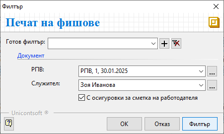

```{only} html
[Нагоре](000-index)
```

# **Печат на фишове**

Системата разполага с функционалност за разпечатване на фишове на служители. Тя е достъпна от **ТРЗ » Печат на фишове**.  

> Фишове на служители могат да се разпечатат след предварително валидиране на документите **РПВ**-*Разчетно-платежни ведомости*.  

1) Във филтър формата **Печат на фишове** има възможност за избор в полета:  
    - **РПВ** - поле за избор на разчетно-платежни ведомости за печат;  
    От бутона в края на полето се отваря списък с всички документи **РПВ**. Могат да се посочат една или няколко ведомости.  
    Ако полето остане празно, системата ще направи справка за всички **РПВ**.  
    - **Служител** - поле за избор на служител, за който се разпечатва фиш;  
    От бутона в края на полето се отваря списък с всички служители. Може да се посочи един или няколко служителя.  
    Ако полето остане празно, системата ще предложи за печат фишове за всички служители от избраната **РПВ**.  
    - **С осигуровки за сметка на работодателя** - при активиране на опцията системата ще визуализира и данни с осигуровките, които са за сметка на работодател;  

{ class=align-center }

2) **Ок** или **Филтър** - чрез бутоните се потвърждават избраните опции и системата извежда справката на екран.  