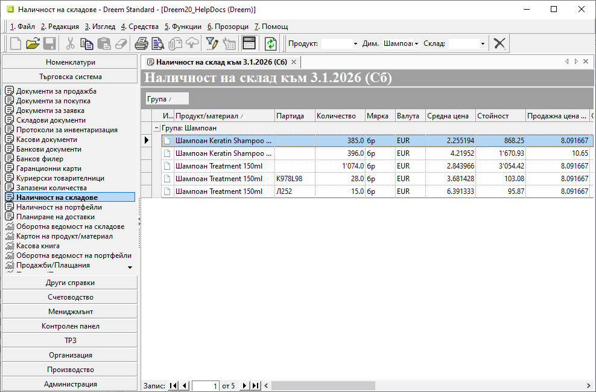

```{only} html
[Нагоре](000-index)
```

# **Наличност на склад**

Справка **Наличност на склад** е достъпна от меню **Търговска система**.  
Използва се за проследяване на налични количества за продукти и материали към текущия момент.  

Спраквата дава възможност за прилагане на бърз филтър по *Продукт*, *Дименсия* и *Склад*. Ако полетата във филтъра останат празни, представената информация включва всички налични продукти общо за всички складове.  

В списъка на справката могат да бъдат прилагани общовалидните за системата правила за сортиране, групиране, скриване и извеждане на колони. Това позволява оптимизиране изгледа на справката.  

{ class=align-center w=15cm }

Колона **Количество** показва текуща наличност на продукт в избран склад. Когато в бързия филтър не е посочен конкретен склад, колоната показва общо налично количество от всички складове.  

В **Последна доставна цена** се визуализира единична цена (без ДДС) от последната покупка на продукта.

Колона **Средна цена** показва текуща среднопретеглена цена в избрания склад.  

Допълнително за избран продукт може да бъде изведена детайлна справка. Тя е достъпна с десен клик вурху избрания ред и опция **Картон на продукт/ материал**.  

За избран продукт от справката може да бъде отворена форма с реквизити. За целта с десен клик върху реда в списъка се избира опция **Редакция продукт [*]**.   