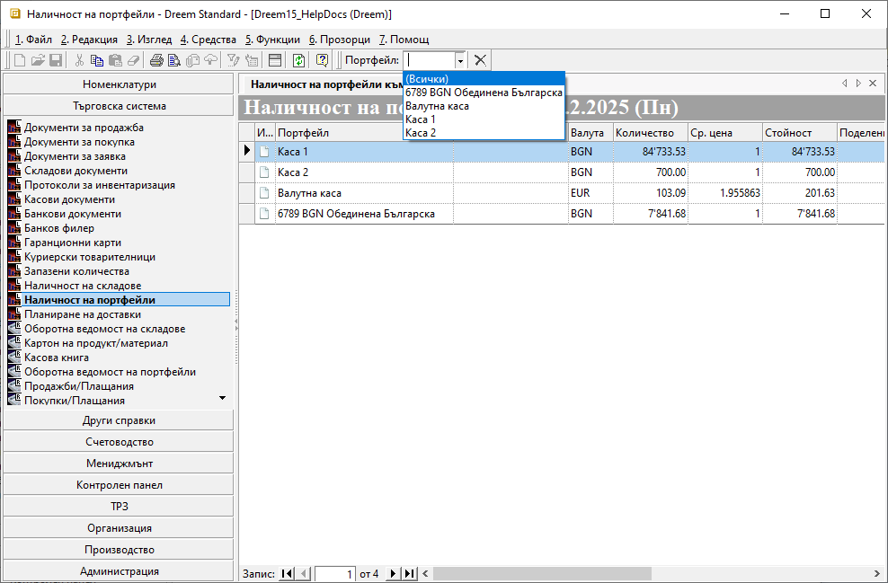

```{only} html
[Нагоре](000-index)
```

# **Наличност на портфейли**

Справката е достъпна от **Търговска система » Наличност на портфейли**. Използва се за бърза проверка на текущите наличности на парични средства в отделните каси и банкови сметки.  

Справката е с табличен вид, като има възможност за разместване, скриване, извеждане и сортиране на колони. 
Чрез поле **Портфейл** от бързия филтър може да се приложи филтър за определена каса или банкова сметка.  

Текущата наличност в лева на всеки портфейл е на отделен ред в колона **Стойност**.  
За портфейлите в чуждестранна валута колона **Количество** дава информация за валутната наличност, а колона **Ср. цена** - средна стойност на валутния курс.   

{ class=align-center w=15cm }

