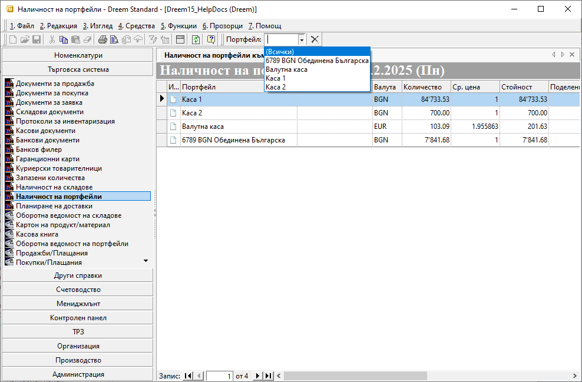

```{only} html
[Нагоре](000-index)
```

# **Наличност на портфейли**

Справката е достъпна от **Търговска система » Наличност на портфейли**.  
Използва се за бърза проверка на текущо налични парични средства в каси и банкови сметки.  

Справката е в табличен вид. Има възможност за разместване, скриване, извеждане и сортиране на колони.  

Поле **Портфейл** в бързия филтър се изпозлва за търсене по име на каса или банкова сметка.  

{ class=align-center w=15cm }

Справката извежда списък с портфейли и настроените им валути.  

Колона **Количество** показва наличност във валута на съответната каса/банкова сметка.  

В колона **Ср. цена** се визуализира средна стойност на валутния курс.   

Колона **Стойност** дава информация за текуща наличност в местна валута спрямо средния курс.  
