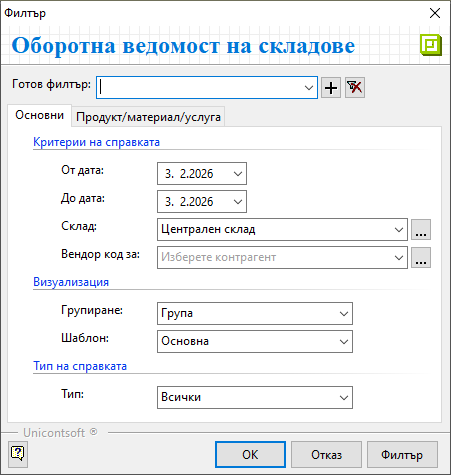
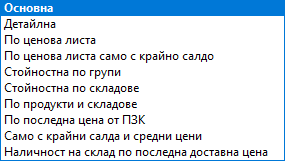
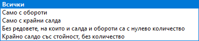

```{only} html
[Нагоре](000-index)
```

# **ОВ на складове**

Справка **Оборотна ведомост на складове** е достъпна в меню **Търговска система**.  
Показва детайлна информация за движението на продукти и наличностите им в началото и в края на избран период.  

Филтър формата представя различни опции за избор на критерии за справката.  

{ class=align-center }

В раздел **Основни**:  

- **От дата** и **До дата** - В тези полета се указва период, за който се филтрират данни.  
 Ако останат празни, системата приема, че няма начална и/или крайна дата.  

- **Склад** - От полето могат да бъдат избрани един или няколко склада.    
 Ако остане празно, справката ще включва данни за всички складове.  

- **Вендор код за** - Отваря се форма за избор от списък **Контрагенти**. Може да бъде посочен контрагент, чийто кодове на продукти се визуализират в колона **Вендор код** от изглед **Списък с данни**.  

- **Групиране** - Полето показва падащ списък с потребителски дименсии на продукти. Избира се категорията, за която се групират данните в справката.   

- **Шаблон** - Избира се шаблон от настроените различни конфигурации за справката. Чрез него се представят различн и данни, касаещи движението на стоки в склад.  
Например:  
   - *Основна* - показва приходи, разходи и салда на продуктите в началото и в края на периода;  
   - *Детайлна* - показва *Основна* справка с добавени брак, липси и излишък на продукти през периода;  
   - *По ценова листа* и *По ценова листа само с крайно салдо* - активира нов раздел **Ценова листа** във филтър формата и показва стойности на салда и обороти по избрана ЦЛ;    
   - *Стойностна по групи* - представя само стойности на салдата и оборотите по групи продукти;  
   - *Стойностна по складове* - показва обща стойност на салда и обороти по складове;  

   { class=align-center }

- **Тип на справката** - От полето се избира какъв тип данни да се визуализират.  
Например може да бъде представена справка с данни за всички продукти, единствено продукти с обороти, единствено продуктите с крайни салда.     

   { class=align-center }

В раздел **Продукт/материал/услуга**:  

От този раздел се прилагат критерии за филтриране, свързани с продукти, дименсии, тип, мярка и други.   

В раздел **Ценова листа**:  

Този раздел се визуализира при избран шаблон *По ценова листа* или *По ценова листа само с крайно салдо*.  
