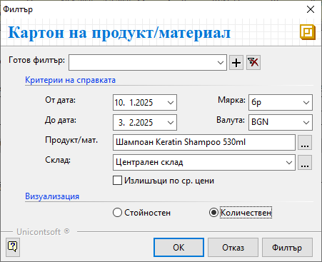
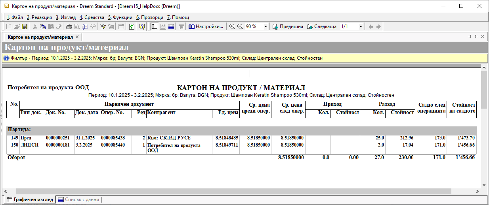
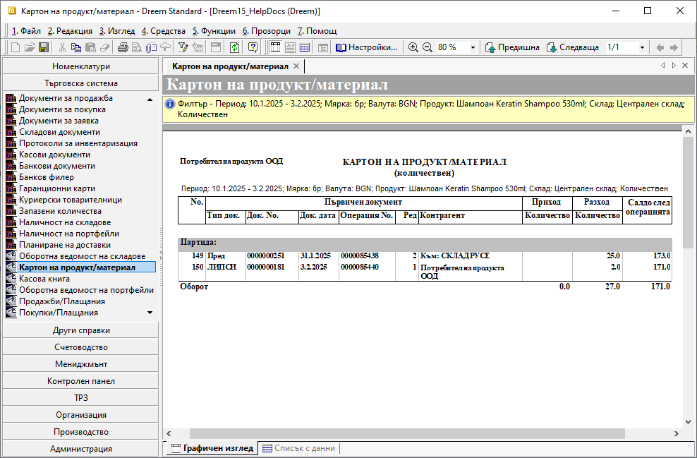

```{only} html
[Нагоре](000-index)
```

# **Картон на продукт/материал**

Справката представя хронологично складовите документи с движението по прихода и разхода на един избран продукт. Картонът включва информация за текуща наличност след всяка операция. 

Тази справка е достъпна от **Търговска система » Картон на продукт/материал**.  

{ class=align-center }

 - **От дата** и **До дата** – полета за избор на период на справката;  

 - **Мярка** - от полето се избира мерна единица за справката;  
 Системата визуализира данни единствено за мерна единица, с която са валидирани складовите документи спрямо настройките на избрания продукт.  

 - **Валута** - поле за избор на валута при стойностен изглед на справката;  
 При избрана валута на справката се визуализират единствено складовите документи, валидирани с тази валута.  

 - **Продукт/мат.** – от бутона в края на полето [**...**] се отваряте форма за избор **Продукти и материали**;  
 В списъка с номенклатури може да се използва *Бърз филтър* за намиране на желания продукт.  
 Справката позволява избор само на един продукт.   

 - **Склад** – от списъка с настроени складове се избира един или няколко склада за справката;  

 - **Излишъци по средни цени** - с активиране на опцията при визуализация *Стойностнен* системата показва средна цена в склада и остойностява салдото спрямо нея;  

- **Визуализация**:  

    - **Количествен** - с количествената визуализация системата извежда информация единствено за количества на прихода, разхода и салдата след всяка операция в склада;  

   { class=align-center w=15cm }

    - **Стойностен** - при тази визуализация на справката системата показва среднопретеглени цени за движенията и стойност на салдото в склада;  

    { class=align-center w=15cm }

___  
## Свързани статии

[Картон на продукт/материал](https://www.unicontsoft.com/cms/node/159)