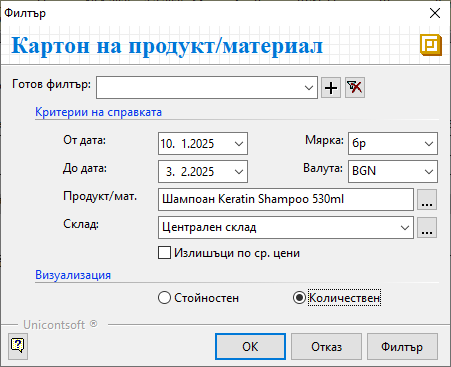
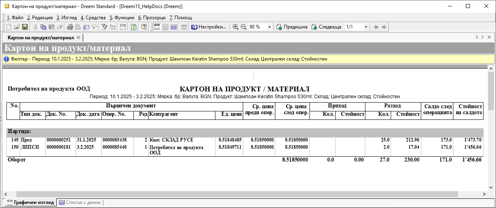
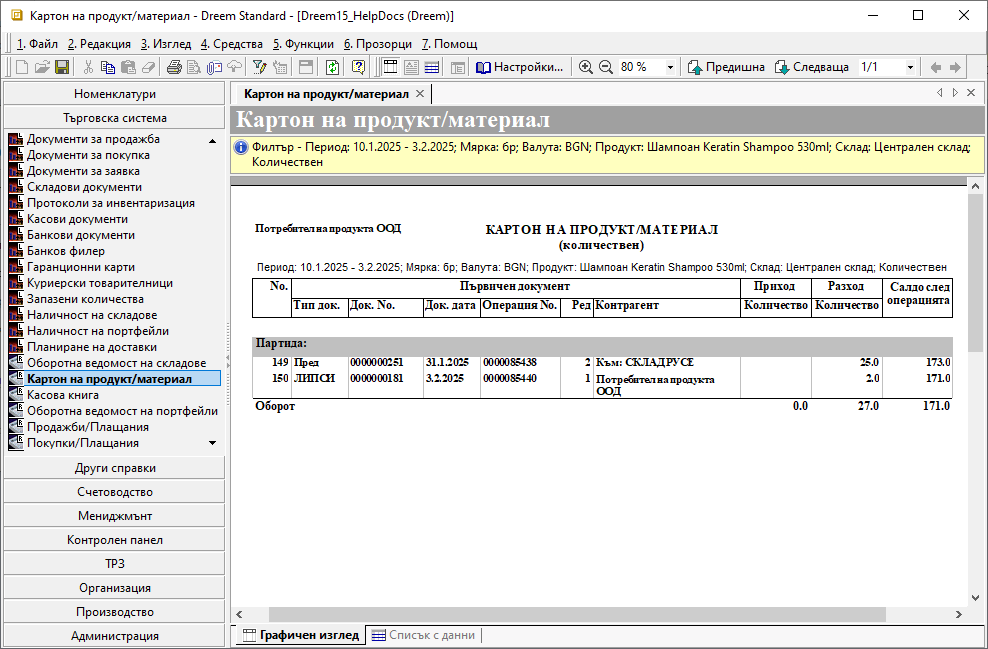

```{only} html
[Нагоре](000-index)
```

# **Картон на продукт/материал**

Справка **Картон на продукт/материал** е достъпна от меню **Търговска система**.  
Представя хронология на складовите документи с движенията за един избран продукт - приход, разход и салдо след всяка операция.  
Справката може да включва също информация за среднопретеглени цени и стойност.  

{ class=align-center }

От филтър формата могат да бъдат избрани някои от следните критерии:  

- **От дата** и **До дата** – Чрез тези полета се указва период на справката.  

- **Мярка** - В полето задължително се избира мерна единица на продукта.  
Системата ще визуализира данни, когато продуктът е настроен в тази мярка и със същата има валидирани складови документи.  

- **Валута** - Указва се валута при генериране на справка със стойности. Системата показва единствено складовите документи, валидирани с тази валута.  

- **Продукт/мат.** – Бутонът [**...**] в края на полето отваря форма за избор **Продукти и материали**. В списъка с номенклатури може да се използва *Бърз филтър* за намиране на желания продукт.  

> Справката позволява да бъде избран само един продукт.   

- **Склад** – В полето може да бъде избран един или няколко склада.    

- **Излишъци по средни цени** - При едновременно активиране на  опцията и на визуализация *Стойностен* справката показва средна цена в склада и остойностява салдото спрямо нея.  

- **Визуализация**:  

    - **Количествен** - При тази визуализация се извежда информация единствено за количества на прихода, разхода и салдата след всяка операция в склада.  

    { class=align-center w=15cm }

    - **Стойностен** - Справката показва среднопретеглени цени преди и след всяка операция в склада, както и стойност на прихода, разхода и салдото.  

    { class=align-center w=15cm }

