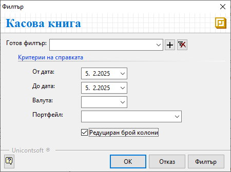
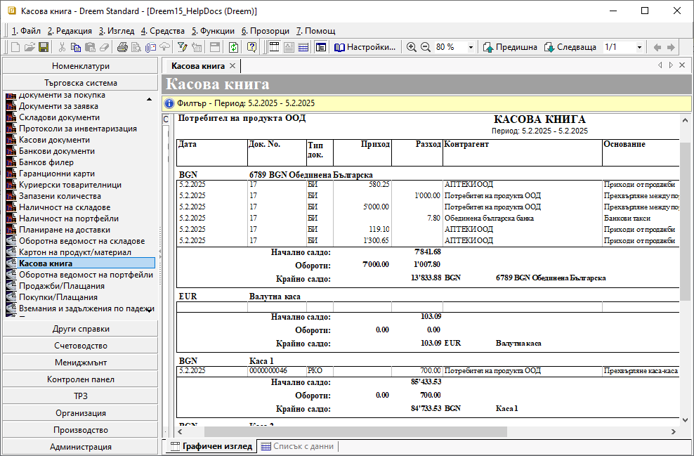

```{only} html
[Нагоре](000-index)
```

# **Касова книга**

Тази справка дава пълна информация за всички операции, валидирани в системата чрез касови и банкови документи. Движенията и салдата на паричните средства се визуализират хронологично според филтрирания период. 

Справката е достъпна от **Търговска система » Касова книга**.  
Във филтъра чрез полета **От дата** и **До дата** се избира период на справката.  

От поле **Валута** може да се филтрира една или множество валути от предварително настроените в системата.  

Избор на портфейл - определена каса или банкова сметка, става чрез поле **Портфейл**. Ако полето остане празно, в справката се визуализират данни за всички портфейли.   
Системата позволява избирането и на вече деактивиран портфейл.  

{ class=align-center }

При поставена отметка за **Редуциран брой колони** в справката се изключват колони като *Курс*, *Стойност*, *Персона, *Док. основание*.  

{ class=align-center w=15cm }

___  

## Свързани статии

[Касова книга](https://www.unicontsoft.com/cms/node/160)