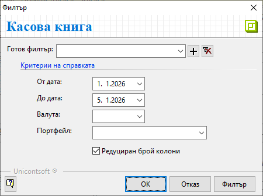
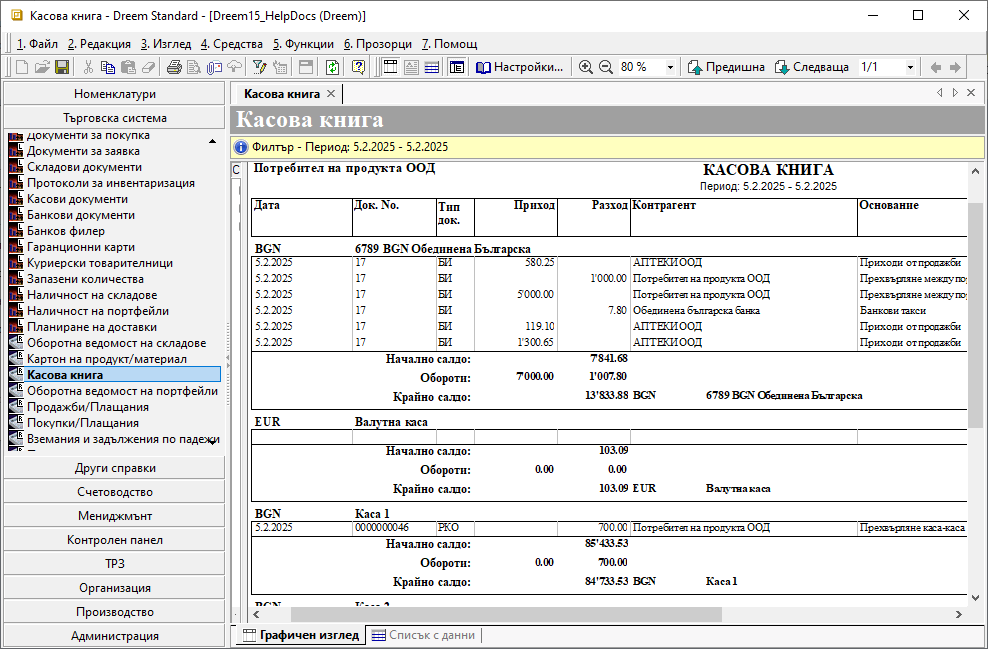

```{only} html
[Нагоре](000-index)
```

# **Касова книга**

Справка **Касова книга** е достъпна от **Търговска система**.  
Визуализира хронологично движенията на парични средства и формираните салда за избран период. Данните в справката включват валидираните операции с касови и банкови документи.   

{ class=align-center }

Във филтър формата се указва период на справката чрез полета **От дата** и **До дата**.  

За справката може да бъде дефиниран критерий **Валута** - една или няколко. Системата ще изведе информация за регистрираните движения на средства в избраната валута.  

Избор на определена каса или банкова сметка може да се направи от поле **Портфейл**. Ако остане празно, се визуализират данни за всички портфейли.   
Системата позволява маркиране и на вече деактивирани портфейли.  

При поставена отметка за **Редуциран брой колони** в справката се изключват колони като *Курс*, *Стойност*, *Персона*, *Док. основание*.  

{ class=align-center w=15cm }

