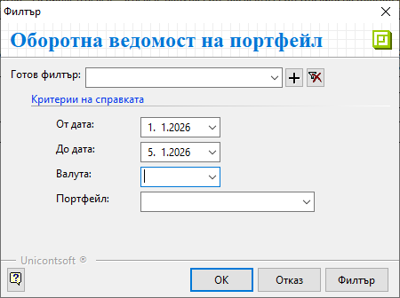
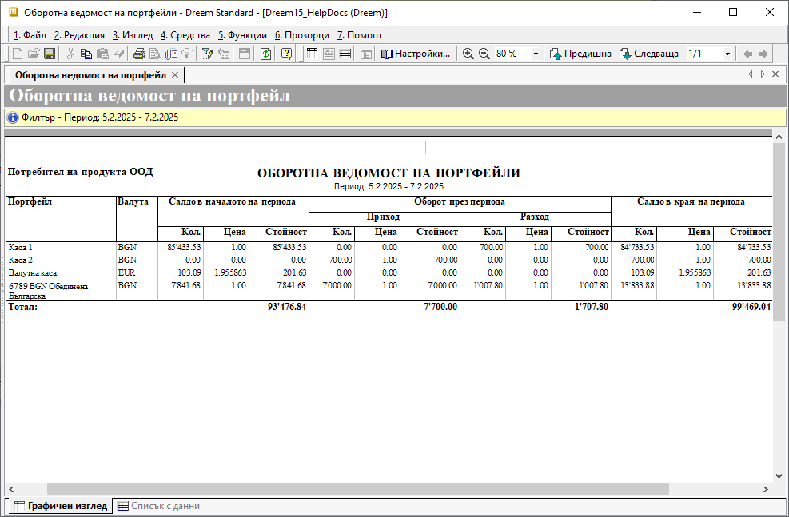

```{only} html
[Нагоре](000-index)
```

# **ОВ на портфейли**

Справка **Оборотна ведомост на портфейли** е достъпна от меню **Търговска система**.  
Представя синтезирана информация за паричните потоци в каси и банкови сметки. Данните включват портфейлите, в които има активности и/или наличности в избран период.  

Филтър формата съдържа следните опции за избор на критерии:  

{ class=align-center }

- **От дата** и **До дата** - Чрез тези полета се задава времеви обхват на справката.  

- **Валута** - В полето могат да бъдат избрани една или няколко валути.  
Ако остане празно, справката извежда данни с движения и наличности във всички валути.  

- **Портфейл** - От полето се отваря списък за избор на портфейл. Могат да бъдат маркирани една или няколко каси и/или банкови сметки.    
Ако остане празно, справката показва движения и наличности във всички банкови сметки и каси.  

Справката показва обобщени данни с приходи, разходи и наличности в началото и в края на избрания период.  

{ class=align-center w=15cm }

